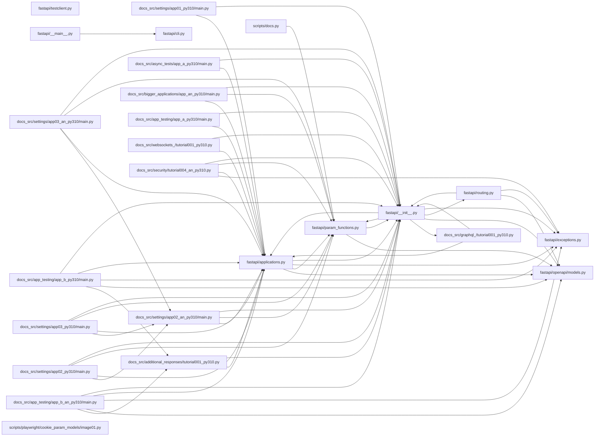

## ARCHITECTURE

A software project composed of the following subsystems:

- **docs/**: Primary subsystem containing 1496 files
- **tests/**: Primary subsystem containing 581 files
- **docs_src/**: Primary subsystem containing 457 files
- **scripts/**: Primary subsystem containing 70 files
- **fastapi/**: Primary subsystem containing 53 files
- **Root**: Contains scripts and execution points

## ENTRY_POINTS

### `docs_src/settings/app01_py310/main.py`

```python
from fastapi import FastAPI

from .config import settings

app = FastAPI()


@app.get("/info")
async def info():
    return {
        "app_name": settings.app_name,
        "admin_email": settings.admin_email,
        "items_per_user": settings.items_per_user,
    }

```

### `docs_src/settings/app02_an_py310/main.py`

```python
from functools import lru_cache
from typing import Annotated

from fastapi import Depends, FastAPI

from .config import Settings

app = FastAPI()


@lru_cache
def get_settings():
    return Settings()


@app.get("/info")
async def info(settings: Annotated[Settings, Depends(get_settings)]):
    return {
        "app_name": settings.app_name,
        "admin_email": settings.admin_email,
        "items_per_user": settings.items_per_user,
    }

```

### `docs_src/async_tests/app_a_py310/main.py`

```python
from fastapi import FastAPI

app = FastAPI()


@app.get("/")
async def root():
    return {"message": "Tomato"}

```

### `fastapi/cli.py`

```python
try:
    from fastapi_cli.cli import main as cli_main

except ImportError:  # pragma: no cover
    cli_main = None  # type: ignore


def main() -> None:
    if not cli_main:  # type: ignore[truthy-function]  # ty: ignore[unused-ignore-comment]
        message = 'To use the fastapi command, please install "fastapi[standard]":\n\n\tpip install "fastapi[standard]"\n'
        print(message)
        raise RuntimeError(message)  # noqa: B904
    cli_main()

```

### `fastapi/__main__.py`

```python
from fastapi.cli import main

main()

```

### `docs_src/settings/app02_py310/main.py`

```python
from functools import lru_cache

from fastapi import Depends, FastAPI

from .config import Settings

app = FastAPI()


@lru_cache
def get_settings():
    return Settings()


@app.get("/info")
async def info(settings: Settings = Depends(get_settings)):
    return {
        "app_name": settings.app_name,
        "admin_email": settings.admin_email,
        "items_per_user": settings.items_per_user,
    }

```

### `docs_src/settings/app03_py310/main.py`

```python
from functools import lru_cache

from fastapi import Depends, FastAPI

from . import config

app = FastAPI()


@lru_cache
def get_settings():
    return config.Settings()


@app.get("/info")
async def info(settings: config.Settings = Depends(get_settings)):
    return {
        "app_name": settings.app_name,
        "admin_email": settings.admin_email,
        "items_per_user": settings.items_per_user,
    }

```

### `docs_src/settings/app03_an_py310/main.py`

```python
from functools import lru_cache
from typing import Annotated

from fastapi import Depends, FastAPI

from . import config

app = FastAPI()


@lru_cache
def get_settings():
    return config.Settings()


@app.get("/info")
async def info(settings: Annotated[config.Settings, Depends(get_settings)]):
    return {
        "app_name": settings.app_name,
        "admin_email": settings.admin_email,
        "items_per_user": settings.items_per_user,
    }

```

### `docs_src/app_testing/app_b_an_py310/main.py`

```python
from typing import Annotated

from fastapi import FastAPI, Header, HTTPException
from pydantic import BaseModel

fake_secret_token = "coneofsilence"

fake_db = {
    "foo": {"id": "foo", "title": "Foo", "description": "There goes my hero"},
    "bar": {"id": "bar", "title": "Bar", "description": "The bartenders"},
}

app = FastAPI()


class Item(BaseModel):
    id: str
    title: str
    description: str | None = None


@app.get("/items/{item_id}", response_model=Item)
async def read_main(item_id: str, x_token: Annotated[str, Header()]):
    if x_token != fake_secret_token:
        raise HTTPException(status_code=400, detail="Invalid X-Token header")
    if item_id not in fake_db:
        raise HTTPException(status_code=404, detail="Item not found")
    return fake_db[item_id]


@app.post("/items/")
async def create_item(item: Item, x_token: Annotated[str, Header()]) -> Item:
    if x_token != fake_secret_token:
        raise HTTPException(status_code=400, detail="Invalid X-Token header")
    if item.id in fake_db:
        raise HTTPException(status_code=409, detail="Item already exists")
    fake_db[item.id] = item.model_dump()
    return item

```

### `docs_src/bigger_applications/app_an_py310/main.py`

```python
from fastapi import Depends, FastAPI

from .dependencies import get_query_token, get_token_header
from .internal import admin
from .routers import items, users

app = FastAPI(dependencies=[Depends(get_query_token)])


app.include_router(users.router)
app.include_router(items.router)
app.include_router(
    admin.router,
    prefix="/admin",
    tags=["admin"],
    dependencies=[Depends(get_token_header)],
    responses={418: {"description": "I'm a teapot"}},
)


@app.get("/")
async def root():
    return {"message": "Hello Bigger Applications!"}

```

### `docs_src/app_testing/app_b_py310/main.py`

```python
from fastapi import FastAPI, Header, HTTPException
from pydantic import BaseModel

fake_secret_token = "coneofsilence"

fake_db = {
    "foo": {"id": "foo", "title": "Foo", "description": "There goes my hero"},
    "bar": {"id": "bar", "title": "Bar", "description": "The bartenders"},
}

app = FastAPI()


class Item(BaseModel):
    id: str
    title: str
    description: str | None = None


@app.get("/items/{item_id}", response_model=Item)
async def read_main(item_id: str, x_token: str = Header()):
    if x_token != fake_secret_token:
        raise HTTPException(status_code=400, detail="Invalid X-Token header")
    if item_id not in fake_db:
        raise HTTPException(status_code=404, detail="Item not found")
    return fake_db[item_id]


@app.post("/items/")
async def create_item(item: Item, x_token: str = Header()) -> Item:
    if x_token != fake_secret_token:
        raise HTTPException(status_code=400, detail="Invalid X-Token header")
    if item.id in fake_db:
        raise HTTPException(status_code=409, detail="Item already exists")
    fake_db[item.id] = item.model_dump()
    return item

```

### `docs_src/app_testing/app_a_py310/main.py`

```python
from fastapi import FastAPI

app = FastAPI()


@app.get("/")
async def read_main():
    return {"msg": "Hello World"}

```

## SYMBOL_INDEX

**`fastapi/applications.py`**
- class `FastAPI`
  - `__init__()`
  - `build_middleware_stack()`
  - `openapi()`
  - `setup()`
  - `__call__()`
  - `add_api_route()`
  - `api_route()`
  - `add_api_websocket_route()`
  - `websocket()`
  - `include_router()`
  - `get()`
  - `put()`
  - `post()`
  - `delete()`
  - `options()`
  - `head()`
  - `patch()`
  - `trace()`
  - `websocket_route()`
  - `middleware()`
  - `exception_handler()`

**`fastapi/openapi/models.py`**
- class `BaseModelWithConfig`
- class `Contact`
- class `License`
- class `Info`
- class `ServerVariable`
- class `Server`
- class `Reference`
- class `Discriminator`
- class `XML`
- class `ExternalDocumentation`
- class `Schema`
- class `Example`
- class `ParameterInType`
- class `Encoding`
- class `MediaType`
- class `ParameterBase`
- class `Parameter`
- class `Header`
- class `RequestBody`
- class `Link`
- class `Response`
- class `Operation`
- class `PathItem`
- class `SecuritySchemeType`
- class `SecurityBase`
- class `APIKeyIn`
- class `APIKey`
- class `HTTPBase`
- class `HTTPBearer`
- class `OAuthFlow`
- class `OAuthFlowImplicit`
- class `OAuthFlowPassword`
- class `OAuthFlowClientCredentials`
- class `OAuthFlowAuthorizationCode`
- class `OAuthFlows`
- class `OAuth2`
- class `OpenIdConnect`
- class `Components`
- class `Tag`
- class `OpenAPI`

**`docs_src/settings/app01_py310/main.py`**
- `info()`

**`fastapi/param_functions.py`**
- `Path()`
- `Query()`
- `Header()`
- `Cookie()`
- `Body()`
- `Form()`
- `File()`
- `Depends()`
- `Security()`

**`docs_src/graphql_/tutorial001_py310.py`**
- class `User`
- class `Query`

**`docs_src/additional_responses/tutorial001_py310.py`**
- class `Item`
- class `Message`
- `read_item()`

**`docs_src/settings/app02_an_py310/main.py`**
- `get_settings()`
- `info()`

**`docs_src/async_tests/app_a_py310/main.py`**
- `root()`

**`fastapi/cli.py`**
- `main()`

**`docs_src/settings/app02_py310/main.py`**
- `get_settings()`
- `info()`

**`docs_src/settings/app03_py310/main.py`**
- `get_settings()`
- `info()`

**`docs_src/settings/app03_an_py310/main.py`**
- `get_settings()`
- `info()`

**`docs_src/app_testing/app_b_an_py310/main.py`**
- class `Item`
- `read_main()`
- `create_item()`

**`docs_src/bigger_applications/app_an_py310/main.py`**
- `root()`

**`docs_src/app_testing/app_b_py310/main.py`**
- class `Item`
- `read_main()`
- `create_item()`

**`docs_src/app_testing/app_a_py310/main.py`**
- `read_main()`

**`fastapi/exceptions.py`**
- class `EndpointContext`
- class `HTTPException`
  - `__init__()`
- class `WebSocketException`
  - `__init__()`
- class `FastAPIError`
- class `DependencyScopeError`
- class `ValidationException`
  - `__init__()`
  - `errors()`
  - `_format_endpoint_context()`
  - `__str__()`
- class `RequestValidationError`
  - `__init__()`
- class `WebSocketRequestValidationError`
  - `__init__()`
- class `ResponseValidationError`
  - `__init__()`
- class `PydanticV1NotSupportedError`
- class `FastAPIDeprecationWarning`

**`docs_src/websockets_/tutorial001_py310.py`**
- `get()`
- `websocket_endpoint()`

**`fastapi/routing.py`**
- `request_response()`
- `websocket_session()`
- class `_AsyncLiftContextManager`
  - `__init__()`
  - `__aenter__()`
  - `__aexit__()`
- `_wrap_gen_lifespan_context()`
- `_merge_lifespan_context()`
- class `_DefaultLifespan`
  - `__init__()`
  - `__aenter__()`
  - `__aexit__()`
  - `__call__()`
- `_extract_endpoint_context()`
- `serialize_response()`
- `run_endpoint_function()`
- `_build_response_args()`
- `get_request_handler()`
- `get_websocket_app()`
- class `APIWebSocketRoute`
  - `__init__()`
  - `matches()`
- class `APIRoute`
  - `__init__()`
  - `get_route_handler()`
  - `matches()`
- class `APIRouter`
  - `__init__()`
  - `route()`
  - `add_api_route()`
  - `api_route()`
  - `add_api_websocket_route()`
  - `websocket()`
  - `websocket_route()`
  - `include_router()`
  - `get()`
  - `put()`
  - `post()`
  - `delete()`
  - `options()`
  - `head()`
  - `patch()`
  - `trace()`
  - `_startup()`
  - `_shutdown()`
  - `add_event_handler()`

**`docs_src/security/tutorial004_an_py310.py`**
- class `Token`
- class `TokenData`
- class `User`
- class `UserInDB`
- `verify_password()`
- `get_password_hash()`
- `get_user()`
- `authenticate_user()`
- `create_access_token()`
- `get_current_user()`
- `get_current_active_user()`
- `login_for_access_token()`
- `read_users_me()`
- `read_own_items()`

**`fastapi/encoders.py`**
- `isoformat()`
- `decimal_encoder()`
- `generate_encoders_by_class_tuples()`
- `jsonable_encoder()`

**`fastapi/responses.py`**
- class `_UjsonModule`
  - `dumps()`
- class `_OrjsonModule`
  - `dumps()`
- class `UJSONResponse`
  - `render()`
- class `ORJSONResponse`
  - `render()`

**`docs_src/conditional_openapi/tutorial001_py310.py`**
- class `Settings`
- `root()`

**`docs_src/settings/app02_py310/config.py`**
- class `Settings`

**`docs_src/settings/app02_an_py310/config.py`**
- class `Settings`

**`docs_src/settings/app03_py310/config.py`**
- class `Settings`

**`docs_src/settings/app03_an_py310/config.py`**
- class `Settings`

**`docs_src/settings/app01_py310/config.py`**
- class `Settings`

**`fastapi/datastructures.py`**
- class `UploadFile`
  - `write()`
  - `read()`
  - `seek()`
  - `close()`
- class `DefaultPlaceholder`
  - `__init__()`
  - `__bool__()`
  - `__eq__()`
- `Default()`

**`docs_src/settings/app02_py310/test_main.py`**
- `get_settings_override()`
- `test_app()`

**`docs_src/settings/app02_an_py310/test_main.py`**
- `get_settings_override()`
- `test_app()`

**`docs_src/body_multiple_params/tutorial002_py310.py`**
- class `Item`
- class `User`
- `update_item()`

**`fastapi/security/oauth2.py`**
- class `OAuth2PasswordRequestForm`
  - `__init__()`
- class `OAuth2PasswordRequestFormStrict`
  - `__init__()`
- class `OAuth2`
  - `__init__()`
  - `make_not_authenticated_error()`
  - `__call__()`
- class `OAuth2PasswordBearer`
  - `__init__()`
  - `__call__()`
- class `OAuth2AuthorizationCodeBearer`
  - `__init__()`
  - `__call__()`
- class `SecurityScopes`
  - `__init__()`

**`docs_src/security/tutorial002_an_py310.py`**
- class `User`
- `fake_decode_token()`
- `get_current_user()`

## IMPORTANT_CALL_PATHS

main.read_main()
  → applications.FastAPI()
  → exceptions.EndpointContext()
## CORE_MODULES

### `fastapi/applications.py`

**Purpose:** Implements applications.
**Depends on:** `datastructures`, `exception_handlers`, `exceptions`, `logger`, `middleware.asyncexitstack`, `openapi.docs`, `openapi.utils`, `params`, +3 more

**Types:**
- `FastAPI` (bases: `Starlette`) - `FastAPI` app class, the main entrypoint to use FastAPI. methods: `__call__`, `__init__`, `add_api_route`, `add_api_websocket_route`, `api_route`, `build_middleware_stack` (+15 more)

**Notes:** decorator-heavy (13 decorators); large file (4692 lines)

### `fastapi/openapi/models.py`

**Purpose:** Implements models.
**Depends on:** `_compat`, `logger`

**Types:**
- `APIKey` (bases: `SecurityBase`)
- `APIKeyIn` (bases: `Enum`)
- `BaseModelWithConfig` (bases: `BaseModel`)
- `Components` (bases: `BaseModelWithConfig`)
- `Contact` (bases: `BaseModelWithConfig`)
- `Discriminator` (bases: `BaseModel`)

**Notes:** large file (436 lines)

### `fastapi/param_functions.py`

**Purpose:** Implements param functions.
**Depends on:** `_compat`, `datastructures`, `openapi.models`, `params`

**Functions:**
- `def Body(...),     ] = Undefined,     *,     default_factory: Annotated[         Callable[[], Any] | None,         Doc(             """             A callable to generate the default value.              This doesn't affect `Path` parameters as the value is always required.             The parameter is available only for compatibility.             """         ),     ] = _Unset,     embed: Annotated[         bool | None,         Doc(             """             When `embed` is `True`, the parameter will be expected in a JSON body as a             key instead of being the JSON body itself.              This happens automatically when more than one `Body` parameter is declared.              Read more about it in the             [FastAPI docs for Body - Multiple Parameters](https://fastapi.tiangolo.com/tutorial/body-multiple-params/#embed-a-single-body-parameter).             """         ),     ] = None,     media_type: Annotated[         str,         Doc(             """             The media type of this parameter field. Changing it would affect the             generated OpenAPI, but currently it doesn't affect the parsing of the data.             """         ),     ] = "application/json",     alias: Annotated[         str | None,         Doc(             """             An alternative name for the parameter field.              This will be used to extract the data and for the generated OpenAPI.             It is particularly useful when you can't use the name you want because it             is a Python reserved keyword or similar.             """         ),     ] = None,     alias_priority: Annotated[         int | None,         Doc(             """             Priority of the alias. This affects whether an alias generator is used.             """         ),     ] = _Unset,     validation_alias: Annotated[         str | AliasPath | AliasChoices | None,         Doc(             """             'Whitelist' validation step. The parameter field will be the single one             allowed by the alias or set of aliases defined.             """         ),     ] = None,     serialization_alias: Annotated[         str | None,         Doc(             """             'Blacklist' validation step. The vanilla parameter field will be the             single one of the alias' or set of aliases' fields and all the other             fields will be ignored at serialization time.             """         ),     ] = None,     title: Annotated[         str | None,         Doc(             """             Human-readable title.             """         ),     ] = None,     description: Annotated[         str | None,         Doc(             """             Human-readable description.             """         ),     ] = None,     gt: Annotated[         float | None,         Doc(             """             Greater than. If set, value must be greater than this. Only applicable to             numbers.             """         ),     ] = None,     ge: Annotated[         float | None,         Doc(             """             Greater than or equal. If set, value must be greater than or equal to             this. Only applicable to numbers.             """         ),     ] = None,     lt: Annotated[         float | None,         Doc(             """             Less than. If set, value must be less than this. Only applicable to numbers.             """         ),     ] = None,     le: Annotated[         float | None,         Doc(             """             Less than or equal. If set, value must be less than or equal to this.             Only applicable to numbers.             """         ),     ] = None,     min_length: Annotated[         int | None,         Doc(             """             Minimum length for strings.             """         ),     ] = None,     max_length: Annotated[         int | None,         Doc(             """             Maximum length for strings.             """         ),     ] = None,     pattern: Annotated[         str | None,         Doc(             """             RegEx pattern for strings.             """         ),     ] = None,     regex: Annotated[         str | None,         Doc(             """             RegEx pattern for strings.             """         ),         deprecated(             "Deprecated in FastAPI 0.100.0 and Pydantic v2, use `pattern` instead."         ),     ] = None,     discriminator: Annotated[         str | None,         Doc(             """             Parameter field name for discriminating the type in a tagged union.             """         ),     ] = None,     strict: Annotated[         bool | None,         Doc(             """             If `True`, strict validation is applied to the field.             """         ),     ] = _Unset,     multiple_of: Annotated[         float | None,         Doc(             """             Value must be a multiple of this. Only applicable to numbers.             """         ),     ] = _Unset,     allow_inf_nan: Annotated[         bool | None,         Doc(             """             Allow `inf`, `-inf`, `nan`. Only applicable to numbers.             """         ),     ] = _Unset,     max_digits: Annotated[         int | None,         Doc(             """             Maximum number of digits allowed for decimal values.             """         ),     ] = _Unset,     decimal_places: Annotated[         int | None,         Doc(             """             Maximum number of decimal places allowed for decimal values.             """         ),     ] = _Unset,     examples: Annotated[         list[Any] | None,         Doc(             """             Example values for this field.              Read more about it in the             [FastAPI docs for Declare Request Example Data](https://fastapi.tiangolo.com/tutorial/schema-extra-example/)             """         ),     ] = None,     example: Annotated[         Any | None,         deprecated(             "Deprecated in OpenAPI 3.1.0 that now uses JSON Schema 2020-12, "             "although still supported. Use examples instead."         ),     ] = _Unset,     openapi_examples: Annotated[         dict[str, Example] | None,         Doc(             """             OpenAPI-specific examples.              It will be added to the generated OpenAPI (e.g. visible at `/docs`).              Swagger UI (that provides the `/docs` interface) has better support for the             OpenAPI-specific examples than the JSON Schema `examples`, that's the main             use case for this.              Read more about it in the             [FastAPI docs for Declare Request Example Data](https://fastapi.tiangolo.com/tutorial/schema-extra-example/#using-the-openapi_examples-parameter).             """         ),     ] = None,     deprecated: Annotated[         deprecated | str | bool | None,         Doc(             """             Mark this parameter field as deprecated.              It will affect the generated OpenAPI (e.g. visible at `/docs`).             """         ),     ] = None,     include_in_schema: Annotated[         bool,         Doc(             """             To include (or not) this parameter field in the generated OpenAPI.             You probably don't need it, but it's available.              This affects the generated OpenAPI (e.g. visible at `/docs`).             """         ),     ] = True,     json_schema_extra: Annotated[         dict[str, Any] | None,         Doc(             """             Any additional JSON schema data.             """         ),     ] = None,     **extra: Annotated[         Any,         Doc(             """             Include extra fields used by the JSON Schema.             """         ),         deprecated(             """             The `extra` kwargs is deprecated. Use `json_schema_extra` instead.             """         ),     ], ) -> Any`
- `def Cookie(...),     ] = Undefined,     *,     default_factory: Annotated[         Callable[[], Any] | None,         Doc(             """             A callable to generate the default value.              This doesn't affect `Path` parameters as the value is always required.             The parameter is available only for compatibility.             """         ),     ] = _Unset,     alias: Annotated[         str | None,         Doc(             """             An alternative name for the parameter field.              This will be used to extract the data and for the generated OpenAPI.             It is particularly useful when you can't use the name you want because it             is a Python reserved keyword or similar.             """         ),     ] = None,     alias_priority: Annotated[         int | None,         Doc(             """             Priority of the alias. This affects whether an alias generator is used.             """         ),     ] = _Unset,     validation_alias: Annotated[         str | AliasPath | AliasChoices | None,         Doc(             """             'Whitelist' validation step. The parameter field will be the single one             allowed by the alias or set of aliases defined.             """         ),     ] = None,     serialization_alias: Annotated[         str | None,         Doc(             """             'Blacklist' validation step. The vanilla parameter field will be the             single one of the alias' or set of aliases' fields and all the other             fields will be ignored at serialization time.             """         ),     ] = None,     title: Annotated[         str | None,         Doc(             """             Human-readable title.             """         ),     ] = None,     description: Annotated[         str | None,         Doc(             """             Human-readable description.             """         ),     ] = None,     gt: Annotated[         float | None,         Doc(             """             Greater than. If set, value must be greater than this. Only applicable to             numbers.             """         ),     ] = None,     ge: Annotated[         float | None,         Doc(             """             Greater than or equal. If set, value must be greater than or equal to             this. Only applicable to numbers.             """         ),     ] = None,     lt: Annotated[         float | None,         Doc(             """             Less than. If set, value must be less than this. Only applicable to numbers.             """         ),     ] = None,     le: Annotated[         float | None,         Doc(             """             Less than or equal. If set, value must be less than or equal to this.             Only applicable to numbers.             """         ),     ] = None,     min_length: Annotated[         int | None,         Doc(             """             Minimum length for strings.             """         ),     ] = None,     max_length: Annotated[         int | None,         Doc(             """             Maximum length for strings.             """         ),     ] = None,     pattern: Annotated[         str | None,         Doc(             """             RegEx pattern for strings.             """         ),     ] = None,     regex: Annotated[         str | None,         Doc(             """             RegEx pattern for strings.             """         ),         deprecated(             "Deprecated in FastAPI 0.100.0 and Pydantic v2, use `pattern` instead."         ),     ] = None,     discriminator: Annotated[         str | None,         Doc(             """             Parameter field name for discriminating the type in a tagged union.             """         ),     ] = None,     strict: Annotated[         bool | None,         Doc(             """             If `True`, strict validation is applied to the field.             """         ),     ] = _Unset,     multiple_of: Annotated[         float | None,         Doc(             """             Value must be a multiple of this. Only applicable to numbers.             """         ),     ] = _Unset,     allow_inf_nan: Annotated[         bool | None,         Doc(             """             Allow `inf`, `-inf`, `nan`. Only applicable to numbers.             """         ),     ] = _Unset,     max_digits: Annotated[         int | None,         Doc(             """             Maximum number of digits allowed for decimal values.             """         ),     ] = _Unset,     decimal_places: Annotated[         int | None,         Doc(             """             Maximum number of decimal places allowed for decimal values.             """         ),     ] = _Unset,     examples: Annotated[         list[Any] | None,         Doc(             """             Example values for this field.              Read more about it in the             [FastAPI docs for Declare Request Example Data](https://fastapi.tiangolo.com/tutorial/schema-extra-example/)             """         ),     ] = None,     example: Annotated[         Any | None,         deprecated(             "Deprecated in OpenAPI 3.1.0 that now uses JSON Schema 2020-12, "             "although still supported. Use examples instead."         ),     ] = _Unset,     openapi_examples: Annotated[         dict[str, Example] | None,         Doc(             """             OpenAPI-specific examples.              It will be added to the generated OpenAPI (e.g. visible at `/docs`).              Swagger UI (that provides the `/docs` interface) has better support for the             OpenAPI-specific examples than the JSON Schema `examples`, that's the main             use case for this.              Read more about it in the             [FastAPI docs for Declare Request Example Data](https://fastapi.tiangolo.com/tutorial/schema-extra-example/#using-the-openapi_examples-parameter).             """         ),     ] = None,     deprecated: Annotated[         deprecated | str | bool | None,         Doc(             """             Mark this parameter field as deprecated.              It will affect the generated OpenAPI (e.g. visible at `/docs`).             """         ),     ] = None,     include_in_schema: Annotated[         bool,         Doc(             """             To include (or not) this parameter field in the generated OpenAPI.             You probably don't need it, but it's available.              This affects the generated OpenAPI (e.g. visible at `/docs`).             """         ),     ] = True,     json_schema_extra: Annotated[         dict[str, Any] | None,         Doc(             """             Any additional JSON schema data.             """         ),     ] = None,     **extra: Annotated[         Any,         Doc(             """             Include extra fields used by the JSON Schema.             """         ),         deprecated(             """             The `extra` kwargs is deprecated. Use `json_schema_extra` instead.             """         ),     ], ) -> Any`
- `def Depends(...).              Don't call it directly, FastAPI will call it for you, just pass the object             directly.              Read more about it in the             [FastAPI docs for Dependencies](https://fastapi.tiangolo.com/tutorial/dependencies/)             """         ),     ] = None,     *,     use_cache: Annotated[         bool,         Doc(             """             By default, after a dependency is called the first time in a request, if             the dependency is declared again for the rest of the request (for example             if the dependency is needed by several dependencies), the value will be             re-used for the rest of the request.              Set `use_cache` to `False` to disable this behavior and ensure the             dependency is called again (if declared more than once) in the same request.              Read more about it in the             [FastAPI docs about sub-dependencies](https://fastapi.tiangolo.com/tutorial/dependencies/sub-dependencies/#using-the-same-dependency-multiple-times)             """         ),     ] = True,     scope: Annotated[         Literal["function", "request"] | None,         Doc(             """             Mainly for dependencies with `yield`, define when the dependency function             should start (the code before `yield`) and when it should end (the code             after `yield`).              * `"function"`: start the dependency before the *path operation function*                 that handles the request, end the dependency after the *path operation                 function* ends, but **before** the response is sent back to the client.                 So, the dependency function will be executed **around** the *path operation                 **function***.             * `"request"`: start the dependency before the *path operation function*                 that handles the request (similar to when using `"function"`), but end                 **after** the response is sent back to the client. So, the dependency                 function will be executed **around** the **request** and response cycle.              Read more about it in the             [FastAPI docs for FastAPI Dependencies with yield](https://fastapi.tiangolo.com/tutorial/dependencies/dependencies-with-yield/#early-exit-and-scope)             """         ),     ] = None, ) -> Any`
- `def File(...),     ] = Undefined,     *,     default_factory: Annotated[         Callable[[], Any] | None,         Doc(             """             A callable to generate the default value.              This doesn't affect `Path` parameters as the value is always required.             The parameter is available only for compatibility.             """         ),     ] = _Unset,     media_type: Annotated[         str,         Doc(             """             The media type of this parameter field. Changing it would affect the             generated OpenAPI, but currently it doesn't affect the parsing of the data.             """         ),     ] = "multipart/form-data",     alias: Annotated[         str | None,         Doc(             """             An alternative name for the parameter field.              This will be used to extract the data and for the generated OpenAPI.             It is particularly useful when you can't use the name you want because it             is a Python reserved keyword or similar.             """         ),     ] = None,     alias_priority: Annotated[         int | None,         Doc(             """             Priority of the alias. This affects whether an alias generator is used.             """         ),     ] = _Unset,     validation_alias: Annotated[         str | AliasPath | AliasChoices | None,         Doc(             """             'Whitelist' validation step. The parameter field will be the single one             allowed by the alias or set of aliases defined.             """         ),     ] = None,     serialization_alias: Annotated[         str | None,         Doc(             """             'Blacklist' validation step. The vanilla parameter field will be the             single one of the alias' or set of aliases' fields and all the other             fields will be ignored at serialization time.             """         ),     ] = None,     title: Annotated[         str | None,         Doc(             """             Human-readable title.             """         ),     ] = None,     description: Annotated[         str | None,         Doc(             """             Human-readable description.             """         ),     ] = None,     gt: Annotated[         float | None,         Doc(             """             Greater than. If set, value must be greater than this. Only applicable to             numbers.             """         ),     ] = None,     ge: Annotated[         float | None,         Doc(             """             Greater than or equal. If set, value must be greater than or equal to             this. Only applicable to numbers.             """         ),     ] = None,     lt: Annotated[         float | None,         Doc(             """             Less than. If set, value must be less than this. Only applicable to numbers.             """         ),     ] = None,     le: Annotated[         float | None,         Doc(             """             Less than or equal. If set, value must be less than or equal to this.             Only applicable to numbers.             """         ),     ] = None,     min_length: Annotated[         int | None,         Doc(             """             Minimum length for strings.             """         ),     ] = None,     max_length: Annotated[         int | None,         Doc(             """             Maximum length for strings.             """         ),     ] = None,     pattern: Annotated[         str | None,         Doc(             """             RegEx pattern for strings.             """         ),     ] = None,     regex: Annotated[         str | None,         Doc(             """             RegEx pattern for strings.             """         ),         deprecated(             "Deprecated in FastAPI 0.100.0 and Pydantic v2, use `pattern` instead."         ),     ] = None,     discriminator: Annotated[         str | None,         Doc(             """             Parameter field name for discriminating the type in a tagged union.             """         ),     ] = None,     strict: Annotated[         bool | None,         Doc(             """             If `True`, strict validation is applied to the field.             """         ),     ] = _Unset,     multiple_of: Annotated[         float | None,         Doc(             """             Value must be a multiple of this. Only applicable to numbers.             """         ),     ] = _Unset,     allow_inf_nan: Annotated[         bool | None,         Doc(             """             Allow `inf`, `-inf`, `nan`. Only applicable to numbers.             """         ),     ] = _Unset,     max_digits: Annotated[         int | None,         Doc(             """             Maximum number of digits allowed for decimal values.             """         ),     ] = _Unset,     decimal_places: Annotated[         int | None,         Doc(             """             Maximum number of decimal places allowed for decimal values.             """         ),     ] = _Unset,     examples: Annotated[         list[Any] | None,         Doc(             """             Example values for this field.              Read more about it in the             [FastAPI docs for Declare Request Example Data](https://fastapi.tiangolo.com/tutorial/schema-extra-example/)             """         ),     ] = None,     example: Annotated[         Any | None,         deprecated(             "Deprecated in OpenAPI 3.1.0 that now uses JSON Schema 2020-12, "             "although still supported. Use examples instead."         ),     ] = _Unset,     openapi_examples: Annotated[         dict[str, Example] | None,         Doc(             """             OpenAPI-specific examples.              It will be added to the generated OpenAPI (e.g. visible at `/docs`).              Swagger UI (that provides the `/docs` interface) has better support for the             OpenAPI-specific examples than the JSON Schema `examples`, that's the main             use case for this.              Read more about it in the             [FastAPI docs for Declare Request Example Data](https://fastapi.tiangolo.com/tutorial/schema-extra-example/#using-the-openapi_examples-parameter).             """         ),     ] = None,     deprecated: Annotated[         deprecated | str | bool | None,         Doc(             """             Mark this parameter field as deprecated.              It will affect the generated OpenAPI (e.g. visible at `/docs`).             """         ),     ] = None,     include_in_schema: Annotated[         bool,         Doc(             """             To include (or not) this parameter field in the generated OpenAPI.             You probably don't need it, but it's available.              This affects the generated OpenAPI (e.g. visible at `/docs`).             """         ),     ] = True,     json_schema_extra: Annotated[         dict[str, Any] | None,         Doc(             """             Any additional JSON schema data.             """         ),     ] = None,     **extra: Annotated[         Any,         Doc(             """             Include extra fields used by the JSON Schema.             """         ),         deprecated(             """             The `extra` kwargs is deprecated. Use `json_schema_extra` instead.             """         ),     ], ) -> Any`

### `fastapi/testclient.py`

**Purpose:** Implements testclient.

### `docs_src/graphql_/tutorial001_py310.py`

**Purpose:** Implements tutorial001 py310.

**Types:**
- `Query`
- `User`

### `docs_src/additional_responses/tutorial001_py310.py`

**Purpose:** Implements tutorial001 py310.

**Types:**
- `Item` (bases: `BaseModel`)
- `Message` (bases: `BaseModel`)

**Functions:**
- `def read_item(item_id: str)`

### `fastapi/exceptions.py`

**Purpose:** Implements exceptions.

**Types:**
- `DependencyScopeError` (bases: `FastAPIError`) - A dependency declared that it depends on another dependency with an invalid
- `EndpointContext` (bases: `TypedDict, total=False`)
- `FastAPIDeprecationWarning` (bases: `UserWarning`) - A custom deprecation warning as DeprecationWarning is ignored
- `FastAPIError` (bases: `RuntimeError`) - A generic, FastAPI-specific error.
- `HTTPException` (bases: `StarletteHTTPException`) - An HTTP exception you can raise in your own code to show errors to the client. methods: `__init__`
- `PydanticV1NotSupportedError` (bases: `FastAPIError`) - A pydantic.v1 model is used, which is no longer supported.

### `docs_src/websockets_/tutorial001_py310.py`

**Purpose:** Implements tutorial001 py310.

**Functions:**
- `def get()`
- `def websocket_endpoint(websocket: WebSocket)`

### `fastapi/__init__.py`

**Purpose:** FastAPI framework, high performance, easy to learn, fast to code, ready for production
**Depends on:** `applications`, `background`, `datastructures`, `exceptions`, `param_functions`, `requests`, `responses`, `routing`, +1 more

## Constants
__version__ = "0.136.0"

### `fastapi/routing.py`

**Purpose:** Implements routing.
**Depends on:** `_compat`, `datastructures`, `dependencies.models`, `dependencies.utils`, +6 more

**Types:**
- `APIRoute` (bases: `routing.Route`) methods: `__init__`, `get_route_handler` (+1 more)

**Functions:**
- `def _build_response_args(     *, status_code: int | None, solved_result: Any ) -> dict[str, Any]`
- `def _extract_endpoint_context(func: Any) -> EndpointContext`
- `def _merge_lifespan_context(     original_context: Lifespan[Any], nested_context: Lifespan[Any] ) -> Lifespan[Any]`
- `def _wrap_gen_lifespan_context(...) -> Callable[[Any], AbstractAsyncContextManager[Any]]`

### `docs_src/security/tutorial004_an_py310.py`

**Purpose:** Implements tutorial004 an py310.

**Types:**
- `Token` (bases: `BaseModel`)

**Functions:**
- `def authenticate_user(fake_db, username: str, password: str)`
- `def create_access_token(data: dict, expires_delta: timedelta | None = None)`
- `def get_current_active_user(     current_user: Annotated[User, Depends(get_current_user)], )`
- `def get_current_user(token: Annotated[str, Depends(oauth2_scheme)])`

## Constants
SECRET_KEY = "09d25e094faa6ca2556c818166b7a9563b93f7099f6f0f4caa6cf63b88e8d3e7"
ALGORITHM = "HS256"
ACCESS_TOKEN_EXPIRE_MINUTES = 30
DUMMY_HASH = password_hash.hash("dummypassword")

### `fastapi/encoders.py`

**Purpose:** Implements encoders.

**Functions:**
- `def decimal_encoder(dec_value: Decimal) -> int | float`
  - Encodes a Decimal as int if there's no exponent, otherwise float

### `fastapi/responses.py`

**Purpose:** Implements responses.
**Depends on:** `exceptions`, `sse`

**Types:**
- `ORJSONResponse` (bases: `JSONResponse`) - JSON response using the orjson library to serialize data to JSON. methods: `render`
- `UJSONResponse` (bases: `JSONResponse`) - JSON response using the ujson library to serialize data to JSON. methods: `render`
- `_OrjsonModule` (bases: `Protocol`) methods: `dumps`
- `_UjsonModule` (bases: `Protocol`) methods: `dumps`

### `docs_src/conditional_openapi/tutorial001_py310.py`

**Purpose:** Implements tutorial001 py310.

**Types:**
- `Settings` (bases: `BaseSettings`)

**Functions:**
- `def root()`

### `fastapi/.agents/skills/fastapi/SKILL.md`

**Purpose:** Implements SKILL.

**Notes:** decorator-heavy (18 decorators); large file (437 lines)

### `docs_src/settings/app02_py310/config.py`

**Purpose:** Implements config.

**Types:**
- `Settings` (bases: `BaseSettings`)

### `docs_src/settings/app02_an_py310/config.py`

**Purpose:** Implements config.

**Types:**
- `Settings` (bases: `BaseSettings`)

### `docs_src/settings/app03_py310/config.py`

**Purpose:** Implements config.

**Types:**
- `Settings` (bases: `BaseSettings`)

### `docs_src/settings/app03_an_py310/config.py`

**Purpose:** Implements config.

**Types:**
- `Settings` (bases: `BaseSettings`)

### `docs_src/settings/app01_py310/config.py`

**Purpose:** Implements config.

**Types:**
- `Settings` (bases: `BaseSettings`)

### `fastapi/datastructures.py`

**Purpose:** Implements datastructures.
**Depends on:** `_compat.v2`

**Types:**
- `DefaultPlaceholder` - You shouldn't use this class directly. methods: `__init__`
- `UploadFile` (bases: `StarletteUploadFile`) - A file uploaded in a request. methods: `close`, `read`, `seek`, `write`

**Functions:**
- `def Default(value: DefaultType) -> DefaultType`
  - You shouldn't use this function directly.

### `docs_src/settings/app02_py310/test_main.py`

**Purpose:** Implements test main.
**Depends on:** `settings.app02_py310.config`, `settings.app02_py310.main`

**Functions:**
- `def get_settings_override()`
- `def test_app()`

### `docs_src/settings/app02_an_py310/test_main.py`

**Purpose:** Implements test main.
**Depends on:** `settings.app02_an_py310.config`, `settings.app02_an_py310.main`

**Functions:**
- `def get_settings_override()`
- `def test_app()`

### `docs_src/body_multiple_params/tutorial002_py310.py`

**Purpose:** Implements tutorial002 py310.

**Types:**
- `Item` (bases: `BaseModel`)
- `User` (bases: `BaseModel`)

**Functions:**
- `def update_item(item_id: int, item: Item, user: User)`

### `fastapi/security/oauth2.py`

**Purpose:** Implements oauth2.
**Depends on:** `exceptions`, `openapi.models`, `param_functions`, `security.base`, `security.utils`

**Types:**
- `OAuth2` (bases: `SecurityBase`) - This is the base class for OAuth2 authentication, an instance of it would be used methods: `__call__`, `__init__`, `make_not_authenticated_error`
- `OAuth2AuthorizationCodeBearer` (bases: `OAuth2`) - OAuth2 flow for authentication using a bearer token obtained with an OAuth2 code methods: `__call__`, `__init__`
- `OAuth2PasswordBearer` (bases: `OAuth2`) - OAuth2 flow for authentication using a bearer token obtained with a password. methods: `__call__`, `__init__`

**Notes:** large file (694 lines)

### `docs_src/security/tutorial002_an_py310.py`

**Purpose:** Implements tutorial002 an py310.

**Types:**
- `User` (bases: `BaseModel`)

**Functions:**
- `def fake_decode_token(token)`
- `def get_current_user(token: Annotated[str, Depends(oauth2_scheme)])`
- `def read_users_me(current_user: Annotated[User, Depends(get_current_user)])`

### `docs_src/bigger_applications/app_an_py310/dependencies.py`

**Purpose:** Implements dependencies.

**Functions:**
- `def get_query_token(token: str)`
- `def get_token_header(x_token: Annotated[str, Header()])`

### `fastapi/params.py`

**Purpose:** Implements params.
**Depends on:** `_compat`, `datastructures`, `exceptions`, `openapi.models`

**Types:**
- `Body` (bases: `FieldInfo`) methods: `__init__`, `__repr__`
- `Cookie` (bases: `Param`) methods: `__init__`
- `Depends`
- `File` (bases: `Form`) methods: `__init__`
- `Form` (bases: `Body`) methods: `__init__`
- `Header` (bases: `Param`) methods: `__init__`

**Notes:** large file (755 lines)

### `docs_src/request_form_models/tutorial001_an_py310.py`

**Purpose:** Implements tutorial001 an py310.

**Types:**
- `FormData` (bases: `BaseModel`)

**Functions:**
- `def login(data: Annotated[FormData, Form()])`

### `fastapi/security/__init__.py`

**Purpose:** Implements init.
**Depends on:** `security.api_key`, `security.http`, `security.oauth2`, `security.open_id_connect_url`

### `docs_src/bigger_applications/app_an_py310/routers/__init__.py`

**Purpose:** Implements init.

### `docs_src/bigger_applications/app_an_py310/internal/__init__.py`

**Purpose:** Implements init.

### `docs_src/app_testing/app_a_py310/test_main.py`

**Purpose:** Implements test main.
**Depends on:** `app_testing.app_a_py310.main`

**Functions:**
- `def test_read_main()`

### `docs_src/async_tests/app_a_py310/test_main.py`

**Purpose:** Implements test main.
**Depends on:** `async_tests.app_a_py310.main`

**Functions:**
- `def test_root()`

### `docs_src/app_testing/app_b_py310/test_main.py`

**Purpose:** Implements test main.
**Depends on:** `app_testing.app_b_py310.main`

**Functions:**
- `def test_create_existing_item()`
- `def test_create_item()`
- `def test_create_item_bad_token()`
- `def test_read_item()`
- `def test_read_item_bad_token()`
- `def test_read_nonexistent_item()`

### `docs_src/app_testing/app_b_an_py310/test_main.py`

**Purpose:** Implements test main.
**Depends on:** `app_testing.app_b_an_py310.main`

**Functions:**
- `def test_create_existing_item()`
- `def test_create_item()`
- `def test_create_item_bad_token()`
- `def test_read_item()`
- `def test_read_item_bad_token()`
- `def test_read_nonexistent_item()`

### `docs_src/dependencies/tutorial013_an_py310.py`

**Purpose:** Implements tutorial013 an py310.

**Types:**
- `User` (bases: `SQLModel, table=True`)

**Functions:**
- `def generate(query: str)`
- `def generate_stream(query: str)`
- `def get_session()`
- `def get_user(user_id: int, session: Annotated[Session, Depends(get_session)])`

### `fastapi/security/http.py`

**Purpose:** Implements http.
**Depends on:** `exceptions`, `openapi.models`, `security.base`, `security.utils`

**Types:**
- `HTTPAuthorizationCredentials` (bases: `BaseModel`) - The HTTP authorization credentials in the result of using `HTTPBearer` or
- `HTTPBase` (bases: `SecurityBase`) methods: `__call__`, `__init__`, `make_authenticate_headers`, `make_not_authenticated_error`
- `HTTPBasic` (bases: `HTTPBase`) - HTTP Basic authentication. methods: `__call__`, `__init__`, `make_authenticate_headers`
- `HTTPBasicCredentials` (bases: `BaseModel`) - The HTTP Basic credentials given as the result of using `HTTPBasic` in a

**Notes:** large file (418 lines)

### `fastapi/sse.py`

**Purpose:** Implements sse.

**Functions:**
- `def _check_id_no_null(v: str | None) -> str | None`

### `docs_src/app_testing/tutorial004_py310.py`

**Purpose:** Implements tutorial004 py310.

**Functions:**
- `def lifespan(app: FastAPI)`
- `def read_items(item_id: str)`
- `def test_read_items()`

### `docs_src/cookie_param_models/tutorial001_an_py310.py`

**Purpose:** Implements tutorial001 an py310.

**Types:**
- `Cookies` (bases: `BaseModel`)

**Functions:**
- `def read_items(cookies: Annotated[Cookies, Cookie()])`

## SUPPORTING_MODULES

### `fastapi/background.py`

```python
class BackgroundTasks(StarletteBackgroundTasks)
    """A collection of background tasks that will be called after a response has been
    sent to the client.

    Read more about it in the
    [FastAPI docs for Background Tasks](https://fastapi.tiangolo.com/tutorial/background-tasks/).

    ## Example

    ```python
    from fastapi import BackgroundTasks, FastAPI

    app = FastAPI()


    def write_notification(email: str, message=""):
        with open("log.txt", mode="w") as email_file:
            content = f"notification for {email}: {message}"
            email_file.write(content)


    @app.post("/send-notification/{email}")
    async def send_notification(email: str, background_tasks: BackgroundTasks):
        background_tasks.add_task(write_notification, email, message="some notification")
        return {"message": "Notification sent in the background"}
    ```"""

```

### `fastapi/openapi/docs.py`

```python
def _html_safe_json(value: Any) -> str
    """Serialize a value to JSON with HTML special characters escaped.

    This prevents injection when the JSON is embedded inside a <script> tag."""

def get_swagger_ui_html(
    *,
    openapi_url: Annotated[
        str,
        Doc(
            """
            The OpenAPI URL that Swagger UI should load and use.

            This is normally done automatically by FastAPI using the default URL
            `/openapi.json`.

            Read more about it in the
            [FastAPI docs for Conditional OpenAPI](https://fastapi.tiangolo.com/how-to/conditional-openapi/#conditional-openapi-from-settings-and-env-vars)
            """
        ),
    ],
    title: Annotated[
        str,
        Doc(
            """
            The HTML `<title>` content, normally shown in the browser tab.

            Read more about it in the
            [FastAPI docs for Custom Docs UI Static Assets](https://fastapi.tiangolo.com/how-to/custom-docs-ui-assets/)
            """
        ),
    ],
    swagger_js_url: Annotated[
        str,
        Doc(
            """
            The URL to use to load the Swagger UI JavaScript.

            It is normally set to a CDN URL.

            Read more about it in the
            [FastAPI docs for Custom Docs UI Static Assets](https://fastapi.tiangolo.com/how-to/custom-docs-ui-assets/)
            """
        ),
    ] = "https://cdn.jsdelivr.net/npm/swagger-ui-dist@5/swagger-ui-bundle.js",
    swagger_css_url: Annotated[
        str,
        Doc(
            """
            The URL to use to load the Swagger UI CSS.

            It is normally set to a CDN URL.

            Read more about it in the
            [FastAPI docs for Custom Docs UI Static Assets](https://fastapi.tiangolo.com/how-to/custom-docs-ui-assets/)
            """
        ),
    ] = "https://cdn.jsdelivr.net/npm/swagger-ui-dist@5/swagger-ui.css",
    swagger_favicon_url: Annotated[
        str,
        Doc(
            """
            The URL of the favicon to use. It is normally shown in the browser tab.
            """
        ),
    ] = "https://fastapi.tiangolo.com/img/favicon.png",
    oauth2_redirect_url: Annotated[
        str | None,
        Doc(
            """
            The OAuth2 redirect URL, it is normally automatically handled by FastAPI.

            Read more about it in the
            [FastAPI docs for Custom Docs UI Static Assets](https://fastapi.tiangolo.com/how-to/custom-docs-ui-assets/)
            """
        ),
    ] = None,
    init_oauth: Annotated[
        dict[str, Any] | None,
        Doc(
            """
            A dictionary with Swagger UI OAuth2 initialization configurations.

            Read more about the available configuration options in the
            [Swagger UI docs](https://swagger.io/docs/open-source-tools/swagger-ui/usage/oauth2/).
            """
        ),
    ] = None,
    swagger_ui_parameters: Annotated[
        dict[str, Any] | None,
        Doc(
            """
            Configuration parameters for Swagger UI.

            It defaults to [swagger_ui_default_parameters][fastapi.openapi.docs.swagger_ui_default_parameters].

            Read more about it in the
            [FastAPI docs about how to Configure Swagger UI](https://fastapi.tiangolo.com/how-to/configure-swagger-ui/).
            """
        ),
    ] = None,
) -> HTMLResponse
    """Generate and return the HTML  that loads Swagger UI for the interactive
    API docs (normally served at `/docs`).

    You would only call this function yourself if you needed to override some parts,
    for example the URLs to use to load Swagger UI's JavaScript and CSS.

    Read more about it in the
    [FastAPI docs for Configure Swagger UI](https://fastapi.tiangolo.com/how-to/configure-swagger-ui/)
    and the [FastAPI docs for Custom Docs UI Static Assets (Self-Hosting)](https://fastapi.tiangolo.com/how-to/custom-docs-ui-assets/)."""

def get_redoc_html(
    *,
    openapi_url: Annotated[
        str,
        Doc(
            """
            The OpenAPI URL that ReDoc should load and use.

            This is normally done automatically by FastAPI using the default URL
            `/openapi.json`.

            Read more about it in the
            [FastAPI docs for Conditional OpenAPI](https://fastapi.tiangolo.com/how-to/conditional-openapi/#conditional-openapi-from-settings-and-env-vars)
            """
        ),
    ],
    title: Annotated[
        str,
        Doc(
            """
            The HTML `<title>` content, normally shown in the browser tab.

            Read more about it in the
            [FastAPI docs for Custom Docs UI Static Assets](https://fastapi.tiangolo.com/how-to/custom-docs-ui-assets/)
            """
        ),
    ],
    redoc_js_url: Annotated[
        str,
        Doc(
            """
            The URL to use to load the ReDoc JavaScript.

            It is normally set to a CDN URL.

            Read more about it in the
            [FastAPI docs for Custom Docs UI Static Assets](https://fastapi.tiangolo.com/how-to/custom-docs-ui-assets/)
            """
        ),
    ] = "https://cdn.jsdelivr.net/npm/redoc@2/bundles/redoc.standalone.js",
    redoc_favicon_url: Annotated[
        str,
        Doc(
            """
            The URL of the favicon to use. It is normally shown in the browser tab.
            """
        ),
    ] = "https://fastapi.tiangolo.com/img/favicon.png",
    with_google_fonts: Annotated[
        bool,
        Doc(
            """
            Load and use Google Fonts.
            """
        ),
    ] = True,
) -> HTMLResponse
    """Generate and return the HTML response that loads ReDoc for the alternative
    API docs (normally served at `/redoc`).

    You would only call this function yourself if you needed to override some parts,
    for example the URLs to use to load ReDoc's JavaScript and CSS.

    Read more about it in the
    [FastAPI docs for Custom Docs UI Static Assets (Self-Hosting)](https://fastapi.tiangolo.com/how-to/custom-docs-ui-assets/)."""

def get_swagger_ui_oauth2_redirect_html() -> HTMLResponse
    """Generate the HTML response with the OAuth2 redirection for Swagger UI.

    You normally don't need to use or change this."""

```

### `docs_src/using_request_directly/tutorial001_py310.py`

```python
def read_root(item_id: str, request: Request)

```

### `docs_src/extra_models/tutorial001_py310.py`

```python
class UserIn(BaseModel)

class UserOut(BaseModel)

class UserInDB(BaseModel)

def fake_password_hasher(raw_password: str)

def fake_save_user(user_in: UserIn)

def create_user(user_in: UserIn)

```

### `docs_src/security/tutorial003_an_py310.py`

```python
def fake_hash_password(password: str)

class User(BaseModel)

class UserInDB(User)

def get_user(db, username: str)

def fake_decode_token(token)

def get_current_user(token: Annotated[str, Depends(oauth2_scheme)])

def get_current_active_user(
    current_user: Annotated[User, Depends(get_current_user)],
)

def login(form_data: Annotated[OAuth2PasswordRequestForm, Depends()])

def read_users_me(
    current_user: Annotated[User, Depends(get_current_active_user)],
)

```

### `fastapi/security/api_key.py`

```python
class APIKeyBase(SecurityBase)

class APIKeyQuery(APIKeyBase)
    """API key authentication using a query parameter.

    This defines the name of the query parameter that should be provided in the request
    with the API key and integrates that into the OpenAPI documentation. It extracts
    the key value sent in the query parameter automatically and provides it as the
    dependency result. But it doesn't define how to send that API key to the client.

    ## Usage

    Create an instance object and use that object as the dependency in `Depends()`.

    The dependency result will be a string containing the key value.

    ## Example

    ```python
    from fastapi import Depends, FastAPI
    from fastapi.security import APIKeyQuery

    app = FastAPI()

    query_scheme = APIKeyQuery(name="api_key")


    @app.get("/items/")
    async def read_items(api_key: str = Depends(query_scheme)):
        return {"api_key": api_key}
    ```"""

class APIKeyHeader(APIKeyBase)
    """API key authentication using a header.

    This defines the name of the header that should be provided in the request with
    the API key and integrates that into the OpenAPI documentation. It extracts
    the key value sent in the header automatically and provides it as the dependency
    result. But it doesn't define how to send that key to the client.

    ## Usage

    Create an instance object and use that object as the dependency in `Depends()`.

    The dependency result will be a string containing the key value.

    ## Example

    ```python
    from fastapi import Depends, FastAPI
    from fastapi.security import APIKeyHeader

    app = FastAPI()

    header_scheme = APIKeyHeader(name="x-key")


    @app.get("/items/")
    async def read_items(key: str = Depends(header_scheme)):
        return {"key": key}
    ```"""

class APIKeyCookie(APIKeyBase)
    """API key authentication using a cookie.

    This defines the name of the cookie that should be provided in the request with
    the API key and integrates that into the OpenAPI documentation. It extracts
    the key value sent in the cookie automatically and provides it as the dependency
    result. But it doesn't define how to set that cookie.

    ## Usage

    Create an instance object and use that object as the dependency in `Depends()`.

    The dependency result will be a string containing the key value.

    ## Example

    ```python
    from fastapi import Depends, FastAPI
    from fastapi.security import APIKeyCookie

    app = FastAPI()

    cookie_scheme = APIKeyCookie(name="session")


    @app.get("/items/")
    async def read_items(session: str = Depends(cookie_scheme)):
        return {"session": session}
    ```"""

```

### `fastapi/openapi/utils.py`

```python
def get_openapi_security_definitions(
    flat_dependant: Dependant,
) -> tuple[dict[str, Any], list[dict[str, Any]]]

def _get_openapi_operation_parameters(
    *,
    dependant: Dependant,
    model_name_map: ModelNameMap,
    field_mapping: dict[
        tuple[ModelField, Literal["validation", "serialization"]], dict[str, Any]
    ],
    separate_input_output_schemas: bool = True,
) -> list[dict[str, Any]]

def get_openapi_operation_request_body(
    *,
    body_field: ModelField | None,
    model_name_map: ModelNameMap,
    field_mapping: dict[
        tuple[ModelField, Literal["validation", "serialization"]], dict[str, Any]
    ],
    separate_input_output_schemas: bool = True,
) -> dict[str, Any] | None

def generate_operation_id(
    *, route: routing.APIRoute, method: str
) -> str

def generate_operation_summary(*, route: routing.APIRoute, method: str) -> str

def get_openapi_operation_metadata(
    *, route: routing.APIRoute, method: str, operation_ids: set[str]
) -> dict[str, Any]

def get_openapi_path(
    *,
    route: routing.APIRoute,
    operation_ids: set[str],
    model_name_map: ModelNameMap,
    field_mapping: dict[
        tuple[ModelField, Literal["validation", "serialization"]], dict[str, Any]
    ],
    separate_input_output_schemas: bool = True,
) -> tuple[dict[str, Any], dict[str, Any], dict[str, Any]]

def get_fields_from_routes(
    routes: Sequence[BaseRoute],
) -> list[ModelField]

def get_openapi(
    *,
    title: str,
    version: str,
    openapi_version: str = "3.1.0",
    summary: str | None = None,
    description: str | None = None,
    routes: Sequence[BaseRoute],
    webhooks: Sequence[BaseRoute] | None = None,
    tags: list[dict[str, Any]] | None = None,
    servers: list[dict[str, str | Any]] | None = None,
    terms_of_service: str | None = None,
    contact: dict[str, str | Any] | None = None,
    license_info: dict[str, str | Any] | None = None,
    separate_input_output_schemas: bool = True,
    external_docs: dict[str, Any] | None = None,
) -> dict[str, Any]

```

### `fastapi/types.py`

*13 lines, 6 imports*

### `fastapi/_compat/__init__.py`

*41 lines, 30 imports*

### `docs_src/sql_databases/tutorial001_an_py310.py`

```python
class Hero(SQLModel, table=True)

def create_db_and_tables()

def get_session()

def on_startup()

def create_hero(hero: Hero, session: SessionDep) -> Hero

def read_heroes(
    session: SessionDep,
    offset: int = 0,
    limit: Annotated[int, Query(le=100)] = 100,
) -> list[Hero]

def read_hero(hero_id: int, session: SessionDep) -> Hero

def delete_hero(hero_id: int, session: SessionDep)

```

### `fastapi/utils.py`

```python
def is_body_allowed_for_status_code(status_code: int | str | None) -> bool

def get_path_param_names(path: str) -> set[str]

def create_model_field(
    name: str,
    type_: Any,
    default: Any | None = Undefined,
    field_info: FieldInfo | None = None,
    alias: str | None = None,
    mode: Literal["validation", "serialization"] = "validation",
) -> ModelField

def generate_operation_id_for_path(
    *, name: str, path: str, method: str
) -> str

def generate_unique_id(route: "APIRoute") -> str

def deep_dict_update(main_dict: dict[Any, Any], update_dict: dict[Any, Any]) -> None

def get_value_or_default(
    first_item: DefaultPlaceholder | DefaultType,
    *extra_items: DefaultPlaceholder | DefaultType,
) -> DefaultPlaceholder | DefaultType
    """Pass items or `DefaultPlaceholder`s by descending priority.

    The first one to _not_ be a `DefaultPlaceholder` will be returned.

    Otherwise, the first item (a `DefaultPlaceholder`) will be returned."""

```

### `fastapi/security/base.py`

```python
class SecurityBase

```

### `fastapi/websockets.py`

*4 lines, 3 imports*

### `docs_src/python_types/tutorial009_py310.py`

```python
def say_hi(name: str | None = None)

```

### `fastapi/_compat/shared.py`

```python
def lenient_issubclass(
    cls: Any, class_or_tuple: type[_T] | tuple[type[_T], ...] | None
) -> TypeGuard[type[_T]]

def _annotation_is_sequence(annotation: type[Any] | None) -> bool

def field_annotation_is_sequence(annotation: type[Any] | None) -> bool

def value_is_sequence(value: Any) -> bool

def _annotation_is_complex(annotation: type[Any] | None) -> bool

def field_annotation_is_complex(annotation: type[Any] | None) -> bool

def field_annotation_is_scalar(annotation: Any) -> bool

def field_annotation_is_scalar_sequence(annotation: type[Any] | None) -> bool

def is_bytes_or_nonable_bytes_annotation(annotation: Any) -> bool

def is_uploadfile_or_nonable_uploadfile_annotation(annotation: Any) -> bool

def is_bytes_sequence_annotation(annotation: Any) -> bool

def is_uploadfile_sequence_annotation(annotation: Any) -> bool

def is_pydantic_v1_model_instance(obj: Any) -> bool

def is_pydantic_v1_model_class(cls: Any) -> bool

def annotation_is_pydantic_v1(annotation: Any) -> bool

```

### `fastapi/security/open_id_connect_url.py`

```python
class OpenIdConnect(SecurityBase)
    """OpenID Connect authentication class. An instance of it would be used as a
    dependency.

    **Warning**: this is only a stub to connect the components with OpenAPI in FastAPI,
    but it doesn't implement the full OpenIdConnect scheme, for example, it doesn't use
    the OpenIDConnect URL. You would need to subclass it and implement it in your
    code."""

```

### `fastapi/dependencies/models.py`

```python
def _unwrapped_call(call: Callable[..., Any] | None) -> Any

def _impartial(func: Callable[..., Any]) -> Callable[..., Any]

class Dependant

```

### `docs_src/stream_data/tutorial002_py310.py`

```python
def read_image() -> BytesIO

class PNGStreamingResponse(StreamingResponse)

def stream_image() -> AsyncIterable[bytes]

def stream_image_no_async() -> Iterable[bytes]

def stream_image_no_async_yield_from() -> Iterable[bytes]

def stream_image_no_annotation()

def stream_image_no_async_no_annotation()

```

### `docs_src/sql_databases/tutorial002_an_py310.py`

```python
class HeroBase(SQLModel)

class Hero(HeroBase, table=True)

class HeroPublic(HeroBase)

class HeroCreate(HeroBase)

class HeroUpdate(HeroBase)

def create_db_and_tables()

def get_session()

def on_startup()

def create_hero(hero: HeroCreate, session: SessionDep)

def read_heroes(
    session: SessionDep,
    offset: int = 0,
    limit: Annotated[int, Query(le=100)] = 100,
)

def read_hero(hero_id: int, session: SessionDep)

def update_hero(hero_id: int, hero: HeroUpdate, session: SessionDep)

def delete_hero(hero_id: int, session: SessionDep)

```

### `fastapi/_compat/v2.py`

```python
class GenerateJsonSchema(_GenerateJsonSchema)

def asdict(field_info: FieldInfo) -> dict[str, Any]

class ModelField

def _has_computed_fields(field: ModelField) -> bool

def get_schema_from_model_field(
    *,
    field: ModelField,
    model_name_map: ModelNameMap,
    field_mapping: dict[
        tuple[ModelField, Literal["validation", "serialization"]], JsonSchemaValue
    ],
    separate_input_output_schemas: bool = True,
) -> dict[str, Any]

def get_definitions(
    *,
    fields: Sequence[ModelField],
    model_name_map: ModelNameMap,
    separate_input_output_schemas: bool = True,
) -> tuple[
    dict[tuple[ModelField, Literal["validation", "serialization"]], JsonSchemaValue],
    dict[str, dict[str, Any]],
]

def is_scalar_field(field: ModelField) -> bool

def copy_field_info(*, field_info: FieldInfo, annotation: Any) -> FieldInfo

def serialize_sequence_value(*, field: ModelField, value: Any) -> Sequence[Any]

def get_missing_field_error(loc: tuple[int | str, ...]) -> dict[str, Any]

def create_body_model(
    *, fields: Sequence[ModelField], model_name: str
) -> type[BaseModel]

def get_model_fields(model: type[BaseModel]) -> list[ModelField]

def get_cached_model_fields(model: type[BaseModel]) -> list[ModelField]

def normalize_name(name: str) -> str

def get_model_name_map(unique_models: TypeModelSet) -> dict[TypeModelOrEnum, str]

def get_flat_models_from_model(
    model: type["BaseModel"], known_models: TypeModelSet | None = None
) -> TypeModelSet

def get_flat_models_from_annotation(
    annotation: Any, known_models: TypeModelSet
) -> TypeModelSet

def get_flat_models_from_field(
    field: ModelField, known_models: TypeModelSet
) -> TypeModelSet

def get_flat_models_from_fields(
    fields: Sequence[ModelField], known_models: TypeModelSet
) -> TypeModelSet

def _regenerate_error_with_loc(
    *, errors: Sequence[Any], loc_prefix: tuple[str | int, ...]
) -> list[dict[str, Any]]

```

### `fastapi/dependencies/utils.py`

```python
def ensure_multipart_is_installed() -> None

def get_parameterless_sub_dependant(*, depends: params.Depends, path: str) -> Dependant

def get_flat_dependant(
    dependant: Dependant,
    *,
    skip_repeats: bool = False,
    visited: list[DependencyCacheKey] | None = None,
    parent_oauth_scopes: list[str] | None = None,
) -> Dependant

def _get_flat_fields_from_params(fields: list[ModelField]) -> list[ModelField]

def get_flat_params(dependant: Dependant) -> list[ModelField]

def _get_signature(call: Callable[..., Any]) -> inspect.Signature

def get_typed_signature(call: Callable[..., Any]) -> inspect.Signature

def get_typed_annotation(annotation: Any, globalns: dict[str, Any]) -> Any

def get_typed_return_annotation(call: Callable[..., Any]) -> Any

def get_stream_item_type(annotation: Any) -> Any | None

def get_dependant(
    *,
    path: str,
    call: Callable[..., Any],
    name: str | None = None,
    own_oauth_scopes: list[str] | None = None,
    parent_oauth_scopes: list[str] | None = None,
    use_cache: bool = True,
    scope: Literal["function", "request"] | None = None,
) -> Dependant

def add_non_field_param_to_dependency(
    *, param_name: str, type_annotation: Any, dependant: Dependant
) -> bool | None

class ParamDetails

def analyze_param(
    *,
    param_name: str,
    annotation: Any,
    value: Any,
    is_path_param: bool,
) -> ParamDetails

def add_param_to_fields(*, field: ModelField, dependant: Dependant) -> None

def _solve_generator(
    *, dependant: Dependant, stack: AsyncExitStack, sub_values: dict[str, Any]
) -> Any

class SolvedDependency

def solve_dependencies(
    *,
    request: Request | WebSocket,
    dependant: Dependant,
    body: dict[str, Any] | FormData | bytes | None = None,
    background_tasks: StarletteBackgroundTasks | None = None,
    response: Response | None = None,
    dependency_overrides_provider: Any | None = None,
    dependency_cache: dict[DependencyCacheKey, Any] | None = None,
    # TODO: remove this parameter later, no longer used, not removing it yet as some
    # people might be monkey patching this function (although that's not supported)
    async_exit_stack: AsyncExitStack,
    embed_body_fields: bool,
) -> SolvedDependency

def _validate_value_with_model_field(
    *, field: ModelField, value: Any, values: dict[str, Any], loc: tuple[str, ...]
) -> tuple[Any, list[Any]]

def _is_json_field(field: ModelField) -> bool

def _get_multidict_value(
    field: ModelField, values: Mapping[str, Any], alias: str | None = None
) -> Any

def request_params_to_args(
    fields: Sequence[ModelField],
    received_params: Mapping[str, Any] | QueryParams | Headers,
) -> tuple[dict[str, Any], list[Any]]

def is_union_of_base_models(field_type: Any) -> bool
    """Check if field type is a Union where all members are BaseModel subclasses."""

def _should_embed_body_fields(fields: list[ModelField]) -> bool

def _extract_form_body(
    body_fields: list[ModelField],
    received_body: FormData,
) -> dict[str, Any]

def request_body_to_args(
    body_fields: list[ModelField],
    received_body: dict[str, Any] | FormData | bytes | None,
    embed_body_fields: bool,
) -> tuple[dict[str, Any], list[dict[str, Any]]]

def get_body_field(
    *, flat_dependant: Dependant, name: str, embed_body_fields: bool
) -> ModelField | None
    """Get a ModelField representing the request body for a path operation, combining
    all body parameters into a single field if necessary.

    Used to check if it's form data (with `isinstance(body_field, params.Form)`)
    or JSON and to generate the JSON Schema for a request body.

    This is **not** used to validate/parse the request body, that's done with each
    individual body parameter."""

def get_validation_alias(field: ModelField) -> str

```

### `fastapi/requests.py`

*3 lines, 2 imports*

### `fastapi/logger.py`

*4 lines, 1 imports*

### `fastapi/middleware/asyncexitstack.py`

```python
class AsyncExitStackMiddleware

```

### `fastapi/exception_handlers.py`

```python
def http_exception_handler(request: Request, exc: HTTPException) -> Response

def request_validation_exception_handler(
    request: Request, exc: RequestValidationError
) -> JSONResponse

def websocket_request_validation_exception_handler(
    websocket: WebSocket, exc: WebSocketRequestValidationError
) -> None

```

### `docs_src/path_operation_configuration/tutorial002b_py310.py`

```python
class Tags(Enum)

def get_items()

def read_users()

```

### `docs_src/response_model/tutorial003_01_py310.py`

```python
class BaseUser(BaseModel)

class UserIn(BaseUser)

def create_user(user: UserIn) -> BaseUser

```

### `docs_src/security/tutorial005_an_py310.py`

```python
class Token(BaseModel)

class TokenData(BaseModel)

class User(BaseModel)

class UserInDB(User)

def verify_password(plain_password, hashed_password)

def get_password_hash(password)

def get_user(db, username: str)

def authenticate_user(fake_db, username: str, password: str)

def create_access_token(data: dict, expires_delta: timedelta | None = None)

def get_current_user(
    security_scopes: SecurityScopes, token: Annotated[str, Depends(oauth2_scheme)]
)

def get_current_active_user(
    current_user: Annotated[User, Security(get_current_user, scopes=["me"])],
)

def login_for_access_token(
    form_data: Annotated[OAuth2PasswordRequestForm, Depends()],
) -> Token

def read_users_me(
    current_user: Annotated[User, Depends(get_current_active_user)],
) -> User

def read_own_items(
    current_user: Annotated[User, Security(get_current_active_user, scopes=["items"])],
)

def read_system_status(current_user: Annotated[User, Depends(get_current_user)])

```

### `docs_src/dependencies/tutorial001_02_an_py310.py`

```python
def common_parameters(q: str | None = None, skip: int = 0, limit: int = 100)

def read_items(commons: CommonsDep)

def read_users(commons: CommonsDep)

```

### `docs_src/wsgi/tutorial001_py310.py`

```python
def flask_main()

def read_main()

```

### `fastapi/.agents/skills/fastapi/references/other-tools.md`

*77 lines, 0 imports*

### `fastapi/.agents/skills/fastapi/references/streaming.md`

*106 lines, 0 imports*

### `docs_src/websockets_/tutorial002_an_py310.py`

```python
def get()

def get_cookie_or_token(
    websocket: WebSocket,
    session: Annotated[str | None, Cookie()] = None,
    token: Annotated[str | None, Query()] = None,
)

def websocket_endpoint(
    *,
    websocket: WebSocket,
    item_id: str,
    q: int | None = None,
    cookie_or_token: Annotated[str, Depends(get_cookie_or_token)],
)

```

### `fastapi/.agents/skills/fastapi/references/dependencies.md`

*143 lines, 0 imports*

### `docs_src/templates/tutorial001_py310.py`

```python
def read_item(request: Request, id: str)

```

### `fastapi-slim/README.md`

*55 lines, 0 imports*

### `docs_src/pydantic_v1_in_v2/tutorial003_an_py310.py`

```python
class Item(BaseModel)

class ItemV2(BaseModelV2)

def create_item(item: Item)

```

### `docs_src/sub_applications/tutorial001_py310.py`

```python
def read_main()

def read_sub()

```

### `docs_src/websockets_/tutorial002_py310.py`

```python
def get()

def get_cookie_or_token(
    websocket: WebSocket,
    session: str | None = Cookie(default=None),
    token: str | None = Query(default=None),
)

def websocket_endpoint(
    websocket: WebSocket,
    item_id: str,
    q: int | None = None,
    cookie_or_token: str = Depends(get_cookie_or_token),
)

```

### `docs_src/websockets_/tutorial003_py310.py`

```python
class ConnectionManager

def get()

def websocket_endpoint(websocket: WebSocket, client_id: int)

```

### `docs_src/templates/templates/item.html`

*10 lines, 0 imports*

### `docs_src/static_files/tutorial001_py310.py`

*7 lines, 2 imports*

### `docs_src/server_sent_events/tutorial005_py310.py`

```python
class Prompt(BaseModel)

def stream_chat(prompt: Prompt) -> AsyncIterable[ServerSentEvent]

```

### `docs_src/strict_content_type/tutorial001_py310.py`

```python
class Item(BaseModel)

def create_item(item: Item)

```

### `docs_src/path_params/tutorial005_py310.py`

```python
class ModelName(str, Enum)

def get_model(model_name: ModelName)

```

### `docs_src/stream_json_lines/tutorial001_py310.py`

```python
class Item(BaseModel)

def stream_items() -> AsyncIterable[Item]

def stream_items_no_async() -> Iterable[Item]

def stream_items_no_annotation()

def stream_items_no_async_no_annotation()

```

### `docs_src/app_testing/tutorial002_py310.py`

```python
def read_main()

def websocket(websocket: WebSocket)

def test_read_main()

def test_websocket()

```

### `docs_src/stream_data/tutorial001_py310.py`

```python
def stream_story() -> AsyncIterable[str]

def stream_story_no_async() -> Iterable[str]

def stream_story_no_annotation()

def stream_story_no_async_no_annotation()

def stream_story_bytes() -> AsyncIterable[bytes]

def stream_story_no_async_bytes() -> Iterable[bytes]

def stream_story_no_annotation_bytes()

def stream_story_no_async_no_annotation_bytes()

```

### `docs_src/python_types/tutorial010_py310.py`

```python
class Person

def get_person_name(one_person: Person)

```

### `docs_src/sql_databases/tutorial001_py310.py`

```python
class Hero(SQLModel, table=True)

def create_db_and_tables()

def get_session()

def on_startup()

def create_hero(hero: Hero, session: Session = Depends(get_session)) -> Hero

def read_heroes(
    session: Session = Depends(get_session),
    offset: int = 0,
    limit: int = Query(default=100, le=100),
) -> list[Hero]

def read_hero(hero_id: int, session: Session = Depends(get_session)) -> Hero

def delete_hero(hero_id: int, session: Session = Depends(get_session))

```

### `docs_src/sql_databases/tutorial002_py310.py`

```python
class HeroBase(SQLModel)

class Hero(HeroBase, table=True)

class HeroPublic(HeroBase)

class HeroCreate(HeroBase)

class HeroUpdate(HeroBase)

def create_db_and_tables()

def get_session()

def on_startup()

def create_hero(hero: HeroCreate, session: Session = Depends(get_session))

def read_heroes(
    session: Session = Depends(get_session),
    offset: int = 0,
    limit: int = Query(default=100, le=100),
)

def read_hero(hero_id: int, session: Session = Depends(get_session))

def update_hero(
    hero_id: int, hero: HeroUpdate, session: Session = Depends(get_session)
)

def delete_hero(hero_id: int, session: Session = Depends(get_session))

```

### `docs_src/path_operation_advanced_configuration/tutorial006_py310.py`

```python
def magic_data_reader(raw_body: bytes)

def create_item(request: Request)

```

### `docs_src/settings/tutorial001_py310.py`

```python
class Settings(BaseSettings)

def info()

```

### `docs_src/server_sent_events/tutorial002_py310.py`

```python
class Item(BaseModel)

def stream_items() -> AsyncIterable[ServerSentEvent]

```

### `docs_src/body_nested_models/tutorial004_py310.py`

```python
class Image(BaseModel)

class Item(BaseModel)

def update_item(item_id: int, item: Item)

```

### `docs_src/server_sent_events/tutorial001_py310.py`

```python
class Item(BaseModel)

def sse_items() -> AsyncIterable[Item]

def sse_items_no_async() -> Iterable[Item]

def sse_items_no_annotation()

def sse_items_no_async_no_annotation()

```

### `docs_src/server_sent_events/tutorial003_py310.py`

```python
def stream_logs() -> AsyncIterable[ServerSentEvent]

```

### `docs_src/server_sent_events/tutorial004_py310.py`

```python
class Item(BaseModel)

def stream_items(
    last_event_id: Annotated[int | None, Header()] = None,
) -> AsyncIterable[ServerSentEvent]

```

### `docs_src/separate_openapi_schemas/tutorial001_py310.py`

```python
class Item(BaseModel)

def create_item(item: Item)

def read_items() -> list[Item]

```

### `docs_src/separate_openapi_schemas/tutorial002_py310.py`

```python
class Item(BaseModel)

def create_item(item: Item)

def read_items() -> list[Item]

```

### `docs_src/security/tutorial007_an_py310.py`

```python
def get_current_username(
    credentials: Annotated[HTTPBasicCredentials, Depends(security)],
)

def read_current_user(username: Annotated[str, Depends(get_current_username)])

```

### `docs_src/openapi_callbacks/tutorial001_py310.py`

```python
class Invoice(BaseModel)

class InvoiceEvent(BaseModel)

class InvoiceEventReceived(BaseModel)

def invoice_notification(body: InvoiceEvent)

def create_invoice(invoice: Invoice, callback_url: HttpUrl | None = None)
    """Create an invoice.

    This will (let's imagine) let the API user (some external developer) create an
    invoice.

    And this path operation will:

    * Send the invoice to the client.
    * Collect the money from the client.
    * Send a notification back to the API user (the external developer), as a callback.
        * At this point is that the API will somehow send a POST request to the
            external API with the notification of the invoice event
            (e.g. "payment successful")."""

```

### `docs_src/security/tutorial001_an_py310.py`

```python
def read_items(token: Annotated[str, Depends(oauth2_scheme)])

```

### `docs_src/security/tutorial001_py310.py`

```python
def read_items(token: str = Depends(oauth2_scheme))

```

### `docs_src/security/tutorial002_py310.py`

```python
class User(BaseModel)

def fake_decode_token(token)

def get_current_user(token: str = Depends(oauth2_scheme))

def read_users_me(current_user: User = Depends(get_current_user))

```

### `docs_src/security/tutorial003_py310.py`

```python
def fake_hash_password(password: str)

class User(BaseModel)

class UserInDB(User)

def get_user(db, username: str)

def fake_decode_token(token)

def get_current_user(token: str = Depends(oauth2_scheme))

def get_current_active_user(current_user: User = Depends(get_current_user))

def login(form_data: OAuth2PasswordRequestForm = Depends())

def read_users_me(current_user: User = Depends(get_current_active_user))

```

### `docs_src/security/tutorial004_py310.py`

```python
class Token(BaseModel)

class TokenData(BaseModel)

class User(BaseModel)

class UserInDB(User)

def verify_password(plain_password, hashed_password)

def get_password_hash(password)

def get_user(db, username: str)

def authenticate_user(fake_db, username: str, password: str)

def create_access_token(data: dict, expires_delta: timedelta | None = None)

def get_current_user(token: str = Depends(oauth2_scheme))

def get_current_active_user(current_user: User = Depends(get_current_user))

def login_for_access_token(
    form_data: OAuth2PasswordRequestForm = Depends(),
) -> Token

def read_users_me(current_user: User = Depends(get_current_active_user)) -> User

def read_own_items(current_user: User = Depends(get_current_active_user))

```

### `docs_src/security/tutorial005_py310.py`

```python
class Token(BaseModel)

class TokenData(BaseModel)

class User(BaseModel)

class UserInDB(User)

def verify_password(plain_password, hashed_password)

def get_password_hash(password)

def get_user(db, username: str)

def authenticate_user(fake_db, username: str, password: str)

def create_access_token(data: dict, expires_delta: timedelta | None = None)

def get_current_user(
    security_scopes: SecurityScopes, token: str = Depends(oauth2_scheme)
)

def get_current_active_user(
    current_user: User = Security(get_current_user, scopes=["me"]),
)

def login_for_access_token(
    form_data: OAuth2PasswordRequestForm = Depends(),
) -> Token

def read_users_me(current_user: User = Depends(get_current_active_user)) -> User

def read_own_items(
    current_user: User = Security(get_current_active_user, scopes=["items"]),
)

def read_system_status(current_user: User = Depends(get_current_user))

```

### `docs_src/security/tutorial006_an_py310.py`

```python
def read_current_user(credentials: Annotated[HTTPBasicCredentials, Depends(security)])

```

### `docs_src/security/tutorial006_py310.py`

```python
def read_current_user(credentials: HTTPBasicCredentials = Depends(security))

```

### `docs_src/security/tutorial007_py310.py`

```python
def get_current_username(credentials: HTTPBasicCredentials = Depends(security))

def read_current_user(username: str = Depends(get_current_username))

```

### `docs_src/schema_extra_example/tutorial001_py310.py`

```python
class Item(BaseModel)

def update_item(item_id: int, item: Item)

```

### `docs_src/schema_extra_example/tutorial002_py310.py`

```python
class Item(BaseModel)

def update_item(item_id: int, item: Item)

```

### `docs_src/schema_extra_example/tutorial003_an_py310.py`

```python
class Item(BaseModel)

def update_item(
    item_id: int,
    item: Annotated[
        Item,
        Body(
            examples=[
                {
                    "name": "Foo",
                    "description": "A very nice Item",
                    "price": 35.4,
                    "tax": 3.2,
                }
            ],
        ),
    ],
)

```

### `docs_src/schema_extra_example/tutorial003_py310.py`

```python
class Item(BaseModel)

def update_item(
    item_id: int,
    item: Item = Body(
        examples=[
            {
                "name": "Foo",
                "description": "A very nice Item",
                "price": 35.4,
                "tax": 3.2,
            }
        ],
    ),
)

```

### `docs_src/schema_extra_example/tutorial004_an_py310.py`

```python
class Item(BaseModel)

def update_item(
    *,
    item_id: int,
    item: Annotated[
        Item,
        Body(
            examples=[
                {
                    "name": "Foo",
                    "description": "A very nice Item",
                    "price": 35.4,
                    "tax": 3.2,
                },
                {
                    "name": "Bar",
                    "price": "35.4",
                },
                {
                    "name": "Baz",
                    "price": "thirty five point four",
                },
            ],
        ),
    ],
)

```

### `docs_src/schema_extra_example/tutorial004_py310.py`

```python
class Item(BaseModel)

def update_item(
    *,
    item_id: int,
    item: Item = Body(
        examples=[
            {
                "name": "Foo",
                "description": "A very nice Item",
                "price": 35.4,
                "tax": 3.2,
            },
            {
                "name": "Bar",
                "price": "35.4",
            },
            {
                "name": "Baz",
                "price": "thirty five point four",
            },
        ],
    ),
)

```

### `docs_src/schema_extra_example/tutorial005_an_py310.py`

```python
class Item(BaseModel)

def update_item(
    *,
    item_id: int,
    item: Annotated[
        Item,
        Body(
            openapi_examples={
                "normal": {
                    "summary": "A normal example",
                    "description": "A **normal** item works correctly.",
                    "value": {
                        "name": "Foo",
                        "description": "A very nice Item",
                        "price": 35.4,
                        "tax": 3.2,
                    },
                },
                "converted": {
                    "summary": "An example with converted data",
                    "description": "FastAPI can convert price `strings` to actual `numbers` automatically",
                    "value": {
                        "name": "Bar",
                        "price": "35.4",
                    },
                },
                "invalid": {
                    "summary": "Invalid data is rejected with an error",
                    "value": {
                        "name": "Baz",
                        "price": "thirty five point four",
                    },
                },
            },
        ),
    ],
)

```

### `docs_src/schema_extra_example/tutorial005_py310.py`

```python
class Item(BaseModel)

def update_item(
    *,
    item_id: int,
    item: Item = Body(
        openapi_examples={
            "normal": {
                "summary": "A normal example",
                "description": "A **normal** item works correctly.",
                "value": {
                    "name": "Foo",
                    "description": "A very nice Item",
                    "price": 35.4,
                    "tax": 3.2,
                },
            },
            "converted": {
                "summary": "An example with converted data",
                "description": "FastAPI can convert price `strings` to actual `numbers` automatically",
                "value": {
                    "name": "Bar",
                    "price": "35.4",
                },
            },
            "invalid": {
                "summary": "Invalid data is rejected with an error",
                "value": {
                    "name": "Baz",
                    "price": "thirty five point four",
                },
            },
        },
    ),
)

```

### `docs_src/response_model/tutorial003_02_py310.py`

```python
def get_portal(teleport: bool = False) -> Response

```

### `docs_src/response_model/tutorial003_03_py310.py`

```python
def get_teleport() -> RedirectResponse

```

### `docs_src/response_status_code/tutorial001_py310.py`

```python
def create_item(name: str)

```

### `docs_src/response_status_code/tutorial002_py310.py`

```python
def create_item(name: str)

```

### `docs_src/extending_openapi/tutorial001_py310.py`

```python
def read_items()

def custom_openapi()

```

### `docs_src/response_headers/tutorial001_py310.py`

```python
def get_headers()

```

### `docs_src/response_headers/tutorial002_py310.py`

```python
def get_headers(response: Response)

```

### `docs_src/response_cookies/tutorial001_py310.py`

```python
def create_cookie()

```

### `docs_src/response_cookies/tutorial002_py310.py`

```python
def create_cookie(response: Response)

```

### `docs_src/response_change_status_code/tutorial001_py310.py`

```python
def get_or_create_task(task_id: str, response: Response)

```

### `docs_src/response_model/tutorial001_01_py310.py`

```python
class Item(BaseModel)

def create_item(item: Item) -> Item

def read_items() -> list[Item]

```

### `docs_src/response_model/tutorial001_py310.py`

```python
class Item(BaseModel)

def create_item(item: Item) -> Any

def read_items() -> Any

```

### `docs_src/response_model/tutorial002_py310.py`

```python
class UserIn(BaseModel)

def create_user(user: UserIn) -> UserIn

```

### `docs_src/response_model/tutorial003_04_py310.py`

```python
def get_portal(teleport: bool = False) -> Response | dict

```

### `docs_src/response_model/tutorial003_05_py310.py`

```python
def get_portal(teleport: bool = False) -> Response | dict

```

### `docs_src/response_model/tutorial003_py310.py`

```python
class UserIn(BaseModel)

class UserOut(BaseModel)

def create_user(user: UserIn) -> Any

```

### `docs_src/response_model/tutorial004_py310.py`

```python
class Item(BaseModel)

def read_item(item_id: str)

```

### `docs_src/response_model/tutorial005_py310.py`

```python
class Item(BaseModel)

def read_item_name(item_id: str)

def read_item_public_data(item_id: str)

```

### `docs_src/response_model/tutorial006_py310.py`

```python
class Item(BaseModel)

def read_item_name(item_id: str)

def read_item_public_data(item_id: str)

```

### `docs_src/generate_clients/tutorial001_py310.py`

```python
class Item(BaseModel)

class ResponseMessage(BaseModel)

def create_item(item: Item)

def get_items()

```

### `docs_src/response_directly/tutorial001_py310.py`

```python
class Item(BaseModel)

def update_item(id: str, item: Item)

```

### `docs_src/response_directly/tutorial002_py310.py`

```python
def get_legacy_data()

```

### `docs_src/dependencies/tutorial008c_an_py310.py`

```python
class InternalError(Exception)

def get_username()

def get_item(item_id: str, username: Annotated[str, Depends(get_username)])

```

### `docs_src/query_param_models/tutorial001_an_py310.py`

```python
class FilterParams(BaseModel)

def read_items(filter_query: Annotated[FilterParams, Query()])

```

### `docs_src/request_forms_and_files/tutorial001_an_py310.py`

```python
def create_file(
    file: Annotated[bytes, File()],
    fileb: Annotated[UploadFile, File()],
    token: Annotated[str, Form()],
)

```

### `docs_src/request_forms_and_files/tutorial001_py310.py`

```python
def create_file(
    file: bytes = File(), fileb: UploadFile = File(), token: str = Form()
)

```

### `docs_src/dataclasses_/tutorial003_py310.py`

```python
class Item

class Author

def create_author_items(author_id: str, items: list[Item])

def get_authors()

```

### `docs_src/request_forms/tutorial001_an_py310.py`

```python
def login(username: Annotated[str, Form()], password: Annotated[str, Form()])

```

### `docs_src/request_forms/tutorial001_py310.py`

```python
def login(username: str = Form(), password: str = Form())

```

### `docs_src/request_form_models/tutorial001_py310.py`

```python
class FormData(BaseModel)

def login(data: FormData = Form())

```

### `docs_src/request_form_models/tutorial002_an_py310.py`

```python
class FormData(BaseModel)

def login(data: Annotated[FormData, Form()])

```

### `docs_src/request_form_models/tutorial002_py310.py`

```python
class FormData(BaseModel)

def login(data: FormData = Form())

```

### `docs_src/dependencies/tutorial002_an_py310.py`

```python
class CommonQueryParams

def read_items(commons: Annotated[CommonQueryParams, Depends(CommonQueryParams)])

```

### `docs_src/dependencies/tutorial005_an_py310.py`

```python
def query_extractor(q: str | None = None)

def query_or_cookie_extractor(
    q: Annotated[str, Depends(query_extractor)],
    last_query: Annotated[str | None, Cookie()] = None,
)

def read_query(
    query_or_default: Annotated[str, Depends(query_or_cookie_extractor)],
)

```

### `docs_src/request_files/tutorial001_02_an_py310.py`

```python
def create_file(file: Annotated[bytes | None, File()] = None)

def create_upload_file(file: UploadFile | None = None)

```

### `docs_src/request_files/tutorial001_02_py310.py`

```python
def create_file(file: bytes | None = File(default=None))

def create_upload_file(file: UploadFile | None = None)

```

### `docs_src/request_files/tutorial001_03_an_py310.py`

```python
def create_file(file: Annotated[bytes, File(description="A file read as bytes")])

def create_upload_file(
    file: Annotated[UploadFile, File(description="A file read as UploadFile")],
)

```

### `docs_src/request_files/tutorial001_03_py310.py`

```python
def create_file(file: bytes = File(description="A file read as bytes"))

def create_upload_file(
    file: UploadFile = File(description="A file read as UploadFile"),
)

```

### `docs_src/request_files/tutorial001_an_py310.py`

```python
def create_file(file: Annotated[bytes, File()])

def create_upload_file(file: UploadFile)

```

### `docs_src/request_files/tutorial001_py310.py`

```python
def create_file(file: bytes = File())

def create_upload_file(file: UploadFile)

```

### `docs_src/request_files/tutorial002_an_py310.py`

```python
def create_files(files: Annotated[list[bytes], File()])

def create_upload_files(files: list[UploadFile])

def main()

```

### `docs_src/request_files/tutorial002_py310.py`

```python
def create_files(files: list[bytes] = File())

def create_upload_files(files: list[UploadFile])

def main()

```

### `docs_src/request_files/tutorial003_an_py310.py`

```python
def create_files(
    files: Annotated[list[bytes], File(description="Multiple files as bytes")],
)

def create_upload_files(
    files: Annotated[
        list[UploadFile], File(description="Multiple files as UploadFile")
    ],
)

def main()

```

### `docs_src/request_files/tutorial003_py310.py`

```python
def create_files(
    files: list[bytes] = File(description="Multiple files as bytes"),
)

def create_upload_files(
    files: list[UploadFile] = File(description="Multiple files as UploadFile"),
)

def main()

```

### `docs_src/handling_errors/tutorial003_py310.py`

```python
class UnicornException(Exception)

def unicorn_exception_handler(request: Request, exc: UnicornException)

def read_unicorn(name: str)

```

### `docs_src/dependencies/tutorial008_an_py310.py`

```python
def dependency_a()

def dependency_b(dep_a: Annotated[DepA, Depends(dependency_a)])

def dependency_c(dep_b: Annotated[DepB, Depends(dependency_b)])

```

### `docs_src/extra_models/tutorial002_py310.py`

```python
class UserBase(BaseModel)

class UserIn(UserBase)

class UserOut(UserBase)

class UserInDB(UserBase)

def fake_password_hasher(raw_password: str)

def fake_save_user(user_in: UserIn)

def create_user(user_in: UserIn)

```

### `docs_src/query_params/tutorial005_py310.py`

```python
def read_user_item(item_id: str, needy: str)

```

### `docs_src/extra_models/tutorial003_py310.py`

```python
class BaseItem(BaseModel)

class CarItem(BaseItem)

class PlaneItem(BaseItem)

def read_item(item_id: str)

```

### `docs_src/query_params_str_validations/tutorial001_py310.py`

```python
def read_items(q: str | None = None)

```

### `docs_src/query_params_str_validations/tutorial002_an_py310.py`

```python
def read_items(q: Annotated[str | None, Query(max_length=50)] = None)

```

### `docs_src/query_params_str_validations/tutorial002_py310.py`

```python
def read_items(q: str | None = Query(default=None, max_length=50))

```

### `docs_src/query_params_str_validations/tutorial003_an_py310.py`

```python
def read_items(
    q: Annotated[str | None, Query(min_length=3, max_length=50)] = None,
)

```

### `docs_src/query_params_str_validations/tutorial003_py310.py`

```python
def read_items(q: str | None = Query(default=None, min_length=3, max_length=50))

```

### `docs_src/query_params_str_validations/tutorial004_an_py310.py`

```python
def read_items(
    q: Annotated[
        str | None, Query(min_length=3, max_length=50, pattern="^fixedquery$")
    ] = None,
)

```

### `docs_src/query_params_str_validations/tutorial004_py310.py`

```python
def read_items(
    q: str | None = Query(
        default=None, min_length=3, max_length=50, pattern="^fixedquery$"
    ),
)

```

### `docs_src/query_params_str_validations/tutorial005_an_py310.py`

```python
def read_items(q: Annotated[str, Query(min_length=3)] = "fixedquery")

```

### `docs_src/query_params_str_validations/tutorial005_py310.py`

```python
def read_items(q: str = Query(default="fixedquery", min_length=3))

```

### `docs_src/query_params_str_validations/tutorial006_an_py310.py`

```python
def read_items(q: Annotated[str, Query(min_length=3)])

```

### `docs_src/query_params_str_validations/tutorial006_py310.py`

```python
def read_items(q: str = Query(min_length=3))

```

### `docs_src/query_params_str_validations/tutorial006c_an_py310.py`

```python
def read_items(q: Annotated[str | None, Query(min_length=3)])

```

### `docs_src/query_params_str_validations/tutorial006c_py310.py`

```python
def read_items(q: str | None = Query(min_length=3))

```

### `docs_src/query_params_str_validations/tutorial007_an_py310.py`

```python
def read_items(
    q: Annotated[str | None, Query(title="Query string", min_length=3)] = None,
)

```

### `docs_src/query_params_str_validations/tutorial007_py310.py`

```python
def read_items(
    q: str | None = Query(default=None, title="Query string", min_length=3),
)

```

### `docs_src/query_params_str_validations/tutorial008_an_py310.py`

```python
def read_items(
    q: Annotated[
        str | None,
        Query(
            title="Query string",
            description="Query string for the items to search in the database that have a good match",
            min_length=3,
        ),
    ] = None,
)

```

### `docs_src/query_params_str_validations/tutorial008_py310.py`

```python
def read_items(
    q: str | None = Query(
        default=None,
        title="Query string",
        description="Query string for the items to search in the database that have a good match",
        min_length=3,
    ),
)

```

### `docs_src/query_params_str_validations/tutorial009_an_py310.py`

```python
def read_items(q: Annotated[str | None, Query(alias="item-query")] = None)

```

### `docs_src/query_params_str_validations/tutorial009_py310.py`

```python
def read_items(q: str | None = Query(default=None, alias="item-query"))

```

### `docs_src/query_params_str_validations/tutorial010_an_py310.py`

```python
def read_items(
    q: Annotated[
        str | None,
        Query(
            alias="item-query",
            title="Query string",
            description="Query string for the items to search in the database that have a good match",
            min_length=3,
            max_length=50,
            pattern="^fixedquery$",
            deprecated=True,
        ),
    ] = None,
)

```

### `docs_src/query_params_str_validations/tutorial010_py310.py`

```python
def read_items(
    q: str | None = Query(
        default=None,
        alias="item-query",
        title="Query string",
        description="Query string for the items to search in the database that have a good match",
        min_length=3,
        max_length=50,
        pattern="^fixedquery$",
        deprecated=True,
    ),
)

```

### `docs_src/query_params_str_validations/tutorial011_an_py310.py`

```python
def read_items(q: Annotated[list[str] | None, Query()] = None)

```

### `docs_src/query_params_str_validations/tutorial011_py310.py`

```python
def read_items(q: list[str] | None = Query(default=None))

```

### `docs_src/query_params_str_validations/tutorial012_an_py310.py`

```python
def read_items(q: Annotated[list[str], Query()] = ["foo", "bar"])

```

### `docs_src/query_params_str_validations/tutorial012_py310.py`

```python
def read_items(q: list[str] = Query(default=["foo", "bar"]))

```

### `docs_src/query_params_str_validations/tutorial013_an_py310.py`

```python
def read_items(q: Annotated[list, Query()] = [])

```

### `docs_src/query_params_str_validations/tutorial013_py310.py`

```python
def read_items(q: list = Query(default=[]))

```

### `docs_src/query_params_str_validations/tutorial014_an_py310.py`

```python
def read_items(
    hidden_query: Annotated[str | None, Query(include_in_schema=False)] = None,
)

```

### `docs_src/query_params_str_validations/tutorial014_py310.py`

```python
def read_items(
    hidden_query: str | None = Query(default=None, include_in_schema=False),
)

```

### `docs_src/query_params_str_validations/tutorial015_an_py310.py`

```python
def check_valid_id(id: str)

def read_items(
    id: Annotated[str | None, AfterValidator(check_valid_id)] = None,
)

```

### `docs_src/header_param_models/tutorial001_an_py310.py`

```python
class CommonHeaders(BaseModel)

def read_items(headers: Annotated[CommonHeaders, Header()])

```

### `docs_src/custom_request_and_route/tutorial001_an_py310.py`

```python
class GzipRequest(Request)

class GzipRoute(APIRoute)

def sum_numbers(numbers: Annotated[list[int], Body()])

```

### `docs_src/query_params/tutorial001_py310.py`

```python
def read_item(skip: int = 0, limit: int = 10)

```

### `docs_src/query_params/tutorial002_py310.py`

```python
def read_item(item_id: str, q: str | None = None)

```

### `docs_src/query_params/tutorial003_py310.py`

```python
def read_item(item_id: str, q: str | None = None, short: bool = False)

```

### `docs_src/query_params/tutorial004_py310.py`

```python
def read_user_item(
    user_id: int, item_id: str, q: str | None = None, short: bool = False
)

```

### `docs_src/query_params/tutorial006_py310.py`

```python
def read_user_item(
    item_id: str, needy: str, skip: int = 0, limit: int | None = None
)

```

### `docs_src/dependencies/tutorial008b_an_py310.py`

```python
class OwnerError(Exception)

def get_username()

def get_item(item_id: str, username: Annotated[str, Depends(get_username)])

```

### `docs_src/dependencies/tutorial011_an_py310.py`

```python
class FixedContentQueryChecker

def read_query_check(fixed_content_included: Annotated[bool, Depends(checker)])

```

### `docs_src/query_param_models/tutorial001_py310.py`

```python
class FilterParams(BaseModel)

def read_items(filter_query: FilterParams = Query())

```

### `docs_src/query_param_models/tutorial002_an_py310.py`

```python
class FilterParams(BaseModel)

def read_items(filter_query: Annotated[FilterParams, Query()])

```

### `docs_src/query_param_models/tutorial002_py310.py`

```python
class FilterParams(BaseModel)

def read_items(filter_query: FilterParams = Query())

```

### `docs_src/custom_request_and_route/tutorial003_py310.py`

```python
class TimedRoute(APIRoute)

def not_timed()

def timed()

```

### `docs_src/custom_response/tutorial009c_py310.py`

```python
class CustomORJSONResponse(Response)

def main()

```

### `docs_src/custom_docs_ui/tutorial001_py310.py`

```python
def custom_swagger_ui_html()

def swagger_ui_redirect()

def redoc_html()

def read_user(username: str)

```

### `docs_src/pydantic_v1_in_v2/tutorial001_an_py310.py`

```python
class Item(BaseModel)

```

### `docs_src/pydantic_v1_in_v2/tutorial002_an_py310.py`

```python
class Item(BaseModel)

def create_item(item: Item) -> Item

```

### `docs_src/pydantic_v1_in_v2/tutorial004_an_py310.py`

```python
class Item(BaseModel)

def create_item(item: Annotated[Item, Body(embed=True)]) -> Item

```

### `docs_src/path_params/tutorial001_py310.py`

```python
def read_item(item_id)

```

### `docs_src/path_params/tutorial002_py310.py`

```python
def read_item(item_id: int)

```

### `docs_src/path_params/tutorial003_py310.py`

```python
def read_user_me()

def read_user(user_id: str)

```

### `docs_src/path_params/tutorial003b_py310.py`

```python
def read_users()

def read_users2()

```

### `docs_src/path_params/tutorial004_py310.py`

```python
def read_file(file_path: str)

```

### `docs_src/openapi_webhooks/tutorial001_py310.py`

```python
class Subscription(BaseModel)

def new_subscription(body: Subscription)
    """When a new user subscribes to your service we'll send you a POST request with this
    data to the URL that you register for the event `new-subscription` in the dashboard."""

def read_users()

```

### `docs_src/app_testing/tutorial003_py310.py`

```python
def startup_event()

def read_items(item_id: str)

def test_read_items()

```

### `docs_src/custom_response/tutorial004_py310.py`

```python
def generate_html_response()

def read_items()

```

### `docs_src/path_operation_configuration/tutorial006_py310.py`

```python
def read_items()

def read_users()

def read_elements()

```

### `docs_src/path_params_numeric_validations/tutorial001_an_py310.py`

```python
def read_items(
    item_id: Annotated[int, Path(title="The ID of the item to get")],
    q: Annotated[str | None, Query(alias="item-query")] = None,
)

```

### `docs_src/path_params_numeric_validations/tutorial001_py310.py`

```python
def read_items(
    item_id: int = Path(title="The ID of the item to get"),
    q: str | None = Query(default=None, alias="item-query"),
)

```

### `docs_src/path_params_numeric_validations/tutorial002_an_py310.py`

```python
def read_items(
    q: str, item_id: Annotated[int, Path(title="The ID of the item to get")]
)

```

### `docs_src/path_params_numeric_validations/tutorial002_py310.py`

```python
def read_items(q: str, item_id: int = Path(title="The ID of the item to get"))

```

### `docs_src/path_params_numeric_validations/tutorial003_an_py310.py`

```python
def read_items(
    item_id: Annotated[int, Path(title="The ID of the item to get")], q: str
)

```

### `docs_src/path_params_numeric_validations/tutorial003_py310.py`

```python
def read_items(*, item_id: int = Path(title="The ID of the item to get"), q: str)

```

### `docs_src/path_params_numeric_validations/tutorial004_an_py310.py`

```python
def read_items(
    item_id: Annotated[int, Path(title="The ID of the item to get", ge=1)], q: str
)

```

### `docs_src/path_params_numeric_validations/tutorial004_py310.py`

```python
def read_items(
    *, item_id: int = Path(title="The ID of the item to get", ge=1), q: str
)

```

### `docs_src/path_params_numeric_validations/tutorial005_an_py310.py`

```python
def read_items(
    item_id: Annotated[int, Path(title="The ID of the item to get", gt=0, le=1000)],
    q: str,
)

```

### `docs_src/path_params_numeric_validations/tutorial005_py310.py`

```python
def read_items(
    *,
    item_id: int = Path(title="The ID of the item to get", gt=0, le=1000),
    q: str,
)

```

### `docs_src/path_params_numeric_validations/tutorial006_an_py310.py`

```python
def read_items(
    *,
    item_id: Annotated[int, Path(title="The ID of the item to get", ge=0, le=1000)],
    q: str,
    size: Annotated[float, Query(gt=0, lt=10.5)],
)

```

### `docs_src/path_params_numeric_validations/tutorial006_py310.py`

```python
def read_items(
    *,
    item_id: int = Path(title="The ID of the item to get", ge=0, le=1000),
    q: str,
    size: float = Query(gt=0, lt=10.5),
)

```

### `docs_src/path_operation_advanced_configuration/tutorial001_py310.py`

```python
def read_items()

```

### `docs_src/path_operation_advanced_configuration/tutorial002_py310.py`

```python
def read_items()

def use_route_names_as_operation_ids(app: FastAPI) -> None
    """Simplify operation IDs so that generated API clients have simpler function
    names.

    Should be called only after all routes have been added."""

```

### `docs_src/path_operation_advanced_configuration/tutorial003_py310.py`

```python
def read_items()

```

### `docs_src/path_operation_advanced_configuration/tutorial005_py310.py`

```python
def read_items()

```

### `docs_src/handling_errors/tutorial004_py310.py`

```python
def http_exception_handler(request, exc)

def validation_exception_handler(request, exc: RequestValidationError)

def read_item(item_id: int)

```

### `docs_src/path_operation_configuration/tutorial001_py310.py`

```python
class Item(BaseModel)

def create_item(item: Item) -> Item

```

### `docs_src/path_operation_configuration/tutorial002_py310.py`

```python
class Item(BaseModel)

def create_item(item: Item) -> Item

def read_items()

def read_users()

```

### `docs_src/path_operation_configuration/tutorial003_py310.py`

```python
class Item(BaseModel)

def create_item(item: Item) -> Item

```

### `docs_src/path_operation_configuration/tutorial004_py310.py`

```python
class Item(BaseModel)

def create_item(item: Item) -> Item
    """Create an item with all the information:

    - **name**: each item must have a name
    - **description**: a long description
    - **price**: required
    - **tax**: if the item doesn't have tax, you can omit this
    - **tags**: a set of unique tag strings for this item"""

```

### `docs_src/path_operation_configuration/tutorial005_py310.py`

```python
class Item(BaseModel)

def create_item(item: Item) -> Item
    """Create an item with all the information:

    - **name**: each item must have a name
    - **description**: a long description
    - **price**: required
    - **tax**: if the item doesn't have tax, you can omit this
    - **tags**: a set of unique tag strings for this item"""

```

### `docs_src/middleware/tutorial001_py310.py`

```python
def add_process_time_header(request: Request, call_next)

```

### `docs_src/metadata/tutorial001_1_py310.py`

```python
def read_items()

```

### `docs_src/metadata/tutorial001_py310.py`

```python
def read_items()

```

### `docs_src/metadata/tutorial002_py310.py`

```python
def read_items()

```

### `docs_src/metadata/tutorial003_py310.py`

```python
def read_items()

```

### `docs_src/metadata/tutorial004_py310.py`

```python
def get_users()

def get_items()

```

### `docs_src/bigger_applications/app_an_py310/routers/items.py`

```python
def read_items()

def read_item(item_id: str)

def update_item(item_id: str)

```

### `docs_src/path_operation_advanced_configuration/tutorial004_py310.py`

```python
class Item(BaseModel)

def create_item(item: Item) -> Item
    """Create an item with all the information:

    - **name**: each item must have a name
    - **description**: a long description
    - **price**: required
    - **tax**: if the item doesn't have tax, you can omit this
    - **tags**: a set of unique tag strings for this item
    \f
    :param item: User input."""

```

### `docs_src/path_operation_advanced_configuration/tutorial007_py310.py`

```python
class Item(BaseModel)

def create_item(request: Request)

```

### `docs_src/json_base64_bytes/tutorial001_py310.py`

```python
class DataInput(BaseModel)

class DataOutput(BaseModel)

class DataInputOutput(BaseModel)

def post_data(body: DataInput)

def get_data() -> DataOutput

def post_data_in_out(body: DataInputOutput) -> DataInputOutput

```

### `docs_src/body_nested_models/tutorial007_py310.py`

```python
class Image(BaseModel)

class Item(BaseModel)

class Offer(BaseModel)

def create_offer(offer: Offer)

```

### `docs_src/background_tasks/tutorial001_py310.py`

```python
def write_notification(email: str, message="")

def send_notification(email: str, background_tasks: BackgroundTasks)

```

### `docs_src/handling_errors/tutorial001_py310.py`

```python
def read_item(item_id: str)

```

### `docs_src/handling_errors/tutorial002_py310.py`

```python
def read_item_header(item_id: str)

```

### `docs_src/handling_errors/tutorial005_py310.py`

```python
def validation_exception_handler(request: Request, exc: RequestValidationError)

class Item(BaseModel)

def create_item(item: Item)

```

### `docs_src/handling_errors/tutorial006_py310.py`

```python
def custom_http_exception_handler(request, exc)

def validation_exception_handler(request, exc)

def read_item(item_id: int)

```

### `docs_src/header_params/tutorial001_an_py310.py`

```python
def read_items(user_agent: Annotated[str | None, Header()] = None)

```

### `docs_src/header_params/tutorial001_py310.py`

```python
def read_items(user_agent: str | None = Header(default=None))

```

### `docs_src/header_params/tutorial002_an_py310.py`

```python
def read_items(
    strange_header: Annotated[str | None, Header(convert_underscores=False)] = None,
)

```

### `docs_src/header_params/tutorial002_py310.py`

```python
def read_items(
    strange_header: str | None = Header(default=None, convert_underscores=False),
)

```

### `docs_src/header_params/tutorial003_an_py310.py`

```python
def read_items(x_token: Annotated[list[str] | None, Header()] = None)

```

### `docs_src/header_params/tutorial003_py310.py`

```python
def read_items(x_token: list[str] | None = Header(default=None))

```

### `docs_src/dependencies/tutorial007_py310.py`

```python
def get_db()

```

### `docs_src/header_param_models/tutorial001_py310.py`

```python
class CommonHeaders(BaseModel)

def read_items(headers: CommonHeaders = Header())

```

### `docs_src/header_param_models/tutorial002_an_py310.py`

```python
class CommonHeaders(BaseModel)

def read_items(headers: Annotated[CommonHeaders, Header()])

```

### `docs_src/header_param_models/tutorial002_py310.py`

```python
class CommonHeaders(BaseModel)

def read_items(headers: CommonHeaders = Header())

```

### `docs_src/header_param_models/tutorial003_an_py310.py`

```python
class CommonHeaders(BaseModel)

def read_items(
    headers: Annotated[CommonHeaders, Header(convert_underscores=False)],
)

```

### `docs_src/header_param_models/tutorial003_py310.py`

```python
class CommonHeaders(BaseModel)

def read_items(headers: CommonHeaders = Header(convert_underscores=False))

```

### `docs_src/generate_clients/tutorial002_py310.py`

```python
class Item(BaseModel)

class ResponseMessage(BaseModel)

class User(BaseModel)

def create_item(item: Item)

def get_items()

def create_user(user: User)

```

### `docs_src/generate_clients/tutorial003_py310.py`

```python
def custom_generate_unique_id(route: APIRoute)

class Item(BaseModel)

class ResponseMessage(BaseModel)

class User(BaseModel)

def create_item(item: Item)

def get_items()

def create_user(user: User)

```

### `docs_src/events/tutorial003_py310.py`

```python
def fake_answer_to_everything_ml_model(x: float)

def lifespan(app: FastAPI)

def predict(x: float)

```

### `docs_src/bigger_applications/app_an_py310/routers/users.py`

```python
def read_users()

def read_user_me()

def read_user(username: str)

```

### `docs_src/generate_clients/tutorial004_py310.py`

*16 lines, 2 imports*

### `docs_src/first_steps/tutorial001_py310.py`

```python
def root()

```

### `docs_src/first_steps/tutorial003_py310.py`

```python
def root()

```

### `docs_src/events/tutorial001_py310.py`

```python
def startup_event()

def read_items(item_id: str)

```

### `docs_src/events/tutorial002_py310.py`

```python
def shutdown_event()

def read_items()

```

### `docs_src/dependencies/tutorial006_an_py310.py`

```python
def verify_token(x_token: Annotated[str, Header()])

def verify_key(x_key: Annotated[str, Header()])

def read_items()

```

### `docs_src/extra_models/tutorial004_py310.py`

```python
class Item(BaseModel)

def read_items()

```

### `docs_src/extra_models/tutorial005_py310.py`

```python
def read_keyword_weights()

```

### `docs_src/dependency_testing/tutorial001_an_py310.py`

```python
def common_parameters(q: str | None = None, skip: int = 0, limit: int = 100)

def read_items(commons: Annotated[dict, Depends(common_parameters)])

def read_users(commons: Annotated[dict, Depends(common_parameters)])

def override_dependency(q: str | None = None)

def test_override_in_items()

def test_override_in_items_with_q()

def test_override_in_items_with_params()

```

### `docs_src/extra_data_types/tutorial001_an_py310.py`

```python
def read_items(
    item_id: UUID,
    start_datetime: Annotated[datetime, Body()],
    end_datetime: Annotated[datetime, Body()],
    process_after: Annotated[timedelta, Body()],
    repeat_at: Annotated[time | None, Body()] = None,
)

```

### `docs_src/extra_data_types/tutorial001_py310.py`

```python
def read_items(
    item_id: UUID,
    start_datetime: datetime = Body(),
    end_datetime: datetime = Body(),
    process_after: timedelta = Body(),
    repeat_at: time | None = Body(default=None),
)

```

### `docs_src/encoder/tutorial001_py310.py`

```python
class Item(BaseModel)

def update_item(id: str, item: Item)

```

### `docs_src/dependencies/tutorial008e_an_py310.py`

```python
def get_username()

def get_user_me(username: Annotated[str, Depends(get_username, scope="function")])

```

### `docs_src/dependency_testing/tutorial001_py310.py`

```python
def common_parameters(q: str | None = None, skip: int = 0, limit: int = 100)

def read_items(commons: dict = Depends(common_parameters))

def read_users(commons: dict = Depends(common_parameters))

def override_dependency(q: str | None = None)

def test_override_in_items()

def test_override_in_items_with_q()

def test_override_in_items_with_params()

```

### `docs_src/dependencies/tutorial001_an_py310.py`

```python
def common_parameters(q: str | None = None, skip: int = 0, limit: int = 100)

def read_items(commons: Annotated[dict, Depends(common_parameters)])

def read_users(commons: Annotated[dict, Depends(common_parameters)])

```

### `docs_src/dependencies/tutorial001_py310.py`

```python
def common_parameters(q: str | None = None, skip: int = 0, limit: int = 100)

def read_items(commons: dict = Depends(common_parameters))

def read_users(commons: dict = Depends(common_parameters))

```

### `docs_src/dependencies/tutorial002_py310.py`

```python
class CommonQueryParams

def read_items(commons: CommonQueryParams = Depends(CommonQueryParams))

```

### `docs_src/dependencies/tutorial003_an_py310.py`

```python
class CommonQueryParams

def read_items(commons: Annotated[Any, Depends(CommonQueryParams)])

```

### `docs_src/dependencies/tutorial003_py310.py`

```python
class CommonQueryParams

def read_items(commons=Depends(CommonQueryParams))

```

### `docs_src/dependencies/tutorial004_an_py310.py`

```python
class CommonQueryParams

def read_items(commons: Annotated[CommonQueryParams, Depends()])

```

### `docs_src/dependencies/tutorial004_py310.py`

```python
class CommonQueryParams

def read_items(commons: CommonQueryParams = Depends())

```

### `docs_src/dependencies/tutorial005_py310.py`

```python
def query_extractor(q: str | None = None)

def query_or_cookie_extractor(
    q: str = Depends(query_extractor), last_query: str | None = Cookie(default=None)
)

def read_query(query_or_default: str = Depends(query_or_cookie_extractor))

```

### `docs_src/dependencies/tutorial006_py310.py`

```python
def verify_token(x_token: str = Header())

def verify_key(x_key: str = Header())

def read_items()

```

### `docs_src/dependencies/tutorial008_py310.py`

```python
def dependency_a()

def dependency_b(dep_a=Depends(dependency_a))

def dependency_c(dep_b=Depends(dependency_b))

```

### `docs_src/dependencies/tutorial008b_py310.py`

```python
class OwnerError(Exception)

def get_username()

def get_item(item_id: str, username: str = Depends(get_username))

```

### `docs_src/dependencies/tutorial008c_py310.py`

```python
class InternalError(Exception)

def get_username()

def get_item(item_id: str, username: str = Depends(get_username))

```

### `docs_src/dependencies/tutorial008d_an_py310.py`

```python
class InternalError(Exception)

def get_username()

def get_item(item_id: str, username: Annotated[str, Depends(get_username)])

```

### `docs_src/dependencies/tutorial008d_py310.py`

```python
class InternalError(Exception)

def get_username()

def get_item(item_id: str, username: str = Depends(get_username))

```

### `docs_src/dependencies/tutorial008e_py310.py`

```python
def get_username()

def get_user_me(username: str = Depends(get_username, scope="function"))

```

### `docs_src/dependencies/tutorial011_py310.py`

```python
class FixedContentQueryChecker

def read_query_check(fixed_content_included: bool = Depends(checker))

```

### `docs_src/dependencies/tutorial012_an_py310.py`

```python
def verify_token(x_token: Annotated[str, Header()])

def verify_key(x_key: Annotated[str, Header()])

def read_items()

def read_users()

```

### `docs_src/dependencies/tutorial012_py310.py`

```python
def verify_token(x_token: str = Header())

def verify_key(x_key: str = Header())

def read_items()

def read_users()

```

### `docs_src/dependencies/tutorial014_an_py310.py`

```python
class User(SQLModel, table=True)

def get_session()

def get_user(user_id: int, session: Annotated[Session, Depends(get_session)])

def generate_stream(query: str)

def generate(query: str)

```

### `docs_src/debugging/tutorial001_py310.py`

```python
def root()

```

### `docs_src/dataclasses_/tutorial001_py310.py`

```python
class Item

def create_item(item: Item)

```

### `docs_src/dataclasses_/tutorial002_py310.py`

```python
class Item

def read_next_item()

```

### `docs_src/custom_response/tutorial001b_py310.py`

```python
def read_items()

```

### `docs_src/custom_response/tutorial005_py310.py`

```python
def main()

```

### `docs_src/custom_response/tutorial006_py310.py`

```python
def redirect_typer()

```

### `docs_src/custom_response/tutorial006b_py310.py`

```python
def redirect_fastapi()

```

### `docs_src/custom_response/tutorial006c_py310.py`

```python
def redirect_pydantic()

```

### `docs_src/custom_response/tutorial007_py310.py`

```python
def fake_video_streamer()

def main()

```

### `docs_src/custom_response/tutorial008_py310.py`

```python
def main()

```

### `docs_src/custom_response/tutorial009_py310.py`

```python
def main()

```

### `docs_src/custom_response/tutorial009b_py310.py`

```python
def main()

```

### `docs_src/custom_request_and_route/tutorial002_an_py310.py`

```python
class ValidationErrorLoggingRoute(APIRoute)

def sum_numbers(numbers: Annotated[list[int], Body()])

```

### `docs_src/custom_response/tutorial001_py310.py`

```python
def read_items()

```

### `docs_src/custom_response/tutorial002_py310.py`

```python
def read_items()

```

### `docs_src/custom_response/tutorial003_py310.py`

```python
def read_items()

```

### `docs_src/custom_response/tutorial010_py310.py`

```python
def read_items()

```

### `docs_src/custom_docs_ui/tutorial002_py310.py`

```python
def custom_swagger_ui_html()

def swagger_ui_redirect()

def redoc_html()

def read_user(username: str)

```

### `docs_src/cors/tutorial001_py310.py`

```python
def main()

```

### `docs_src/custom_request_and_route/tutorial001_py310.py`

```python
class GzipRequest(Request)

class GzipRoute(APIRoute)

def sum_numbers(numbers: list[int] = Body())

```

### `docs_src/custom_request_and_route/tutorial002_py310.py`

```python
class ValidationErrorLoggingRoute(APIRoute)

def sum_numbers(numbers: list[int] = Body())

```

### `docs_src/configure_swagger_ui/tutorial001_py310.py`

```python
def read_user(username: str)

```

### `docs_src/configure_swagger_ui/tutorial002_py310.py`

```python
def read_user(username: str)

```

### `docs_src/configure_swagger_ui/tutorial003_py310.py`

```python
def read_user(username: str)

```

### `docs_src/cookie_params/tutorial001_an_py310.py`

```python
def read_items(ads_id: Annotated[str | None, Cookie()] = None)

```

### `docs_src/cookie_params/tutorial001_py310.py`

```python
def read_items(ads_id: str | None = Cookie(default=None))

```

### `docs_src/cookie_param_models/tutorial001_py310.py`

```python
class Cookies(BaseModel)

def read_items(cookies: Cookies = Cookie())

```

### `docs_src/cookie_param_models/tutorial002_an_py310.py`

```python
class Cookies(BaseModel)

def read_items(cookies: Annotated[Cookies, Cookie()])

```

### `docs_src/cookie_param_models/tutorial002_py310.py`

```python
class Cookies(BaseModel)

def read_items(cookies: Cookies = Cookie())

```

### `docs_src/body_updates/tutorial001_py310.py`

```python
class Item(BaseModel)

def read_item(item_id: str)

def update_item(item_id: str, item: Item)

```

### `docs_src/body_updates/tutorial002_py310.py`

```python
class Item(BaseModel)

def read_item(item_id: str)

def update_item(item_id: str, item: Item) -> Item

```

### `docs_src/body_nested_models/tutorial001_py310.py`

```python
class Item(BaseModel)

def update_item(item_id: int, item: Item)

```

### `docs_src/body_nested_models/tutorial002_py310.py`

```python
class Item(BaseModel)

def update_item(item_id: int, item: Item)

```

### `docs_src/body_nested_models/tutorial003_py310.py`

```python
class Item(BaseModel)

def update_item(item_id: int, item: Item)

```

### `docs_src/body_nested_models/tutorial005_py310.py`

```python
class Image(BaseModel)

class Item(BaseModel)

def update_item(item_id: int, item: Item)

```

### `docs_src/body_nested_models/tutorial006_py310.py`

```python
class Image(BaseModel)

class Item(BaseModel)

def update_item(item_id: int, item: Item)

```

### `docs_src/body_nested_models/tutorial008_py310.py`

```python
class Image(BaseModel)

def create_multiple_images(images: list[Image])

```

### `docs_src/body_nested_models/tutorial009_py310.py`

```python
def create_index_weights(weights: dict[int, float])

```

### `docs_src/body_multiple_params/tutorial001_an_py310.py`

```python
class Item(BaseModel)

def update_item(
    item_id: Annotated[int, Path(title="The ID of the item to get", ge=0, le=1000)],
    q: str | None = None,
    item: Item | None = None,
)

```

### `docs_src/body_multiple_params/tutorial001_py310.py`

```python
class Item(BaseModel)

def update_item(
    *,
    item_id: int = Path(title="The ID of the item to get", ge=0, le=1000),
    q: str | None = None,
    item: Item | None = None,
)

```

### `docs_src/body_multiple_params/tutorial003_an_py310.py`

```python
class Item(BaseModel)

class User(BaseModel)

def update_item(
    item_id: int, item: Item, user: User, importance: Annotated[int, Body()]
)

```

### `docs_src/body_multiple_params/tutorial003_py310.py`

```python
class Item(BaseModel)

class User(BaseModel)

def update_item(item_id: int, item: Item, user: User, importance: int = Body())

```

### `docs_src/body_multiple_params/tutorial004_an_py310.py`

```python
class Item(BaseModel)

class User(BaseModel)

def update_item(
    *,
    item_id: int,
    item: Item,
    user: User,
    importance: Annotated[int, Body(gt=0)],
    q: str | None = None,
)

```

### `docs_src/body_multiple_params/tutorial004_py310.py`

```python
class Item(BaseModel)

class User(BaseModel)

def update_item(
    *,
    item_id: int,
    item: Item,
    user: User,
    importance: int = Body(gt=0),
    q: str | None = None,
)

```

### `docs_src/body_multiple_params/tutorial005_an_py310.py`

```python
class Item(BaseModel)

def update_item(item_id: int, item: Annotated[Item, Body(embed=True)])

```

### `docs_src/body_multiple_params/tutorial005_py310.py`

```python
class Item(BaseModel)

def update_item(item_id: int, item: Item = Body(embed=True))

```

### `docs_src/body_fields/tutorial001_an_py310.py`

```python
class Item(BaseModel)

def update_item(item_id: int, item: Annotated[Item, Body(embed=True)])

```

### `docs_src/body_fields/tutorial001_py310.py`

```python
class Item(BaseModel)

def update_item(item_id: int, item: Item = Body(embed=True))

```

### `docs_src/body/tutorial001_py310.py`

```python
class Item(BaseModel)

def create_item(item: Item)

```

### `docs_src/body/tutorial002_py310.py`

```python
class Item(BaseModel)

def create_item(item: Item)

```

### `docs_src/body/tutorial003_py310.py`

```python
class Item(BaseModel)

def update_item(item_id: int, item: Item)

```

### `docs_src/body/tutorial004_py310.py`

```python
class Item(BaseModel)

def update_item(item_id: int, item: Item, q: str | None = None)

```

### `docs_src/behind_a_proxy/tutorial001_01_py310.py`

```python
def read_items()

```

### `docs_src/behind_a_proxy/tutorial001_py310.py`

```python
def read_main(request: Request)

```

### `docs_src/behind_a_proxy/tutorial002_py310.py`

```python
def read_main(request: Request)

```

### `docs_src/behind_a_proxy/tutorial003_py310.py`

```python
def read_main(request: Request)

```

### `docs_src/behind_a_proxy/tutorial004_py310.py`

```python
def read_main(request: Request)

```

### `docs_src/bigger_applications/app_an_py310/internal/admin.py`

```python
def update_admin()

```

### `docs_src/background_tasks/tutorial002_an_py310.py`

```python
def write_log(message: str)

def get_query(background_tasks: BackgroundTasks, q: str | None = None)

def send_notification(
    email: str, background_tasks: BackgroundTasks, q: Annotated[str, Depends(get_query)]
)

```

### `fastapi/staticfiles.py`

*2 lines, 1 imports*

### `docs_src/app_testing/tutorial001_py310.py`

```python
def read_main()

def test_read_main()

```

### `docs_src/background_tasks/tutorial002_py310.py`

```python
def write_log(message: str)

def get_query(background_tasks: BackgroundTasks, q: str | None = None)

def send_notification(
    email: str, background_tasks: BackgroundTasks, q: str = Depends(get_query)
)

```

### `docs_src/authentication_error_status_code/tutorial001_an_py310.py`

```python
class HTTPBearer403(HTTPBearer)

def read_me(credentials: CredentialsDep)

```

### `fastapi/security/utils.py`

```python
def get_authorization_scheme_param(
    authorization_header_value: str | None,
) -> tuple[str, str]

```

### `docs_src/advanced_middleware/tutorial001_py310.py`

```python
def main()

```

### `docs_src/advanced_middleware/tutorial002_py310.py`

```python
def main()

```

### `docs_src/advanced_middleware/tutorial003_py310.py`

```python
def main()

```

### `fastapi/templating.py`

*2 lines, 1 imports*

### `docs_src/additional_responses/tutorial003_py310.py`

```python
class Item(BaseModel)

class Message(BaseModel)

def read_item(item_id: str)

```

### `docs_src/additional_status_codes/tutorial001_an_py310.py`

```python
def upsert_item(
    item_id: str,
    name: Annotated[str | None, Body()] = None,
    size: Annotated[int | None, Body()] = None,
)

```

### `docs_src/additional_status_codes/tutorial001_py310.py`

```python
def upsert_item(
    item_id: str,
    name: str | None = Body(default=None),
    size: int | None = Body(default=None),
)

```

### `fastapi/openapi/constants.py`

*4 lines, 0 imports*

### `docs_src/additional_responses/tutorial002_py310.py`

```python
class Item(BaseModel)

def read_item(item_id: str, img: bool | None = None)

```

### `docs_src/additional_responses/tutorial004_py310.py`

```python
class Item(BaseModel)

def read_item(item_id: str, img: bool | None = None)

```

### `fastapi/middleware/cors.py`

*2 lines, 1 imports*

### `fastapi/middleware/gzip.py`

*2 lines, 1 imports*

### `fastapi/middleware/httpsredirect.py`

*4 lines, 1 imports*

### `fastapi/middleware/trustedhost.py`

*4 lines, 1 imports*

## DEPENDENCY_GRAPH



### Cyclic Dependencies

> [!WARNING]
> The following circular import chains were detected:

1. `fastapi/__init__.py` -> `fastapi/applications.py`

## RANKED_FILES

| File | Score | Tier | Tokens |
|------|-------|------|--------|
| `fastapi/applications.py` | 0.434 | structured summary | 143 |
| `fastapi/openapi/models.py` | 0.337 | structured summary | 116 |
| `tests/test_additional_responses_bad.py` | 0.327 | one-liner | 22 |
| `docs_src/settings/app01_py310/main.py` | 0.320 | full source | 78 |
| `fastapi/param_functions.py` | 0.297 | structured summary | 5088 |
| `fastapi/testclient.py` | 0.216 | structured summary | 15 |
| `tests/test_validate_response_recursive/app.py` | 0.200 | one-liner | 28 |
| `tests/test_modules_same_name_body/app/main.py` | 0.190 | one-liner | 21 |
| `docs_src/graphql_/tutorial001_py310.py` | 0.190 | structured summary | 33 |
| `tests/main.py` | 0.189 | one-liner | 19 |
| `docs_src/additional_responses/tutorial001_py310.py` | 0.187 | structured summary | 63 |
| `docs_src/settings/app02_an_py310/main.py` | 0.186 | full source | 118 |
| `docs_src/async_tests/app_a_py310/main.py` | 0.186 | full source | 47 |
| `tests/test_annotated.py` | 0.186 | one-liner | 22 |
| `fastapi/cli.py` | 0.184 | full source | 135 |
| `fastapi/__main__.py` | 0.184 | full source | 23 |
| `docs_src/settings/app02_py310/main.py` | 0.183 | full source | 107 |
| `docs_src/settings/app03_py310/main.py` | 0.183 | full source | 108 |
| `docs_src/settings/app03_an_py310/main.py` | 0.183 | full source | 119 |
| `docs_src/app_testing/app_b_an_py310/main.py` | 0.178 | full source | 314 |
| `docs_src/bigger_applications/app_an_py310/main.py` | 0.177 | full source | 144 |
| `docs_src/app_testing/app_b_py310/main.py` | 0.177 | full source | 301 |
| `docs_src/app_testing/app_a_py310/main.py` | 0.177 | full source | 47 |
| `tests/test_ws_dependencies.py` | 0.174 | one-liner | 21 |
| `tests/test_generic_parameterless_depends.py` | 0.171 | one-liner | 29 |
| `fastapi/exceptions.py` | 0.170 | structured summary | 189 |
| `scripts/playwright/cookie_param_models/image01.py` | 0.170 | one-liner | 26 |
| `docs_src/websockets_/tutorial001_py310.py` | 0.168 | structured summary | 42 |
| `tests/test_additional_responses_router.py` | 0.162 | one-liner | 26 |
| `tests/benchmarks/test_general_performance.py` | 0.161 | one-liner | 29 |
| `fastapi/__init__.py` | 0.159 | structured summary | 80 |
| `tests/test_dependency_duplicates.py` | 0.159 | one-liner | 25 |
| `docs/en/docs/js/custom.js` | 0.156 | one-liner | 18 |
| `fastapi/routing.py` | 0.152 | structured summary | 176 |
| `tests/test_tutorial/test_background_tasks/test_tutorial001.py` | 0.152 | one-liner | 28 |
| `tests/test_duplicate_models_openapi.py` | 0.151 | one-liner | 28 |
| `tests/test_validate_response_recursive/test_validate_response_recursive.py` | 0.150 | one-liner | 26 |
| `tests/utils.py` | 0.150 | one-liner | 19 |
| `tests/test_additional_properties.py` | 0.150 | one-liner | 25 |
| `tests/test_additional_properties_bool.py` | 0.146 | one-liner | 27 |

## PERIPHERY

- `tests/test_additional_responses_bad.py` — 2 functions, 3 imports, 41 lines
- `tests/test_validate_response_recursive/app.py` — 3 classs, 2 functions, 2 imports, 48 lines
- `tests/test_modules_same_name_body/app/main.py` — 2 imports, 9 lines
- `tests/main.py` — 38 functions, 2 imports, 209 lines
- `tests/test_annotated.py` — 8 functions, 5 imports, 299 lines
- `tests/test_ws_dependencies.py` — 8 functions, 4 imports, 73 lines
- `tests/test_generic_parameterless_depends.py` — 2 classs, 4 functions, 4 imports, 80 lines
- `scripts/playwright/cookie_param_models/image01.py` — 1 function, 4 imports, 40 lines
- `tests/test_additional_responses_router.py` — 1 class, 9 functions, 4 imports, 183 lines
- `tests/benchmarks/test_general_performance.py` — 4 classs, 46 functions, 8 imports, 400 lines
- `tests/test_dependency_duplicates.py` — 1 class, 11 functions, 4 imports, 238 lines
- `docs/en/docs/js/custom.js` — 6 functions, 213 lines
- `tests/test_tutorial/test_background_tasks/test_tutorial001.py` — 1 function, 5 imports, 22 lines
- `tests/test_duplicate_models_openapi.py` — 3 classs, 3 functions, 4 imports, 85 lines
- `tests/test_validate_response_recursive/test_validate_response_recursive.py` — 1 function, 2 imports, 31 lines
- `tests/utils.py` — 1 function, 3 imports, 30 lines
- `tests/test_additional_properties.py` — 1 class, 3 functions, 4 imports, 115 lines
- `tests/test_additional_properties_bool.py` — 2 classs, 4 functions, 4 imports, 126 lines
- `tests/test_dependency_contextmanager.py` — 3 classs, 48 functions, 5 imports, 400 lines
- `tests/test_modules_same_name_body/app/a.py` — 1 function, 1 imports, 9 lines
- `tests/test_path.py` — 75 functions, 2 imports, 781 lines
- `tests/test_query.py` — 29 functions, 2 imports, 278 lines
- `tests/test_modules_same_name_body/test_main.py` — 3 functions, 4 imports, 157 lines
- `tests/test_fastapi_cli.py` — 2 functions, 6 imports, 35 lines
- `scripts/docs.py` — 1 class, 27 functions, 17 imports, 742 lines
- `tests/test_application.py` — 6 functions, 4 imports, 1286 lines
- `tests/test_additional_responses_response_class.py` — 3 classs, 3 functions, 5 imports, 118 lines
- `tests/test_openapi_examples.py` — 1 class, 7 functions, 4 imports, 423 lines
- `tests/test_validation_error_context.py` — 2 classs, 15 functions, 4 imports, 169 lines
- `tests/test_webhooks_security.py` — 1 class, 3 functions, 7 imports, 135 lines
- `tests/test_wrapped_method_forward_reference.py` — 2 functions, 4 imports, 32 lines
- `tests/test_ws_router.py` — 1 class, 27 functions, 5 imports, 272 lines
- `tests/test_union_body.py` — 2 classs, 4 functions, 4 imports, 135 lines
- `tests/test_validate_response.py` — 1 class, 11 functions, 5 imports, 83 lines
- `tests/test_typing_python39.py` — 1 function, 3 imports, 25 lines
- `tests/test_union_body_discriminator.py` — 1 function, 7 imports, 205 lines
- `tests/test_union_body_discriminator_annotated.py` — 4 functions, 8 imports, 204 lines
- `tests/test_union_forms.py` — 2 classs, 6 functions, 5 imports, 164 lines
- `tests/test_union_inherited_body.py` — 2 classs, 4 functions, 4 imports, 143 lines
- `tests/test_validate_response_dataclass.py` — 1 class, 6 functions, 5 imports, 52 lines
- `tests/test_additional_responses_custom_validationerror.py` — 3 classs, 2 functions, 5 imports, 101 lines
- `tests/test_tutorial/test_websockets/test_tutorial002.py` — 7 functions, 6 imports, 105 lines
- `tests/test_tutorial/test_testing/test_main_a.py` — 2 functions, 2 imports, 33 lines
- `tests/test_tutorial/test_testing/test_tutorial001.py` — 2 functions, 2 imports, 33 lines
- `tests/test_tutorial/test_testing/test_tutorial002.py` — 2 functions, 1 imports, 10 lines
- `tests/test_tutorial/test_static_files/test_tutorial001.py` — 4 functions, 7 imports, 49 lines
- `tests/test_tutorial/test_response_model/test_tutorial003_04.py` — 1 function, 4 imports, 18 lines
- `tests/test_tutorial/test_request_forms_and_files/test_tutorial001.py` — 8 functions, 5 imports, 246 lines
- `tests/test_tutorial/test_request_files/test_tutorial001_02.py` — 6 functions, 6 imports, 197 lines
- `tests/test_tutorial/test_request_files/test_tutorial002.py` — 8 functions, 5 imports, 255 lines
- `tests/test_tutorial/test_request_files/test_tutorial003.py` — 6 functions, 5 imports, 227 lines
- `tests/test_sub_callbacks.py` — 4 classs, 5 functions, 4 imports, 307 lines
- `tests/test_dependency_after_yield_streaming.py` — 1 class, 15 functions, 7 imports, 131 lines
- `tests/test_deprecated_openapi_prefix.py` — 3 functions, 3 imports, 46 lines
- `tests/test_tutorial/test_graphql/test_tutorial001.py` — 3 functions, 5 imports, 74 lines
- `tests/test_tutorial/test_events/test_tutorial001.py` — 3 functions, 5 imports, 101 lines
- `tests/test_tutorial/test_events/test_tutorial002.py` — 3 functions, 6 imports, 51 lines
- `tests/test_tutorial/test_dependencies/test_tutorial008.py` — 2 functions, 8 imports, 65 lines
- `tests/test_tutorial/test_dependencies/test_tutorial008c.py` — 5 functions, 5 imports, 48 lines
- `tests/test_tutorial/test_dependencies/test_tutorial010.py` — 1 function, 5 imports, 30 lines
- `tests/test_tuples.py` — 2 classs, 10 functions, 4 imports, 277 lines
- `tests/test_tutorial/test_advanced_middleware/test_tutorial003.py` — 2 functions, 3 imports, 23 lines
- `tests/test_tutorial/test_custom_response/test_tutorial001b.py` — 2 functions, 6 imports, 48 lines
- `tests/test_tutorial/test_custom_response/test_tutorial008.py` — 1 function, 4 imports, 18 lines
- `tests/test_tutorial/test_custom_response/test_tutorial009.py` — 1 function, 4 imports, 18 lines
- `tests/test_tutorial/test_custom_response/test_tutorial009b.py` — 1 function, 4 imports, 18 lines
- `tests/test_tutorial/test_custom_request_and_route/test_tutorial001.py` — 3 functions, 7 imports, 47 lines
- `tests/test_tutorial/test_custom_docs_ui/test_tutorial001.py` — 5 functions, 6 imports, 49 lines
- `tests/test_tutorial/test_custom_docs_ui/test_tutorial002.py` — 5 functions, 6 imports, 49 lines
- `tests/test_stringified_annotations_simple.py` — 1 class, 1 function, 4 imports, 28 lines
- `tests/test_router_events.py` — 1 class, 11 functions, 7 imports, 379 lines
- `tests/test_tutorial/test_background_tasks/test_tutorial002.py` — 2 functions, 6 imports, 35 lines
- `tests/test_tutorial/test_async_tests/test_main_a.py` — 1 function, 2 imports, 9 lines
- `tests/test_tutorial/test_additional_responses/test_tutorial001.py` — 3 functions, 3 imports, 128 lines
- `docs/zh/docs/tutorial/security/simple-oauth2.md` — 290 lines
- `docs/zh/docs/tutorial/server-sent-events.md` — 121 lines
- `docs/zh/docs/tutorial/static-files.md` — 41 lines
- `docs/zh/docs/tutorial/stream-json-lines.md` — 112 lines
- `docs/zh/docs/tutorial/testing.md` — 192 lines
- `docs/zh/docs/virtual-environments.md` — 865 lines
- `docs/zh/llm-prompt.md` — 47 lines
- `tests/test_sse.py` — 1 class, 32 functions, 10 imports, 319 lines
- `docs/zh/docs/tutorial/request-files.md` — 177 lines
- `docs/zh/docs/tutorial/request-form-models.md` — 79 lines
- `docs/zh/docs/tutorial/request-forms-and-files.md` — 42 lines
- `docs/zh/docs/tutorial/request-forms.md` — 74 lines
- `docs/zh/docs/tutorial/response-model.md` — 345 lines
- `docs/zh/docs/tutorial/response-status-code.md` — 102 lines
- `docs/zh/docs/tutorial/schema-extra-example.md` — 203 lines
- `docs/zh/docs/tutorial/security/first-steps.md` — 204 lines
- `docs/zh/docs/tutorial/dependencies/dependencies-in-path-operation-decorators.md` — 70 lines
- `docs/zh/docs/tutorial/dependencies/dependencies-with-yield.md` — 288 lines
- `docs/zh/docs/tutorial/dependencies/index.md` — 251 lines
- `docs/zh/docs/tutorial/dependencies/sub-dependencies.md` — 106 lines
- `docs/zh/docs/tutorial/first-steps.md` — 430 lines
- `docs/zh/docs/tutorial/header-params.md` — 92 lines
- `docs/zh/docs/tutorial/metadata.md` — 121 lines
- `docs/zh/docs/tutorial/path-operation-configuration.md` — 108 lines
- `docs/zh/docs/tutorial/path-params-numeric-validations.md` — 155 lines
- `tests/test_security_openid_connect.py` — 1 class, 6 functions, 5 imports, 80 lines
- `tests/test_security_openid_connect_description.py` — 1 class, 6 functions, 5 imports, 83 lines
- `tests/test_security_openid_connect_optional.py` — 1 class, 6 functions, 5 imports, 83 lines
- `tests/test_security_scopes.py` — 4 functions, 4 imports, 46 lines
- `tests/test_security_scopes_dont_propagate.py` — 5 functions, 4 imports, 45 lines
- `tests/test_security_scopes_sub_dependency.py` — 4 functions, 5 imports, 108 lines
- `tests/test_serialize_response.py` — 1 class, 6 functions, 3 imports, 56 lines
- `tests/test_serialize_response_dataclass.py` — 1 class, 14 functions, 4 imports, 194 lines
- `tests/test_serialize_response_model.py` — 1 class, 16 functions, 3 imports, 153 lines
- `tests/test_skip_defaults.py` — 4 classs, 10 functions, 3 imports, 94 lines
- `tests/test_starlette_exception.py` — 11 functions, 4 imports, 210 lines
- `tests/test_starlette_urlconvertors.py` — 9 functions, 2 imports, 64 lines
- `tests/test_stream_bare_type.py` — 1 class, 4 functions, 5 imports, 43 lines
- `tests/test_stream_cancellation.py` — 
- `tests/test_stream_json_validation_error.py` — 1 class, 4 functions, 6 imports, 41 lines
- `tests/test_strict_content_type_app_level.py` — 6 functions, 2 imports, 45 lines
- `tests/test_strict_content_type_nested.py` — 12 functions, 2 imports, 92 lines
- `tests/test_strict_content_type_router_level.py` — 9 functions, 2 imports, 62 lines
- `tests/test_stringified_annotation_dependency.py` — 1 class, 4 functions, 6 imports, 80 lines
- `tests/test_stringified_annotation_dependency_py314.py` — 1 function, 4 imports, 31 lines
- `tests/test_swagger_ui_init_oauth.py` — 3 functions, 2 imports, 29 lines
- `tests/test_top_level_security_scheme_in_openapi.py` — 4 functions, 4 imports, 61 lines
- `docs/zh/docs/tutorial/bigger-applications.md` — 536 lines
- `docs/zh/docs/tutorial/body-multiple-params.md` — 166 lines
- `docs/zh/docs/tutorial/body-nested-models.md` — 221 lines
- `docs/zh/docs/tutorial/body.md` — 165 lines
- `docs/zh/docs/tutorial/cookie-param-models.md` — 77 lines
- `docs/zh/docs/tutorial/cookie-params.md` — 46 lines
- `docs/zh/docs/tutorial/cors.md` — 89 lines
- `docs/zh/docs/tutorial/debugging.md` — 110 lines
- `tests/test_security_oauth2_authorization_code_bearer_scopes_openapi.py` — 12 functions, 5 imports, 198 lines
- `tests/test_response_model_data_filter.py` — 5 classs, 6 functions, 3 imports, 80 lines
- `tests/test_response_model_include_exclude.py` — 3 classs, 12 functions, 3 imports, 176 lines
- `tests/test_security_api_key_cookie_optional.py` — 1 class, 5 functions, 5 imports, 75 lines
- `tests/test_security_api_key_header.py` — 1 class, 5 functions, 5 imports, 71 lines
- `tests/test_security_api_key_header_description.py` — 1 class, 5 functions, 5 imports, 76 lines
- `tests/test_security_api_key_header_optional.py` — 1 class, 5 functions, 5 imports, 74 lines
- `tests/test_security_api_key_query.py` — 1 class, 5 functions, 5 imports, 71 lines
- `tests/test_security_api_key_query_description.py` — 1 class, 5 functions, 5 imports, 76 lines
- `tests/test_security_api_key_query_optional.py` — 1 class, 5 functions, 5 imports, 74 lines
- `tests/test_security_http_base.py` — 5 functions, 4 imports, 65 lines
- `tests/test_security_http_base_description.py` — 4 functions, 4 imports, 65 lines
- `tests/test_security_http_base_optional.py` — 4 functions, 4 imports, 62 lines
- `tests/test_security_http_basic_optional.py` — 6 functions, 5 imports, 80 lines
- `tests/test_security_http_basic_realm.py` — 6 functions, 5 imports, 79 lines
- `tests/test_security_http_basic_realm_description.py` — 6 functions, 5 imports, 85 lines
- `tests/test_security_http_bearer.py` — 5 functions, 4 imports, 66 lines
- `tests/test_security_http_bearer_description.py` — 5 functions, 4 imports, 72 lines
- `tests/test_security_http_bearer_optional.py` — 5 functions, 4 imports, 68 lines
- `tests/test_security_http_digest.py` — 5 functions, 4 imports, 68 lines
- `tests/test_security_http_digest_description.py` — 5 functions, 4 imports, 74 lines
- `tests/test_security_http_digest_optional.py` — 5 functions, 4 imports, 70 lines
- `tests/test_security_oauth2.py` — 1 class, 11 functions, 6 imports, 281 lines
- `tests/test_security_oauth2_authorization_code_bearer.py` — 6 functions, 4 imports, 83 lines
- `tests/test_security_oauth2_authorization_code_bearer_description.py` — 5 functions, 4 imports, 81 lines
- `tests/test_security_oauth2_authorization_code_bearer_scopes_openapi_simple.py` — 4 functions, 5 imports, 81 lines
- `tests/test_security_oauth2_optional.py` — 1 class, 11 functions, 6 imports, 282 lines
- `tests/test_security_oauth2_optional_description.py` — 1 class, 11 functions, 6 imports, 284 lines
- `tests/test_security_oauth2_password_bearer_optional.py` — 5 functions, 4 imports, 71 lines
- `tests/test_security_oauth2_password_bearer_optional_description.py` — 5 functions, 4 imports, 76 lines
- `docs/zh/docs/how-to/extending-openapi.md` — 81 lines
- `docs/zh/docs/how-to/separate-openapi-schemas.md` — 103 lines
- `docs/zh/docs/python-types.md` — 349 lines
- `tests/test_tutorial/test_wsgi/test_tutorial001.py` — 2 functions, 2 imports, 18 lines
- `tests/test_request_params/test_query/test_list.py` — 4 classs, 24 functions, 7 imports, 429 lines
- `tests/test_request_params/test_query/test_optional_list.py` — 4 classs, 24 functions, 6 imports, 349 lines
- `tests/test_request_params/test_query/test_optional_str.py` — 4 classs, 24 functions, 6 imports, 329 lines
- `tests/test_request_params/test_query/test_required_str.py` — 4 classs, 24 functions, 7 imports, 415 lines
- `tests/test_required_noneable.py` — 10 functions, 2 imports, 61 lines
- `tests/test_response_by_alias.py` — 2 classs, 19 functions, 4 imports, 331 lines
- `tests/test_response_change_status_code.py` — 4 functions, 2 imports, 27 lines
- `tests/test_response_class_no_mediatype.py` — 3 classs, 3 functions, 5 imports, 115 lines
- `tests/test_response_code_no_body.py` — 3 classs, 4 functions, 5 imports, 116 lines
- `tests/test_response_dependency.py` — Test using special types (Response, Request, BackgroundTasks) as dependency anno
- `tests/test_response_model_as_return_annotation.py` — 4 classs, 74 functions, 7 imports, 1122 lines
- `tests/test_response_model_data_filter_no_inheritance.py` — 5 classs, 6 functions, 3 imports, 82 lines
- `tests/test_response_model_default_factory.py` — 1 class, 4 functions, 3 imports, 48 lines
- `tests/test_response_model_invalid.py` — 1 class, 4 functions, 3 imports, 44 lines
- `tests/test_response_model_sub_types.py` — 1 class, 6 functions, 4 imports, 162 lines
- `tests/test_return_none_stringified_annotations.py` — 1 function, 3 imports, 18 lines
- `tests/test_route_scope.py` — 7 functions, 4 imports, 51 lines
- `tests/test_router_circular_import.py` — 1 function, 2 imports, 13 lines
- `tests/test_router_prefix_with_template.py` — 2 functions, 2 imports, 24 lines
- `tests/test_router_redirect_slashes.py` — 2 functions, 2 imports, 41 lines
- `tests/test_schema_compat_pydantic_v2.py` — 3 functions, 8 imports, 122 lines
- `tests/test_schema_extra_examples.py` — 3 functions, 6 imports, 858 lines
- `tests/test_schema_ref_pydantic_v2.py` — 3 functions, 6 imports, 69 lines
- `tests/test_security_api_key_cookie.py` — 1 class, 5 functions, 5 imports, 71 lines
- `tests/test_security_api_key_cookie_description.py` — 1 class, 5 functions, 5 imports, 76 lines
- `tests/test_tutorial/test_websockets/test_tutorial001.py` — 2 functions, 4 imports, 27 lines
- `tests/test_tutorial/test_websockets/test_tutorial003.py` — 5 functions, 5 imports, 56 lines
- `tests/test_depends_hashable.py` — 2 functions, 1 imports, 26 lines
- `tests/test_request_params/test_path/test_list.py` — 2 lines
- `tests/test_request_params/test_path/test_optional_list.py` — 2 lines
- `tests/test_request_params/test_path/test_optional_str.py` — 2 lines
- `tests/test_request_params/test_path/test_required_str.py` — 6 functions, 5 imports, 89 lines
- `tests/test_tutorial/test_using_request_directly/test_tutorial001.py` — 2 functions, 3 imports, 118 lines
- `tests/test_tutorial/test_testing_dependencies/test_tutorial001.py` — 8 functions, 4 imports, 81 lines
- `tests/test_request_params/test_header/test_list.py` — 4 classs, 24 functions, 7 imports, 428 lines
- `tests/test_request_params/test_header/test_optional_list.py` — 4 classs, 24 functions, 6 imports, 353 lines
- `tests/test_request_params/test_header/test_optional_str.py` — 4 classs, 24 functions, 6 imports, 329 lines
- `tests/test_request_params/test_header/test_required_str.py` — 4 classs, 24 functions, 7 imports, 412 lines
- `tests/test_tutorial/test_testing/test_tutorial003.py` — 1 function, 2 imports, 8 lines
- `tests/test_tutorial/test_testing/test_tutorial004.py` — 1 function, 1 imports, 6 lines
- `tests/test_request_params/test_form/test_list.py` — 4 classs, 24 functions, 7 imports, 437 lines
- `tests/test_request_params/test_form/test_optional_list.py` — 4 classs, 24 functions, 6 imports, 359 lines
- `tests/test_request_params/test_form/test_optional_str.py` — 4 classs, 24 functions, 6 imports, 338 lines
- `tests/test_request_params/test_form/test_required_str.py` — 4 classs, 24 functions, 7 imports, 416 lines
- `tests/test_tutorial/test_templates/test_tutorial001.py` — 1 function, 5 imports, 31 lines
- `tests/test_tutorial/test_sub_applications/test_tutorial001.py` — 4 functions, 3 imports, 70 lines
- `tests/test_tutorial/test_sql_databases/test_tutorial001.py` — 4 functions, 10 imports, 356 lines
- `tests/test_tutorial/test_strict_content_type/test_tutorial001.py` — 4 functions, 3 imports, 44 lines
- `tests/test_request_params/test_file/test_list.py` — 24 functions, 5 imports, 454 lines
- `tests/test_request_params/test_file/test_optional.py` — 24 functions, 5 imports, 364 lines
- `tests/test_request_params/test_file/test_optional_list.py` — 24 functions, 5 imports, 384 lines
- `tests/test_request_params/test_file/test_required.py` — 24 functions, 5 imports, 438 lines
- `docs/zh/docs/deployment/server-workers.md` — 140 lines
- `docs/zh/docs/features.md` — 201 lines
- `tests/test_tutorial/test_stream_json_lines/test_tutorial001.py` — 3 functions, 5 imports, 144 lines
- `tests/test_tutorial/test_stream_data/test_tutorial001.py` — 3 functions, 4 imports, 155 lines
- `tests/test_tutorial/test_stream_data/test_tutorial002.py` — 4 functions, 4 imports, 122 lines
- `tests/test_request_params/test_cookie/test_optional_str.py` — 4 classs, 24 functions, 6 imports, 337 lines
- `tests/test_request_params/test_cookie/test_required_str.py` — 4 classs, 24 functions, 7 imports, 423 lines
- `tests/test_tutorial/test_sql_databases/test_tutorial002.py` — 4 functions, 10 imports, 437 lines
- `tests/test_request_params/test_body/test_list.py` — 4 classs, 24 functions, 7 imports, 434 lines
- `tests/test_request_params/test_body/test_optional_list.py` — 4 classs, 32 functions, 6 imports, 455 lines
- `tests/test_request_params/test_body/test_optional_str.py` — 4 classs, 32 functions, 6 imports, 430 lines
- `tests/test_request_params/test_body/test_required_str.py` — 4 classs, 24 functions, 7 imports, 420 lines
- `tests/test_tutorial/test_settings/test_app01.py` — 5 functions, 8 imports, 82 lines
- `tests/test_tutorial/test_settings/test_app03.py` — 4 functions, 5 imports, 45 lines
- `tests/test_tutorial/test_settings/test_tutorial001.py` — 2 functions, 4 imports, 24 lines
- `tests/test_tutorial/test_security/test_tutorial004.py` — 18 functions, 7 imports, 373 lines
- `tests/test_tutorial/test_server_sent_events/test_tutorial001.py` — 3 functions, 4 imports, 192 lines
- `tests/test_tutorial/test_server_sent_events/test_tutorial002.py` — 3 functions, 4 imports, 84 lines
- `tests/test_tutorial/test_server_sent_events/test_tutorial003.py` — 3 functions, 4 imports, 74 lines
- `tests/test_tutorial/test_server_sent_events/test_tutorial004.py` — 5 functions, 4 imports, 165 lines
- `tests/test_tutorial/test_server_sent_events/test_tutorial005.py` — 3 functions, 4 imports, 142 lines
- `tests/test_tutorial/test_separate_openapi_schemas/test_tutorial001.py` — 4 functions, 5 imports, 149 lines
- `tests/test_tutorial/test_separate_openapi_schemas/test_tutorial002.py` — 4 functions, 5 imports, 149 lines
- `tests/test_tutorial/test_security/test_tutorial001.py` — 5 functions, 4 imports, 74 lines
- `tests/test_tutorial/test_security/test_tutorial002.py` — 4 functions, 5 imports, 73 lines
- `tests/test_tutorial/test_security/test_tutorial003.py` — 10 functions, 5 imports, 216 lines
- `tests/test_tutorial/test_security/test_tutorial005.py` — 21 functions, 6 imports, 415 lines
- `tests/test_tutorial/test_security/test_tutorial006.py` — 6 functions, 5 imports, 81 lines
- `tests/test_tutorial/test_security/test_tutorial007.py` — 8 functions, 5 imports, 93 lines
- `tests/test_tutorial/test_schema_extra_example/test_tutorial001.py` — 3 functions, 5 imports, 145 lines
- `tests/test_tutorial/test_schema_extra_example/test_tutorial002.py` — 3 functions, 5 imports, 147 lines
- `tests/test_tutorial/test_schema_extra_example/test_tutorial003.py` — 3 functions, 5 imports, 148 lines
- `tests/test_tutorial/test_schema_extra_example/test_tutorial004.py` — 3 functions, 5 imports, 153 lines
- `tests/test_tutorial/test_schema_extra_example/test_tutorial005.py` — 3 functions, 5 imports, 162 lines
- `tests/test_tutorial/test_response_status_code/test_tutorial001_tutorial002.py` — 3 functions, 4 imports, 104 lines
- `tests/test_repeated_cookie_headers.py` — 5 functions, 2 imports, 35 lines
- `tests/test_openapi_model_description_trim_on_formfeed.py` — 1 class, 2 functions, 3 imports, 32 lines
- `docs/zh/docs/advanced/settings.md` — 303 lines
- `docs/zh/docs/advanced/stream-data.md` — 118 lines
- `docs/zh/docs/advanced/strict-content-type.md` — 89 lines
- `docs/zh/docs/advanced/sub-applications.md` — 68 lines
- `docs/zh/docs/advanced/websockets.md` — 187 lines
- `docs/zh/docs/advanced/wsgi.md` — 52 lines
- `docs/zh/docs/alternatives.md` — 483 lines
- `docs/zh/docs/advanced/behind-a-proxy.md` — 467 lines
- `docs/zh/docs/advanced/dataclasses.md` — 88 lines
- `docs/zh/docs/advanced/events.md` — 166 lines
- `docs/zh/docs/advanced/openapi-webhooks.md` — 56 lines
- `docs/zh/docs/advanced/path-operation-advanced-configuration.md` — 173 lines
- `docs/zh/docs/advanced/response-cookies.md` — 50 lines
- `docs/zh/docs/advanced/response-directly.md` — 85 lines
- `docs/zh/docs/advanced/additional-responses.md` — 248 lines
- `tests/test_tutorial/test_response_model/test_tutorial001_tutorial001_01.py` — 5 functions, 5 imports, 201 lines
- `tests/test_tutorial/test_response_model/test_tutorial002.py` — 3 functions, 5 imports, 138 lines
- `tests/test_tutorial/test_response_model/test_tutorial003.py` — 3 functions, 5 imports, 158 lines
- `tests/test_tutorial/test_response_model/test_tutorial003_01.py` — 3 functions, 5 imports, 158 lines
- `tests/test_tutorial/test_response_model/test_tutorial003_02.py` — 3 functions, 3 imports, 101 lines
- `tests/test_tutorial/test_response_model/test_tutorial003_03.py` — 2 functions, 3 imports, 38 lines
- `tests/test_tutorial/test_response_model/test_tutorial003_05.py` — 4 functions, 5 imports, 115 lines
- `tests/test_tutorial/test_response_model/test_tutorial004.py` — 3 functions, 5 imports, 149 lines
- `tests/test_tutorial/test_response_model/test_tutorial005.py` — 4 functions, 5 imports, 167 lines
- `tests/test_tutorial/test_response_model/test_tutorial006.py` — 4 functions, 5 imports, 167 lines
- `tests/test_put_no_body.py` — 4 functions, 3 imports, 104 lines
- `tests/test_pydantic_v1_error.py` — 6 functions, 7 imports, 97 lines
- `tests/test_pydanticv2_dataclasses_uuid_stringified_annotations.py` — 1 class, 2 functions, 6 imports, 52 lines
- `tests/test_query_cookie_header_model_extra_params.py` — 1 class, 8 functions, 3 imports, 106 lines
- `tests/test_read_with_orm_mode.py` — 1 function, 4 imports, 44 lines
- `tests/test_regex_deprecated_body.py` — 5 functions, 7 imports, 155 lines
- `tests/test_regex_deprecated_params.py` — 5 functions, 7 imports, 147 lines
- `tests/test_repeated_dependency_schema.py` — 5 functions, 3 imports, 110 lines
- `tests/test_repeated_parameter_alias.py` — 3 functions, 3 imports, 107 lines
- `tests/test_reponse_set_reponse_code_empty.py` — 3 functions, 4 imports, 105 lines
- `tests/test_request_body_parameters_media_type.py` — 2 classs, 3 functions, 4 imports, 185 lines
- `tests/test_request_param_model_by_alias.py` — 1 class, 9 functions, 4 imports, 73 lines
- `tests/test_tutorial/test_response_headers/test_tutorial001.py` — 1 function, 2 imports, 14 lines
- `tests/test_tutorial/test_response_headers/test_tutorial002.py` — 1 function, 2 imports, 13 lines
- `docs/zh/docs/_llm-test.md` — 504 lines
- `tests/test_tutorial/test_response_directly/test_tutorial001.py` — 3 functions, 5 imports, 157 lines
- `tests/test_tutorial/test_response_directly/test_tutorial002.py` — 3 functions, 4 imports, 69 lines
- `tests/test_modules_same_name_body/app/b.py` — 1 function, 1 imports, 9 lines
- `tests/test_multi_body_errors.py` — 1 class, 5 functions, 6 imports, 192 lines
- `tests/test_multi_query_errors.py` — 4 functions, 3 imports, 123 lines
- `tests/test_multipart_installation.py` — 11 functions, 4 imports, 150 lines
- `tests/test_no_schema_split.py` — 4 classs, 3 functions, 5 imports, 177 lines
- `tests/test_no_swagger_ui_redirect.py` — 4 functions, 2 imports, 32 lines
- `tests/test_openapi_cache_root_path.py` — 4 functions, 2 imports, 76 lines
- `tests/test_openapi_query_parameter_extension.py` — 3 functions, 3 imports, 132 lines
- `tests/test_openapi_route_extensions.py` — 3 functions, 3 imports, 46 lines
- `tests/test_openapi_schema_type.py` — 2 functions, 2 imports, 25 lines
- `tests/test_openapi_separate_input_output_schemas.py` — 3 classs, 8 functions, 4 imports, 677 lines
- `tests/test_openapi_servers.py` — 3 functions, 3 imports, 61 lines
- `tests/test_operations_signatures.py` — 1 function, 2 imports, 23 lines
- `tests/test_optional_file_list.py` — 3 functions, 2 imports, 29 lines
- `tests/test_orjson_response_class.py` — 2 functions, 7 imports, 33 lines
- `tests/test_param_class.py` — 3 functions, 3 imports, 26 lines
- `tests/test_param_in_path_and_dependency.py` — 4 functions, 3 imports, 100 lines
- `tests/test_param_include_in_schema.py` — 9 functions, 4 imports, 247 lines
- `tests/test_params_repr.py` — 27 functions, 2 imports, 115 lines
- `tests/test_tutorial/test_response_cookies/test_tutorial001.py` — 1 function, 2 imports, 13 lines
- `tests/test_tutorial/test_response_cookies/test_tutorial002.py` — 1 function, 2 imports, 13 lines
- `tests/test_tutorial/test_response_change_status_code/test_tutorial001.py` — 1 function, 2 imports, 16 lines
- `tests/test_tutorial/test_request_forms/test_tutorial001.py` — 7 functions, 4 imports, 187 lines
- `tests/test_tutorial/test_request_form_models/test_tutorial001.py` — 7 functions, 4 imports, 185 lines
- `tests/test_tutorial/test_request_form_models/test_tutorial002.py` — 8 functions, 4 imports, 203 lines
- `scripts/translation_fixer.py` — 6 functions, 6 imports, 133 lines
- `docs/zh-hant/docs/tutorial/security/oauth2-jwt.md` — 278 lines
- `docs/zh-hant/docs/tutorial/security/simple-oauth2.md` — 290 lines
- `docs/zh-hant/docs/tutorial/server-sent-events.md` — 121 lines
- `docs/zh-hant/docs/tutorial/static-files.md` — 41 lines
- `docs/zh-hant/docs/tutorial/stream-json-lines.md` — 112 lines
- `docs/zh-hant/docs/tutorial/testing.md` — 194 lines
- `docs/zh-hant/docs/virtual-environments.md` — 865 lines
- `tests/test_tutorial/test_request_files/test_tutorial001.py` — 7 functions, 4 imports, 217 lines
- `tests/test_tutorial/test_request_files/test_tutorial001_03.py` — 4 functions, 4 imports, 178 lines
- `tests/test_dependency_after_yield_raise.py` — 1 class, 8 functions, 4 imports, 69 lines
- `tests/test_tutorial/test_query_params_str_validations/test_tutorial001.py` — 5 functions, 5 imports, 128 lines
- `tests/test_tutorial/test_query_params_str_validations/test_tutorial002.py` — 6 functions, 5 imports, 148 lines
- `tests/test_tutorial/test_query_params_str_validations/test_tutorial003.py` — 6 functions, 5 imports, 159 lines
- `tests/test_tutorial/test_query_params_str_validations/test_tutorial004.py` — 5 functions, 5 imports, 144 lines
- `tests/test_tutorial/test_query_params_str_validations/test_tutorial005.py` — 5 functions, 4 imports, 139 lines
- `tests/test_tutorial/test_query_params_str_validations/test_tutorial006.py` — 5 functions, 4 imports, 144 lines
- `tests/test_tutorial/test_query_params_str_validations/test_tutorial006c.py` — 6 functions, 5 imports, 154 lines
- `tests/test_tutorial/test_query_params_str_validations/test_tutorial007.py` — 5 functions, 5 imports, 142 lines
- `tests/test_tutorial/test_query_params_str_validations/test_tutorial008.py` — 5 functions, 5 imports, 144 lines
- `tests/test_tutorial/test_query_params_str_validations/test_tutorial009.py` — 5 functions, 5 imports, 129 lines
- `tests/test_tutorial/test_query_params_str_validations/test_tutorial010.py` — 6 functions, 6 imports, 159 lines
- `tests/test_tutorial/test_query_params_str_validations/test_tutorial011.py` — 4 functions, 5 imports, 122 lines
- `tests/test_tutorial/test_query_params_str_validations/test_tutorial012.py` — 4 functions, 4 imports, 119 lines
- `tests/test_tutorial/test_query_params_str_validations/test_tutorial013.py` — 4 functions, 4 imports, 119 lines
- `tests/test_tutorial/test_query_params_str_validations/test_tutorial014.py` — 4 functions, 5 imports, 106 lines
- `tests/test_tutorial/test_query_params_str_validations/test_tutorial015.py` — 6 functions, 6 imports, 144 lines
- `tests/test_get_request_body.py` — 1 class, 3 functions, 4 imports, 115 lines
- `tests/test_include_router_defaults_overrides.py` — 6 classs, 27 functions, 6 imports, 7305 lines
- `tests/test_jsonable_encoder.py` — 10 classs, 24 functions, 16 imports, 314 lines
- `docs/zh-hant/docs/tutorial/response-status-code.md` — 102 lines
- `docs/zh-hant/docs/tutorial/schema-extra-example.md` — 203 lines
- `docs/zh-hant/docs/tutorial/security/first-steps.md` — 204 lines
- `tests/test_tutorial/test_query_params/test_tutorial001.py` — 3 functions, 4 imports, 134 lines
- `tests/test_tutorial/test_query_params/test_tutorial002.py` — 3 functions, 5 imports, 134 lines
- `tests/test_tutorial/test_query_params/test_tutorial003.py` — 3 functions, 5 imports, 155 lines
- `tests/test_tutorial/test_query_params/test_tutorial004.py` — 3 functions, 5 imports, 163 lines
- `tests/test_tutorial/test_query_params/test_tutorial005.py` — 3 functions, 3 imports, 112 lines
- `tests/test_tutorial/test_query_params/test_tutorial006.py` — 4 functions, 5 imports, 162 lines
- `tests/test_tutorial/test_query_param_models/test_tutorial001.py` — 6 functions, 5 imports, 228 lines
- `tests/test_tutorial/test_query_param_models/test_tutorial002.py` — 6 functions, 5 imports, 234 lines
- `tests/test_generate_unique_id_function.py` — 2 classs, 11 functions, 6 imports, 1700 lines
- `tests/test_get_model_definitions_formfeed_escape.py` — 3 functions, 5 imports, 161 lines
- `tests/test_http_connection_injection.py` — 5 functions, 4 imports, 40 lines
- `tests/test_include_route.py` — 2 functions, 3 imports, 23 lines
- `tests/test_infer_param_optionality.py` — 13 functions, 3 imports, 338 lines
- `tests/test_inherited_custom_class.py` — 1 class, 1 function, 6 imports, 68 lines
- `tests/test_invalid_path_param.py` — 7 functions, 3 imports, 76 lines
- `tests/test_invalid_sequence_param.py` — 4 functions, 3 imports, 64 lines
- `tests/test_json_type.py` — 8 functions, 5 imports, 64 lines
- `tests/test_list_bytes_file_order_preserved_issue_14811.py` — 
- `docs/zh-hant/docs/tutorial/dependencies/dependencies-in-path-operation-decorators.md` — 70 lines
- `docs/zh-hant/docs/tutorial/dependencies/dependencies-with-yield.md` — 289 lines
- `docs/zh-hant/docs/tutorial/dependencies/sub-dependencies.md` — 106 lines
- `docs/zh-hant/docs/tutorial/first-steps.md` — 430 lines
- `docs/zh-hant/docs/tutorial/header-params.md` — 92 lines
- `docs/zh-hant/docs/tutorial/metadata.md` — 121 lines
- `docs/zh-hant/docs/tutorial/path-operation-configuration.md` — 108 lines
- `docs/zh-hant/docs/tutorial/path-params-numeric-validations.md` — 155 lines
- `docs/zh-hant/docs/tutorial/query-params-str-validations.md` — 450 lines
- `docs/zh-hant/docs/tutorial/request-files.md` — 177 lines
- `docs/zh-hant/docs/tutorial/request-form-models.md` — 79 lines
- `docs/zh-hant/docs/tutorial/request-forms-and-files.md` — 42 lines
- `docs/zh-hant/docs/tutorial/request-forms.md` — 74 lines
- `docs/zh-hant/docs/tutorial/response-model.md` — 345 lines
- `tests/test_tutorial/test_python_types/test_tutorial005.py` — 1 function, 1 imports, 13 lines
- `tests/test_tutorial/test_python_types/test_tutorial010.py` — 1 function, 1 imports, 6 lines
- `tests/test_arbitrary_types.py` — 4 functions, 7 imports, 136 lines
- `tests/test_tutorial/test_path_params_numeric_validations/test_tutorial001.py` — 4 functions, 5 imports, 168 lines
- `tests/test_tutorial/test_path_params_numeric_validations/test_tutorial002_tutorial003.py` — 5 functions, 4 imports, 176 lines
- `tests/test_tutorial/test_path_params_numeric_validations/test_tutorial004.py` — 6 functions, 4 imports, 191 lines
- `tests/test_tutorial/test_path_params_numeric_validations/test_tutorial005.py` — 7 functions, 4 imports, 208 lines
- `tests/test_tutorial/test_path_params_numeric_validations/test_tutorial006.py` — 7 functions, 4 imports, 227 lines
- `tests/test_dependency_yield_except_httpexception.py` — 6 functions, 3 imports, 73 lines
- `tests/test_dependency_yield_scope.py` — 2 classs, 23 functions, 7 imports, 246 lines
- `tests/test_extra_routes.py` — 1 class, 15 functions, 5 imports, 371 lines
- `tests/test_tutorial/test_path_params/test_tutorial001.py` — 2 functions, 4 imports, 122 lines
- `tests/test_tutorial/test_path_params/test_tutorial002.py` — 3 functions, 3 imports, 130 lines
- `tests/test_tutorial/test_path_params/test_tutorial003.py` — 2 functions, 4 imports, 139 lines
- `tests/test_tutorial/test_path_params/test_tutorial003b.py` — 3 functions, 4 imports, 48 lines
- `tests/test_tutorial/test_path_params/test_tutorial004.py` — 3 functions, 3 imports, 99 lines
- `tests/test_tutorial/test_path_params/test_tutorial005.py` — 5 functions, 3 imports, 124 lines
- `docs/zh-hant/docs/tutorial/bigger-applications.md` — 536 lines
- `docs/zh-hant/docs/tutorial/body-multiple-params.md` — 166 lines
- `docs/zh-hant/docs/tutorial/body-nested-models.md` — 221 lines
- `docs/zh-hant/docs/tutorial/body.md` — 165 lines
- `docs/zh-hant/docs/tutorial/cookie-param-models.md` — 77 lines
- `docs/zh-hant/docs/tutorial/cookie-params.md` — 46 lines
- `docs/zh-hant/docs/tutorial/cors.md` — 89 lines
- `docs/zh-hant/docs/tutorial/debugging.md` — 114 lines
- `tests/test_dependency_overrides.py` — 33 functions, 3 imports, 390 lines
- `tests/test_dependency_paramless.py` — 8 functions, 4 imports, 78 lines
- `tests/test_dependency_partial.py` — 5 classs, 17 functions, 6 imports, 252 lines
- `tests/test_dependency_pep695.py` — 2 functions, 4 imports, 28 lines
- `tests/test_dependency_security_overrides.py` — 8 functions, 3 imports, 64 lines
- `tests/test_dependency_wrapped.py` — 13 classs, 39 functions, 10 imports, 450 lines
- `tests/test_dependency_yield_scope_websockets.py` — 2 classs, 17 functions, 6 imports, 201 lines
- `tests/test_deprecated_responses.py` — 1 class, 6 functions, 8 imports, 80 lines
- `tests/test_dump_json_fast_path.py` — 1 class, 4 functions, 5 imports, 52 lines
- `tests/test_empty_router.py` — 3 functions, 4 imports, 37 lines
- `tests/test_enforce_once_required_parameter.py` — 6 functions, 3 imports, 116 lines
- `tests/test_exception_handlers.py` — 14 functions, 5 imports, 89 lines
- `tests/test_file_and_form_order_issue_9116.py` — 
- `tests/test_filter_pydantic_sub_model_pv2.py` — 4 functions, 7 imports, 183 lines
- `tests/test_form_default.py` — 4 functions, 3 imports, 35 lines
- `tests/test_forms_from_non_typing_sequences.py` — 6 functions, 2 imports, 47 lines
- `tests/test_forms_single_model.py` — 2 classs, 8 functions, 4 imports, 142 lines
- `tests/test_forms_single_param.py` — 3 functions, 4 imports, 110 lines
- `tests/test_tutorial/test_path_operation_configurations/test_tutorial001.py` — 3 functions, 6 imports, 191 lines
- `tests/test_tutorial/test_path_operation_configurations/test_tutorial002.py` — 5 functions, 6 imports, 228 lines
- `tests/test_tutorial/test_path_operation_configurations/test_tutorial002b.py` — 3 functions, 3 imports, 58 lines
- `tests/test_tutorial/test_path_operation_configurations/test_tutorial003_tutorial004.py` — 4 functions, 7 imports, 212 lines
- `tests/test_tutorial/test_path_operation_configurations/test_tutorial005.py` — 3 functions, 5 imports, 142 lines
- `tests/test_tutorial/test_path_operation_configurations/test_tutorial006.py` — 2 functions, 4 imports, 75 lines
- `scripts/notify_translations.py` — 24 classs, 7 functions, 10 imports, 433 lines
- `scripts/people.py` — 14 classs, 8 functions, 15 imports, 484 lines
- `tests/test_tutorial/test_path_operation_advanced_configurations/test_tutorial001.py` — 2 functions, 3 imports, 38 lines
- `tests/test_tutorial/test_path_operation_advanced_configurations/test_tutorial002.py` — 2 functions, 3 imports, 38 lines
- `tests/test_tutorial/test_path_operation_advanced_configurations/test_tutorial003.py` — 2 functions, 3 imports, 25 lines
- `tests/test_tutorial/test_path_operation_advanced_configurations/test_tutorial004.py` — 3 functions, 5 imports, 143 lines
- `tests/test_tutorial/test_path_operation_advanced_configurations/test_tutorial005.py` — 2 functions, 3 imports, 38 lines
- `tests/test_tutorial/test_path_operation_advanced_configurations/test_tutorial006.py` — 2 functions, 3 imports, 61 lines
- `tests/test_tutorial/test_path_operation_advanced_configurations/test_tutorial007.py` — 5 functions, 4 imports, 119 lines
- `tests/test_tutorial/test_openapi_webhooks/test_tutorial001.py` — 3 functions, 3 imports, 127 lines
- `tests/test_tutorial/test_openapi_callbacks/test_tutorial001.py` — 5 functions, 6 imports, 209 lines
- `tests/test_tutorial/test_middleware/test_tutorial001.py` — 2 functions, 3 imports, 28 lines
- `docs/zh-hant/docs/how-to/extending-openapi.md` — 81 lines
- `docs/zh-hant/docs/how-to/separate-openapi-schemas.md` — 103 lines
- `tests/test_default_response_class.py` — 2 classs, 28 functions, 6 imports, 223 lines
- `tests/test_dependency_class.py` — 5 classs, 13 functions, 4 imports, 155 lines
- `tests/test_dependency_contextvars.py` — 4 functions, 5 imports, 53 lines
- `tests/test_tutorial/test_metadata/test_tutorial001.py` — 2 functions, 3 imports, 53 lines
- `tests/test_tutorial/test_metadata/test_tutorial001_1.py` — 2 functions, 3 imports, 53 lines
- `tests/test_tutorial/test_metadata/test_tutorial002.py` — 3 functions, 3 imports, 46 lines
- `tests/test_tutorial/test_metadata/test_tutorial003.py` — 5 functions, 3 imports, 57 lines
- `tests/test_tutorial/test_metadata/test_tutorial004.py` — 2 functions, 3 imports, 67 lines
- `tests/test_additional_responses_union_duplicate_anyof.py` — 
- `tests/test_tutorial/test_json_base64_bytes/test_tutorial001.py` — 5 functions, 5 imports, 226 lines
- `tests/test_callable_endpoint.py` — 2 functions, 3 imports, 25 lines
- `tests/test_compat.py` — 8 functions, 11 imports, 133 lines
- `tests/test_computed_fields.py` — 3 functions, 5 imports, 109 lines
- `tests/test_custom_middleware_exception.py` — 1 class, 3 functions, 4 imports, 95 lines
- `tests/test_custom_route_class.py` — 3 classs, 6 functions, 6 imports, 122 lines
- `tests/test_custom_schema_fields.py` — 1 class, 3 functions, 4 imports, 63 lines
- `tests/test_custom_swagger_ui_redirect.py` — 4 functions, 2 imports, 39 lines
- `tests/test_datastructures.py` — 5 functions, 6 imports, 66 lines
- `tests/test_datetime_custom_encoder.py` — 1 function, 5 imports, 29 lines
- `tests/test_default_response_class_router.py` — 1 class, 28 functions, 3 imports, 207 lines
- `tests/test_dependency_after_yield_websockets.py` — 1 class, 7 functions, 6 imports, 80 lines
- `tests/test_dependency_cache.py` — 10 functions, 2 imports, 92 lines
- `tests/test_tutorial/test_header_params/test_tutorial001.py` — 3 functions, 5 imports, 117 lines
- `tests/test_tutorial/test_header_params/test_tutorial002.py` — 3 functions, 5 imports, 128 lines
- `tests/test_tutorial/test_header_params/test_tutorial003.py` — 3 functions, 5 imports, 125 lines
- `tests/test_additional_response_extra.py` — 3 functions, 3 imports, 53 lines
- `tests/test_additional_responses_custom_model_in_callback.py` — 1 class, 3 functions, 5 imports, 148 lines
- `tests/test_additional_responses_default_validationerror.py` — 2 functions, 3 imports, 92 lines
- `tests/test_allow_inf_nan_in_enforcing.py` — 5 functions, 4 imports, 85 lines
- `tests/test_ambiguous_params.py` — 2 functions, 5 imports, 75 lines
- `tests/test_tutorial/test_header_param_models/test_tutorial001.py` — 6 functions, 5 imports, 208 lines
- `tests/test_tutorial/test_header_param_models/test_tutorial002.py` — 6 functions, 5 imports, 205 lines
- `tests/test_tutorial/test_header_param_models/test_tutorial003.py` — 7 functions, 5 imports, 245 lines
- `docs/zh-hant/docs/deployment/server-workers.md` — 140 lines
- `docs/zh-hant/docs/features.md` — 200 lines
- `tests/test_tutorial/test_handling_errors/test_tutorial001.py` — 3 functions, 3 imports, 98 lines
- `tests/test_tutorial/test_handling_errors/test_tutorial002.py` — 3 functions, 3 imports, 98 lines
- `tests/test_tutorial/test_handling_errors/test_tutorial003.py` — 3 functions, 3 imports, 99 lines
- `tests/test_tutorial/test_handling_errors/test_tutorial004.py` — 4 functions, 3 imports, 104 lines
- `tests/test_tutorial/test_handling_errors/test_tutorial005.py` — 3 functions, 3 imports, 117 lines
- `tests/test_tutorial/test_handling_errors/test_tutorial006.py` — 4 functions, 3 imports, 112 lines
- `tests/test_tutorial/test_generate_clients/test_tutorial001.py` — 4 functions, 4 imports, 154 lines
- `tests/test_tutorial/test_generate_clients/test_tutorial002.py` — 4 functions, 3 imports, 199 lines
- `tests/test_tutorial/test_generate_clients/test_tutorial003.py` — 4 functions, 3 imports, 199 lines
- `tests/test_tutorial/test_first_steps/test_tutorial001_tutorial002_tutorial003.py` — 3 functions, 4 imports, 57 lines
- `scripts/translate.py` — 21 functions, 15 imports, 455 lines
- `tests/test_tutorial/test_extra_models/test_tutorial001_tutorial002.py` — 3 functions, 6 imports, 162 lines
- `tests/test_tutorial/test_extra_models/test_tutorial003.py` — 4 functions, 5 imports, 159 lines
- `tests/test_tutorial/test_extra_models/test_tutorial004.py` — 3 functions, 4 imports, 76 lines
- `tests/test_tutorial/test_extra_models/test_tutorial005.py` — 3 functions, 4 imports, 58 lines
- `tests/test_tutorial/test_extra_data_types/test_tutorial001.py` — 3 functions, 5 imports, 164 lines
- `docs/zh-hant/docs/advanced/stream-data.md` — 118 lines
- `docs/zh-hant/docs/advanced/strict-content-type.md` — 89 lines
- `docs/zh-hant/docs/advanced/sub-applications.md` — 68 lines
- `docs/zh-hant/docs/advanced/websockets.md` — 187 lines
- `docs/zh-hant/docs/advanced/wsgi.md` — 52 lines
- `docs/zh-hant/docs/alternatives.md` — 486 lines
- `tests/test_tutorial/test_extending_openapi/test_tutorial001.py` — 2 functions, 3 imports, 51 lines
- `tests/test_tutorial/test_events/test_tutorial003.py` — 2 functions, 3 imports, 101 lines
- `tests/test_tutorial/test_encoder/test_tutorial001.py` — 5 functions, 6 imports, 213 lines
- `scripts/tests/test_translation_fixer/test_markdown_links/data/translated_doc.md` — 20 lines
- `scripts/tests/test_translation_fixer/test_markdown_links/data/translated_doc_number_gt.md` — 22 lines
- `scripts/tests/test_translation_fixer/test_markdown_links/data/translated_doc_number_lt.md` — 20 lines
- `scripts/tests/test_translation_fixer/test_markdown_links/test_mkd_links_number_mismatch.py` — 2 functions, 4 imports, 61 lines
- `scripts/topic_repos.py` — 2 classs, 1 function, 8 imports, 82 lines
- `scripts/tests/test_translation_fixer/test_markdown_links/data/en_doc.md` — 20 lines
- `scripts/tests/test_translation_fixer/test_html_links/data/translated_doc_number_gt.md` — 22 lines
- `scripts/tests/test_translation_fixer/test_html_links/data/translated_doc_number_lt.md` — 20 lines
- `scripts/tests/test_translation_fixer/test_html_links/test_html_links_number_mismatch.py` — 2 functions, 4 imports, 59 lines
- `scripts/tests/test_translation_fixer/test_html_links/data/en_doc.md` — 20 lines
- `tests/test_tutorial/test_dependencies/test_tutorial001_tutorial001_02.py` — 3 functions, 5 imports, 193 lines
- `tests/test_tutorial/test_dependencies/test_tutorial002_tutorial003_tutorial004.py` — 3 functions, 5 imports, 181 lines
- `tests/test_tutorial/test_dependencies/test_tutorial005.py` — 3 functions, 5 imports, 145 lines
- `tests/test_tutorial/test_dependencies/test_tutorial006.py` — 6 functions, 4 imports, 151 lines
- `tests/test_tutorial/test_dependencies/test_tutorial007.py` — 1 function, 4 imports, 25 lines
- `tests/test_tutorial/test_dependencies/test_tutorial008b.py` — 4 functions, 3 imports, 37 lines
- `tests/test_tutorial/test_dependencies/test_tutorial008d.py` — 5 functions, 4 imports, 49 lines
- `tests/test_tutorial/test_dependencies/test_tutorial008e.py` — 2 functions, 3 imports, 25 lines
- `tests/test_tutorial/test_dependencies/test_tutorial011.py` — 3 functions, 4 imports, 128 lines
- `tests/test_tutorial/test_dependencies/test_tutorial012.py` — 10 functions, 4 imports, 234 lines
- `tests/test_tutorial/test_debugging/test_tutorial001.py` — 5 functions, 7 imports, 68 lines
- `scripts/tests/test_translation_fixer/test_header_permalinks/data/translated_doc_level_mismatch_1.md` — 20 lines
- `scripts/tests/test_translation_fixer/test_header_permalinks/data/translated_doc_level_mismatch_2.md` — 20 lines
- `scripts/tests/test_translation_fixer/test_header_permalinks/data/translated_doc_number_gt.md` — 20 lines
- `scripts/tests/test_translation_fixer/test_header_permalinks/data/translated_doc_number_lt.md` — 20 lines
- `scripts/tests/test_translation_fixer/test_header_permalinks/test_header_level_mismatch.py` — 2 functions, 4 imports, 61 lines
- `scripts/tests/test_translation_fixer/test_header_permalinks/test_header_number_mismatch.py` — 2 functions, 4 imports, 61 lines
- `docs/zh-hant/docs/advanced/behind-a-proxy.md` — 467 lines
- `docs/zh-hant/docs/advanced/dataclasses.md` — 88 lines
- `docs/zh-hant/docs/advanced/events.md` — 166 lines
- `docs/zh-hant/docs/advanced/openapi-webhooks.md` — 56 lines
- `docs/zh-hant/docs/advanced/path-operation-advanced-configuration.md` — 173 lines
- `docs/zh-hant/docs/advanced/response-cookies.md` — 52 lines
- `docs/zh-hant/docs/advanced/response-directly.md` — 84 lines
- `scripts/tests/test_translation_fixer/test_header_permalinks/data/en_doc.md` — 20 lines
- `tests/test_tutorial/test_dataclasses/test_tutorial001.py` — 4 functions, 5 imports, 143 lines
- `tests/test_tutorial/test_dataclasses/test_tutorial002.py` — 3 functions, 5 imports, 89 lines
- `tests/test_tutorial/test_dataclasses/test_tutorial003.py` — 4 functions, 5 imports, 211 lines
- `scripts/tests/test_translation_fixer/test_complex_doc/data/translated_doc.md` — 241 lines
- `scripts/tests/test_translation_fixer/test_complex_doc/data/translated_doc_expected.md` — 241 lines
- `scripts/tests/test_translation_fixer/test_complex_doc/test_compex_doc.py` — 1 function, 4 imports, 31 lines
- `docs/zh-hant/docs/advanced/additional-responses.md` — 248 lines
- `scripts/tests/test_translation_fixer/test_complex_doc/data/en_doc.md` — 245 lines
- `docs/zh-hant/docs/_llm-test.md` — 504 lines
- `scripts/tests/test_translation_fixer/test_code_includes/data/translated_doc_number_gt.md` — 16 lines
- `scripts/tests/test_translation_fixer/test_code_includes/data/translated_doc_number_lt.md` — 14 lines
- `scripts/tests/test_translation_fixer/test_code_includes/test_number_mismatch.py` — 2 functions, 4 imports, 61 lines
- `scripts/tests/test_translation_fixer/test_code_includes/data/en_doc.md` — 14 lines
- `tests/test_tutorial/test_custom_response/test_tutorial001.py` — 3 functions, 4 imports, 53 lines
- `tests/test_tutorial/test_custom_response/test_tutorial002_tutorial003_tutorial004.py` — 4 functions, 4 imports, 72 lines
- `tests/test_tutorial/test_custom_response/test_tutorial005.py` — 2 functions, 3 imports, 40 lines
- `tests/test_tutorial/test_custom_response/test_tutorial006.py` — 2 functions, 3 imports, 38 lines
- `tests/test_tutorial/test_custom_response/test_tutorial006b.py` — 2 functions, 3 imports, 33 lines
- `tests/test_tutorial/test_custom_response/test_tutorial006c.py` — 2 functions, 3 imports, 33 lines
- `tests/test_tutorial/test_custom_response/test_tutorial007.py` — 1 function, 2 imports, 12 lines
- `tests/test_tutorial/test_custom_response/test_tutorial009c.py` — 1 function, 3 imports, 14 lines
- `tests/test_tutorial/test_custom_response/test_tutorial010.py` — 3 functions, 4 imports, 51 lines
- `scripts/contributors.py` — 13 classs, 7 functions, 12 imports, 317 lines
- `scripts/tests/test_translation_fixer/test_code_blocks/data/translated_doc_lines_number_gt.md` — 46 lines
- `scripts/tests/test_translation_fixer/test_code_blocks/data/translated_doc_lines_number_lt.md` — 46 lines
- `scripts/tests/test_translation_fixer/test_code_blocks/data/translated_doc_mermaid_not_translated.md` — 45 lines
- `scripts/tests/test_translation_fixer/test_code_blocks/data/translated_doc_mermaid_translated.md` — 45 lines
- `scripts/tests/test_translation_fixer/test_code_blocks/data/translated_doc_number_gt.md` — 51 lines
- `scripts/tests/test_translation_fixer/test_code_blocks/data/translated_doc_wrong_lang_code.md` — 47 lines
- `scripts/tests/test_translation_fixer/test_code_blocks/data/translated_doc_wrong_lang_code_2.md` — 47 lines
- `scripts/tests/test_translation_fixer/test_code_blocks/test_code_blocks_lines_number_mismatch.py` — 2 functions, 4 imports, 59 lines
- `scripts/tests/test_translation_fixer/test_code_blocks/test_code_blocks_mermaid.py` — 2 functions, 4 imports, 60 lines
- `scripts/tests/test_translation_fixer/test_code_blocks/test_code_blocks_number_mismatch.py` — 2 functions, 4 imports, 61 lines
- `scripts/tests/test_translation_fixer/test_code_blocks/test_code_blocks_wrong_lang_code.py` — 2 functions, 4 imports, 59 lines
- `scripts/sponsors.py` — 9 classs, 5 functions, 11 imports, 223 lines
- `tests/test_tutorial/test_custom_request_and_route/test_tutorial002.py` — 3 functions, 5 imports, 45 lines
- `tests/test_tutorial/test_custom_request_and_route/test_tutorial003.py` — 3 functions, 4 imports, 33 lines
- `scripts/tests/test_translation_fixer/test_code_blocks/data/en_doc.md` — 45 lines
- `scripts/tests/test_translation_fixer/conftest.py` — 4 functions, 5 imports, 51 lines
- `tests/test_tutorial/test_cors/test_tutorial001.py` — 1 function, 2 imports, 38 lines
- `tests/test_tutorial/test_cookie_params/test_tutorial001.py` — 3 functions, 6 imports, 125 lines
- `docs/uk/docs/tutorial/security/simple-oauth2.md` — 290 lines
- `docs/uk/docs/tutorial/server-sent-events.md` — 121 lines
- `docs/uk/docs/tutorial/static-files.md` — 41 lines
- `docs/uk/docs/tutorial/stream-json-lines.md` — 112 lines
- `docs/uk/llm-prompt.md` — 114 lines
- `tests/test_tutorial/test_cookie_param_models/test_tutorial001.py` — 6 functions, 5 imports, 172 lines
- `tests/test_tutorial/test_cookie_param_models/test_tutorial002.py` — 6 functions, 5 imports, 182 lines
- `tests/test_tutorial/test_testing/test_main_b.py` — 2 functions, 4 imports, 29 lines
- `tests/test_tutorial/test_configure_swagger_ui/test_tutorial001.py` — 2 functions, 2 imports, 42 lines
- `tests/test_tutorial/test_configure_swagger_ui/test_tutorial002.py` — 2 functions, 2 imports, 45 lines
- `tests/test_tutorial/test_configure_swagger_ui/test_tutorial003.py` — 2 functions, 2 imports, 45 lines
- `tests/test_tutorial/test_conditional_openapi/test_tutorial001.py` — 4 functions, 4 imports, 62 lines
- `tests/test_tutorial/test_body_updates/test_tutorial001.py` — 4 functions, 5 imports, 193 lines
- `tests/test_tutorial/test_body_updates/test_tutorial002.py` — 5 functions, 5 imports, 214 lines
- `tests/test_tutorial/test_body_nested_models/test_tutorial001_tutorial002_tutorial003.py` — 7 functions, 6 imports, 256 lines
- `tests/test_tutorial/test_body_nested_models/test_tutorial004.py` — 7 functions, 6 imports, 282 lines
- `tests/test_tutorial/test_body_nested_models/test_tutorial005.py` — 8 functions, 6 imports, 308 lines
- `tests/test_tutorial/test_body_nested_models/test_tutorial006.py` — 6 functions, 6 imports, 276 lines
- `tests/test_tutorial/test_body_nested_models/test_tutorial007.py` — 7 functions, 5 imports, 351 lines
- `tests/test_tutorial/test_body_nested_models/test_tutorial008.py` — 5 functions, 4 imports, 165 lines
- `tests/test_tutorial/test_body_nested_models/test_tutorial009.py` — 4 functions, 4 imports, 124 lines
- `docs/uk/docs/tutorial/response-model.md` — 345 lines
- `docs/uk/docs/tutorial/response-status-code.md` — 102 lines
- `docs/uk/docs/tutorial/security/first-steps.md` — 204 lines
- `tests/test_tutorial/test_body_multiple_params/test_tutorial001.py` — 6 functions, 5 imports, 186 lines
- `tests/test_tutorial/test_body_multiple_params/test_tutorial002.py` — 10 functions, 5 imports, 366 lines
- `tests/test_tutorial/test_body_multiple_params/test_tutorial003.py` — 5 functions, 5 imports, 226 lines
- `tests/test_tutorial/test_body_multiple_params/test_tutorial004.py` — 7 functions, 5 imports, 296 lines
- `tests/test_tutorial/test_body_multiple_params/test_tutorial005.py` — 7 functions, 5 imports, 276 lines
- `tests/test_tutorial/test_body_fields/test_tutorial001.py` — 5 functions, 5 imports, 190 lines
- `scripts/deploy_docs_status.py` — 2 classs, 1 function, 6 imports, 150 lines
- `scripts/general-llm-prompt.md` — 515 lines
- `scripts/label_approved.py` — 2 classs, 6 imports, 61 lines
- `scripts/mkdocs_hooks.py` — 1 class, 11 functions, 8 imports, 183 lines
- `tests/test_tutorial/test_body/test_tutorial001.py` — 17 functions, 6 imports, 347 lines
- `tests/test_tutorial/test_body/test_tutorial002.py` — 5 functions, 5 imports, 167 lines
- `tests/test_tutorial/test_body/test_tutorial003.py` — 5 functions, 5 imports, 178 lines
- `tests/test_tutorial/test_body/test_tutorial004.py` — 5 functions, 5 imports, 189 lines
- `tests/test_tutorial/test_bigger_applications/test_main.py` — 26 functions, 4 imports, 607 lines
- `docs/uk/docs/tutorial/dependencies/dependencies-in-path-operation-decorators.md` — 70 lines
- `docs/uk/docs/tutorial/dependencies/dependencies-with-yield.md` — 290 lines
- `docs/uk/docs/tutorial/dependencies/index.md` — 251 lines
- `docs/uk/docs/tutorial/dependencies/sub-dependencies.md` — 106 lines
- `docs/uk/docs/tutorial/first-steps.md` — 430 lines
- `docs/uk/docs/tutorial/header-params.md` — 92 lines
- `docs/uk/docs/tutorial/metadata.md` — 121 lines
- `docs/uk/docs/tutorial/path-operation-configuration.md` — 108 lines
- `docs/uk/docs/tutorial/path-params-numeric-validations.md` — 155 lines
- `docs/uk/docs/tutorial/request-files.md` — 177 lines
- `docs/uk/docs/tutorial/request-form-models.md` — 79 lines
- `docs/uk/docs/tutorial/request-forms-and-files.md` — 42 lines
- `docs/uk/docs/tutorial/request-forms.md` — 74 lines
- `tests/test_tutorial/test_behind_a_proxy/test_tutorial001.py` — 2 functions, 3 imports, 39 lines
- `tests/test_tutorial/test_behind_a_proxy/test_tutorial001_01.py` — 2 functions, 2 imports, 22 lines
- `tests/test_tutorial/test_behind_a_proxy/test_tutorial002.py` — 2 functions, 3 imports, 39 lines
- `tests/test_tutorial/test_behind_a_proxy/test_tutorial003.py` — 2 functions, 3 imports, 49 lines
- `tests/test_tutorial/test_behind_a_proxy/test_tutorial004.py` — 2 functions, 3 imports, 48 lines
- `pyproject.toml` — 338 lines
- `scripts/add_latest_release_date.py` — Check release-notes.md and add today's date to the latest release header if miss
- `tests/test_request_params/test_body/utils.py` — 1 function, 1 imports, 8 lines
- `tests/test_tutorial/test_authentication_error_status_code/test_tutorial001.py` — 4 functions, 4 imports, 67 lines
- `docs/uk/docs/tutorial/bigger-applications.md` — 536 lines
- `docs/uk/docs/tutorial/body-multiple-params.md` — 170 lines
- `docs/uk/docs/tutorial/body-nested-models.md` — 222 lines
- `docs/uk/docs/tutorial/body.md` — 167 lines
- `docs/uk/docs/tutorial/cookie-param-models.md` — 77 lines
- `docs/uk/docs/tutorial/cookie-params.md` — 46 lines
- `docs/uk/docs/tutorial/debugging.md` — 114 lines
- `tests/test_tutorial/test_advanced_middleware/test_tutorial001.py` — 1 function, 2 imports, 15 lines
- `tests/test_tutorial/test_advanced_middleware/test_tutorial002.py` — 1 function, 2 imports, 16 lines
- `tests/test_tutorial/test_additional_status_codes/test_tutorial001.py` — 3 functions, 4 imports, 33 lines
- `tests/test_tutorial/test_additional_responses/test_tutorial002.py` — 4 functions, 7 imports, 141 lines
- `tests/test_tutorial/test_additional_responses/test_tutorial003.py` — 3 functions, 3 imports, 132 lines
- `tests/test_tutorial/test_additional_responses/test_tutorial004.py` — 4 functions, 7 imports, 144 lines
- `docs/uk/docs/how-to/extending-openapi.md` — 81 lines
- `docs/uk/docs/how-to/separate-openapi-schemas.md` — 102 lines
- `tests/test_tutorial/test_python_types/test_tutorial008b.py` — 2 functions, 5 imports, 28 lines
- `tests/test_tutorial/test_python_types/test_tutorial009_tutorial009b.py` — 2 functions, 5 imports, 33 lines
- `tests/test_tutorial/test_python_types/test_tutorial011.py` — 1 function, 4 imports, 25 lines
- `tests/test_request_params/test_form/utils.py` — 1 function, 1 imports, 8 lines
- `tests/test_swagger_ui_escape.py` — 3 functions, 1 imports, 38 lines
- `docs/uk/docs/deployment/server-workers.md` — 140 lines
- `docs/uk/docs/features.md` — 202 lines
- `docs/uk/docs/help-fastapi.md` — 257 lines
- `tests/test_request_params/test_file/utils.py` — 1 function, 1 imports, 8 lines
- `docs/uk/docs/deployment/docker.md` — 619 lines
- `docs/uk/docs/advanced/security/oauth2-scopes.md` — 275 lines
- `docs/uk/docs/advanced/settings.md` — 303 lines
- `docs/uk/docs/advanced/strict-content-type.md` — 89 lines
- `docs/uk/docs/advanced/sub-applications.md` — 68 lines
- `docs/uk/docs/advanced/websockets.md` — 187 lines
- `docs/uk/docs/advanced/wsgi.md` — 52 lines
- `docs/uk/docs/alternatives.md` — 486 lines
- `tests/test_request_params/test_cookie/test_list.py` — 4 lines
- `tests/test_request_params/test_cookie/test_optional_list.py` — 4 lines
- `docs/uk/docs/advanced/advanced-dependencies.md` — 164 lines
- `docs/uk/docs/advanced/behind-a-proxy.md` — 467 lines
- `docs/uk/docs/advanced/custom-response.md` — 274 lines
- `docs/uk/docs/advanced/dataclasses.md` — 96 lines
- `docs/uk/docs/advanced/events.md` — 166 lines
- `docs/uk/docs/advanced/openapi-webhooks.md` — 56 lines
- `docs/uk/docs/advanced/path-operation-advanced-configuration.md` — 173 lines
- `docs/uk/docs/advanced/response-cookies.md` — 52 lines
- `docs/uk/docs/advanced/response-directly.md` — 84 lines
- `docs/uk/docs/advanced/additional-responses.md` — 248 lines
- `docs/uk/docs/_llm-test.md` — 504 lines
- `docs/tr/docs/tutorial/security/oauth2-jwt.md` — 278 lines
- `docs/tr/docs/tutorial/security/simple-oauth2.md` — 290 lines
- `docs/tr/docs/tutorial/server-sent-events.md` — 121 lines
- `docs/tr/docs/tutorial/static-files.md` — 41 lines
- `docs/tr/docs/tutorial/stream-json-lines.md` — 112 lines
- `docs/tr/docs/tutorial/testing.md` — 191 lines
- `docs/tr/docs/virtual-environments.md` — 863 lines
- `docs/tr/llm-prompt.md` — 69 lines
- `docs/tr/docs/tutorial/security/first-steps.md` — 204 lines
- `tests/test_local_docs.py` — 5 functions, 2 imports, 68 lines
- `docs/tr/docs/tutorial/dependencies/dependencies-in-path-operation-decorators.md` — 70 lines
- `docs/tr/docs/tutorial/dependencies/dependencies-with-yield.md` — 289 lines
- `docs/tr/docs/tutorial/dependencies/index.md` — 251 lines
- `docs/tr/docs/tutorial/dependencies/sub-dependencies.md` — 106 lines
- `docs/tr/docs/tutorial/first-steps.md` — 430 lines
- `docs/tr/docs/tutorial/header-params.md` — 92 lines
- `docs/tr/docs/tutorial/metadata.md` — 121 lines
- `docs/tr/docs/tutorial/path-operation-configuration.md` — 108 lines
- `docs/tr/docs/tutorial/path-params-numeric-validations.md` — 155 lines
- `docs/tr/docs/tutorial/query-params-str-validations.md` — 451 lines
- `docs/tr/docs/tutorial/request-files.md` — 177 lines
- `docs/tr/docs/tutorial/request-form-models.md` — 79 lines
- `docs/tr/docs/tutorial/request-forms-and-files.md` — 42 lines
- `docs/tr/docs/tutorial/request-forms.md` — 74 lines
- `docs/tr/docs/tutorial/response-model.md` — 345 lines
- `docs/tr/docs/tutorial/response-status-code.md` — 102 lines
- `docs/tr/docs/tutorial/schema-extra-example.md` — 203 lines
- `docs/tr/docs/tutorial/bigger-applications.md` — 536 lines
- `docs/tr/docs/tutorial/body-multiple-params.md` — 170 lines
- `docs/tr/docs/tutorial/body-nested-models.md` — 221 lines
- `docs/tr/docs/tutorial/body.md` — 167 lines
- `docs/tr/docs/tutorial/cookie-param-models.md` — 77 lines
- `docs/tr/docs/tutorial/cookie-params.md` — 46 lines
- `docs/tr/docs/tutorial/cors.md` — 90 lines
- `docs/tr/docs/tutorial/debugging.md` — 114 lines
- `docs/tr/docs/how-to/extending-openapi.md` — 81 lines
- `docs/tr/docs/how-to/separate-openapi-schemas.md` — 103 lines
- `docs/tr/docs/python-types.md` — 349 lines
- `tests/forward_reference_type.py` — 1 class, 1 function, 1 imports, 10 lines
- `tests/test_dependencies_utils.py` — 1 function, 1 imports, 9 lines
- `docs/tr/docs/deployment/docker.md` — 619 lines
- `docs/tr/docs/deployment/server-workers.md` — 140 lines
- `docs/tr/docs/features.md` — 203 lines
- `docs/tr/docs/help-fastapi.md` — 257 lines
- `docs/tr/docs/advanced/security/oauth2-scopes.md` — 275 lines
- `docs/tr/docs/advanced/settings.md` — 303 lines
- `docs/tr/docs/advanced/stream-data.md` — 118 lines
- `docs/tr/docs/advanced/strict-content-type.md` — 89 lines
- `docs/tr/docs/advanced/sub-applications.md` — 68 lines
- `docs/tr/docs/advanced/websockets.md` — 187 lines
- `docs/tr/docs/advanced/wsgi.md` — 52 lines
- `docs/tr/docs/alternatives.md` — 484 lines
- `docs/tr/docs/async.md` — 445 lines
- `docs/tr/docs/advanced/advanced-dependencies.md` — 164 lines
- `docs/tr/docs/advanced/behind-a-proxy.md` — 467 lines
- `docs/tr/docs/advanced/custom-response.md` — 273 lines
- `docs/tr/docs/advanced/dataclasses.md` — 96 lines
- `docs/tr/docs/advanced/events.md` — 166 lines
- `docs/tr/docs/advanced/openapi-webhooks.md` — 56 lines
- `docs/tr/docs/advanced/path-operation-advanced-configuration.md` — 173 lines
- `docs/tr/docs/advanced/response-cookies.md` — 52 lines
- `docs/tr/docs/advanced/response-directly.md` — 84 lines
- `docs/tr/docs/advanced/additional-responses.md` — 248 lines
- `docs/tr/docs/_llm-test.md` — 504 lines
- `scripts/tests/test_translation_fixer/test_code_blocks/data/translated_doc_number_lt.md` — 42 lines
- `docs/ru/docs/tutorial/security/oauth2-jwt.md` — 278 lines
- `docs/ru/docs/tutorial/security/simple-oauth2.md` — 274 lines
- `docs/ru/docs/tutorial/server-sent-events.md` — 121 lines
- `docs/ru/docs/tutorial/static-files.md` — 42 lines
- `docs/ru/docs/tutorial/stream-json-lines.md` — 112 lines
- `docs/ru/docs/tutorial/testing.md` — 194 lines
- `scripts/playwright/sql_databases/image02.py` — 1 function, 4 imports, 38 lines
- `scripts/test-cov-html.sh` — 7 lines
- `scripts/test-cov.sh` — 7 lines
- `scripts/playwright/separate_openapi_schemas/image02.py` — 1 function, 2 imports, 34 lines
- `scripts/playwright/separate_openapi_schemas/image03.py` — 1 function, 2 imports, 34 lines
- `scripts/playwright/separate_openapi_schemas/image04.py` — 1 function, 2 imports, 33 lines
- `scripts/playwright/separate_openapi_schemas/image05.py` — 1 function, 2 imports, 33 lines
- `scripts/playwright/sql_databases/image01.py` — 1 function, 4 imports, 38 lines
- `scripts/doc_parsing_utils.py` — 6 classs, 20 functions, 2 imports, 734 lines
- `scripts/playwright/header_param_models/image01.py` — 1 function, 4 imports, 39 lines
- `scripts/playwright/json_base64_bytes/image01.py` — 1 function, 4 imports, 38 lines
- `scripts/playwright/query_param_models/image01.py` — 1 function, 4 imports, 42 lines
- `scripts/playwright/request_form_models/image01.py` — 1 function, 4 imports, 39 lines
- `scripts/playwright/separate_openapi_schemas/image01.py` — 1 function, 2 imports, 33 lines
- `docs/ru/docs/tutorial/request-files.md` — 178 lines
- `docs/ru/docs/tutorial/request-form-models.md` — 79 lines
- `docs/ru/docs/tutorial/request-forms-and-files.md` — 42 lines
- `docs/ru/docs/tutorial/request-forms.md` — 74 lines
- `docs/ru/docs/tutorial/response-status-code.md` — 102 lines
- `docs/ru/docs/tutorial/schema-extra-example.md` — 203 lines
- `docs/ru/docs/tutorial/security/first-steps.md` — 204 lines
- `docs/ru/docs/tutorial/dependencies/dependencies-in-path-operation-decorators.md` — 70 lines
- `docs/ru/docs/tutorial/dependencies/index.md` — 251 lines
- `docs/ru/docs/tutorial/dependencies/sub-dependencies.md` — 106 lines
- `docs/ru/docs/tutorial/first-steps.md` — 430 lines
- `docs/ru/docs/tutorial/header-params.md` — 92 lines
- `docs/ru/docs/tutorial/metadata.md` — 121 lines
- `docs/ru/docs/tutorial/path-operation-configuration.md` — 108 lines
- `docs/ru/docs/tutorial/body-nested-models.md` — 221 lines
- `docs/ru/docs/tutorial/body.md` — 167 lines
- `docs/ru/docs/tutorial/cookie-param-models.md` — 77 lines
- `docs/ru/docs/tutorial/cookie-params.md` — 46 lines
- `docs/ru/docs/tutorial/cors.md` — 89 lines
- `docs/ru/docs/tutorial/debugging.md` — 114 lines
- `docs/ru/docs/how-to/extending-openapi.md` — 81 lines
- `docs/ru/docs/how-to/separate-openapi-schemas.md` — 103 lines
- `docs/zh/docs/tutorial/security/get-current-user.md` — 108 lines
- `docs/zh/docs/tutorial/security/index.md` — 107 lines
- `docs/zh/docs/tutorial/sql-databases.md` — 358 lines
- `fastapi/middleware/__init__.py` — 1 imports, 2 lines
- `fastapi/middleware/wsgi.py` — 1 imports, 4 lines
- `fastapi/concurrency.py` — 1 function, 9 imports, 42 lines
- `docs/ru/docs/deployment/docker.md` — 619 lines
- `docs/ru/docs/help-fastapi.md` — 256 lines
- `docs/zh/docs/tutorial/query-params.md` — 189 lines
- `docs/zh/docs/tutorial/dependencies/global-dependencies.md` — 16 lines
- `docs/zh/docs/tutorial/encoder.md` — 36 lines
- `docs/zh/docs/tutorial/extra-data-types.md` — 63 lines
- `docs/zh/docs/tutorial/extra-models.md` — 212 lines
- `docs/zh/docs/tutorial/header-param-models.md` — 73 lines
- `docs/zh/docs/tutorial/index.md` — 102 lines
- `docs/zh/docs/tutorial/middleware.md` — 96 lines
- `docs/zh/docs/tutorial/path-params.md` — 252 lines
- `docs/zh/docs/tutorial/query-param-models.md` — 69 lines
- `docs/zh/docs/tutorial/body-fields.md` — 61 lines
- `docs/zh/docs/tutorial/body-updates.md` — 101 lines
- `docs/zh/docs/tutorial/dependencies/classes-as-dependencies.md` — 289 lines
- `docs/ru/docs/advanced/security/oauth2-scopes.md` — 275 lines
- `docs/ru/docs/advanced/settings.md` — 303 lines
- `docs/ru/docs/advanced/strict-content-type.md` — 89 lines
- `docs/ru/docs/advanced/sub-applications.md` — 68 lines
- `docs/ru/docs/advanced/websockets.md` — 187 lines
- `docs/ru/docs/advanced/wsgi.md` — 52 lines
- `docs/ru/docs/async.md` — 445 lines
- `docs/zh/docs/how-to/conditional-openapi.md` — 57 lines
- `docs/zh/docs/how-to/configure-swagger-ui.md` — 71 lines
- `docs/zh/docs/how-to/custom-docs-ui-assets.md` — 186 lines
- `docs/zh/docs/how-to/custom-request-and-route.md` — 110 lines
- `docs/zh/docs/how-to/general.md` — 44 lines
- `docs/zh/docs/how-to/graphql.md` — 61 lines
- `docs/zh/docs/how-to/index.md` — 14 lines
- `docs/zh/docs/how-to/migrate-from-pydantic-v1-to-pydantic-v2.md` — 136 lines
- `docs/zh/docs/how-to/testing-database.md` — 8 lines
- `docs/zh/docs/index.md` — 546 lines
- `docs/zh/docs/learn/index.md` — 6 lines
- `docs/zh/docs/project-generation.md` — 29 lines
- `docs/zh/docs/tutorial/background-tasks.md` — 85 lines
- `docs/ru/docs/advanced/advanced-dependencies.md` — 164 lines
- `docs/ru/docs/advanced/behind-a-proxy.md` — 467 lines
- `docs/ru/docs/advanced/custom-response.md` — 273 lines
- `docs/ru/docs/advanced/dataclasses.md` — 96 lines
- `docs/ru/docs/advanced/events.md` — 166 lines
- `docs/ru/docs/advanced/openapi-webhooks.md` — 56 lines
- `docs/ru/docs/advanced/path-operation-advanced-configuration.md` — 173 lines
- `docs/ru/docs/advanced/response-cookies.md` — 52 lines
- `docs/ru/docs/advanced/response-directly.md` — 84 lines
- `docs/ru/docs/advanced/additional-responses.md` — 248 lines
- `docs/zh/docs/deployment/fastapicloud.md` — 66 lines
- `docs/zh/docs/deployment/index.md` — 24 lines
- `docs/zh/docs/deployment/manually.md` — 158 lines
- `docs/zh/docs/deployment/versions.md` — 94 lines
- `docs/zh/docs/editor-support.md` — 24 lines
- `docs/zh/docs/environment-variables.md` — 299 lines
- `docs/zh/docs/fastapi-cli.md` — 129 lines
- `docs/zh/docs/history-design-future.md` — 78 lines
- `docs/zh/docs/how-to/authentication-error-status-code.md` — 18 lines
- `docs/ru/docs/_llm-test.md` — 504 lines
- `docs/zh/docs/advanced/templates.md` — 126 lines
- `docs/zh/docs/advanced/testing-dependencies.md` — 54 lines
- `docs/zh/docs/advanced/using-request-directly.md` — 57 lines
- `docs/zh/docs/benchmarks.md` — 35 lines
- `docs/zh/docs/deployment/cloud.md` — 25 lines
- `docs/zh/docs/advanced/additional-status-codes.md` — 42 lines
- `docs/zh/docs/advanced/async-tests.md` — 100 lines
- `docs/zh/docs/advanced/index.md` — 22 lines
- `docs/zh/docs/advanced/middleware.md` — 98 lines
- `docs/zh/docs/advanced/openapi-callbacks.md` — 187 lines
- `docs/zh/docs/advanced/response-change-status-code.md` — 32 lines
- `docs/zh/docs/advanced/response-headers.md` — 42 lines
- `docs/zh/docs/advanced/security/http-basic-auth.md` — 108 lines
- `docs/zh/docs/about/index.md` — 4 lines
- `docs/pt/docs/tutorial/security/oauth2-jwt.md` — 278 lines
- `docs/pt/docs/tutorial/security/simple-oauth2.md` — 291 lines
- `docs/pt/docs/tutorial/server-sent-events.md` — 121 lines
- `docs/pt/docs/tutorial/static-files.md` — 41 lines
- `docs/pt/docs/tutorial/stream-json-lines.md` — 112 lines
- `docs/pt/docs/tutorial/testing.md` — 192 lines
- `docs/pt/docs/virtual-environments.md` — 865 lines
- `docs/pt/llm-prompt.md` — 88 lines
- `docs/zh-hant/docs/tutorial/security/get-current-user.md` — 106 lines
- `docs/zh-hant/docs/tutorial/security/index.md` — 102 lines
- `docs/zh-hant/llm-prompt.md` — 61 lines
- `docs/pt/docs/tutorial/schema-extra-example.md` — 203 lines
- `docs/pt/docs/tutorial/security/first-steps.md` — 204 lines
- `docs_src/python_types/tutorial011_py310.py` — 1 class, 2 imports, 23 lines
- `docs/pt/docs/tutorial/dependencies/dependencies-in-path-operation-decorators.md` — 70 lines
- `docs/pt/docs/tutorial/dependencies/dependencies-with-yield.md` — 290 lines
- `docs/pt/docs/tutorial/dependencies/index.md` — 251 lines
- `docs/pt/docs/tutorial/dependencies/sub-dependencies.md` — 106 lines
- `docs/pt/docs/tutorial/first-steps.md` — 430 lines
- `docs/pt/docs/tutorial/header-params.md` — 92 lines
- `docs/pt/docs/tutorial/metadata.md` — 121 lines
- `docs/pt/docs/tutorial/path-operation-configuration.md` — 108 lines
- `docs/pt/docs/tutorial/path-params-numeric-validations.md` — 155 lines
- `docs/pt/docs/tutorial/query-params-str-validations.md` — 451 lines
- `docs/pt/docs/tutorial/request-files.md` — 177 lines
- `docs/pt/docs/tutorial/request-form-models.md` — 79 lines
- `docs/pt/docs/tutorial/request-forms-and-files.md` — 42 lines
- `docs/pt/docs/tutorial/request-forms.md` — 74 lines
- `docs/pt/docs/tutorial/response-model.md` — 345 lines
- `docs/pt/docs/tutorial/response-status-code.md` — 102 lines
- `docs/zh-hant/docs/tutorial/dependencies/global-dependencies.md` — 16 lines
- `docs/zh-hant/docs/tutorial/encoder.md` — 36 lines
- `docs/zh-hant/docs/tutorial/extra-data-types.md` — 63 lines
- `docs/zh-hant/docs/tutorial/extra-models.md` — 212 lines
- `docs/zh-hant/docs/tutorial/header-param-models.md` — 73 lines
- `docs/zh-hant/docs/tutorial/index.md` — 102 lines
- `docs/zh-hant/docs/tutorial/middleware.md` — 96 lines
- `docs/zh-hant/docs/tutorial/path-params.md` — 252 lines
- `docs/zh-hant/docs/tutorial/query-param-models.md` — 69 lines
- `docs/zh-hant/docs/tutorial/query-params.md` — 188 lines
- `docs/pt/docs/tutorial/bigger-applications.md` — 536 lines
- `docs/pt/docs/tutorial/body-multiple-params.md` — 166 lines
- `docs/pt/docs/tutorial/body-nested-models.md` — 222 lines
- `docs/pt/docs/tutorial/body.md` — 167 lines
- `docs/pt/docs/tutorial/cookie-param-models.md` — 77 lines
- `docs/pt/docs/tutorial/cookie-params.md` — 46 lines
- `docs/pt/docs/tutorial/cors.md` — 90 lines
- `docs/pt/docs/tutorial/debugging.md` — 114 lines
- `docs/zh-hant/docs/tutorial/body-fields.md` — 62 lines
- `docs/zh-hant/docs/tutorial/body-updates.md` — 101 lines
- `docs/zh-hant/docs/tutorial/dependencies/classes-as-dependencies.md` — 289 lines
- `docs/pt/docs/how-to/extending-openapi.md` — 81 lines
- `docs/pt/docs/how-to/separate-openapi-schemas.md` — 103 lines
- `docs/pt/docs/python-types.md` — 349 lines
- `docs/zh-hant/docs/how-to/conditional-openapi.md` — 57 lines
- `docs/zh-hant/docs/how-to/configure-swagger-ui.md` — 71 lines
- `docs/zh-hant/docs/how-to/custom-docs-ui-assets.md` — 186 lines
- `docs/zh-hant/docs/how-to/custom-request-and-route.md` — 110 lines
- `docs/zh-hant/docs/how-to/general.md` — 44 lines
- `docs/zh-hant/docs/how-to/graphql.md` — 61 lines
- `docs/zh-hant/docs/how-to/index.md` — 14 lines
- `docs/zh-hant/docs/how-to/migrate-from-pydantic-v1-to-pydantic-v2.md` — 136 lines
- `docs/zh-hant/docs/how-to/testing-database.md` — 8 lines
- `docs/zh-hant/docs/learn/index.md` — 6 lines
- `docs/zh-hant/docs/project-generation.md` — 29 lines
- `docs/zh-hant/docs/tutorial/background-tasks.md` — 85 lines
- `docs/pt/docs/deployment/docker.md` — 619 lines
- `docs/pt/docs/deployment/server-workers.md` — 140 lines
- `docs/pt/docs/features.md` — 202 lines
- `docs/pt/docs/help-fastapi.md` — 257 lines
- `docs/zh-hant/docs/deployment/concepts.md` — 322 lines
- `docs/zh-hant/docs/deployment/fastapicloud.md` — 66 lines
- `docs/zh-hant/docs/deployment/index.md` — 24 lines
- `docs/zh-hant/docs/deployment/manually.md` — 158 lines
- `docs/zh-hant/docs/deployment/versions.md` — 94 lines
- `docs/zh-hant/docs/editor-support.md` — 24 lines
- `docs/zh-hant/docs/environment-variables.md` — 299 lines
- `docs/zh-hant/docs/fastapi-cli.md` — 129 lines
- `docs/zh-hant/docs/history-design-future.md` — 80 lines
- `docs/zh-hant/docs/how-to/authentication-error-status-code.md` — 16 lines
- `docs_src/dependencies/tutorial010_py310.py` — 1 class, 1 function, 15 lines
- `docs/pt/docs/advanced/security/oauth2-scopes.md` — 275 lines
- `docs/pt/docs/advanced/settings.md` — 303 lines
- `docs/pt/docs/advanced/stream-data.md` — 118 lines
- `docs/pt/docs/advanced/strict-content-type.md` — 89 lines
- `docs/pt/docs/advanced/sub-applications.md` — 68 lines
- `docs/pt/docs/advanced/websockets.md` — 187 lines
- `docs/pt/docs/advanced/wsgi.md` — 52 lines
- `docs/pt/docs/alternatives.md` — 486 lines
- `docs/pt/docs/async.md` — 445 lines
- `docs_src/custom_response/__init__.py` — 0 lines
- `docs/zh-hant/docs/advanced/templates.md` — 127 lines
- `docs/zh-hant/docs/advanced/testing-dependencies.md` — 54 lines
- `docs/zh-hant/docs/advanced/using-request-directly.md` — 57 lines
- `docs/zh-hant/docs/benchmarks.md` — 35 lines
- `docs/zh-hant/docs/deployment/cloud.md` — 25 lines
- `docs/pt/docs/advanced/advanced-dependencies.md` — 164 lines
- `docs/pt/docs/advanced/behind-a-proxy.md` — 467 lines
- `docs/pt/docs/advanced/custom-response.md` — 273 lines
- `docs/pt/docs/advanced/dataclasses.md` — 96 lines
- `docs/pt/docs/advanced/events.md` — 166 lines
- `docs/pt/docs/advanced/openapi-webhooks.md` — 56 lines
- `docs/pt/docs/advanced/path-operation-advanced-configuration.md` — 173 lines
- `docs/pt/docs/advanced/response-cookies.md` — 52 lines
- `docs/pt/docs/advanced/response-directly.md` — 84 lines
- `docs/pt/docs/advanced/additional-responses.md` — 248 lines
- `docs/pt/docs/_llm-test.md` — 504 lines
- `docs/zh-hant/docs/advanced/additional-status-codes.md` — 42 lines
- `docs/zh-hant/docs/advanced/async-tests.md` — 100 lines
- `docs/zh-hant/docs/advanced/generate-clients.md` — 209 lines
- `docs/zh-hant/docs/advanced/index.md` — 22 lines
- `docs/zh-hant/docs/advanced/middleware.md` — 98 lines
- `docs/zh-hant/docs/advanced/openapi-callbacks.md` — 187 lines
- `docs/zh-hant/docs/advanced/response-change-status-code.md` — 32 lines
- `docs/zh-hant/docs/advanced/response-headers.md` — 42 lines
- `docs/zh-hant/docs/advanced/security/http-basic-auth.md` — 108 lines
- `docs/zh-hant/docs/about/index.md` — 4 lines
- `docs/ko/docs/tutorial/security/oauth2-jwt.md` — 278 lines
- `docs/ko/docs/tutorial/server-sent-events.md` — 121 lines
- `docs/ko/docs/tutorial/static-files.md` — 41 lines
- `docs/ko/docs/tutorial/stream-json-lines.md` — 112 lines
- `docs/ko/docs/tutorial/testing.md` — 194 lines
- `docs/ko/llm-prompt.md` — 56 lines
- `docs/uk/docs/tutorial/security/get-current-user.md` — 106 lines
- `docs/uk/docs/tutorial/security/index.md` — 107 lines
- `docs/ko/docs/tutorial/request-form-models.md` — 79 lines
- `docs/ko/docs/tutorial/request-forms-and-files.md` — 42 lines
- `docs/ko/docs/tutorial/request-forms.md` — 74 lines
- `docs/ko/docs/tutorial/response-model.md` — 345 lines
- `docs/ko/docs/tutorial/response-status-code.md` — 102 lines
- `docs/ko/docs/tutorial/schema-extra-example.md` — 203 lines
- `docs/ko/docs/tutorial/security/first-steps.md` — 204 lines
- `docs/ko/docs/tutorial/dependencies/dependencies-in-path-operation-decorators.md` — 70 lines
- `docs/ko/docs/tutorial/dependencies/dependencies-with-yield.md` — 290 lines
- `docs/ko/docs/tutorial/dependencies/index.md` — 251 lines
- `docs/ko/docs/tutorial/dependencies/sub-dependencies.md` — 106 lines
- `docs/ko/docs/tutorial/header-params.md` — 92 lines
- `docs/ko/docs/tutorial/metadata.md` — 121 lines
- `docs/ko/docs/tutorial/path-operation-configuration.md` — 108 lines
- `docs/ko/docs/tutorial/path-params-numeric-validations.md` — 155 lines
- `docs/ko/docs/tutorial/query-params-str-validations.md` — 451 lines
- `docs/ko/docs/tutorial/body-multiple-params.md` — 170 lines
- `docs/ko/docs/tutorial/body-nested-models.md` — 222 lines
- `docs/ko/docs/tutorial/body.md` — 167 lines
- `docs/ko/docs/tutorial/cookie-param-models.md` — 77 lines
- `docs/ko/docs/tutorial/cookie-params.md` — 46 lines
- `docs/ko/docs/tutorial/cors.md` — 90 lines
- `docs/ko/docs/tutorial/debugging.md` — 114 lines
- `docs/uk/docs/tutorial/dependencies/global-dependencies.md` — 16 lines
- `docs/uk/docs/tutorial/encoder.md` — 36 lines
- `docs/uk/docs/tutorial/extra-data-types.md` — 63 lines
- `docs/uk/docs/tutorial/header-param-models.md` — 73 lines
- `docs/uk/docs/tutorial/index.md` — 102 lines
- `docs/uk/docs/tutorial/middleware.md` — 96 lines
- `docs/uk/docs/tutorial/path-params.md` — 252 lines
- `docs/uk/docs/tutorial/query-param-models.md` — 69 lines
- `docs/uk/docs/tutorial/query-params.md` — 189 lines
- `docs/ko/docs/how-to/extending-openapi.md` — 81 lines
- `docs/ko/docs/how-to/separate-openapi-schemas.md` — 103 lines
- `docs/ko/docs/python-types.md` — 351 lines
- `docs/uk/docs/tutorial/body-fields.md` — 62 lines
- `docs/uk/docs/tutorial/body-updates.md` — 101 lines
- `docs_src/python_types/tutorial005_py310.py` — 1 function, 3 lines
- `docs/ko/docs/deployment/docker.md` — 619 lines
- `docs/ko/docs/help-fastapi.md` — 257 lines
- `docs/uk/docs/how-to/conditional-openapi.md` — 57 lines
- `docs/uk/docs/how-to/configure-swagger-ui.md` — 71 lines
- `docs/uk/docs/how-to/custom-docs-ui-assets.md` — 186 lines
- `docs/uk/docs/how-to/custom-request-and-route.md` — 110 lines
- `docs/uk/docs/how-to/general.md` — 44 lines
- `docs/uk/docs/how-to/graphql.md` — 61 lines
- `docs/uk/docs/how-to/index.md` — 14 lines
- `docs/uk/docs/how-to/migrate-from-pydantic-v1-to-pydantic-v2.md` — 136 lines
- `docs/uk/docs/how-to/testing-database.md` — 8 lines
- `docs/uk/docs/index.md` — 546 lines
- `docs/uk/docs/learn/index.md` — 6 lines
- `docs/uk/docs/project-generation.md` — 29 lines
- `docs/uk/docs/tutorial/background-tasks.md` — 85 lines
- `docs/ko/docs/advanced/security/oauth2-scopes.md` — 275 lines
- `docs/ko/docs/advanced/settings.md` — 303 lines
- `docs/ko/docs/advanced/stream-data.md` — 118 lines
- `docs/ko/docs/advanced/strict-content-type.md` — 89 lines
- `docs/ko/docs/advanced/sub-applications.md` — 68 lines
- `docs/ko/docs/advanced/websockets.md` — 187 lines
- `docs/ko/docs/advanced/wsgi.md` — 52 lines
- `docs/ko/docs/alternatives.md` — 486 lines
- `docs/uk/docs/deployment/index.md` — 24 lines
- `docs/uk/docs/deployment/manually.md` — 158 lines
- `docs/uk/docs/deployment/versions.md` — 94 lines
- `docs/uk/docs/editor-support.md` — 24 lines
- `docs/uk/docs/fastapi-cli.md` — 129 lines
- `docs/uk/docs/history-design-future.md` — 80 lines
- `docs/uk/docs/how-to/authentication-error-status-code.md` — 18 lines
- `docs/ko/docs/advanced/behind-a-proxy.md` — 467 lines
- `docs/ko/docs/advanced/custom-response.md` — 274 lines
- `docs/ko/docs/advanced/dataclasses.md` — 96 lines
- `docs/ko/docs/advanced/events.md` — 166 lines
- `docs/ko/docs/advanced/openapi-webhooks.md` — 56 lines
- `docs/ko/docs/advanced/path-operation-advanced-configuration.md` — 173 lines
- `docs/ko/docs/advanced/response-cookies.md` — 52 lines
- `docs/ko/docs/advanced/response-directly.md` — 84 lines
- `docs/uk/docs/deployment/fastapicloud.md` — 66 lines
- `docs/ko/docs/_llm-test.md` — 504 lines
- `tests/test_validate_response_recursive/__init__.py` — 0 lines
- `tests/test_tutorial/test_wsgi/__init__.py` — 0 lines
- `tests/test_tutorial/test_websockets/__init__.py` — 0 lines
- `docs/ja/docs/tutorial/security/oauth2-jwt.md` — 278 lines
- `docs/ja/docs/tutorial/server-sent-events.md` — 121 lines
- `docs/ja/docs/tutorial/static-files.md` — 41 lines
- `docs/ja/docs/tutorial/stream-json-lines.md` — 112 lines
- `docs/ja/docs/tutorial/testing.md` — 194 lines
- `docs/ja/llm-prompt.md` — 47 lines
- `tests/test_tutorial/test_using_request_directly/__init__.py` — 0 lines
- `tests/test_tutorial/test_testing_dependencies/__init__.py` — 0 lines
- `tests/test_tutorial/test_testing/__init__.py` — 0 lines
- `docs/uk/docs/advanced/templates.md` — 127 lines
- `docs/uk/docs/advanced/testing-dependencies.md` — 54 lines
- `docs/uk/docs/advanced/using-request-directly.md` — 56 lines
- `docs/uk/docs/benchmarks.md` — 35 lines
- `docs/uk/docs/deployment/cloud.md` — 25 lines
- `tests/test_tutorial/test_templates/__init__.py` — 0 lines
- `tests/test_tutorial/test_sub_applications/__init__.py` — 0 lines
- `tests/test_tutorial/test_strict_content_type/__init__.py` — 0 lines
- `tests/test_tutorial/test_stream_json_lines/__init__.py` — 0 lines
- `tests/test_tutorial/test_stream_data/__init__.py` — 0 lines
- `tests/test_tutorial/test_static_files/__init__.py` — 0 lines
- `tests/test_tutorial/test_settings/test_app02.py` — 5 functions, 4 imports, 41 lines
- `tests/test_tutorial/test_sql_databases/__init__.py` — 0 lines
- `docs/ja/docs/tutorial/request-form-models.md` — 79 lines
- `docs/ja/docs/tutorial/request-forms-and-files.md` — 42 lines
- `docs/ja/docs/tutorial/request-forms.md` — 74 lines
- `docs/ja/docs/tutorial/response-status-code.md` — 102 lines
- `tests/test_tutorial/test_settings/__init__.py` — 0 lines
- `tests/test_tutorial/test_server_sent_events/__init__.py` — 0 lines
- `docs/uk/docs/advanced/additional-status-codes.md` — 42 lines
- `docs/uk/docs/advanced/async-tests.md` — 100 lines
- `docs/uk/docs/advanced/generate-clients.md` — 209 lines
- `docs/uk/docs/advanced/index.md` — 22 lines
- `docs/uk/docs/advanced/middleware.md` — 98 lines
- `docs/uk/docs/advanced/response-change-status-code.md` — 32 lines
- `docs/uk/docs/advanced/response-headers.md` — 42 lines
- `docs/uk/docs/advanced/security/http-basic-auth.md` — 108 lines
- `docs/ja/docs/tutorial/dependencies/dependencies-in-path-operation-decorators.md` — 70 lines
- `docs/ja/docs/tutorial/dependencies/dependencies-with-yield.md` — 289 lines
- `docs/ja/docs/tutorial/dependencies/sub-dependencies.md` — 106 lines
- `docs/ja/docs/tutorial/first-steps.md` — 429 lines
- `docs/ja/docs/tutorial/header-params.md` — 92 lines
- `docs/ja/docs/tutorial/metadata.md` — 121 lines
- `docs/ja/docs/tutorial/path-operation-configuration.md` — 108 lines
- `docs/ja/docs/tutorial/path-params-numeric-validations.md` — 155 lines
- `docs/uk/docs/about/index.md` — 4 lines
- `tests/test_tutorial/test_separate_openapi_schemas/__init__.py` — 0 lines
- `tests/test_tutorial/test_security/__init__.py` — 0 lines
- `tests/test_tutorial/test_schema_extra_example/__init__.py` — 0 lines
- `docs/ja/docs/tutorial/bigger-applications.md` — 536 lines
- `docs/ja/docs/tutorial/body-multiple-params.md` — 169 lines
- `docs/ja/docs/tutorial/cookie-param-models.md` — 77 lines
- `docs/ja/docs/tutorial/cookie-params.md` — 46 lines
- `docs/ja/docs/tutorial/cors.md` — 90 lines
- `docs/ja/docs/tutorial/debugging.md` — 114 lines
- `docs/zh/docs/advanced/security/index.md` — 20 lines
- `docs/zh/docs/advanced/testing-events.md` — 12 lines
- `docs/zh/docs/advanced/testing-websockets.md` — 14 lines
- `docs/zh/docs/advanced/advanced-python-types.md` — 62 lines
- `docs/zh/docs/advanced/json-base64-bytes.md` — 64 lines
- `tests/test_tutorial/test_response_status_code/__init__.py` — 0 lines
- `tests/test_tutorial/test_response_model/__init__.py` — 0 lines
- `docs/tr/docs/tutorial/security/get-current-user.md` — 106 lines
- `docs/tr/docs/tutorial/security/index.md` — 107 lines
- `docs/tr/docs/tutorial/sql-databases.md` — 358 lines
- `tests/test_tutorial/test_response_headers/__init__.py` — 0 lines
- `docs_src/conditional_openapi/__init__.py` — 0 lines
- `tests/test_tutorial/test_response_directly/__init__.py` — 0 lines
- `tests/test_tutorial/test_response_cookies/__init__.py` — 0 lines
- `tests/test_tutorial/test_response_change_status_code/__init__.py` — 0 lines
- `docs/ja/docs/how-to/extending-openapi.md` — 81 lines
- `docs/ja/docs/how-to/separate-openapi-schemas.md` — 103 lines
- `tests/test_tutorial/test_request_forms_and_files/__init__.py` — 0 lines
- `tests/test_tutorial/test_request_forms/__init__.py` — 0 lines
- `tests/test_tutorial/test_request_form_models/__init__.py` — 0 lines
- `tests/test_tutorial/test_request_files/__init__.py` — 0 lines
- `docs/ja/docs/features.md` — 202 lines
- `tests/test_tutorial/test_query_params_str_validations/__init__.py` — 0 lines
- `tests/test_tutorial/test_query_params/__init__.py` — 0 lines
- `docs/tr/docs/tutorial/dependencies/global-dependencies.md` — 17 lines
- `docs/tr/docs/tutorial/encoder.md` — 36 lines
- `docs/tr/docs/tutorial/extra-data-types.md` — 63 lines
- `docs/tr/docs/tutorial/extra-models.md` — 212 lines
- `docs/tr/docs/tutorial/handling-errors.md` — 245 lines
- `docs/tr/docs/tutorial/header-param-models.md` — 73 lines
- `docs/tr/docs/tutorial/index.md` — 102 lines
- `docs/tr/docs/tutorial/middleware.md` — 96 lines
- `docs/tr/docs/tutorial/path-params.md` — 252 lines
- `docs/tr/docs/tutorial/query-param-models.md` — 69 lines
- `docs/tr/docs/tutorial/query-params.md` — 189 lines
- `tests/test_tutorial/test_python_types/test_tutorial001_tutorial002.py` — 1 function, 3 imports, 19 lines
- `tests/test_tutorial/test_python_types/test_tutorial003.py` — 2 functions, 2 imports, 13 lines
- `tests/test_tutorial/test_python_types/test_tutorial004.py` — 1 function, 1 imports, 6 lines
- `tests/test_tutorial/test_python_types/test_tutorial006.py` — 1 function, 2 imports, 17 lines
- `tests/test_tutorial/test_python_types/test_tutorial007.py` — 1 function, 1 imports, 9 lines
- `tests/test_tutorial/test_python_types/test_tutorial008.py` — 1 function, 2 imports, 18 lines
- `tests/test_tutorial/test_python_types/test_tutorial013.py` — 1 function, 1 imports, 6 lines
- `tests/test_tutorial/test_query_param_models/__init__.py` — 0 lines
- `docs/ja/docs/advanced/security/oauth2-scopes.md` — 275 lines
- `docs/ja/docs/advanced/settings.md` — 303 lines
- `docs/ja/docs/advanced/stream-data.md` — 118 lines
- `docs/ja/docs/advanced/strict-content-type.md` — 89 lines
- `docs/ja/docs/advanced/sub-applications.md` — 68 lines
- `docs/ja/docs/advanced/websockets.md` — 187 lines
- `docs/ja/docs/advanced/wsgi.md` — 52 lines
- `tests/test_tutorial/test_python_types/__init__.py` — 0 lines
- `docs/tr/docs/tutorial/body-fields.md` — 61 lines
- `docs/tr/docs/tutorial/body-updates.md` — 101 lines
- `docs/tr/docs/tutorial/dependencies/classes-as-dependencies.md` — 289 lines
- `tests/test_tutorial/test_path_params_numeric_validations/__init__.py` — 0 lines
- `tests/test_tutorial/test_path_params/__init__.py` — 0 lines
- `tests/test_tutorial/test_path_operation_configurations/__init__.py` — 0 lines
- `tests/test_tutorial/test_path_operation_advanced_configurations/__init__.py` — 0 lines
- `docs/ja/docs/advanced/advanced-dependencies.md` — 164 lines
- `docs/ja/docs/advanced/behind-a-proxy.md` — 467 lines
- `docs/ja/docs/advanced/custom-response.md` — 273 lines
- `docs/ja/docs/advanced/dataclasses.md` — 96 lines
- `docs/ja/docs/advanced/openapi-webhooks.md` — 56 lines
- `docs/ja/docs/advanced/path-operation-advanced-configuration.md` — 173 lines
- `docs/ja/docs/advanced/response-cookies.md` — 52 lines
- `docs/ja/docs/advanced/response-directly.md` — 84 lines
- `docs/tr/docs/how-to/conditional-openapi.md` — 57 lines
- `docs/tr/docs/how-to/configure-swagger-ui.md` — 71 lines
- `docs/tr/docs/how-to/custom-docs-ui-assets.md` — 186 lines
- `docs/tr/docs/how-to/custom-request-and-route.md` — 110 lines
- `docs/tr/docs/how-to/general.md` — 44 lines
- `docs/tr/docs/how-to/graphql.md` — 61 lines
- `docs/tr/docs/how-to/index.md` — 14 lines
- `docs/tr/docs/how-to/migrate-from-pydantic-v1-to-pydantic-v2.md` — 136 lines
- `docs/tr/docs/how-to/testing-database.md` — 8 lines
- `docs/tr/docs/index.md` — 546 lines
- `docs/tr/docs/learn/index.md` — 6 lines
- `docs/tr/docs/project-generation.md` — 29 lines
- `docs/tr/docs/tutorial/background-tasks.md` — 85 lines
- `tests/test_tutorial/test_openapi_webhooks/__init__.py` — 0 lines
- `tests/test_tutorial/test_openapi_callbacks/__init__.py` — 0 lines
- `tests/test_tutorial/test_middleware/__init__.py` — 0 lines
- `tests/test_tutorial/test_metadata/__init__.py` — 0 lines
- `tests/test_tutorial/test_json_base64_bytes/__init__.py` — 0 lines
- `tests/test_tutorial/test_header_params/__init__.py` — 0 lines
- `docs/tr/docs/deployment/concepts.md` — 322 lines
- `docs/tr/docs/deployment/fastapicloud.md` — 66 lines
- `docs/tr/docs/deployment/https.md` — 232 lines
- `docs/tr/docs/deployment/index.md` — 24 lines
- `docs/tr/docs/deployment/manually.md` — 158 lines
- `docs/tr/docs/deployment/versions.md` — 94 lines
- `docs/tr/docs/editor-support.md` — 24 lines
- `docs/tr/docs/environment-variables.md` — 299 lines
- `docs/tr/docs/fastapi-cli.md` — 129 lines
- `docs/tr/docs/history-design-future.md` — 80 lines
- `docs/tr/docs/how-to/authentication-error-status-code.md` — 18 lines
- `docs/fr/docs/tutorial/security/oauth2-jwt.md` — 278 lines
- `docs/fr/docs/tutorial/security/simple-oauth2.md` — 290 lines
- `docs/fr/docs/tutorial/server-sent-events.md` — 121 lines
- `docs/fr/docs/tutorial/static-files.md` — 41 lines
- `docs/fr/docs/tutorial/stream-json-lines.md` — 112 lines
- `docs/fr/docs/tutorial/testing.md` — 194 lines
- `docs/fr/docs/virtual-environments.md` — 865 lines
- `docs/fr/llm-prompt.md` — 133 lines
- `tests/test_tutorial/test_header_param_models/__init__.py` — 0 lines
- `tests/test_tutorial/test_handling_errors/__init__.py` — 0 lines
- `tests/test_tutorial/test_generate_clients/test_tutorial004.py` — 1 function, 6 imports, 237 lines
- `tests/test_tutorial/test_graphql/__init__.py` — 0 lines
- `tests/test_tutorial/test_generate_clients/__init__.py` — 0 lines
- `tests/test_tutorial/test_first_steps/__init__.py` — 0 lines
- `docs/tr/docs/advanced/templates.md` — 127 lines
- `docs/tr/docs/advanced/testing-dependencies.md` — 55 lines
- `docs/tr/docs/advanced/using-request-directly.md` — 57 lines
- `docs/tr/docs/benchmarks.md` — 35 lines
- `docs/tr/docs/deployment/cloud.md` — 25 lines
- `tests/test_tutorial/test_extra_models/__init__.py` — 0 lines
- `docs/zh-hant/docs/advanced/security/index.md` — 20 lines
- `docs/zh-hant/docs/advanced/testing-events.md` — 12 lines
- `docs/zh-hant/docs/advanced/testing-websockets.md` — 14 lines
- `tests/test_tutorial/test_extra_data_types/__init__.py` — 0 lines
- `tests/test_tutorial/test_extending_openapi/__init__.py` — 0 lines
- `tests/test_tutorial/test_events/__init__.py` — 0 lines
- `docs/fr/docs/tutorial/request-forms-and-files.md` — 42 lines
- `docs/fr/docs/tutorial/request-forms.md` — 74 lines
- `docs/fr/docs/tutorial/response-model.md` — 345 lines
- `docs/fr/docs/tutorial/response-status-code.md` — 102 lines
- `docs/fr/docs/tutorial/schema-extra-example.md` — 203 lines
- `docs/fr/docs/tutorial/security/first-steps.md` — 204 lines
- `docs/fr/docs/tutorial/dependencies/dependencies-in-path-operation-decorators.md` — 70 lines
- `docs/fr/docs/tutorial/dependencies/dependencies-with-yield.md` — 290 lines
- `docs/fr/docs/tutorial/dependencies/index.md` — 251 lines
- `docs/fr/docs/tutorial/dependencies/sub-dependencies.md` — 106 lines
- `docs/fr/docs/tutorial/first-steps.md` — 430 lines
- `docs/fr/docs/tutorial/header-params.md` — 92 lines
- `docs/fr/docs/tutorial/metadata.md` — 121 lines
- `docs/fr/docs/tutorial/path-operation-configuration.md` — 108 lines
- `docs/fr/docs/tutorial/path-params-numeric-validations.md` — 155 lines
- `docs/fr/docs/tutorial/query-params-str-validations.md` — 450 lines
- `docs/fr/docs/tutorial/request-files.md` — 177 lines
- `docs/fr/docs/tutorial/request-form-models.md` — 79 lines
- `tests/test_tutorial/test_encoder/__init__.py` — 0 lines
- `docs/tr/docs/advanced/additional-status-codes.md` — 42 lines
- `docs/tr/docs/advanced/async-tests.md` — 100 lines
- `docs/tr/docs/advanced/index.md` — 22 lines
- `docs/tr/docs/advanced/json-base64-bytes.md` — 64 lines
- `docs/tr/docs/advanced/middleware.md` — 98 lines
- `docs/tr/docs/advanced/openapi-callbacks.md` — 187 lines
- `docs/tr/docs/advanced/response-change-status-code.md` — 32 lines
- `docs/tr/docs/advanced/response-headers.md` — 42 lines
- `docs/tr/docs/advanced/security/http-basic-auth.md` — 108 lines
- `tests/test_tutorial/test_dependencies/__init__.py` — 0 lines
- `docs/zh-hant/docs/advanced/advanced-python-types.md` — 62 lines
- `docs/zh-hant/docs/advanced/json-base64-bytes.md` — 64 lines
- `docs/tr/docs/about/index.md` — 4 lines
- `tests/test_tutorial/test_debugging/__init__.py` — 0 lines
- `docs/fr/docs/tutorial/bigger-applications.md` — 536 lines
- `docs/fr/docs/tutorial/body-multiple-params.md` — 166 lines
- `docs/fr/docs/tutorial/body-nested-models.md` — 221 lines
- `docs/fr/docs/tutorial/body.md` — 165 lines
- `docs/fr/docs/tutorial/cookie-param-models.md` — 77 lines
- `docs/fr/docs/tutorial/cookie-params.md` — 46 lines
- `docs/fr/docs/tutorial/cors.md` — 89 lines
- `docs/fr/docs/tutorial/debugging.md` — 114 lines
- `tests/test_tutorial/test_dataclasses/__init__.py` — 0 lines
- `tests/test_tutorial/test_custom_response/__init__.py` — 0 lines
- `tests/test_tutorial/test_custom_request_and_route/__init__.py` — 0 lines
- `tests/test_tutorial/test_custom_docs_ui/__init__.py` — 0 lines
- `tests/test_tutorial/test_cors/__init__.py` — 0 lines
- `docs/ru/docs/tutorial/security/get-current-user.md` — 106 lines
- `docs/ru/docs/tutorial/security/index.md` — 107 lines
- `docs/ru/docs/tutorial/sql-databases.md` — 358 lines
- `docs/ru/llm-prompt.md` — 102 lines
- `tests/test_tutorial/test_cookie_params/__init__.py` — 0 lines
- `docs/fr/docs/how-to/extending-openapi.md` — 81 lines
- `docs/fr/docs/how-to/separate-openapi-schemas.md` — 103 lines
- `tests/test_tutorial/test_cookie_param_models/__init__.py` — 0 lines
- `tests/test_tutorial/test_configure_swagger_ui/__init__.py` — 0 lines
- `tests/test_tutorial/test_conditional_openapi/__init__.py` — 0 lines
- `tests/test_tutorial/test_body_updates/__init__.py` — 0 lines
- `docs/fr/docs/deployment/docker.md` — 619 lines
- `docs/fr/docs/deployment/server-workers.md` — 140 lines
- `docs/fr/docs/features.md` — 202 lines
- `docs/fr/docs/help-fastapi.md` — 257 lines
- `tests/test_tutorial/test_body_nested_models/__init__.py` — 0 lines
- `tests/test_tutorial/test_body_multiple_params/__init__.py` — 0 lines
- `docs/ru/docs/tutorial/query-param-models.md` — 69 lines
- `docs/ru/docs/tutorial/query-params.md` — 188 lines
- `docs/ru/docs/tutorial/dependencies/global-dependencies.md` — 16 lines
- `docs/ru/docs/tutorial/encoder.md` — 36 lines
- `docs/ru/docs/tutorial/handling-errors.md` — 245 lines
- `docs/ru/docs/tutorial/header-param-models.md` — 73 lines
- `docs/ru/docs/tutorial/index.md` — 102 lines
- `docs/ru/docs/tutorial/middleware.md` — 96 lines
- `docs/ru/docs/tutorial/path-params.md` — 251 lines
- `tests/test_tutorial/test_body_fields/__init__.py` — 0 lines
- `tests/test_tutorial/test_body/__init__.py` — 0 lines
- `tests/test_tutorial/test_bigger_applications/__init__.py` — 0 lines
- `docs/fr/docs/advanced/security/oauth2-scopes.md` — 275 lines
- `docs/fr/docs/advanced/settings.md` — 303 lines
- `docs/fr/docs/advanced/stream-data.md` — 118 lines
- `docs/fr/docs/advanced/strict-content-type.md` — 89 lines
- `docs/fr/docs/advanced/sub-applications.md` — 68 lines
- `docs/fr/docs/advanced/websockets.md` — 187 lines
- `docs/fr/docs/advanced/wsgi.md` — 52 lines
- `docs/fr/docs/alternatives.md` — 517 lines
- `docs/fr/docs/async.md` — 445 lines
- `tests/test_tutorial/test_behind_a_proxy/__init__.py` — 0 lines
- `docs/ru/docs/tutorial/body-fields.md` — 61 lines
- `docs/ru/docs/tutorial/body-updates.md` — 101 lines
- `tests/test_tutorial/test_background_tasks/__init__.py` — 0 lines
- `tests/test_tutorial/test_authentication_error_status_code/__init__.py` — 0 lines
- `tests/test_tutorial/test_async_tests/__init__.py` — 0 lines
- `tests/test_tutorial/test_advanced_middleware/__init__.py` — 0 lines
- `tests/test_tutorial/test_additional_status_codes/__init__.py` — 0 lines
- `tests/test_tutorial/test_additional_responses/__init__.py` — 0 lines
- `docs/fr/docs/advanced/advanced-dependencies.md` — 164 lines
- `docs/fr/docs/advanced/behind-a-proxy.md` — 467 lines
- `docs/fr/docs/advanced/custom-response.md` — 273 lines
- `docs/fr/docs/advanced/dataclasses.md` — 96 lines
- `docs/fr/docs/advanced/events.md` — 166 lines
- `docs/fr/docs/advanced/openapi-webhooks.md` — 56 lines
- `docs/fr/docs/advanced/path-operation-advanced-configuration.md` — 173 lines
- `docs/fr/docs/advanced/response-cookies.md` — 52 lines
- `docs/fr/docs/advanced/response-directly.md` — 84 lines
- `docs/ru/docs/how-to/conditional-openapi.md` — 57 lines
- `docs/ru/docs/how-to/configure-swagger-ui.md` — 71 lines
- `docs/ru/docs/how-to/custom-docs-ui-assets.md` — 186 lines
- `docs/ru/docs/how-to/custom-request-and-route.md` — 110 lines
- `docs/ru/docs/how-to/general.md` — 44 lines
- `docs/ru/docs/how-to/graphql.md` — 61 lines
- `docs/ru/docs/how-to/index.md` — 14 lines
- `docs/ru/docs/how-to/migrate-from-pydantic-v1-to-pydantic-v2.md` — 136 lines
- `docs/ru/docs/how-to/testing-database.md` — 8 lines
- `docs/ru/docs/index.md` — 546 lines
- `docs/ru/docs/learn/index.md` — 6 lines
- `docs/ru/docs/project-generation.md` — 29 lines
- `docs/ru/docs/tutorial/background-tasks.md` — 85 lines
- `docs/fr/docs/advanced/additional-responses.md` — 248 lines
- `docs/fr/docs/_llm-test.md` — 504 lines
- `tests/test_tutorial/__init__.py` — 0 lines
- `docs/ru/docs/deployment/fastapicloud.md` — 66 lines
- `docs/ru/docs/deployment/https.md` — 232 lines
- `docs/ru/docs/deployment/index.md` — 24 lines
- `docs/ru/docs/deployment/manually.md` — 158 lines
- `docs/ru/docs/deployment/versions.md` — 94 lines
- `docs/ru/docs/editor-support.md` — 24 lines
- `docs/ru/docs/environment-variables.md` — 299 lines
- `docs/ru/docs/fastapi-cli.md` — 129 lines
- `docs/ru/docs/history-design-future.md` — 80 lines
- `docs/ru/docs/how-to/authentication-error-status-code.md` — 18 lines
- `docs/es/docs/tutorial/security/first-steps.md` — 204 lines
- `docs/es/docs/tutorial/security/oauth2-jwt.md` — 278 lines
- `docs/es/docs/tutorial/security/simple-oauth2.md` — 290 lines
- `docs/es/docs/tutorial/server-sent-events.md` — 121 lines
- `docs/es/docs/tutorial/static-files.md` — 41 lines
- `docs/es/docs/tutorial/stream-json-lines.md` — 112 lines
- `docs/es/docs/tutorial/testing.md` — 192 lines
- `docs/es/docs/virtual-environments.md` — 863 lines
- `docs/ru/docs/advanced/templates.md` — 127 lines
- `docs/ru/docs/advanced/testing-dependencies.md` — 54 lines
- `docs/ru/docs/advanced/using-request-directly.md` — 57 lines
- `docs/ru/docs/benchmarks.md` — 35 lines
- `docs/ru/docs/deployment/cloud.md` — 25 lines
- `docs/es/docs/tutorial/dependencies/dependencies-in-path-operation-decorators.md` — 70 lines
- `docs/es/docs/tutorial/dependencies/dependencies-with-yield.md` — 290 lines
- `docs/es/docs/tutorial/dependencies/index.md` — 251 lines
- `docs/es/docs/tutorial/dependencies/sub-dependencies.md` — 106 lines
- `docs/es/docs/tutorial/first-steps.md` — 430 lines
- `docs/es/docs/tutorial/header-params.md` — 92 lines
- `docs/es/docs/tutorial/metadata.md` — 121 lines
- `docs/es/docs/tutorial/path-operation-configuration.md` — 108 lines
- `docs/es/docs/tutorial/path-params-numeric-validations.md` — 155 lines
- `docs/es/docs/tutorial/query-params-str-validations.md` — 451 lines
- `docs/es/docs/tutorial/request-files.md` — 177 lines
- `docs/es/docs/tutorial/request-form-models.md` — 79 lines
- `docs/es/docs/tutorial/request-forms-and-files.md` — 42 lines
- `docs/es/docs/tutorial/request-forms.md` — 74 lines
- `docs/es/docs/tutorial/response-model.md` — 345 lines
- `docs/es/docs/tutorial/response-status-code.md` — 102 lines
- `docs/es/docs/tutorial/schema-extra-example.md` — 203 lines
- `tests/test_request_params/test_query/__init__.py` — 0 lines
- `docs/es/docs/tutorial/bigger-applications.md` — 536 lines
- `docs/es/docs/tutorial/body-multiple-params.md` — 166 lines
- `docs/es/docs/tutorial/body-nested-models.md` — 222 lines
- `docs/es/docs/tutorial/body.md` — 167 lines
- `docs/es/docs/tutorial/cookie-param-models.md` — 77 lines
- `docs/es/docs/tutorial/cookie-params.md` — 46 lines
- `docs/es/docs/tutorial/cors.md` — 90 lines
- `docs/es/docs/tutorial/debugging.md` — 114 lines
- `tests/test_request_params/test_path/__init__.py` — 0 lines
- `tests/test_request_params/test_header/__init__.py` — 0 lines
- `docs/ru/docs/advanced/additional-status-codes.md` — 42 lines
- `docs/ru/docs/advanced/async-tests.md` — 100 lines
- `docs/ru/docs/advanced/index.md` — 22 lines
- `docs/ru/docs/advanced/middleware.md` — 98 lines
- `docs/ru/docs/advanced/openapi-callbacks.md` — 187 lines
- `docs/ru/docs/advanced/response-change-status-code.md` — 32 lines
- `docs/ru/docs/advanced/response-headers.md` — 42 lines
- `docs/ru/docs/advanced/security/http-basic-auth.md` — 108 lines
- `docs/uk/docs/advanced/security/index.md` — 20 lines
- `docs/uk/docs/advanced/testing-events.md` — 12 lines
- `docs/uk/docs/advanced/testing-websockets.md` — 14 lines
- `docs/ru/docs/about/index.md` — 4 lines
- `tests/test_request_params/test_form/__init__.py` — 0 lines
- `tests/test_request_params/test_file/__init__.py` — 0 lines
- `tests/test_request_params/test_cookie/__init__.py` — 0 lines
- `tests/test_request_params/test_body/__init__.py` — 0 lines
- `docs/uk/docs/advanced/advanced-python-types.md` — 62 lines
- `docs/uk/docs/advanced/json-base64-bytes.md` — 64 lines
- `docs/es/docs/how-to/extending-openapi.md` — 81 lines
- `docs/es/docs/how-to/separate-openapi-schemas.md` — 103 lines
- `docs/es/docs/python-types.md` — 349 lines
- `docs/es/docs/deployment/docker.md` — 619 lines
- `docs/es/docs/deployment/server-workers.md` — 140 lines
- `docs/es/docs/features.md` — 202 lines
- `docs/es/docs/help-fastapi.md` — 257 lines
- `tests/test_request_params/__init__.py` — 0 lines
- `docs/es/docs/advanced/security/oauth2-scopes.md` — 275 lines
- `docs/es/docs/advanced/settings.md` — 303 lines
- `docs/es/docs/advanced/stream-data.md` — 118 lines
- `docs/es/docs/advanced/strict-content-type.md` — 89 lines
- `docs/es/docs/advanced/sub-applications.md` — 68 lines
- `docs/es/docs/advanced/websockets.md` — 187 lines
- `docs/es/docs/advanced/wsgi.md` — 52 lines
- `docs/es/docs/alternatives.md` — 486 lines
- `docs/es/docs/async.md` — 445 lines
- `docs/pt/docs/tutorial/security/get-current-user.md` — 106 lines
- `docs/pt/docs/tutorial/security/index.md` — 106 lines
- `docs/pt/docs/tutorial/sql-databases.md` — 357 lines
- `tests/test_modules_same_name_body/app/__init__.py` — 0 lines
- `docs/es/docs/advanced/advanced-dependencies.md` — 164 lines
- `docs/es/docs/advanced/behind-a-proxy.md` — 467 lines
- `docs/es/docs/advanced/custom-response.md` — 274 lines
- `docs/es/docs/advanced/dataclasses.md` — 96 lines
- `docs/es/docs/advanced/events.md` — 166 lines
- `docs/es/docs/advanced/openapi-webhooks.md` — 56 lines
- `docs/es/docs/advanced/path-operation-advanced-configuration.md` — 173 lines
- `docs/es/docs/advanced/response-cookies.md` — 52 lines
- `docs/es/docs/advanced/response-directly.md` — 84 lines
- `docs/es/docs/advanced/additional-responses.md` — 248 lines
- `docs/es/docs/_llm-test.md` — 504 lines
- `tests/test_modules_same_name_body/__init__.py` — 0 lines
- `docs/pt/docs/tutorial/dependencies/global-dependencies.md` — 17 lines
- `docs/pt/docs/tutorial/encoder.md` — 36 lines
- `docs/pt/docs/tutorial/extra-data-types.md` — 63 lines
- `docs/pt/docs/tutorial/extra-models.md` — 212 lines
- `docs/pt/docs/tutorial/handling-errors.md` — 243 lines
- `docs/pt/docs/tutorial/header-param-models.md` — 73 lines
- `docs/pt/docs/tutorial/index.md` — 102 lines
- `docs/pt/docs/tutorial/middleware.md` — 96 lines
- `docs/pt/docs/tutorial/path-params.md` — 238 lines
- `docs/pt/docs/tutorial/query-param-models.md` — 69 lines
- `docs/pt/docs/tutorial/query-params.md` — 188 lines
- `docs/pt/docs/tutorial/body-fields.md` — 61 lines
- `docs/pt/docs/tutorial/body-updates.md` — 101 lines
- `docs/pt/docs/tutorial/dependencies/classes-as-dependencies.md` — 289 lines
- `docs/en/docs/tutorial/security/oauth2-jwt.md` — 278 lines
- `docs/en/docs/tutorial/security/simple-oauth2.md` — 290 lines
- `docs/en/docs/tutorial/server-sent-events.md` — 121 lines
- `docs/en/docs/tutorial/static-files.md` — 41 lines
- `docs/en/docs/tutorial/stream-json-lines.md` — 112 lines
- `docs/en/docs/tutorial/testing.md` — 194 lines
- `docs/en/docs/virtual-environments.md` — 865 lines
- `docs/en/mkdocs.yml` — 355 lines
- `docs/pt/docs/how-to/conditional-openapi.md` — 57 lines
- `docs/pt/docs/how-to/configure-swagger-ui.md` — 71 lines
- `docs/pt/docs/how-to/custom-docs-ui-assets.md` — 186 lines
- `docs/pt/docs/how-to/custom-request-and-route.md` — 110 lines
- `docs/pt/docs/how-to/general.md` — 43 lines
- `docs/pt/docs/how-to/graphql.md` — 61 lines
- `docs/pt/docs/how-to/index.md` — 14 lines
- `docs/pt/docs/how-to/migrate-from-pydantic-v1-to-pydantic-v2.md` — 136 lines
- `docs/pt/docs/how-to/testing-database.md` — 8 lines
- `docs/pt/docs/index.md` — 546 lines
- `docs/pt/docs/learn/index.md` — 6 lines
- `docs/pt/docs/project-generation.md` — 29 lines
- `docs/pt/docs/tutorial/background-tasks.md` — 86 lines
- `docs/en/docs/tutorial/query-params-str-validations.md` — 451 lines
- `docs/en/docs/tutorial/request-files.md` — 177 lines
- `docs/en/docs/tutorial/request-form-models.md` — 79 lines
- `docs/en/docs/tutorial/request-forms-and-files.md` — 42 lines
- `docs/en/docs/tutorial/request-forms.md` — 74 lines
- `docs/en/docs/tutorial/response-model.md` — 345 lines
- `docs/en/docs/tutorial/response-status-code.md` — 102 lines
- `docs/en/docs/tutorial/schema-extra-example.md` — 203 lines
- `docs/en/docs/tutorial/security/first-steps.md` — 204 lines
- `docs/en/docs/tutorial/dependencies/dependencies-in-path-operation-decorators.md` — 70 lines
- `docs/en/docs/tutorial/dependencies/dependencies-with-yield.md` — 290 lines
- `docs/en/docs/tutorial/dependencies/index.md` — 251 lines
- `docs/en/docs/tutorial/dependencies/sub-dependencies.md` — 106 lines
- `docs/en/docs/tutorial/extra-data-types.md` — 63 lines
- `docs/en/docs/tutorial/first-steps.md` — 430 lines
- `docs/en/docs/tutorial/header-params.md` — 92 lines
- `docs/en/docs/tutorial/metadata.md` — 121 lines
- `docs/en/docs/tutorial/path-operation-configuration.md` — 108 lines
- `docs/en/docs/tutorial/path-params-numeric-validations.md` — 155 lines
- `docs/pt/docs/deployment/concepts.md` — 322 lines
- `docs/pt/docs/deployment/fastapicloud.md` — 66 lines
- `docs/pt/docs/deployment/https.md` — 232 lines
- `docs/pt/docs/deployment/index.md` — 24 lines
- `docs/pt/docs/deployment/manually.md` — 158 lines
- `docs/pt/docs/deployment/versions.md` — 94 lines
- `docs/pt/docs/editor-support.md` — 24 lines
- `docs/pt/docs/environment-variables.md` — 299 lines
- `docs/pt/docs/fastapi-cli.md` — 129 lines
- `docs/pt/docs/history-design-future.md` — 80 lines
- `docs/pt/docs/how-to/authentication-error-status-code.md` — 18 lines
- `tests/benchmarks/__init__.py` — 0 lines
- `docs/en/docs/tutorial/bigger-applications.md` — 536 lines
- `docs/en/docs/tutorial/body-multiple-params.md` — 170 lines
- `docs/en/docs/tutorial/body-nested-models.md` — 222 lines
- `docs/en/docs/tutorial/body.md` — 167 lines
- `docs/en/docs/tutorial/cookie-param-models.md` — 77 lines
- `docs/en/docs/tutorial/cookie-params.md` — 46 lines
- `docs/en/docs/tutorial/cors.md` — 90 lines
- `docs/en/docs/tutorial/debugging.md` — 114 lines
- `tests/__init__.py` — 0 lines
- `docs/pt/docs/advanced/templates.md` — 127 lines
- `docs/pt/docs/advanced/testing-dependencies.md` — 55 lines
- `docs/pt/docs/advanced/using-request-directly.md` — 57 lines
- `docs/pt/docs/benchmarks.md` — 35 lines
- `docs/pt/docs/deployment/cloud.md` — 25 lines
- `docs/tr/docs/advanced/security/index.md` — 20 lines
- `docs/tr/docs/advanced/testing-events.md` — 13 lines
- `docs/tr/docs/advanced/testing-websockets.md` — 14 lines
- `docs/pt/docs/advanced/additional-status-codes.md` — 42 lines
- `docs/pt/docs/advanced/async-tests.md` — 100 lines
- `docs/pt/docs/advanced/generate-clients.md` — 209 lines
- `docs/pt/docs/advanced/index.md` — 22 lines
- `docs/pt/docs/advanced/json-base64-bytes.md` — 64 lines
- `docs/pt/docs/advanced/middleware.md` — 98 lines
- `docs/pt/docs/advanced/openapi-callbacks.md` — 187 lines
- `docs/pt/docs/advanced/response-change-status-code.md` — 32 lines
- `docs/pt/docs/advanced/response-headers.md` — 42 lines
- `docs/pt/docs/advanced/security/http-basic-auth.md` — 108 lines
- `docs/en/docs/release-notes.md` — 6810 lines
- `docs/pt/docs/about/index.md` — 4 lines
- `docs/tr/docs/advanced/advanced-python-types.md` — 62 lines
- `docs/ko/docs/tutorial/security/get-current-user.md` — 106 lines
- `docs/ko/docs/tutorial/security/index.md` — 107 lines
- `docs/ko/docs/tutorial/sql-databases.md` — 358 lines
- `scripts/test.sh` — 8 lines
- `docs/en/docs/python-types.md` — 349 lines
- `docs/ko/docs/tutorial/dependencies/global-dependencies.md` — 16 lines
- `docs/ko/docs/tutorial/encoder.md` — 36 lines
- `docs/ko/docs/tutorial/header-param-models.md` — 73 lines
- `docs/ko/docs/tutorial/index.md` — 102 lines
- `docs/ko/docs/tutorial/middleware.md` — 96 lines
- `docs/ko/docs/tutorial/path-params.md` — 252 lines
- `docs/ko/docs/tutorial/query-param-models.md` — 69 lines
- `docs/ko/docs/tutorial/query-params.md` — 189 lines
- `docs/ko/docs/tutorial/body-fields.md` — 61 lines
- `docs/ko/docs/tutorial/body-updates.md` — 101 lines
- `scripts/coverage.sh` — 9 lines
- `scripts/format.sh` — 6 lines
- `scripts/lint.sh` — 10 lines
- `docs/ko/docs/how-to/conditional-openapi.md` — 57 lines
- `docs/ko/docs/how-to/configure-swagger-ui.md` — 71 lines
- `docs/ko/docs/how-to/custom-request-and-route.md` — 110 lines
- `docs/ko/docs/how-to/general.md` — 44 lines
- `docs/ko/docs/how-to/graphql.md` — 61 lines
- `docs/ko/docs/how-to/migrate-from-pydantic-v1-to-pydantic-v2.md` — 136 lines
- `docs/ko/docs/index.md` — 546 lines
- `docs/ko/docs/learn/index.md` — 6 lines
- `docs/ko/docs/project-generation.md` — 29 lines
- `docs/ko/docs/tutorial/background-tasks.md` — 87 lines
- `fastapi/py.typed` — 0 lines
- `fastapi/openapi/__init__.py` — 0 lines
- `docs/ko/docs/deployment/fastapicloud.md` — 66 lines
- `docs/ko/docs/deployment/index.md` — 24 lines
- `docs/ko/docs/deployment/manually.md` — 158 lines
- `docs/ko/docs/deployment/versions.md` — 94 lines
- `docs/ko/docs/editor-support.md` — 24 lines
- `docs/ko/docs/fastapi-cli.md` — 129 lines
- `docs/ko/docs/history-design-future.md` — 80 lines
- `docs/ko/docs/how-to/authentication-error-status-code.md` — 18 lines
- `docs/ko/docs/advanced/templates.md` — 127 lines
- `docs/ko/docs/advanced/testing-dependencies.md` — 54 lines
- `docs/ko/docs/advanced/using-request-directly.md` — 57 lines
- `docs/ko/docs/benchmarks.md` — 35 lines
- `docs/ko/docs/deployment/cloud.md` — 25 lines
- `fastapi/dependencies/__init__.py` — 0 lines
- `docs_src/wsgi/__init__.py` — 0 lines
- `docs_src/websockets_/__init__.py` — 0 lines
- `docs_src/using_request_directly/__init__.py` — 0 lines
- `docs_src/templates/static/styles.css` — 4 lines
- `docs_src/templates/templates/__init__.py` — 0 lines
- `docs_src/templates/static/__init__.py` — 0 lines
- `docs_src/templates/__init__.py` — 0 lines
- `docs/ru/docs/advanced/testing-events.md` — 13 lines
- `docs/ru/docs/advanced/testing-websockets.md` — 14 lines
- `docs_src/sub_applications/__init__.py` — 0 lines
- `docs/ko/docs/advanced/additional-status-codes.md` — 42 lines
- `docs/ko/docs/advanced/async-tests.md` — 100 lines
- `docs/ko/docs/advanced/generate-clients.md` — 209 lines
- `docs/ko/docs/advanced/index.md` — 22 lines
- `docs/ko/docs/advanced/middleware.md` — 98 lines
- `docs/ko/docs/advanced/response-change-status-code.md` — 32 lines
- `docs/ko/docs/advanced/response-headers.md` — 42 lines
- `docs/ko/docs/advanced/security/http-basic-auth.md` — 108 lines
- `docs_src/strict_content_type/__init__.py` — 0 lines
- `docs/ru/docs/advanced/security/index.md` — 20 lines
- `docs/ko/docs/about/index.md` — 4 lines
- `docs_src/stream_json_lines/__init__.py` — 0 lines
- `docs_src/stream_data/__init__.py` — 0 lines
- `docs_src/static_files/__init__.py` — 0 lines
- `docs_src/sql_databases/__init__.py` — 0 lines
- `docs_src/settings/app03_py310/__init__.py` — 0 lines
- `docs_src/settings/app03_an_py310/__init__.py` — 0 lines
- `docs_src/settings/app02_py310/__init__.py` — 0 lines
- `docs_src/settings/app02_an_py310/__init__.py` — 0 lines
- `docs/ja/docs/tutorial/security/get-current-user.md` — 106 lines
- `docs/ja/docs/tutorial/security/index.md` — 107 lines
- `docs/ja/docs/tutorial/sql-databases.md` — 358 lines
- `docs_src/settings/app01_py310/__init__.py` — 0 lines
- `docs_src/settings/__init__.py` — 0 lines
- `docs/ru/docs/advanced/advanced-python-types.md` — 62 lines
- `docs/ru/docs/advanced/json-base64-bytes.md` — 64 lines
- `docs_src/server_sent_events/__init__.py` — 0 lines
- `docs_src/separate_openapi_schemas/__init__.py` — 0 lines
- `docs_src/security/__init__.py` — 0 lines
- `docs_src/schema_extra_example/__init__.py` — 0 lines
- `docs/ja/docs/tutorial/dependencies/global-dependencies.md` — 16 lines
- `docs/ja/docs/tutorial/encoder.md` — 36 lines
- `docs/ja/docs/tutorial/header-param-models.md` — 73 lines
- `docs/ja/docs/tutorial/index.md` — 102 lines
- `docs/ja/docs/tutorial/middleware.md` — 96 lines
- `docs/ja/docs/tutorial/path-params.md` — 252 lines
- `docs/ja/docs/tutorial/query-param-models.md` — 69 lines
- `docs/ja/docs/tutorial/query-params.md` — 189 lines
- `docs_src/response_status_code/__init__.py` — 0 lines
- `docs_src/response_model/__init__.py` — 0 lines
- `docs_src/response_headers/__init__.py` — 0 lines
- `docs_src/response_directly/__init__.py` — 0 lines
- `docs_src/response_cookies/__init__.py` — 0 lines
- `docs_src/response_change_status_code/__init__.py` — 0 lines
- `docs/ja/docs/tutorial/body-fields.md` — 62 lines
- `docs/ja/docs/tutorial/body-updates.md` — 101 lines
- `docs_src/request_forms_and_files/__init__.py` — 0 lines
- `docs_src/request_forms/__init__.py` — 0 lines
- `docs_src/request_form_models/__init__.py` — 0 lines
- `docs_src/python_types/tutorial006_py310.py` — 1 function, 4 lines
- `docs/ja/docs/how-to/conditional-openapi.md` — 57 lines
- `docs/ja/docs/how-to/configure-swagger-ui.md` — 71 lines
- `docs/ja/docs/how-to/custom-request-and-route.md` — 110 lines
- `docs/ja/docs/how-to/general.md` — 44 lines
- `docs/ja/docs/how-to/graphql.md` — 61 lines
- `docs/ja/docs/how-to/index.md` — 14 lines
- `docs/ja/docs/how-to/migrate-from-pydantic-v1-to-pydantic-v2.md` — 136 lines
- `docs/ja/docs/how-to/testing-database.md` — 8 lines
- `docs/ja/docs/index.md` — 546 lines
- `docs/ja/docs/learn/index.md` — 6 lines
- `docs/ja/docs/project-generation.md` — 29 lines
- `docs/ja/docs/tutorial/background-tasks.md` — 87 lines
- `docs_src/python_types/tutorial003_py310.py` — 1 function, 4 lines
- `docs_src/request_files/__init__.py` — 0 lines
- `docs_src/query_params_str_validations/__init__.py` — 0 lines
- `docs_src/python_types/tutorial001_py310.py` — 1 function, 7 lines
- `docs_src/python_types/tutorial004_py310.py` — 1 function, 4 lines
- `docs_src/python_types/tutorial007_py310.py` — 1 function, 3 lines
- `docs_src/python_types/tutorial008_py310.py` — 1 function, 5 lines
- `docs_src/python_types/tutorial013_py310.py` — 1 function, 1 imports, 6 lines
- `docs_src/query_params/__init__.py` — 0 lines
- `docs_src/python_types/tutorial002_py310.py` — 1 function, 7 lines
- `docs_src/python_types/tutorial008b_py310.py` — 1 function, 3 lines
- `docs_src/query_param_models/__init__.py` — 0 lines
- `docs/ja/docs/deployment/concepts.md` — 334 lines
- `docs/ja/docs/deployment/fastapicloud.md` — 66 lines
- `docs/ja/docs/deployment/index.md` — 24 lines
- `docs/ja/docs/deployment/manually.md` — 158 lines
- `docs/ja/docs/deployment/versions.md` — 94 lines
- `docs/ja/docs/editor-support.md` — 24 lines
- `docs/ja/docs/environment-variables.md` — 299 lines
- `docs/ja/docs/fastapi-cli.md` — 129 lines
- `docs/ja/docs/history-design-future.md` — 80 lines
- `docs/ja/docs/how-to/authentication-error-status-code.md` — 18 lines
- `docs_src/python_types/__init__.py` — 0 lines
- `docs_src/pydantic_v1_in_v2/__init__.py` — 0 lines
- `docs_src/path_params_numeric_validations/__init__.py` — 0 lines
- `docs_src/path_params/__init__.py` — 0 lines
- `docs/ja/docs/advanced/templates.md` — 127 lines
- `docs/ja/docs/advanced/testing-dependencies.md` — 54 lines
- `docs/ja/docs/advanced/using-request-directly.md` — 57 lines
- `docs/ja/docs/benchmarks.md` — 35 lines
- `docs/ja/docs/deployment/cloud.md` — 25 lines
- `docs_src/path_operation_configuration/__init__.py` — 0 lines
- `docs_src/path_operation_advanced_configuration/__init__.py` — 0 lines
- `docs_src/openapi_webhooks/__init__.py` — 0 lines
- `docs_src/openapi_callbacks/__init__.py` — 0 lines
- `docs_src/middleware/__init__.py` — 0 lines
- `docs_src/metadata/__init__.py` — 0 lines
- `docs_src/json_base64_bytes/__init__.py` — 0 lines
- `docs/pt/docs/translation-banner.md` — 12 lines
- `docs/ja/docs/advanced/additional-status-codes.md` — 42 lines
- `docs/ja/docs/advanced/async-tests.md` — 100 lines
- `docs/ja/docs/advanced/index.md` — 22 lines
- `docs/ja/docs/advanced/middleware.md` — 98 lines
- `docs/ja/docs/advanced/openapi-callbacks.md` — 187 lines
- `docs/ja/docs/advanced/response-change-status-code.md` — 32 lines
- `docs/ja/docs/advanced/response-headers.md` — 42 lines
- `docs/ja/docs/advanced/security/http-basic-auth.md` — 108 lines
- `docs_src/header_params/__init__.py` — 0 lines
- `docs_src/generate_clients/__init__.py` — 0 lines
- `docs/ja/docs/about/index.md` — 4 lines
- `docs_src/header_param_models/__init__.py` — 0 lines
- `docs_src/handling_errors/__init__.py` — 0 lines
- `docs_src/generate_clients/tutorial004.js` — 1 function, 1 imports, 37 lines
- `docs_src/graphql_/__init__.py` — 0 lines
- `docs_src/first_steps/__init__.py` — 0 lines
- `docs_src/extra_models/__init__.py` — 0 lines
- `docs_src/extra_data_types/__init__.py` — 0 lines
- `docs_src/extending_openapi/__init__.py` — 0 lines
- `docs/fr/docs/tutorial/security/get-current-user.md` — 106 lines
- `docs/fr/docs/tutorial/security/index.md` — 107 lines
- `docs/fr/docs/tutorial/sql-databases.md` — 358 lines
- `docs_src/events/__init__.py` — 0 lines
- `docs_src/encoder/__init__.py` — 0 lines
- `docs/pt/docs/advanced/security/index.md` — 20 lines
- `docs/pt/docs/advanced/testing-events.md` — 12 lines
- `docs/pt/docs/advanced/testing-websockets.md` — 14 lines
- `docs_src/dependency_testing/__init__.py` — 0 lines
- `docs_src/dependencies/__init__.py` — 0 lines
- `docs_src/debugging/__init__.py` — 0 lines
- `docs/pt/docs/advanced/advanced-python-types.md` — 62 lines
- `docs/fr/docs/tutorial/dependencies/global-dependencies.md` — 16 lines
- `docs/fr/docs/tutorial/encoder.md` — 36 lines
- `docs/fr/docs/tutorial/extra-data-types.md` — 63 lines
- `docs/fr/docs/tutorial/extra-models.md` — 212 lines
- `docs/fr/docs/tutorial/handling-errors.md` — 245 lines
- `docs/fr/docs/tutorial/header-param-models.md` — 73 lines
- `docs/fr/docs/tutorial/index.md` — 102 lines
- `docs/fr/docs/tutorial/middleware.md` — 96 lines
- `docs/fr/docs/tutorial/path-params.md` — 252 lines
- `docs/fr/docs/tutorial/query-param-models.md` — 69 lines
- `docs/fr/docs/tutorial/query-params.md` — 188 lines
- `docs_src/dataclasses_/__init__.py` — 0 lines
- `docs_src/custom_request_and_route/__init__.py` — 0 lines
- `docs_src/custom_docs_ui/__init__.py` — 0 lines
- `docs/fr/docs/tutorial/body-fields.md` — 62 lines
- `docs/fr/docs/tutorial/body-updates.md` — 101 lines
- `docs/fr/docs/tutorial/dependencies/classes-as-dependencies.md` — 289 lines
- `docs_src/cors/__init__.py` — 0 lines
- `docs_src/cookie_params/__init__.py` — 0 lines
- `docs_src/cookie_param_models/__init__.py` — 0 lines
- `docs_src/configure_swagger_ui/__init__.py` — 0 lines
- `docs_src/body_updates/__init__.py` — 0 lines
- `docs/fr/docs/tutorial/background-tasks.md` — 85 lines
- `docs/fr/docs/how-to/conditional-openapi.md` — 57 lines
- `docs/fr/docs/how-to/configure-swagger-ui.md` — 71 lines
- `docs/fr/docs/how-to/custom-docs-ui-assets.md` — 186 lines
- `docs/fr/docs/how-to/custom-request-and-route.md` — 110 lines
- `docs/fr/docs/how-to/general.md` — 44 lines
- `docs/fr/docs/how-to/graphql.md` — 61 lines
- `docs/fr/docs/how-to/index.md` — 14 lines
- `docs/fr/docs/how-to/migrate-from-pydantic-v1-to-pydantic-v2.md` — 136 lines
- `docs/fr/docs/how-to/testing-database.md` — 8 lines
- `docs/fr/docs/index.md` — 546 lines
- `docs/fr/docs/learn/index.md` — 6 lines
- `docs/fr/docs/project-generation.md` — 29 lines
- `docs_src/body_nested_models/__init__.py` — 0 lines
- `docs_src/body_multiple_params/__init__.py` — 0 lines
- `docs_src/body_fields/__init__.py` — 0 lines
- `docs_src/body/__init__.py` — 0 lines
- `docs_src/bigger_applications/app_an_py310/__init__.py` — 0 lines
- `docs_src/bigger_applications/__init__.py` — 0 lines
- `docs/fr/docs/history-design-future.md` — 80 lines
- `docs/fr/docs/how-to/authentication-error-status-code.md` — 18 lines
- `docs_src/behind_a_proxy/__init__.py` — 0 lines
- `docs/fr/docs/deployment/concepts.md` — 322 lines
- `docs/fr/docs/deployment/fastapicloud.md` — 66 lines
- `docs/fr/docs/deployment/https.md` — 232 lines
- `docs/fr/docs/deployment/index.md` — 31 lines
- `docs/fr/docs/deployment/manually.md` — 158 lines
- `docs/fr/docs/deployment/versions.md` — 94 lines
- `docs/fr/docs/editor-support.md` — 24 lines
- `docs/fr/docs/environment-variables.md` — 299 lines
- `docs/fr/docs/fastapi-cli.md` — 129 lines
- `docs_src/background_tasks/__init__.py` — 0 lines
- `docs_src/authentication_error_status_code/__init__.py` — 0 lines
- `docs_src/async_tests/app_a_py310/__init__.py` — 0 lines
- `docs_src/async_tests/__init__.py` — 0 lines
- `docs_src/app_testing/app_b_py310/__init__.py` — 0 lines
- `docs_src/app_testing/app_b_an_py310/__init__.py` — 0 lines
- `docs_src/app_testing/app_a_py310/__init__.py` — 0 lines
- `docs_src/app_testing/__init__.py` — 0 lines
- `docs/fr/docs/deployment/cloud.md` — 25 lines
- `docs_src/advanced_middleware/__init__.py` — 0 lines
- `docs/fr/docs/advanced/templates.md` — 127 lines
- `docs/fr/docs/advanced/testing-dependencies.md` — 53 lines
- `docs/fr/docs/advanced/using-request-directly.md` — 57 lines
- `docs/fr/docs/benchmarks.md` — 35 lines
- `docs/ko/docs/how-to/index.md` — 14 lines
- `docs/ko/docs/how-to/testing-database.md` — 8 lines
- `docs_src/additional_status_codes/__init__.py` — 0 lines
- `docs_src/additional_responses/__init__.py` — 0 lines
- `docs/fr/docs/advanced/security/http-basic-auth.md` — 108 lines
- `docs/fr/docs/advanced/additional-status-codes.md` — 42 lines
- `docs/fr/docs/advanced/async-tests.md` — 100 lines
- `docs/fr/docs/advanced/generate-clients.md` — 209 lines
- `docs/fr/docs/advanced/index.md` — 22 lines
- `docs/fr/docs/advanced/middleware.md` — 98 lines
- `docs/fr/docs/advanced/openapi-callbacks.md` — 187 lines
- `docs/fr/docs/advanced/response-change-status-code.md` — 32 lines
- `docs/fr/docs/advanced/response-headers.md` — 42 lines
- `docs/fr/docs/about/index.md` — 4 lines
- `docs/zh/mkdocs.yml` — 2 lines
- `docs/ko/docs/advanced/security/index.md` — 20 lines
- `docs/ko/docs/advanced/testing-events.md` — 13 lines
- `docs/ko/docs/advanced/testing-websockets.md` — 14 lines
- `docs/es/docs/tutorial/security/get-current-user.md` — 104 lines
- `docs/es/docs/tutorial/security/index.md` — 106 lines
- `docs/es/docs/tutorial/sql-databases.md` — 358 lines
- `docs/es/llm-prompt.md` — 100 lines
- `docs/ko/docs/advanced/advanced-python-types.md` — 62 lines
- `docs/ko/docs/advanced/json-base64-bytes.md` — 64 lines
- `docs/es/docs/tutorial/dependencies/global-dependencies.md` — 16 lines
- `docs/es/docs/tutorial/encoder.md` — 36 lines
- `docs/es/docs/tutorial/extra-data-types.md` — 63 lines
- `docs/es/docs/tutorial/extra-models.md` — 212 lines
- `docs/es/docs/tutorial/handling-errors.md` — 245 lines
- `docs/es/docs/tutorial/header-param-models.md` — 73 lines
- `docs/es/docs/tutorial/index.md` — 102 lines
- `docs/es/docs/tutorial/middleware.md` — 96 lines
- `docs/es/docs/tutorial/path-params.md` — 252 lines
- `docs/es/docs/tutorial/query-param-models.md` — 69 lines
- `docs/es/docs/tutorial/query-params.md` — 188 lines
- `docs/zh/docs/resources/index.md` — 4 lines
- `docs/zh/docs/translation-banner.md` — 12 lines
- `docs/es/docs/tutorial/body-fields.md` — 61 lines
- `docs/es/docs/tutorial/body-updates.md` — 101 lines
- `docs/es/docs/tutorial/dependencies/classes-as-dependencies.md` — 289 lines
- `docs/es/docs/how-to/conditional-openapi.md` — 57 lines
- `docs/es/docs/how-to/configure-swagger-ui.md` — 71 lines
- `docs/es/docs/how-to/custom-docs-ui-assets.md` — 186 lines
- `docs/es/docs/how-to/custom-request-and-route.md` — 110 lines
- `docs/es/docs/how-to/general.md` — 44 lines
- `docs/es/docs/how-to/graphql.md` — 61 lines
- `docs/es/docs/how-to/index.md` — 14 lines
- `docs/es/docs/how-to/migrate-from-pydantic-v1-to-pydantic-v2.md` — 136 lines
- `docs/es/docs/how-to/testing-database.md` — 8 lines
- `docs/es/docs/index.md` — 546 lines
- `docs/es/docs/learn/index.md` — 6 lines
- `docs/es/docs/project-generation.md` — 29 lines
- `docs/es/docs/tutorial/background-tasks.md` — 85 lines
- `docs/es/docs/deployment/concepts.md` — 322 lines
- `docs/es/docs/deployment/fastapicloud.md` — 66 lines
- `docs/es/docs/deployment/https.md` — 232 lines
- `docs/es/docs/deployment/index.md` — 24 lines
- `docs/es/docs/deployment/manually.md` — 158 lines
- `docs/es/docs/deployment/versions.md` — 94 lines
- `docs/es/docs/editor-support.md` — 24 lines
- `docs/es/docs/environment-variables.md` — 299 lines
- `docs/es/docs/fastapi-cli.md` — 129 lines
- `docs/es/docs/history-design-future.md` — 80 lines
- `docs/es/docs/how-to/authentication-error-status-code.md` — 18 lines
- `docs/es/docs/advanced/templates.md` — 127 lines
- `docs/es/docs/advanced/testing-dependencies.md` — 54 lines
- `docs/es/docs/advanced/using-request-directly.md` — 57 lines
- `docs/es/docs/benchmarks.md` — 35 lines
- `docs/es/docs/deployment/cloud.md` — 25 lines
- `docs/zh-hant/mkdocs.yml` — 2 lines
- `docs/es/docs/advanced/additional-status-codes.md` — 42 lines
- `docs/es/docs/advanced/async-tests.md` — 100 lines
- `docs/es/docs/advanced/generate-clients.md` — 209 lines
- `docs/es/docs/advanced/index.md` — 22 lines
- `docs/es/docs/advanced/json-base64-bytes.md` — 64 lines
- `docs/es/docs/advanced/middleware.md` — 98 lines
- `docs/es/docs/advanced/openapi-callbacks.md` — 187 lines
- `docs/es/docs/advanced/response-change-status-code.md` — 32 lines
- `docs/es/docs/advanced/response-headers.md` — 42 lines
- `docs/es/docs/advanced/security/http-basic-auth.md` — 108 lines
- `docs/es/docs/about/index.md` — 4 lines
- `docs/en/overrides/partials/copyright.html` — 12 lines
- `docs/ja/docs/advanced/security/index.md` — 20 lines
- `docs/ja/docs/advanced/testing-events.md` — 12 lines
- `docs/ja/docs/advanced/testing-websockets.md` — 14 lines
- `docs/en/docs/tutorial/security/get-current-user.md` — 106 lines
- `docs/en/docs/tutorial/security/index.md` — 107 lines
- `docs/en/docs/tutorial/sql-databases.md` — 358 lines
- `docs/en/mkdocs.env.yml` — 6 lines
- `docs/en/overrides/main.html` — 99 lines
- `docs/ja/docs/advanced/advanced-python-types.md` — 62 lines
- `docs/ja/docs/advanced/json-base64-bytes.md` — 64 lines
- `docs/zh-hant/docs/resources/index.md` — 4 lines
- `docs/zh-hant/docs/translation-banner.md` — 12 lines
- `docs/en/docs/tutorial/query-params.md` — 189 lines
- `docs/en/docs/tutorial/dependencies/global-dependencies.md` — 17 lines
- `docs/en/docs/tutorial/encoder.md` — 36 lines
- `docs/en/docs/tutorial/extra-models.md` — 212 lines
- `docs/en/docs/tutorial/handling-errors.md` — 245 lines
- `docs/en/docs/tutorial/header-param-models.md` — 73 lines
- `docs/en/docs/tutorial/index.md` — 102 lines
- `docs/en/docs/tutorial/middleware.md` — 96 lines
- `docs/en/docs/tutorial/path-params.md` — 252 lines
- `docs/en/docs/tutorial/query-param-models.md` — 69 lines
- `docs/en/docs/tutorial/body-fields.md` — 62 lines
- `docs/en/docs/tutorial/body-updates.md` — 101 lines
- `docs/en/docs/tutorial/dependencies/classes-as-dependencies.md` — 289 lines
- `docs/en/docs/tutorial/background-tasks.md` — 87 lines
- `docs/en/docs/js/termynal.js` — 1 class, 265 lines
- `docs/en/docs/reference/openapi/index.md` — 6 lines
- `docs/en/docs/reference/openapi/models.md` — 6 lines
- `docs/en/docs/reference/parameters.md` — 36 lines
- `docs/en/docs/reference/request.md` — 20 lines
- `docs/en/docs/reference/response.md` — 16 lines
- `docs/en/docs/reference/responses.md` — 173 lines
- `docs/en/docs/reference/security/index.md` — 76 lines
- `docs/en/docs/reference/staticfiles.md` — 14 lines
- `docs/en/docs/reference/status.md` — 37 lines
- `docs/en/docs/reference/templating.md` — 14 lines
- `docs/en/docs/reference/testclient.md` — 14 lines
- `docs/en/docs/reference/websockets.md` — 74 lines
- `docs/en/docs/reference/dependencies.md` — 30 lines
- `docs/en/docs/reference/exceptions.md` — 21 lines
- `docs/en/docs/reference/fastapi.md` — 32 lines
- `docs/en/docs/reference/index.md` — 8 lines
- `docs/en/docs/reference/middleware.md` — 38 lines
- `docs/en/docs/reference/openapi/docs.md` — 12 lines
- `docs/uk/mkdocs.yml` — 2 lines
- `docs/en/docs/js/init_kapa_widget.js` — 30 lines
- `docs/en/docs/learn/index.md` — 6 lines
- `docs/en/docs/management-tasks.md` — 166 lines
- `docs/en/docs/management.md` — 40 lines
- `docs/en/docs/newsletter.md` — 6 lines
- `docs/en/docs/project-generation.md` — 29 lines
- `docs/fr/docs/translation-banner.md` — 12 lines
- `docs/en/docs/index.md` — 546 lines
- `docs/fr/docs/advanced/security/index.md` — 20 lines
- `docs/fr/docs/advanced/testing-events.md` — 12 lines
- `docs/fr/docs/advanced/testing-websockets.md` — 14 lines
- `docs/fr/docs/advanced/advanced-python-types.md` — 62 lines
- `docs/fr/docs/advanced/json-base64-bytes.md` — 64 lines
- `docs/uk/docs/resources/index.md` — 4 lines
- `docs/uk/docs/translation-banner.md` — 12 lines
- `docs/es/docs/translation-banner.md` — 12 lines
- `docs/tr/mkdocs.yml` — 2 lines
- `docs/es/docs/advanced/security/index.md` — 20 lines
- `docs/es/docs/advanced/testing-events.md` — 13 lines
- `docs/es/docs/advanced/testing-websockets.md` — 14 lines
- `docs/es/docs/advanced/advanced-python-types.md` — 62 lines
- `docs/tr/docs/resources/index.md` — 4 lines
- `docs/tr/docs/translation-banner.md` — 12 lines
- `docs/en/docs/reference/uploadfile.md` — 23 lines
- `docs/en/docs/reference/background.md` — 12 lines
- `docs/en/docs/reference/encoders.md` — 4 lines
- `docs/en/docs/reference/httpconnection.md` — 12 lines
- `docs/ru/mkdocs.yml` — 2 lines
- `docs/en/docs/reference/apirouter.md` — 25 lines
- `docs/ru/docs/tutorial/extra-data-types.md` — 63 lines
- `docs/ru/docs/resources/index.md` — 4 lines
- `docs/ru/docs/translation-banner.md` — 12 lines
- `docs/en/docs/img/tutorial/bigger-applications/package.drawio.svg` — 421 lines
- `docs/pt/mkdocs.yml` — 2 lines
- `docs/en/docs/how-to/extending-openapi.md` — 81 lines
- `docs/en/docs/how-to/separate-openapi-schemas.md` — 103 lines
- `docs/en/docs/img/sponsors/subtotal-banner.svg` — 134 lines
- `docs/en/docs/img/sponsors/subtotal.svg` — 32 lines
- `docs/en/docs/deployment/docker.md` — 619 lines
- `docs/en/docs/deployment/server-workers.md` — 140 lines
- `docs/en/docs/external-links.md` — 26 lines
- `docs/en/docs/features.md` — 202 lines
- `docs/en/docs/help-fastapi.md` — 257 lines
- `docs/en/docs/css/termynal.css` — 112 lines
- `docs/en/docs/advanced/security/oauth2-scopes.md` — 275 lines
- `docs/en/docs/advanced/settings.md` — 303 lines
- `docs/en/docs/advanced/stream-data.md` — 118 lines
- `docs/en/docs/advanced/strict-content-type.md` — 89 lines
- `docs/en/docs/advanced/sub-applications.md` — 68 lines
- `docs/en/docs/advanced/websockets.md` — 187 lines
- `docs/en/docs/advanced/wsgi.md` — 52 lines
- `docs/en/docs/alternatives.md` — 486 lines
- `docs/en/docs/async.md` — 445 lines
- `docs/en/docs/css/custom.css` — 267 lines
- `docs/pt/docs/resources/index.md` — 4 lines
- `docs/en/docs/advanced/advanced-dependencies.md` — 164 lines
- `docs/en/docs/advanced/behind-a-proxy.md` — 467 lines
- `docs/en/docs/advanced/custom-response.md` — 274 lines
- `docs/en/docs/advanced/dataclasses.md` — 96 lines
- `docs/en/docs/advanced/events.md` — 166 lines
- `docs/en/docs/advanced/openapi-webhooks.md` — 56 lines
- `docs/en/docs/advanced/path-operation-advanced-configuration.md` — 173 lines
- `docs/en/docs/advanced/response-cookies.md` — 52 lines
- `docs/en/docs/advanced/response-directly.md` — 84 lines
- `docs/en/docs/advanced/additional-responses.md` — 248 lines
- `docs/en/docs/_llm-test.md` — 504 lines
- `docs/de/docs/tutorial/security/oauth2-jwt.md` — 278 lines
- `docs/de/docs/tutorial/security/simple-oauth2.md` — 290 lines
- `docs/de/docs/tutorial/server-sent-events.md` — 121 lines
- `docs/de/docs/tutorial/static-files.md` — 41 lines
- `docs/de/docs/tutorial/stream-json-lines.md` — 112 lines
- `docs/de/docs/tutorial/testing.md` — 195 lines
- `docs/de/docs/virtual-environments.md` — 863 lines
- `docs/de/llm-prompt.md` — 325 lines
- `docs/en/docs/img/sponsors/investsuite.svg` — 125 lines
- `docs/en/docs/img/sponsors/haystack-fastapi.svg` — 193 lines
- `docs/ko/mkdocs.yml` — 2 lines
- `docs/language_names.yml` — 184 lines
- `docs/missing-translation.md` — 10 lines
- `docs/de/docs/tutorial/dependencies/dependencies-in-path-operation-decorators.md` — 70 lines
- `docs/de/docs/tutorial/dependencies/dependencies-with-yield.md` — 289 lines
- `docs/de/docs/tutorial/dependencies/index.md` — 250 lines
- `docs/de/docs/tutorial/dependencies/sub-dependencies.md` — 106 lines
- `docs/de/docs/tutorial/first-steps.md` — 430 lines
- `docs/de/docs/tutorial/header-params.md` — 92 lines
- `docs/de/docs/tutorial/metadata.md` — 121 lines
- `docs/de/docs/tutorial/path-operation-configuration.md` — 108 lines
- `docs/de/docs/tutorial/path-params-numeric-validations.md` — 155 lines
- `docs/de/docs/tutorial/query-params-str-validations.md` — 450 lines
- `docs/de/docs/tutorial/request-files.md` — 177 lines
- `docs/de/docs/tutorial/request-form-models.md` — 79 lines
- `docs/de/docs/tutorial/request-forms-and-files.md` — 42 lines
- `docs/de/docs/tutorial/request-forms.md` — 74 lines
- `docs/de/docs/tutorial/response-model.md` — 345 lines
- `docs/de/docs/tutorial/response-status-code.md` — 102 lines
- `docs/de/docs/tutorial/schema-extra-example.md` — 203 lines
- `docs/de/docs/tutorial/security/first-steps.md` — 206 lines
- `docs/de/docs/tutorial/bigger-applications.md` — 536 lines
- `docs/de/docs/tutorial/body-multiple-params.md` — 166 lines
- `docs/de/docs/tutorial/body-nested-models.md` — 221 lines
- `docs/de/docs/tutorial/body.md` — 166 lines
- `docs/de/docs/tutorial/cookie-param-models.md` — 77 lines
- `docs/de/docs/tutorial/cookie-params.md` — 46 lines
- `docs/de/docs/tutorial/cors.md` — 89 lines
- `docs/de/docs/tutorial/debugging.md` — 114 lines
- `docs/ko/docs/tutorial/extra-data-types.md` — 63 lines
- `docs/en/docs/img/sponsors/fastapi-course-bundle-banner.svg` — 294 lines
- `docs/de/docs/how-to/extending-openapi.md` — 81 lines
- `docs/de/docs/how-to/separate-openapi-schemas.md` — 103 lines
- `docs/de/docs/python-types.md` — 349 lines
- `docs/de/docs/deployment/docker.md` — 619 lines
- `docs/de/docs/deployment/server-workers.md` — 140 lines
- `docs/de/docs/features.md` — 202 lines
- `docs/de/docs/help-fastapi.md` — 257 lines
- `docs/ko/docs/resources/index.md` — 4 lines
- `docs/ko/docs/translation-banner.md` — 12 lines
- `docs/de/docs/advanced/settings.md` — 303 lines
- `docs/de/docs/advanced/stream-data.md` — 118 lines
- `docs/de/docs/advanced/strict-content-type.md` — 89 lines
- `docs/de/docs/advanced/sub-applications.md` — 68 lines
- `docs/de/docs/advanced/websockets.md` — 187 lines
- `docs/de/docs/advanced/wsgi.md` — 52 lines
- `docs/de/docs/alternatives.md` — 486 lines
- `docs/de/docs/async.md` — 445 lines
- `docs/de/docs/advanced/advanced-dependencies.md` — 164 lines
- `docs/de/docs/advanced/behind-a-proxy.md` — 467 lines
- `docs/de/docs/advanced/custom-response.md` — 273 lines
- `docs/de/docs/advanced/dataclasses.md` — 96 lines
- `docs/de/docs/advanced/events.md` — 166 lines
- `docs/de/docs/advanced/openapi-webhooks.md` — 56 lines
- `docs/de/docs/advanced/path-operation-advanced-configuration.md` — 173 lines
- `docs/de/docs/advanced/response-cookies.md` — 52 lines
- `docs/de/docs/advanced/response-directly.md` — 84 lines
- `docs/de/docs/advanced/additional-responses.md` — 248 lines
- `docs/de/docs/_llm-test.md` — 504 lines
- `docs/en/docs/img/logo-margin/logo-teal.svg` — 60 lines
- `docs/en/docs/img/logo-teal-vector.svg` — 52 lines
- `docs/en/docs/img/logo-teal.svg` — 57 lines
- `docs/ja/mkdocs.yml` — 2 lines
- `docs/en/docs/img/logo-margin/logo-teal-vector.svg` — 56 lines
- `docs/ja/docs/tutorial/extra-data-types.md` — 63 lines
- `docs/en/docs/img/github-social-preview.svg` — 76 lines
- `docs/ja/docs/resources/index.md` — 4 lines
- `docs/ja/docs/translation-banner.md` — 12 lines
- `docs/en/docs/img/sponsors/svix.svg` — 179 lines
- `docs/en/docs/img/sponsors/testdriven.svg` — 2 lines
- `docs/en/docs/img/sponsors/wetransfer.svg` — 119 lines
- `docs/en/docs/img/deployment/https/https05.drawio.svg` — 642 lines
- `docs/en/docs/img/deployment/https/https06.drawio.svg` — 674 lines
- `docs/en/docs/img/deployment/https/https07.drawio.svg` — 541 lines
- `docs/en/docs/img/deployment/https/https08.drawio.svg` — 626 lines
- `docs/en/docs/img/sponsors/render-banner.svg` — 26 lines
- `docs/en/docs/img/sponsors/render.svg` — 25 lines
- `docs/en/docs/img/sponsors/scalar-banner.svg` — 2 lines
- `docs/en/docs/img/sponsors/scalar.svg` — 2 lines
- `docs/en/docs/img/deployment/https/https04.drawio.svg` — 420 lines
- `docs/en/docs/img/deployment/https/https03.drawio.svg` — 716 lines
- `docs/fr/mkdocs.yml` — 2 lines
- `docs/en/docs/img/sponsors/jina-top-banner.svg` — 2 lines
- `docs/en/docs/img/sponsors/jina.svg` — 1982 lines
- `docs/en/docs/img/sponsors/jina2.svg` — 2 lines
- `docs/en/docs/img/deployment/https/https.drawio.svg` — 908 lines
- `docs/en/docs/img/deployment/https/https02.drawio.svg` — 246 lines
- `docs/en/docs/img/sponsors/imgwhale.svg` — 29 lines
- `docs/en/docs/img/sponsors/jina-banner.svg` — 234 lines
- `docs/en/docs/img/sponsors/fern.svg` — 2 lines
- `docs/en/docs/img/sponsors/imgwhale-banner.svg` — 15 lines
- `docs/fr/docs/resources/index.md` — 4 lines
- `docs/en/docs/img/deployment/concepts/process-ram.drawio.svg` — 298 lines
- `docs/en/docs/img/sponsors/dropbase-banner.svg` — 118 lines
- `docs/en/docs/img/sponsors/dropbase.svg` — 125 lines
- `docs/en/docs/img/sponsors/fern-banner.svg` — 2 lines
- `docs/en/docs/img/sponsors/databento.svg` — 145 lines
- `docs/en/docs/img/sponsors/deta-banner.svg` — 126 lines
- `docs/en/docs/img/sponsors/deta.svg` — 66 lines
- `docs/en/docs/img/sponsors/docarray-top-banner.svg` — 2 lines
- `docs/en/docs/img/sponsors/docarray.svg` — 2 lines
- `docs/en/docs/img/sponsors/doist-banner.svg` — 47 lines
- `docs/en/docs/img/sponsors/doist.svg` — 55 lines
- `docs/en/docs/img/sponsors/cryptapi-banner.svg` — 1376 lines
- `docs/en/docs/img/sponsors/cryptapi.svg` — 1217 lines
- `docs/en/docs/img/sponsors/budget-insight.svg` — 23 lines
- `docs/en/docs/img/sponsors/bump-sh-banner.svg` — 49 lines
- `docs/en/docs/img/sponsors/bump-sh.svg` — 57 lines
- `docs/es/mkdocs.yml` — 2 lines
- `docs/es/docs/resources/index.md` — 4 lines
- `docs/en/docs/img/icon-white.svg` — 35 lines
- `docs/en/docs/how-to/conditional-openapi.md` — 57 lines
- `docs/en/docs/how-to/configure-swagger-ui.md` — 71 lines
- `docs/en/docs/how-to/custom-docs-ui-assets.md` — 186 lines
- `docs/en/docs/how-to/custom-request-and-route.md` — 110 lines
- `docs/en/docs/how-to/general.md` — 44 lines
- `docs/en/docs/how-to/graphql.md` — 61 lines
- `docs/en/docs/how-to/index.md` — 14 lines
- `docs/en/docs/how-to/migrate-from-pydantic-v1-to-pydantic-v2.md` — 136 lines
- `docs/en/docs/how-to/testing-database.md` — 8 lines
- `docs/en/docs/deployment/concepts.md` — 322 lines
- `docs/en/docs/deployment/fastapicloud.md` — 66 lines
- `docs/en/docs/deployment/https.md` — 232 lines
- `docs/en/docs/deployment/index.md` — 24 lines
- `docs/en/docs/deployment/manually.md` — 158 lines
- `docs/en/docs/deployment/versions.md` — 94 lines
- `docs/en/docs/editor-support.md` — 24 lines
- `docs/en/docs/environment-variables.md` — 299 lines
- `docs/en/docs/fastapi-cli.md` — 129 lines
- `docs/en/docs/fastapi-people.md` — 286 lines
- `docs/en/docs/history-design-future.md` — 80 lines
- `docs/en/docs/how-to/authentication-error-status-code.md` — 18 lines
- `docs/en/docs/deployment/cloud.md` — 25 lines
- `docs/en/docs/advanced/security/index.md` — 20 lines
- `docs/en/docs/advanced/templates.md` — 127 lines
- `docs/en/docs/advanced/testing-dependencies.md` — 54 lines
- `docs/en/docs/advanced/using-request-directly.md` — 57 lines
- `docs/en/docs/benchmarks.md` — 35 lines
- `docs/en/docs/contributing.md` — 268 lines
- `docs/en/docs/advanced/additional-status-codes.md` — 42 lines
- `docs/en/docs/advanced/async-tests.md` — 100 lines
- `docs/en/docs/advanced/generate-clients.md` — 208 lines
- `docs/en/docs/advanced/index.md` — 22 lines
- `docs/en/docs/advanced/json-base64-bytes.md` — 64 lines
- `docs/en/docs/advanced/middleware.md` — 98 lines
- `docs/en/docs/advanced/openapi-callbacks.md` — 187 lines
- `docs/en/docs/advanced/response-change-status-code.md` — 32 lines
- `docs/en/docs/advanced/response-headers.md` — 42 lines
- `docs/en/docs/advanced/security/http-basic-auth.md` — 108 lines
- `docs/en/docs/about/index.md` — 4 lines
- `docs/en/data/sponsors.yml` — 65 lines
- `docs/en/data/topic_repos.yml` — 496 lines
- `docs/en/docs/img/deployment/https/https01.drawio.svg` — 132 lines
- `docs/de/docs/tutorial/security/get-current-user.md` — 106 lines
- `docs/de/docs/tutorial/security/index.md` — 107 lines
- `docs/de/docs/tutorial/sql-databases.md` — 358 lines
- `docs/en/docs/resources/index.md` — 4 lines
- `docs/en/docs/translation-banner.md` — 12 lines
- `docs/de/docs/tutorial/dependencies/global-dependencies.md` — 17 lines
- `docs/de/docs/tutorial/encoder.md` — 36 lines
- `docs/de/docs/tutorial/extra-data-types.md` — 63 lines
- `docs/de/docs/tutorial/extra-models.md` — 212 lines
- `docs/de/docs/tutorial/handling-errors.md` — 245 lines
- `docs/de/docs/tutorial/header-param-models.md` — 73 lines
- `docs/de/docs/tutorial/index.md` — 102 lines
- `docs/de/docs/tutorial/middleware.md` — 96 lines
- `docs/de/docs/tutorial/path-params.md` — 252 lines
- `docs/de/docs/tutorial/query-param-models.md` — 69 lines
- `docs/de/docs/tutorial/query-params.md` — 188 lines
- `docs/de/docs/tutorial/body-fields.md` — 60 lines
- `docs/de/docs/tutorial/body-updates.md` — 101 lines
- `docs/de/docs/tutorial/dependencies/classes-as-dependencies.md` — 289 lines
- `docs/de/docs/how-to/conditional-openapi.md` — 57 lines
- `docs/de/docs/how-to/configure-swagger-ui.md` — 71 lines
- `docs/de/docs/how-to/custom-docs-ui-assets.md` — 186 lines
- `docs/de/docs/how-to/custom-request-and-route.md` — 110 lines
- `docs/de/docs/how-to/general.md` — 44 lines
- `docs/de/docs/how-to/graphql.md` — 61 lines
- `docs/de/docs/how-to/index.md` — 14 lines
- `docs/de/docs/how-to/migrate-from-pydantic-v1-to-pydantic-v2.md` — 136 lines
- `docs/de/docs/how-to/testing-database.md` — 8 lines
- `docs/de/docs/index.md` — 546 lines
- `docs/de/docs/learn/index.md` — 6 lines
- `docs/de/docs/project-generation.md` — 29 lines
- `docs/de/docs/tutorial/background-tasks.md` — 87 lines
- `docs/de/docs/deployment/concepts.md` — 322 lines
- `docs/de/docs/deployment/fastapicloud.md` — 66 lines
- `docs/de/docs/deployment/https.md` — 232 lines
- `docs/de/docs/deployment/index.md` — 24 lines
- `docs/de/docs/deployment/manually.md` — 158 lines
- `docs/de/docs/deployment/versions.md` — 94 lines
- `docs/de/docs/editor-support.md` — 24 lines
- `docs/de/docs/environment-variables.md` — 299 lines
- `docs/de/docs/fastapi-cli.md` — 129 lines
- `docs/de/docs/history-design-future.md` — 80 lines
- `docs/de/docs/how-to/authentication-error-status-code.md` — 18 lines
- `docs/de/docs/advanced/templates.md` — 127 lines
- `docs/de/docs/advanced/testing-dependencies.md` — 55 lines
- `docs/de/docs/advanced/using-request-directly.md` — 57 lines
- `docs/de/docs/benchmarks.md` — 35 lines
- `docs/de/docs/deployment/cloud.md` — 25 lines
- `docs/de/docs/advanced/additional-status-codes.md` — 42 lines
- `docs/de/docs/advanced/advanced-python-types.md` — 62 lines
- `docs/de/docs/advanced/async-tests.md` — 100 lines
- `docs/de/docs/advanced/generate-clients.md` — 209 lines
- `docs/de/docs/advanced/index.md` — 22 lines
- `docs/de/docs/advanced/json-base64-bytes.md` — 64 lines
- `docs/de/docs/advanced/middleware.md` — 98 lines
- `docs/de/docs/advanced/openapi-callbacks.md` — 187 lines
- `docs/de/docs/advanced/response-change-status-code.md` — 32 lines
- `docs/de/docs/advanced/response-headers.md` — 42 lines
- `docs/de/docs/advanced/security/http-basic-auth.md` — 108 lines
- `docs/de/docs/about/index.md` — 4 lines
- `CITATION.cff` — 25 lines
- `README.md` — 547 lines
- `SECURITY.md` — 32 lines
- `docs/en/docs/advanced/testing-events.md` — 13 lines
- `docs/en/docs/advanced/testing-websockets.md` — 14 lines
- `docs/en/docs/advanced/advanced-python-types.md` — 62 lines
- `docs/en/data/github_sponsors.yml` — 389 lines
- `docs/en/data/members.yml` — 23 lines
- `docs/en/data/people.yml` — 691 lines
- `docs/en/data/translation_reviewers.yml` — 1876 lines
- `docs/en/data/translators.yml` — 556 lines
- `docs/en/data/contributors.yml` — 591 lines
- `docs/de/docs/advanced/security/index.md` — 20 lines
- `docs/de/docs/advanced/testing-events.md` — 13 lines
- `docs/de/docs/advanced/testing-websockets.md` — 14 lines
- `.gitignore` — 33 lines
- `.pre-commit-config.yaml` — 96 lines
- `docs/en/data/skip_users.yml` — 6 lines
- `docs/en/data/sponsors_badge.yml` — 51 lines
- `docs/de/mkdocs.yml` — 2 lines
- `docs/de/docs/resources/index.md` — 4 lines
- `docs/de/docs/translation-banner.md` — 12 lines
- `.python-version` — 2 lines
- `CONTRIBUTING.md` — 2 lines

