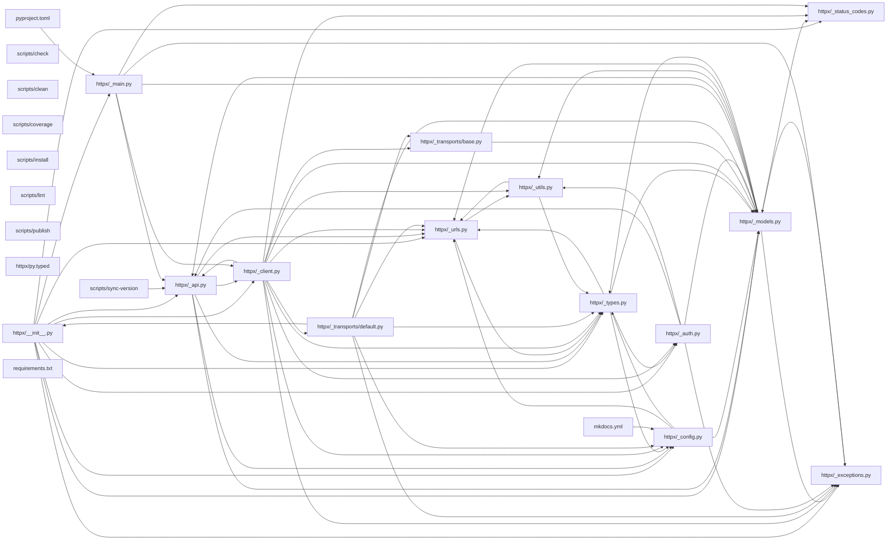

## ARCHITECTURE

A python-based project composed of the following subsystems:

- **tests/**: Primary subsystem containing 40 files
- **docs/**: Primary subsystem containing 26 files
- **httpx/**: Primary subsystem containing 24 files
- **scripts/**: Primary subsystem containing 10 files
- **Root**: Contains scripts and execution points

## ENTRY_POINTS

*No entry points identified within budget.*

## SYMBOL_INDEX

**`httpx/_api.py`**
- `request()`
- `stream()`
- `get()`
- `options()`
- `head()`
- `post()`
- `put()`
- `patch()`
- `delete()`

**`httpx/_models.py`**
- `_is_known_encoding()`
- `_normalize_header_key()`
- `_normalize_header_value()`
- `_parse_content_type_charset()`
- `_parse_header_links()`
- `_obfuscate_sensitive_headers()`
- class `Headers`
  - `__init__()`
  - `keys()`
  - `values()`
  - `items()`
  - `multi_items()`
  - `get()`
  - `get_list()`
  - `update()`
  - `copy()`
  - `__getitem__()`
  - `__setitem__()`
  - `__delitem__()`
  - `__contains__()`
  - `__iter__()`
  - `__len__()`
  - `__eq__()`
  - `__repr__()`
- class `Request`
  - `__init__()`
  - `_prepare()`
  - `read()`
  - `aread()`
  - `__repr__()`
  - `__getstate__()`
  - `__setstate__()`
- class `Response`
  - `__init__()`
  - `_prepare()`
  - `_get_content_decoder()`
  - `raise_for_status()`
  - `json()`
  - `__repr__()`
  - `__getstate__()`
  - `__setstate__()`
  - `read()`
  - `iter_bytes()`
  - `iter_text()`
  - `iter_lines()`
  - `iter_raw()`
  - `close()`
  - `aread()`
  - `aiter_bytes()`
  - `aiter_text()`
  - `aiter_lines()`
  - `aiter_raw()`
  - `aclose()`
- class `Cookies`
  - `__init__()`
  - `extract_cookies()`
  - `set_cookie_header()`
  - `set()`
  - `get()`
  - `delete()`
  - `clear()`
  - `update()`
  - `__setitem__()`
  - `__getitem__()`
  - `__delitem__()`
  - `__len__()`
  - `__iter__()`
  - `__bool__()`
  - `__repr__()`

**`httpx/_exceptions.py`**
- class `HTTPError`
  - `__init__()`
- class `RequestError`
  - `__init__()`
- class `TransportError`
- class `TimeoutException`
- class `ConnectTimeout`
- class `ReadTimeout`
- class `WriteTimeout`
- class `PoolTimeout`
- class `NetworkError`
- class `ReadError`
- class `WriteError`
- class `ConnectError`
- class `CloseError`
- class `ProxyError`
- class `UnsupportedProtocol`
- class `ProtocolError`
- class `LocalProtocolError`
- class `RemoteProtocolError`
- class `DecodingError`
- class `TooManyRedirects`
- class `HTTPStatusError`
  - `__init__()`
- class `InvalidURL`
  - `__init__()`
- class `CookieConflict`
  - `__init__()`
- class `StreamError`
  - `__init__()`
- class `StreamConsumed`
  - `__init__()`
- class `StreamClosed`
  - `__init__()`
- class `ResponseNotRead`
  - `__init__()`
- class `RequestNotRead`
  - `__init__()`
- `request_context()`

**`httpx/_config.py`**
- class `UnsetType`
- `create_ssl_context()`
- class `Timeout`
  - `__init__()`
  - `as_dict()`
  - `__eq__()`
  - `__repr__()`
- class `Limits`
  - `__init__()`
  - `__eq__()`
  - `__repr__()`
- class `Proxy`
  - `__init__()`
  - `__repr__()`

**`httpx/_urls.py`**
- class `URL`
  - `__init__()`
  - `copy_with()`
  - `copy_set_param()`
  - `copy_add_param()`
  - `copy_remove_param()`
  - `copy_merge_params()`
  - `join()`
  - `__hash__()`
  - `__eq__()`
  - `__str__()`
  - `__repr__()`
- class `QueryParams`
  - `__init__()`
  - `keys()`
  - `values()`
  - `items()`
  - `multi_items()`
  - `get()`
  - `get_list()`
  - `set()`
  - `add()`
  - `remove()`
  - `merge()`
  - `__getitem__()`
  - `__contains__()`
  - `__iter__()`
  - `__len__()`
  - `__bool__()`
  - `__hash__()`
  - `__eq__()`
  - `__str__()`
  - `__repr__()`
  - `update()`
  - `__setitem__()`

**`httpx/_types.py`**
- class `SyncByteStream`
  - `__iter__()`
  - `close()`
- class `AsyncByteStream`
  - `__aiter__()`
  - `aclose()`

**`httpx/_client.py`**
- `_is_https_redirect()`
- `_port_or_default()`
- `_same_origin()`
- class `UseClientDefault`
- class `ClientState`
- class `BoundSyncStream`
  - `__init__()`
  - `__iter__()`
  - `close()`
- class `BoundAsyncStream`
  - `__init__()`
  - `__aiter__()`
  - `aclose()`
- class `BaseClient`
  - `__init__()`
  - `_enforce_trailing_slash()`
  - `_get_proxy_map()`
  - `build_request()`
  - `_merge_url()`
  - `_merge_cookies()`
  - `_merge_headers()`
  - `_merge_queryparams()`
  - `_build_auth()`
  - `_build_request_auth()`
  - `_build_redirect_request()`
  - `_redirect_method()`
  - `_redirect_url()`
  - `_redirect_headers()`
  - `_redirect_stream()`
  - `_set_timeout()`
- class `Client`
  - `__init__()`
  - `_init_transport()`
  - `_init_proxy_transport()`
  - `_transport_for_url()`
  - `request()`
  - `send()`
  - `_send_handling_auth()`
  - `_send_handling_redirects()`
  - `_send_single_request()`
  - `get()`
  - `options()`
  - `head()`
  - `post()`
  - `put()`
  - `patch()`
  - `delete()`
  - `close()`
  - `__enter__()`
  - `__exit__()`
- class `AsyncClient`
  - `__init__()`
  - `_init_transport()`
  - `_init_proxy_transport()`
  - `_transport_for_url()`
  - `request()`
  - `send()`
  - `_send_handling_auth()`
  - `_send_handling_redirects()`
  - `_send_single_request()`
  - `get()`
  - `options()`
  - `head()`
  - `post()`
  - `put()`
  - `patch()`
  - `delete()`
  - `aclose()`
  - `__aenter__()`
  - `__aexit__()`

**`httpx/_transports/base.py`**
- class `BaseTransport`
  - `__enter__()`
  - `__exit__()`
  - `handle_request()`
  - `close()`
- class `AsyncBaseTransport`
  - `__aenter__()`
  - `__aexit__()`
  - `handle_async_request()`
  - `aclose()`

**`httpx/_transports/default.py`**
- `_load_httpcore_exceptions()`
- `map_httpcore_exceptions()`
- class `ResponseStream`
  - `__init__()`
  - `__iter__()`
  - `close()`
- class `HTTPTransport`
  - `__init__()`
  - `__enter__()`
  - `__exit__()`
  - `handle_request()`
  - `close()`
- class `AsyncResponseStream`
  - `__init__()`
  - `__aiter__()`
  - `aclose()`
- class `AsyncHTTPTransport`
  - `__init__()`
  - `__aenter__()`
  - `__aexit__()`
  - `handle_async_request()`
  - `aclose()`

## IMPORTANT_CALL_PATHS

.gitignore()
## CORE_MODULES

### `httpx/__init__.py`

**Purpose:** Implements init.
**Depends on:** `__version__`, `_api`, `_auth`, `_client`, `_config`, `_content`, `_exceptions`, `_main`, +5 more

## Constants
__all__ = <complex expression>
__locals = locals()

### `httpx/_api.py`

**Purpose:** Implements api.
**Depends on:** `_client`, `_config`, `_models`, `_types`, +1 more

**Functions:**
- `def delete(url: URL | str, *, params: QueryParamTypes | None = None, headers: HeaderTypes | None = None, ...) -> Response`
- `def get(url: URL | str, *, params: QueryParamTypes | None = None, headers: HeaderTypes | None = None, ...) -> Response`
- `def head(url: URL | str, *, params: QueryParamTypes | None = None, headers: HeaderTypes | None = None, ...) -> Response`
- `def options(url: URL | str, *, params: QueryParamTypes | None = None, ...) -> Response`

### `httpx/_models.py`

**Purpose:** Implements models.
**Depends on:** `_content`, `_decoders`, `_exceptions`, `_multipart`, +4 more

**Types:**
- `Cookies` (bases: `typing.MutableMapping[str, str]`) - HTTP Cookies, as a mutable mapping. methods: `__init__`, `__repr__` (+7 more)

**Functions:**
- `def _is_known_encoding(encoding: str) -> bool`
- `def _normalize_header_key(key: str | bytes, encoding: str | None = None) -> bytes`
- `def _normalize_header_value(value: str | bytes, encoding: str | None = None) -> bytes`
- `def _obfuscate_sensitive_headers(...) -> typing.Iterator[tuple[typing.AnyStr, typing.AnyStr]]`

## Constants
SENSITIVE_HEADERS = {"authorization", "proxy-authorization"}

### `httpx/_exceptions.py`

**Purpose:** Our exception hierarchy:
**Depends on:** `_models`

**Types:**
- `CloseError` (bases: `NetworkError`) - Failed to close a connection.
- `ConnectError` (bases: `NetworkError`) - Failed to establish a connection.
- `ConnectTimeout` (bases: `TimeoutException`) - Timed out while connecting to the host.
- `CookieConflict` (bases: `Exception`) - Attempted to lookup a cookie by name, but multiple cookies existed. methods: `__init__`

**Functions:**
- `def request_context(     request: Request | None = None, ) -> typing.Iterator[None]`
  - A context manager that can be used to attach the given request context

**Notes:** large file (378 lines)

### `httpx/_config.py`

**Purpose:** Implements config.
**Depends on:** `_models`, `_types`, `_urls`

**Types:**
- `Limits` - Configuration for limits to various client behaviors. methods: `__init__`, `__repr__`
- `Proxy` methods: `__init__`, `__repr__`
- `Timeout` - Timeout configuration. methods: `__init__`, `__repr__`, `as_dict`
- `UnsetType`

**Functions:**
- `def create_ssl_context(verify: ssl.SSLContext | str | bool = True, cert: CertTypes | None = None, ...) -> ssl.SSLContext`

## Constants
UNSET = UnsetType()
DEFAULT_TIMEOUT_CONFIG = Timeout(timeout=5.0)
DEFAULT_LIMITS = Limits(max_connections=100, max_keepalive_connections=20)
DEFAULT_MAX_REDIRECTS = 20

### `httpx/_urls.py`

**Purpose:** Implements urls.
**Depends on:** `_types`, `_urlparse`, `_utils`

**Types:**
- `QueryParams` (bases: `typing.Mapping[str, str]`) - URL query parameters, as a multi-dict. methods: `__init__`, `__repr__`, `__str__`, `add`, `get`, `get_list` (+8 more)
- `URL` - url = httpx.URL("HTTPS://jo%40email.com:a%20secret@müller.de:1234/pa%20th?search=ab#anchorlink") methods: `__init__`, `__repr__`, `__str__`, `copy_add_param`, `copy_merge_params`, `copy_remove_param` (+3 more)

**Notes:** decorator-heavy (17 decorators); large file (642 lines)

### `httpx/_types.py`

**Purpose:** Type definitions for type checking purposes.
**Depends on:** `_auth`, `_config`, `_models`, `_urls`

**Types:**
- `AsyncByteStream` methods: `aclose`
- `SyncByteStream` methods: `close`

### `httpx/_client.py`

**Purpose:** Implements client.
**Depends on:** `__version__`, `_auth`, `_config`, `_decoders`, +8 more

**Types:**
- `AsyncClient` (bases: `BaseClient`) - An asynchronous HTTP client, with connection pooling, HTTP/2, redirects, methods: `__init__`, `aclose` (+9 more)

**Functions:**
- `def _is_https_redirect(url: URL, location: URL) -> bool`
- `def _port_or_default(url: URL) -> int | None`
- `def _same_origin(url: URL, other: URL) -> bool`

## Constants
T = typing.TypeVar("T", bound="Client")
U = typing.TypeVar("U", bound="AsyncClient")
USE_CLIENT_DEFAULT = UseClientDefault()
USER_AGENT = f"python-httpx/{__version__}"
ACCEPT_ENCODING = <complex expression>

## SUPPORTING_MODULES

### `httpx/_transports/base.py`

```python
class BaseTransport

class AsyncBaseTransport

```

### `httpx/_transports/default.py`

> 
Custom transports, with nicely configured defaults.

The following additional keyword arguments are currently supported by httpcore...

* uds: str
* local_address: str
* retries: int

Example usages...

# Disable HTTP/2 on a single specific domain.
mounts = {
    "all://": httpx.HTTPTransport(http2=True),
    "all://*example.org": httpx.HTTPTransport()
}

# Using advanced httpcore configuration, with connection retries.
transport = httpx.HTTPTransport(retries=1)
client = httpx.Client(transport=transport)

# Using advanced httpcore configuration, with unix domain sockets.
transport = httpx.HTTPTransport(uds="socket.uds")
client = httpx.Client(transport=transport)


```python
def _load_httpcore_exceptions() -> dict[type[Exception], type[httpx.HTTPError]]

def map_httpcore_exceptions() -> typing.Iterator[None]

class ResponseStream(SyncByteStream)

class HTTPTransport(BaseTransport)

class AsyncResponseStream(AsyncByteStream)

class AsyncHTTPTransport(AsyncBaseTransport)

```

## DEPENDENCY_GRAPH



### Cyclic Dependencies

> [!WARNING]
> The following circular import chains were detected:

1. `httpx/_api.py` -> `httpx/_client.py`

## RANKED_FILES

| File | Score | Tier | Tokens |
|------|-------|------|--------|
| `httpx/__init__.py` | 0.424 | structured summary | 66 |
| `httpx/_api.py` | 0.406 | structured summary | 166 |
| `httpx/_models.py` | 0.386 | structured summary | 187 |
| `tests/conftest.py` | 0.364 | one-liner | 25 |
| `httpx/_exceptions.py` | 0.306 | structured summary | 172 |
| `httpx/_config.py` | 0.296 | structured summary | 187 |
| `httpx/_urls.py` | 0.294 | structured summary | 184 |
| `httpx/_types.py` | 0.244 | structured summary | 62 |
| `httpx/_client.py` | 0.236 | structured summary | 196 |
| `tests/test_content.py` | 0.200 | one-liner | 20 |
| `tests/test_decoders.py` | 0.200 | one-liner | 21 |
| `tests/test_exceptions.py` | 0.200 | one-liner | 20 |
| `tests/test_exported_members.py` | 0.200 | one-liner | 22 |
| `tests/test_main.py` | 0.200 | one-liner | 20 |
| `tests/test_status_codes.py` | 0.200 | one-liner | 21 |
| `tests/test_timeouts.py` | 0.200 | one-liner | 21 |
| `tests/test_utils.py` | 0.200 | one-liner | 20 |
| `tests/test_wsgi.py` | 0.200 | one-liner | 21 |
| `tests/models/test_cookies.py` | 0.197 | one-liner | 21 |
| `tests/models/test_headers.py` | 0.197 | one-liner | 21 |
| `tests/models/test_queryparams.py` | 0.197 | one-liner | 22 |
| `tests/models/test_requests.py` | 0.197 | one-liner | 21 |
| `tests/models/test_url.py` | 0.197 | one-liner | 21 |
| `tests/models/test_whatwg.py` | 0.197 | one-liner | 23 |
| `tests/models/whatwg.json` | 0.197 | one-liner | 15 |
| `tests/test_api.py` | 0.197 | one-liner | 20 |
| `tests/test_auth.py` | 0.197 | one-liner | 9 |
| `tests/test_config.py` | 0.197 | one-liner | 20 |
| `tests/fixtures/.netrc-nopassword` | 0.196 | one-liner | 16 |
| `tests/models/__init__.py` | 0.196 | one-liner | 14 |
| `httpx/_transports/base.py` | 0.194 | signatures | 24 |
| `httpx/_transports/default.py` | 0.194 | signatures | 231 |
| `tests/fixtures/.netrc` | 0.192 | one-liner | 13 |
| `tests/client/test_cookies.py` | 0.190 | one-liner | 21 |
| `tests/client/test_properties.py` | 0.190 | one-liner | 21 |
| `tests/client/test_proxies.py` | 0.190 | one-liner | 22 |
| `tests/client/test_queryparams.py` | 0.190 | one-liner | 22 |
| `tests/client/__init__.py` | 0.190 | one-liner | 14 |
| `scripts/check` | 0.187 | one-liner | 10 |
| `scripts/clean` | 0.187 | one-liner | 11 |

## PERIPHERY

- `tests/conftest.py` — 1 class, 17 functions, 14 imports, 288 lines
- `tests/test_content.py` — 24 functions, 4 imports, 519 lines
- `tests/test_decoders.py` — 23 functions, 7 imports, 356 lines
- `tests/test_exceptions.py` — 3 functions, 5 imports, 64 lines
- `tests/test_exported_members.py` — 1 function, 1 imports, 14 lines
- `tests/test_main.py` — 13 functions, 4 imports, 188 lines
- `tests/test_status_codes.py` — 6 functions, 1 imports, 28 lines
- `tests/test_timeouts.py` — 5 functions, 2 imports, 56 lines
- `tests/test_utils.py` — 8 functions, 7 imports, 151 lines
- `tests/test_wsgi.py` — 15 functions, 8 imports, 204 lines
- `tests/models/test_cookies.py` — 7 functions, 3 imports, 99 lines
- `tests/models/test_headers.py` — 20 functions, 2 imports, 220 lines
- `tests/models/test_queryparams.py` — 10 functions, 2 imports, 137 lines
- `tests/models/test_requests.py` — 22 functions, 4 imports, 242 lines
- `tests/models/test_url.py` — 69 functions, 2 imports, 864 lines
- `tests/models/test_whatwg.py` — 1 function, 3 imports, 53 lines
- `tests/models/whatwg.json` — 9747 lines
- `tests/test_api.py` — 12 functions, 5 imports, 103 lines
- `tests/test_auth.py` — 
- `tests/test_config.py` — 27 functions, 6 imports, 185 lines
- `tests/fixtures/.netrc-nopassword` — 3 lines
- `tests/models/__init__.py` — 0 lines
- `tests/fixtures/.netrc` — 3 lines
- `tests/client/test_cookies.py` — 8 functions, 3 imports, 169 lines
- `tests/client/test_properties.py` — 8 functions, 1 imports, 69 lines
- `tests/client/test_proxies.py` — 9 functions, 3 imports, 266 lines
- `tests/client/test_queryparams.py` — 4 functions, 1 imports, 36 lines
- `tests/client/__init__.py` — 0 lines
- `scripts/check` — 15 lines
- `scripts/clean` — 15 lines
- `scripts/coverage` — 12 lines
- `scripts/docs` — 11 lines
- `scripts/install` — 20 lines
- `scripts/lint` — 13 lines
- `scripts/publish` — 27 lines
- `scripts/sync-version` — 12 lines
- `scripts/test` — 19 lines
- `tests/__init__.py` — 0 lines
- `httpx/_auth.py` — 6 classs, 12 imports, 349 lines
- `httpx/_utils.py` — 1 class, 9 functions, 8 imports, 243 lines
- `httpx/py.typed` — 0 lines
- `mkdocs.yml` — 62 lines
- `pyproject.toml` — 133 lines
- `requirements.txt` — 30 lines
- `scripts/build` — 14 lines
- `httpx/_status_codes.py` — 1 class, 1 imports, 163 lines
- `tests/client/test_async_client.py` — 27 functions, 4 imports, 376 lines
- `tests/client/test_event_hooks.py` — 7 functions, 2 imports, 229 lines
- `docs/overrides/partials/nav.html` — 54 lines
- `docs/quickstart.md` — 548 lines
- `docs/third_party_packages.md` — 108 lines
- `docs/troubleshooting.md` — 64 lines
- `httpx/_main.py` — 14 functions, 17 imports, 507 lines
- `tests/client/test_redirects.py` — 1 class, 30 functions, 3 imports, 448 lines
- `docs/index.md` — 151 lines
- `docs/logging.md` — 82 lines
- `tests/models/test_responses.py` — 1 class, 73 functions, 6 imports, 1041 lines
- `httpx/_transports/asgi.py` — 2 classs, 2 functions, 9 imports, 188 lines
- `httpx/_transports/mock.py` — 1 class, 3 imports, 44 lines
- `httpx/_transports/wsgi.py` — 2 classs, 1 function, 9 imports, 150 lines
- `tests/test_multipart.py` — 1 class, 19 functions, 5 imports, 470 lines
- `tests/test_asgi.py` — 19 functions, 3 imports, 225 lines
- `httpx/_content.py` — 4 classs, 8 functions, 9 imports, 241 lines
- `httpx/_urlparse.py` — 
- `tests/client/test_client.py` — 38 functions, 5 imports, 463 lines
- `tests/client/test_auth.py` — 
- `tests/client/test_headers.py` — 20 functions, 2 imports, 294 lines
- `tests/concurrency.py` — 
- `docs/contributing.md` — 233 lines
- `docs/css/custom.css` — 11 lines
- `docs/environment_variables.md` — 80 lines
- `docs/exceptions.md` — 125 lines
- `docs/http2.md` — 69 lines
- `docs/advanced/clients.md` — 329 lines
- `docs/advanced/event-hooks.md` — 66 lines
- `docs/advanced/extensions.md` — 243 lines
- `docs/advanced/proxies.md` — 84 lines
- `docs/advanced/resource-limits.md` — 13 lines
- `docs/advanced/ssl.md` — 90 lines
- `docs/advanced/text-encodings.md` — 76 lines
- `docs/advanced/timeouts.md` — 71 lines
- `docs/advanced/transports.md` — 455 lines
- `docs/api.md` — 177 lines
- `docs/async.md` — 194 lines
- `docs/code_of_conduct.md` — 57 lines
- `docs/compatibility.md` — 233 lines
- `httpx/__version__.py` — 4 lines
- `httpx/_decoders.py` — 
- `httpx/_multipart.py` — 3 classs, 3 functions, 8 imports, 301 lines
- `docs/advanced/authentication.md` — 232 lines
- `tests/common.py` — 1 imports, 5 lines
- `.gitignore` — 13 lines
- `CHANGELOG.md` — 1143 lines
- `LICENSE.md` — 13 lines
- `README.md` — 148 lines
- `docs/CNAME` — 2 lines
- `httpx/_transports/__init__.py` — 5 imports, 16 lines

