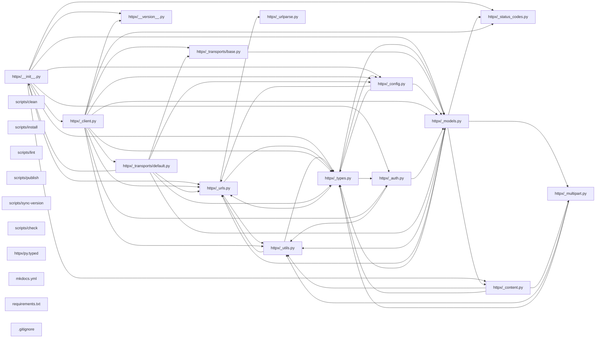

## ARCHITECTURE

A python-based project composed of the following subsystems:

- **tests/**: Primary subsystem containing 40 files
- **docs/**: Primary subsystem containing 26 files
- **httpx/**: Primary subsystem containing 24 files
- **scripts/**: Primary subsystem containing 8 files
- **Root**: Contains scripts and execution points

## ENTRY_POINTS

*No entry points identified within budget.*

## SYMBOL_INDEX

**`httpx/_types.py`**
- class `SyncByteStream`
  - `__iter__()`
  - `close()`
- class `AsyncByteStream`
  - `__aiter__()`
  - `aclose()`

**`httpx/_utils.py`**
- `primitive_value_to_str()`
- `get_environment_proxies()`
- `to_bytes()`
- `to_str()`
- `to_bytes_or_str()`
- `unquote()`
- `peek_filelike_length()`
- class `URLPattern`
  - `__init__()`
  - `matches()`
  - `__hash__()`
  - `__lt__()`
  - `__eq__()`
- `is_ipv4_hostname()`
- `is_ipv6_hostname()`

**`httpx/_urls.py`**
- class `URL`
  - `__init__()`
  - `copy_with()`
  - `copy_set_param()`
  - `copy_add_param()`
  - `copy_remove_param()`
  - `copy_merge_params()`
  - `join()`
  - `__hash__()`
  - `__eq__()`
  - `__str__()`
  - `__repr__()`
- class `QueryParams`
  - `__init__()`
  - `keys()`
  - `values()`
  - `items()`
  - `multi_items()`
  - `get()`
  - `get_list()`
  - `set()`
  - `add()`
  - `remove()`
  - `merge()`
  - `__getitem__()`
  - `__contains__()`
  - `__iter__()`
  - `__len__()`
  - `__bool__()`
  - `__hash__()`
  - `__eq__()`
  - `__str__()`
  - `__repr__()`
  - `update()`
  - `__setitem__()`

## IMPORTANT_CALL_PATHS

.gitignore()

CHANGELOG()

LICENSE()

README()

CNAME()

authentication()

clients()

event-hooks()

extensions()

proxies()

resource-limits()

ssl()

text-encodings()

timeouts()

transports()

api()

async()

code_of_conduct()

compatibility()

contributing()

custom()

environment_variables()

exceptions()

http2()

index()

logging()

nav()

quickstart()

third_party_packages()

troubleshooting()

py()

mkdocs()

requirements()

check()

clean()

docs()

install()

lint()

publish()

sync-version()

test()

__init__()

__init__()

test_async_client.test_get()
  → __init__()
  → _models._is_known_encoding()
  → _types.SyncByteStream()
  → _urls.URL()

test_auth.App()
  → __init__()
  → _models._is_known_encoding()
  → _types.SyncByteStream()
  → _urls.URL()

test_client.autodetect()
  → __init__()
  → _models._is_known_encoding()
  → _types.SyncByteStream()
  → _urls.URL()

test_cookies.get_and_set_cookies()
  → __init__()
  → _models._is_known_encoding()
  → _types.SyncByteStream()
  → _urls.URL()

test_event_hooks.app()
  → __init__()
  → _models._is_known_encoding()
  → _types.SyncByteStream()
  → _urls.URL()

test_headers.echo_headers()
  → __init__()
  → _models._is_known_encoding()
  → _types.SyncByteStream()
  → _urls.URL()

test_properties.test_client_base_url()
  → __init__()
  → _models._is_known_encoding()
  → _types.SyncByteStream()
  → _urls.URL()

test_proxies.url_to_origin()
  → __init__()
  → _models._is_known_encoding()
  → _types.SyncByteStream()
  → _urls.URL()

test_queryparams.hello_world()
  → __init__()
  → _models._is_known_encoding()
  → _types.SyncByteStream()
  → _urls.URL()

test_redirects.redirects()
  → __init__()
  → _models._is_known_encoding()
  → _types.SyncByteStream()
  → _urls.URL()

conftest.clean_environ()
  → __init__()
  → _models._is_known_encoding()
  → _types.SyncByteStream()
  → _urls.URL()

.netrc()

.netrc-nopassword()

__init__()

test_cookies.test_cookies()
  → __init__()
  → _models._is_known_encoding()
  → _types.SyncByteStream()
  → _urls.URL()

test_headers.test_headers()
  → __init__()
  → _models._is_known_encoding()
  → _types.SyncByteStream()
  → _urls.URL()

test_queryparams.test_queryparams()
  → __init__()
  → _models._is_known_encoding()
  → _types.SyncByteStream()
  → _urls.URL()

test_requests.test_request_repr()
  → __init__()
  → _models._is_known_encoding()
  → _types.SyncByteStream()
  → _urls.URL()

test_responses.StreamingBody()
  → __init__()
  → _models._is_known_encoding()
  → _types.SyncByteStream()
  → _urls.URL()

test_url.test_basic_url()
  → __init__()
  → _models._is_known_encoding()
  → _types.SyncByteStream()
  → _urls.URL()

test_whatwg.test_urlparse()
  → _urlparse.ParseResult()
  → _exceptions.HTTPError()
  → _models._is_known_encoding()
  → _types.SyncByteStream()

whatwg()

test_api.test_get()
  → __init__()
  → _models._is_known_encoding()
  → _types.SyncByteStream()
  → _urls.URL()

test_asgi.hello_world()
  → __init__()
  → _models._is_known_encoding()
  → _types.SyncByteStream()
  → _urls.URL()

test_auth.test_basic_auth()
  → __init__()
  → _models._is_known_encoding()
  → _types.SyncByteStream()
  → _urls.URL()

test_config.test_load_ssl_config()
  → __init__()
  → _models._is_known_encoding()
  → _types.SyncByteStream()
  → _urls.URL()

test_content.test_empty_content()
  → __init__()
  → _models._is_known_encoding()
  → _types.SyncByteStream()
  → _urls.URL()

test_decoders.test_deflate()
  → __init__()
  → _models._is_known_encoding()
  → _types.SyncByteStream()
  → _urls.URL()

test_exceptions.test_httpcore_all_exceptions_mapped()
  → __init__()
  → _models._is_known_encoding()
  → _types.SyncByteStream()
  → _urls.URL()

test_exported_members.test_all_imports_are_exported()
  → __init__()
  → _models._is_known_encoding()
  → _types.SyncByteStream()
  → _urls.URL()

test_main.splitlines()
  → __init__()
  → _models._is_known_encoding()
  → _types.SyncByteStream()
  → _urls.URL()

test_multipart.echo_request_content()
  → __init__()
  → _models._is_known_encoding()
  → _types.SyncByteStream()
  → _urls.URL()

test_status_codes.test_status_code_as_int()
  → __init__()
  → _models._is_known_encoding()
  → _types.SyncByteStream()
  → _urls.URL()

test_timeouts.test_read_timeout()
  → __init__()
  → _models._is_known_encoding()
  → _types.SyncByteStream()
  → _urls.URL()

test_utils.test_encoded()
  → __init__()
  → _models._is_known_encoding()
  → _types.SyncByteStream()
  → _urls.URL()

test_wsgi.application_factory()
  → __init__()
  → _models._is_known_encoding()
  → _types.SyncByteStream()
  → _urls.URL()
## CORE_MODULES

### `httpx/__init__.py`

**Purpose:** Implements init.
**Depends on:** `__version__`, `_api`, `_auth`, `_client`, `_config`, `_content`, `_exceptions`, `_main`, +5 more

### `httpx/_types.py`

**Purpose:** Type definitions for type checking purposes.
**Depends on:** `_auth`, `_config`, `_models`, `_urls`

**Types:**
- `AsyncByteStream` methods: `aclose`
- `SyncByteStream` methods: `close`

### `httpx/_utils.py`

**Purpose:** Implements utils.
**Depends on:** `_types`, `_urls`

**Types:**
- `URLPattern` - A utility class currently used for making lookups against proxy keys... methods: `__init__`, `matches`

**Functions:**
- `def get_environment_proxies() -> dict[str, str | None]`
- `def is_ipv4_hostname(hostname: str) -> bool`
- `def is_ipv6_hostname(hostname: str) -> bool`
- `def peek_filelike_length(stream: typing.Any) -> int | None`
- `def primitive_value_to_str(value: PrimitiveData) -> str`
- `def to_bytes(value: str | bytes, encoding: str = "utf-8") -> bytes`

## SUPPORTING_MODULES

### `httpx/_urls.py`

```python
class URL
    """url = httpx.URL("HTTPS://jo%40email.com:a%20secret@müller.de:1234/pa%20th?search=ab#anchorlink")

    assert url.scheme == "https"
    assert url.username == "jo@email.com"
    assert url.password == "a secret"
    assert url.userinfo == b"jo%40email.com:a%20secret"
    assert url.host == "müller.de"
    assert url.raw_host == b"xn--mller-kva.de"
    assert url.port == 1234
    assert url.netloc == b"xn--mller-kva.de:1234"
    assert url.path == "/pa th"
    assert url.query == b"?search=ab"
    assert url.raw_path == b"/pa%20th?search=ab"
    assert url.fragment == "anchorlink"

    The components of a URL are broken down like this:

       https://jo%40email.com:a%20secret@müller.de:1234/pa%20th?search=ab#anchorlink
    [scheme]   [  username  ] [password] [ host ][port][ path ] [ query ] [fragment]
               [       userinfo        ] [   netloc   ][    raw_path    ]

    Note that:

    * `url.scheme` is normalized to always be lowercased.

    * `url.host` is normalized to always be lowercased. Internationalized domain
      names are represented in unicode, without IDNA encoding applied. For instance:

      url = httpx.URL("http://中国.icom.museum")
      assert url.host == "中国.icom.museum"
      url = httpx.URL("http://xn--fiqs8s.icom.museum")
      assert url.host == "中国.icom.museum"

    * `url.raw_host` is normalized to always be lowercased, and is IDNA encoded.

      url = httpx.URL("http://中国.icom.museum")
      assert url.raw_host == b"xn--fiqs8s.icom.museum"
      url = httpx.URL("http://xn--fiqs8s.icom.museum")
      assert url.raw_host == b"xn--fiqs8s.icom.museum"

    * `url.port` is either None or an integer. URLs that include the default port for
      "http", "https", "ws", "wss", and "ftp" schemes have their port
      normalized to `None`.

      assert httpx.URL("http://example.com") == httpx.URL("http://example.com:80")
      assert httpx.URL("http://example.com").port is None
      assert httpx.URL("http://example.com:80").port is None

    * `url.userinfo` is raw bytes, without URL escaping. Usually you'll want to work
      with `url.username` and `url.password` instead, which handle the URL escaping.

    * `url.raw_path` is raw bytes of both the path and query, without URL escaping.
      This portion is used as the target when constructing HTTP requests. Usually you'll
      want to work with `url.path` instead.

    * `url.query` is raw bytes, without URL escaping. A URL query string portion can
      only be properly URL escaped when decoding the parameter names and values
      themselves."""

class QueryParams(typing.Mapping[str, str])
    """URL query parameters, as a multi-dict."""

```

## DEPENDENCY_GRAPH



### Cyclic Dependencies

> [!WARNING]
> The following circular import chains were detected:

1. `httpx/_exceptions.py` -> `httpx/_models.py`

## RANKED_FILES

| File | Score | Tier | Tokens |
|------|-------|------|--------|
| `httpx/__init__.py` | 0.502 | structured summary | 50 |
| `httpx/_types.py` | 0.239 | structured summary | 62 |
| `httpx/_utils.py` | 0.201 | structured summary | 162 |
| `tests/test_main.py` | 0.200 | one-liner | 20 |
| `tests/test_multipart.py` | 0.200 | one-liner | 25 |
| `tests/test_status_codes.py` | 0.200 | one-liner | 21 |
| `tests/test_timeouts.py` | 0.200 | one-liner | 21 |
| `tests/test_utils.py` | 0.200 | one-liner | 20 |
| `tests/test_wsgi.py` | 0.200 | one-liner | 21 |
| `tests/test_api.py` | 0.197 | one-liner | 20 |
| `tests/test_asgi.py` | 0.197 | one-liner | 21 |
| `tests/test_auth.py` | 0.197 | one-liner | 9 |
| `tests/test_config.py` | 0.197 | one-liner | 20 |
| `tests/test_content.py` | 0.197 | one-liner | 20 |
| `tests/test_decoders.py` | 0.197 | one-liner | 21 |
| `tests/test_exceptions.py` | 0.197 | one-liner | 20 |
| `tests/test_exported_members.py` | 0.197 | one-liner | 22 |
| `tests/models/whatwg.json` | 0.194 | one-liner | 15 |
| `tests/models/test_cookies.py` | 0.192 | one-liner | 21 |
| `tests/models/test_headers.py` | 0.192 | one-liner | 21 |
| `tests/models/test_queryparams.py` | 0.192 | one-liner | 22 |
| `tests/models/test_requests.py` | 0.192 | one-liner | 21 |
| `tests/models/test_responses.py` | 0.192 | one-liner | 26 |
| `tests/models/test_url.py` | 0.192 | one-liner | 21 |
| `tests/models/test_whatwg.py` | 0.192 | one-liner | 23 |
| `httpx/_urls.py` | 0.191 | signatures | 748 |
| `tests/fixtures/.netrc-nopassword` | 0.191 | one-liner | 16 |
| `tests/models/__init__.py` | 0.191 | one-liner | 14 |
| `tests/client/test_queryparams.py` | 0.189 | one-liner | 22 |
| `tests/client/test_redirects.py` | 0.189 | one-liner | 26 |
| `tests/conftest.py` | 0.189 | one-liner | 25 |
| `tests/fixtures/.netrc` | 0.189 | one-liner | 13 |
| `tests/client/test_auth.py` | 0.186 | one-liner | 10 |
| `tests/client/test_client.py` | 0.186 | one-liner | 21 |
| `tests/client/test_cookies.py` | 0.186 | one-liner | 21 |
| `tests/client/test_event_hooks.py` | 0.186 | one-liner | 22 |
| `tests/client/test_headers.py` | 0.186 | one-liner | 21 |
| `tests/client/test_properties.py` | 0.186 | one-liner | 21 |
| `tests/client/test_proxies.py` | 0.186 | one-liner | 22 |
| `tests/client/test_async_client.py` | 0.186 | one-liner | 22 |

## PERIPHERY

- `tests/test_main.py` — 13 functions, 4 imports, 188 lines
- `tests/test_multipart.py` — 1 class, 19 functions, 5 imports, 470 lines
- `tests/test_status_codes.py` — 6 functions, 1 imports, 28 lines
- `tests/test_timeouts.py` — 5 functions, 2 imports, 56 lines
- `tests/test_utils.py` — 8 functions, 7 imports, 151 lines
- `tests/test_wsgi.py` — 15 functions, 8 imports, 204 lines
- `tests/test_api.py` — 12 functions, 5 imports, 103 lines
- `tests/test_asgi.py` — 19 functions, 3 imports, 225 lines
- `tests/test_auth.py` — 
- `tests/test_config.py` — 27 functions, 6 imports, 185 lines
- `tests/test_content.py` — 24 functions, 4 imports, 519 lines
- `tests/test_decoders.py` — 23 functions, 7 imports, 356 lines
- `tests/test_exceptions.py` — 3 functions, 5 imports, 64 lines
- `tests/test_exported_members.py` — 1 function, 1 imports, 14 lines
- `tests/models/whatwg.json` — 9747 lines
- `tests/models/test_cookies.py` — 7 functions, 3 imports, 99 lines
- `tests/models/test_headers.py` — 20 functions, 2 imports, 220 lines
- `tests/models/test_queryparams.py` — 10 functions, 2 imports, 137 lines
- `tests/models/test_requests.py` — 22 functions, 4 imports, 242 lines
- `tests/models/test_responses.py` — 1 class, 73 functions, 6 imports, 1041 lines
- `tests/models/test_url.py` — 69 functions, 2 imports, 864 lines
- `tests/models/test_whatwg.py` — 1 function, 3 imports, 53 lines
- `tests/fixtures/.netrc-nopassword` — 3 lines
- `tests/models/__init__.py` — 0 lines
- `tests/client/test_queryparams.py` — 4 functions, 1 imports, 36 lines
- `tests/client/test_redirects.py` — 1 class, 30 functions, 3 imports, 448 lines
- `tests/conftest.py` — 1 class, 17 functions, 14 imports, 288 lines
- `tests/fixtures/.netrc` — 3 lines
- `tests/client/test_auth.py` — 
- `tests/client/test_client.py` — 38 functions, 5 imports, 463 lines
- `tests/client/test_cookies.py` — 8 functions, 3 imports, 169 lines
- `tests/client/test_event_hooks.py` — 7 functions, 2 imports, 229 lines
- `tests/client/test_headers.py` — 20 functions, 2 imports, 294 lines
- `tests/client/test_properties.py` — 8 functions, 1 imports, 69 lines
- `tests/client/test_proxies.py` — 9 functions, 3 imports, 266 lines
- `tests/client/test_async_client.py` — 27 functions, 4 imports, 376 lines
- `tests/client/__init__.py` — 0 lines
- `scripts/clean` — 15 lines
- `scripts/docs` — 11 lines
- `scripts/install` — 20 lines
- `scripts/lint` — 13 lines
- `scripts/publish` — 27 lines
- `scripts/sync-version` — 12 lines
- `scripts/test` — 19 lines
- `tests/__init__.py` — 0 lines
- `scripts/check` — 15 lines
- `httpx/py.typed` — 0 lines
- `mkdocs.yml` — 62 lines
- `requirements.txt` — 30 lines
- `docs/quickstart.md` — 548 lines
- `docs/third_party_packages.md` — 108 lines
- `docs/troubleshooting.md` — 64 lines
- `docs/overrides/partials/nav.html` — 54 lines
- `docs/index.md` — 151 lines
- `docs/logging.md` — 82 lines
- `httpx/_transports/base.py` — 2 classs, 3 imports, 87 lines
- `httpx/_models.py` — 4 classs, 6 functions, 17 imports, 1278 lines
- `httpx/_config.py` — 4 classs, 1 function, 9 imports, 249 lines
- `httpx/_urlparse.py` — 
- `httpx/_status_codes.py` — 1 class, 1 imports, 163 lines
- `tests/common.py` — 1 imports, 5 lines
- `tests/concurrency.py` — 
- `httpx/_client.py` — 7 classs, 3 functions, 23 imports, 2020 lines
- `httpx/_auth.py` — 6 classs, 12 imports, 349 lines
- `httpx/_transports/default.py` — 
- `httpx/_multipart.py` — 3 classs, 3 functions, 8 imports, 301 lines
- `docs/environment_variables.md` — 80 lines
- `docs/exceptions.md` — 125 lines
- `docs/http2.md` — 69 lines
- `httpx/_content.py` — 4 classs, 8 functions, 9 imports, 241 lines
- `httpx/__version__.py` — 4 lines
- `docs/advanced/transports.md` — 455 lines
- `docs/api.md` — 177 lines
- `docs/async.md` — 194 lines
- `docs/code_of_conduct.md` — 57 lines
- `docs/compatibility.md` — 233 lines
- `docs/contributing.md` — 233 lines
- `docs/css/custom.css` — 11 lines
- `docs/advanced/clients.md` — 329 lines
- `docs/advanced/event-hooks.md` — 66 lines
- `docs/advanced/extensions.md` — 243 lines
- `docs/advanced/proxies.md` — 84 lines
- `docs/advanced/resource-limits.md` — 13 lines
- `docs/advanced/ssl.md` — 90 lines
- `docs/advanced/text-encodings.md` — 76 lines
- `docs/advanced/timeouts.md` — 71 lines
- `docs/advanced/authentication.md` — 232 lines
- `CHANGELOG.md` — 1143 lines
- `LICENSE.md` — 13 lines
- `README.md` — 148 lines
- `docs/CNAME` — 2 lines
- `.gitignore` — 13 lines
- `httpx/_main.py` — 14 functions, 17 imports, 507 lines
- `httpx/_transports/__init__.py` — 5 imports, 16 lines
- `httpx/_decoders.py` — 
- `httpx/_exceptions.py` — 
- `httpx/_api.py` — 9 functions, 8 imports, 439 lines
- `httpx/_transports/asgi.py` — 2 classs, 2 functions, 9 imports, 188 lines
- `httpx/_transports/mock.py` — 1 class, 3 imports, 44 lines
- `httpx/_transports/wsgi.py` — 2 classs, 1 function, 9 imports, 150 lines

