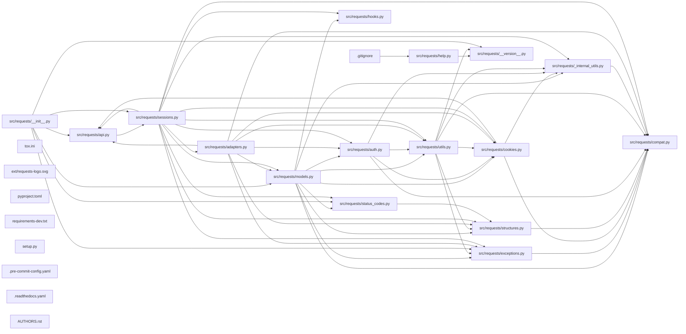

## ARCHITECTURE

A python-based project composed of the following subsystems:

- **tests/**: Primary subsystem containing 32 files
- **docs/**: Primary subsystem containing 24 files
- **src/**: Primary subsystem containing 18 files
- **ext/**: Primary subsystem containing 1 files
- **Root**: Contains scripts and execution points

## ENTRY_POINTS

*No entry points identified within budget.*

## SYMBOL_INDEX

**`src/requests/api.py`**
- `request()`
- `get()`
- `options()`
- `head()`
- `post()`
- `put()`
- `patch()`
- `delete()`

**`src/requests/compat.py`**
- `_resolve_char_detection()`

**`src/requests/models.py`**
- class `RequestEncodingMixin`
- class `RequestHooksMixin`
  - `register_hook()`
  - `deregister_hook()`
- class `Request`
  - `__init__()`
  - `__repr__()`
  - `prepare()`
- class `PreparedRequest`
  - `__init__()`
  - `prepare()`
  - `__repr__()`
  - `copy()`
  - `prepare_method()`
  - `prepare_url()`
  - `prepare_headers()`
  - `prepare_body()`
  - `prepare_content_length()`
  - `prepare_auth()`
  - `prepare_cookies()`
  - `prepare_hooks()`
- class `Response`
  - `__init__()`
  - `__enter__()`
  - `__exit__()`
  - `__getstate__()`
  - `__setstate__()`
  - `__repr__()`
  - `__bool__()`
  - `__nonzero__()`
  - `__iter__()`
  - `iter_content()`
  - `iter_lines()`
  - `json()`
  - `raise_for_status()`
  - `close()`

**`src/requests/help.py`**
- `_implementation()`
- `info()`
- `main()`

**`src/requests/exceptions.py`**
- class `RequestException`
  - `__init__()`
- class `InvalidJSONError`
- class `JSONDecodeError`
  - `__init__()`
  - `__reduce__()`
- class `HTTPError`
- class `ConnectionError`
- class `ProxyError`
- class `SSLError`
- class `Timeout`
- class `ConnectTimeout`
- class `ReadTimeout`
- class `URLRequired`
- class `TooManyRedirects`
- class `MissingSchema`
- class `InvalidSchema`
- class `InvalidURL`
- class `InvalidHeader`
- class `InvalidProxyURL`
- class `ChunkedEncodingError`
- class `ContentDecodingError`
- class `StreamConsumedError`
- class `RetryError`
- class `UnrewindableBodyError`
- class `RequestsWarning`
- class `FileModeWarning`
- class `RequestsDependencyWarning`

**`src/requests/cookies.py`**
- class `MockRequest`
  - `__init__()`
  - `get_type()`
  - `get_host()`
  - `get_origin_req_host()`
  - `get_full_url()`
  - `is_unverifiable()`
  - `has_header()`
  - `get_header()`
  - `add_header()`
  - `add_unredirected_header()`
  - `get_new_headers()`
- class `MockResponse`
  - `__init__()`
  - `info()`
  - `getheaders()`
- `extract_cookies_to_jar()`
- `get_cookie_header()`
- `remove_cookie_by_name()`
- class `CookieConflictError`
- class `RequestsCookieJar`
  - `get()`
  - `set()`
  - `iterkeys()`
  - `keys()`
  - `itervalues()`
  - `values()`
  - `iteritems()`
  - `items()`
  - `list_domains()`
  - `list_paths()`
  - `multiple_domains()`
  - `get_dict()`
  - `__contains__()`
  - `__getitem__()`
  - `__setitem__()`
  - `__delitem__()`
  - `set_cookie()`
  - `update()`
  - `_find()`
  - `_find_no_duplicates()`
  - `__getstate__()`
  - `__setstate__()`
  - `copy()`
  - `get_policy()`
- `_copy_cookie_jar()`
- `create_cookie()`
- `morsel_to_cookie()`
- `cookiejar_from_dict()`
- `merge_cookies()`

**`src/requests/structures.py`**
- class `CaseInsensitiveDict`
  - `__init__()`
  - `__setitem__()`
  - `__getitem__()`
  - `__delitem__()`
  - `__iter__()`
  - `__len__()`
  - `lower_items()`
  - `__eq__()`
  - `copy()`
  - `__repr__()`
- class `LookupDict`
  - `__init__()`
  - `__repr__()`
  - `__getitem__()`
  - `get()`

**`src/requests/auth.py`**
- `_basic_auth_str()`
- class `AuthBase`
  - `__call__()`
- class `HTTPBasicAuth`
  - `__init__()`
  - `__eq__()`
  - `__ne__()`
  - `__call__()`
- class `HTTPProxyAuth`
  - `__call__()`
- class `HTTPDigestAuth`
  - `__init__()`
  - `init_per_thread_state()`
  - `build_digest_header()`
  - `handle_redirect()`
  - `handle_401()`
  - `__call__()`
  - `__eq__()`
  - `__ne__()`

**`src/requests/utils.py`**
- `dict_to_sequence()`
- `super_len()`
- `get_netrc_auth()`
- `guess_filename()`
- `extract_zipped_paths()`
- `atomic_open()`
- `from_key_val_list()`
- `to_key_val_list()`
- `parse_list_header()`
- `parse_dict_header()`
- `unquote_header_value()`
- `dict_from_cookiejar()`
- `add_dict_to_cookiejar()`
- `get_encodings_from_content()`
- `_parse_content_type_header()`
- `get_encoding_from_headers()`
- `stream_decode_response_unicode()`
- `iter_slices()`
- `get_unicode_from_response()`
- `unquote_unreserved()`
- `requote_uri()`
- `address_in_network()`
- `dotted_netmask()`
- `is_ipv4_address()`
- `is_valid_cidr()`
- `set_environ()`
- `should_bypass_proxies()`
- `get_environ_proxies()`
- `select_proxy()`
- `resolve_proxies()`
- `default_user_agent()`
- `default_headers()`
- `parse_header_links()`
- `guess_json_utf()`
- `prepend_scheme_if_needed()`
- `get_auth_from_url()`
- `check_header_validity()`
- `_validate_header_part()`
- `urldefragauth()`
- `rewind_body()`

**`src/requests/__init__.py`**
- `check_compatibility()`
- `_check_cryptography()`

**`src/requests/_internal_utils.py`**
- `to_native_string()`
- `unicode_is_ascii()`

**`src/requests/adapters.py`**
- `_urllib3_request_context()`
- class `BaseAdapter`
  - `__init__()`
  - `send()`
  - `close()`
- class `HTTPAdapter`
  - `__init__()`
  - `__getstate__()`
  - `__setstate__()`
  - `init_poolmanager()`
  - `proxy_manager_for()`
  - `cert_verify()`
  - `build_response()`
  - `build_connection_pool_key_attributes()`
  - `get_connection_with_tls_context()`
  - `get_connection()`
  - `close()`
  - `request_url()`
  - `add_headers()`
  - `proxy_headers()`
  - `send()`

## IMPORTANT_CALL_PATHS

.coveragerc()
## CORE_MODULES

### `src/requests/api.py`

**Purpose:** requests.api
**Depends on:** `sessions`

**Functions:**
- `def delete(url, **kwargs)`
  - r"""Sends a DELETE request.
- `def get(url, params=None, **kwargs)`
  - r"""Sends a GET request.
- `def head(url, **kwargs)`
  - r"""Sends a HEAD request.
- `def options(url, **kwargs)`
  - r"""Sends an OPTIONS request.
- `def patch(url, data=None, **kwargs)`
  - r"""Sends a PATCH request.
- `def post(url, data=None, json=None, **kwargs)`
  - r"""Sends a POST request.
- `def put(url, data=None, **kwargs)`
  - r"""Sends a PUT request.
- `def request(method, url, **kwargs)`
  - Constructs and sends a :class:`Request <Request>`.

### `src/requests/compat.py`

**Purpose:** requests.compat

**Functions:**
- `def _resolve_char_detection()`
  - Find supported character detection libraries.

### `src/requests/models.py`

**Purpose:** requests.models
**Depends on:** `_internal_utils`, `auth`, `compat`, `cookies`, `exceptions`, +4 more

**Types:**
- `PreparedRequest` (bases: `RequestEncodingMixin, RequestHooksMixin`) - The fully mutable :class:`PreparedRequest <PreparedRequest>` object, methods: `__init__`, `__repr__`, `copy` (+9 more)
- `Request` (bases: `RequestHooksMixin`) - A user-created :class:`Request <Request>` object. methods: `__init__`, `__repr__`, `prepare`

## Constants
REDIRECT_STATI = <complex expression>
DEFAULT_REDIRECT_LIMIT = 30
CONTENT_CHUNK_SIZE = 10 * 1024
ITER_CHUNK_SIZE = 512

### `src/requests/help.py`

**Purpose:** Module containing bug report helper(s).
**Depends on:** `__version__`

**Functions:**
- `def _implementation()`
  - Return a dict with the Python implementation and version.
- `def info()`
  - Generate information for a bug report.
- `def main()`
  - Pretty-print the bug information as JSON.

### `src/requests/exceptions.py`

**Purpose:** requests.exceptions
**Depends on:** `compat`

**Types:**
- `ChunkedEncodingError` (bases: `RequestException`) - The server declared chunked encoding but sent an invalid chunk.
- `ConnectTimeout` (bases: `ConnectionError, Timeout`) - The request timed out while trying to connect to the remote server.
- `ConnectionError` (bases: `RequestException`) - A Connection error occurred.
- `ContentDecodingError` (bases: `RequestException, BaseHTTPError`) - Failed to decode response content.
- `FileModeWarning` (bases: `RequestsWarning, DeprecationWarning`) - A file was opened in text mode, but Requests determined its binary length.
- `HTTPError` (bases: `RequestException`) - An HTTP error occurred.

### `src/requests/cookies.py`

**Purpose:** requests.cookies
**Depends on:** `_internal_utils`, `compat`

**Types:**
- `CookieConflictError` (bases: `RuntimeError`) - There are two cookies that meet the criteria specified in the cookie jar.
- `MockRequest` - Wraps a `requests.Request` to mimic a `urllib2.Request`. methods: `__init__`, `add_header`, `add_unredirected_header` (+8 more)

**Functions:**
- `def _copy_cookie_jar(jar)`
- `def cookiejar_from_dict(cookie_dict, cookiejar=None, overwrite=True)`
- `def create_cookie(name, value, **kwargs)`
- `def extract_cookies_to_jar(jar, request, response)`
- `def get_cookie_header(jar, request)`
- `def merge_cookies(cookiejar, cookies)`

### `src/requests/structures.py`

**Purpose:** requests.structures
**Depends on:** `compat`

**Types:**
- `CaseInsensitiveDict` (bases: `MutableMapping`) - A case-insensitive ``dict``-like object. methods: `__init__`, `__repr__`, `copy`, `lower_items`
- `LookupDict` (bases: `dict`) - Dictionary lookup object. methods: `__init__`, `__repr__`, `get`

### `src/requests/auth.py`

**Purpose:** requests.auth
**Depends on:** `_internal_utils`, `compat`, `cookies`, `utils`

**Types:**
- `AuthBase` - Base class that all auth implementations derive from methods: `__call__`
- `HTTPBasicAuth` (bases: `AuthBase`) - Attaches HTTP Basic Authentication to the given Request object. methods: `__call__`, `__init__`
- `HTTPDigestAuth` (bases: `AuthBase`) - Attaches HTTP Digest Authentication to the given Request object. methods: `__call__`, `__init__`, `build_digest_header`, `handle_401` (+2 more)

**Functions:**
- `def _basic_auth_str(username, password)`

## Constants
CONTENT_TYPE_FORM_URLENCODED = "application/x-www-form-urlencoded"
CONTENT_TYPE_MULTI_PART = "multipart/form-data"

**Notes:** large file (315 lines)

### `src/requests/utils.py`

**Purpose:** requests.utils
**Depends on:** `__version__`, `_internal_utils`, `certs`, `compat`, `cookies`, +2 more

**Functions:**
- `def _parse_content_type_header(header)`
- `def _validate_header_part(header, header_part, header_validator_index)`
- `def add_dict_to_cookiejar(cj, cookie_dict)`
- `def address_in_network(ip, net)`
- `def atomic_open(filename)`
- `def check_header_validity(header)`

## Constants
NETRC_FILES = (".netrc", "_netrc")
DEFAULT_CA_BUNDLE_PATH = certs.where()
DEFAULT_PORTS = {"http": 80, "https": 443}
DEFAULT_ACCEPT_ENCODING = <complex expression>
UNRESERVED_SET = <complex expression>

### `src/requests/__init__.py`

**Purpose:** Requests HTTP Library
**Depends on:** `__version__`, `api`, `exceptions`, `models`, `packages`, `sessions`, `status_codes`, `utils`

**Functions:**
- `def _check_cryptography(cryptography_version)`
- `def check_compatibility(urllib3_version, chardet_version, charset_normalizer_version)`

### `src/requests/_internal_utils.py`

**Purpose:** requests._internal_utils
**Depends on:** `compat`

**Functions:**
- `def to_native_string(string, encoding="ascii")`
  - Given a string object, regardless of type, returns a representation of
- `def unicode_is_ascii(u_string)`
  - Determine if unicode string only contains ASCII characters.

## Constants
HEADER_VALIDATORS = {
    bytes: _HEADER_VALIDATORS_BYTE,
    str: _HEADER_VALIDATORS_STR,
}

### `src/requests/adapters.py`

**Purpose:** requests.adapters
**Depends on:** `auth`, `compat`, `cookies`, `exceptions`, `models`, `structures`, `utils`

**Types:**
- `BaseAdapter` - The Base Transport Adapter methods: `__init__`, `close`, `send`
- `HTTPAdapter` (bases: `BaseAdapter`) - The built-in HTTP Adapter for urllib3. methods: `__init__`, `add_headers`, `build_connection_pool_key_attributes`, `build_response`, `cert_verify`, `close` (+7 more)

**Functions:**
- `def _urllib3_request_context(request: "PreparedRequest", ...) -> "(dict[str, typing.Any], dict[str, typing.Any])"`

## Constants
DEFAULT_POOLBLOCK = False
DEFAULT_POOLSIZE = 10
DEFAULT_RETRIES = 0
DEFAULT_POOL_TIMEOUT = None

**Notes:** large file (698 lines)

## SUPPORTING_MODULES

*No supporting modules selected within budget.*

## DEPENDENCY_GRAPH

### Cyclic Dependencies

> [!WARNING]
> The following circular import chains were detected:

1. `src/requests/api.py` -> `src/requests/sessions.py`

## RANKED_FILES

| File | Score | Tier | Tokens |
|------|-------|------|--------|
| `src/requests/api.py` | 0.406 | structured summary | 199 |
| `src/requests/compat.py` | 0.343 | structured summary | 36 |
| `src/requests/models.py` | 0.343 | structured summary | 174 |
| `src/requests/help.py` | 0.324 | structured summary | 82 |
| `src/requests/exceptions.py` | 0.306 | structured summary | 177 |
| `src/requests/cookies.py` | 0.288 | structured summary | 183 |
| `src/requests/structures.py` | 0.270 | structured summary | 103 |
| `tests/conftest.py` | 0.265 | one-liner | 21 |
| `src/requests/auth.py` | 0.252 | structured summary | 200 |
| `src/requests/utils.py` | 0.233 | structured summary | 170 |
| `src/requests/__init__.py` | 0.233 | structured summary | 85 |
| `tests/test_hooks.py` | 0.229 | one-liner | 20 |
| `src/requests/_internal_utils.py` | 0.215 | structured summary | 106 |
| `src/requests/adapters.py` | 0.215 | structured summary | 197 |
| `tox.ini` | 0.200 | one-liner | 11 |
| `tests/testserver/server.py` | 0.198 | one-liner | 26 |
| `tests/certs/valid/server/cert.cnf` | 0.195 | one-liner | 18 |
| `tests/certs/valid/server/server.csr` | 0.195 | one-liner | 17 |
| `tests/test_adapters.py` | 0.195 | one-liner | 21 |
| `tests/test_help.py` | 0.195 | one-liner | 24 |
| `tests/test_lowlevel.py` | 0.195 | one-liner | 21 |
| `tests/test_packages.py` | 0.195 | one-liner | 20 |
| `tests/test_structures.py` | 0.195 | one-liner | 22 |
| `tests/test_testserver.py` | 0.195 | one-liner | 21 |
| `tests/test_utils.py` | 0.195 | one-liner | 25 |
| `tests/testserver/__init__.py` | 0.195 | one-liner | 15 |
| `tests/certs/valid/server/Makefile` | 0.194 | one-liner | 17 |
| `tests/certs/mtls/client/cert.cnf` | 0.193 | one-liner | 19 |
| `tests/certs/mtls/client/client.csr` | 0.193 | one-liner | 18 |
| `tests/certs/mtls/README.md` | 0.193 | one-liner | 17 |
| `tests/certs/mtls/client/Makefile` | 0.193 | one-liner | 18 |
| `tests/compat.py` | 0.192 | one-liner | 20 |
| `tests/certs/expired/server/cert.cnf` | 0.192 | one-liner | 18 |
| `tests/certs/expired/server/server.csr` | 0.192 | one-liner | 17 |
| `tests/certs/mtls/Makefile` | 0.192 | one-liner | 17 |
| `tests/certs/expired/ca/ca.cnf` | 0.190 | one-liner | 17 |
| `tests/certs/expired/ca/ca.srl` | 0.190 | one-liner | 17 |
| `tests/certs/expired/server/Makefile` | 0.190 | one-liner | 17 |
| `tests/certs/expired/README.md` | 0.190 | one-liner | 16 |
| `tests/certs/expired/ca/Makefile` | 0.190 | one-liner | 17 |

## PERIPHERY

- `tests/conftest.py` — 4 functions, 8 imports, 59 lines
- `tests/test_hooks.py` — 3 functions, 2 imports, 23 lines
- `tox.ini` — 19 lines
- `tests/testserver/server.py` — 2 classs, 1 function, 4 imports, 177 lines
- `tests/certs/valid/server/cert.cnf` — 32 lines
- `tests/certs/valid/server/server.csr` — 20 lines
- `tests/test_adapters.py` — 1 function, 1 imports, 9 lines
- `tests/test_help.py` — 1 class, 3 functions, 2 imports, 28 lines
- `tests/test_lowlevel.py` — 14 functions, 6 imports, 429 lines
- `tests/test_packages.py` — 3 functions, 1 imports, 14 lines
- `tests/test_structures.py` — 2 classs, 2 imports, 79 lines
- `tests/test_testserver.py` — 1 class, 6 imports, 166 lines
- `tests/test_utils.py` — 12 classs, 23 functions, 18 imports, 991 lines
- `tests/testserver/__init__.py` — 0 lines
- `tests/certs/valid/server/Makefile` — 17 lines
- `tests/certs/mtls/client/cert.cnf` — 27 lines
- `tests/certs/mtls/client/client.csr` — 25 lines
- `tests/certs/mtls/README.md` — 5 lines
- `tests/certs/mtls/client/Makefile` — 17 lines
- `tests/compat.py` — 1 function, 4 imports, 24 lines
- `tests/certs/expired/server/cert.cnf` — 25 lines
- `tests/certs/expired/server/server.csr` — 20 lines
- `tests/certs/mtls/Makefile` — 8 lines
- `tests/certs/expired/ca/ca.cnf` — 18 lines
- `tests/certs/expired/ca/ca.srl` — 2 lines
- `tests/certs/expired/server/Makefile` — 17 lines
- `tests/certs/expired/README.md` — 12 lines
- `tests/certs/expired/ca/Makefile` — 14 lines
- `tests/certs/expired/Makefile` — 14 lines
- `tests/certs/README.md` — 11 lines
- `tests/__init__.py` — Requests test package initialisation.
- `ext/requests-logo.svg` — 1 lines
- `pyproject.toml` — 107 lines
- `requirements-dev.txt` — 8 lines
- `setup.py` — 2 imports, 10 lines
- `tests/utils.py` — 1 function, 2 imports, 18 lines
- `src/requests/hooks.py` — 
- `src/requests/sessions.py` — 
- `tests/test_requests.py` — Tests for Requests.
- `src/requests/__version__.py` — 15 lines
- `src/requests/status_codes.py` — r"""
- `docs/user/authentication.rst` — 156 lines
- `docs/user/install.rst` — 37 lines
- `docs/user/quickstart.rst` — 574 lines
- `docs/dev/contributing.rst` — 166 lines
- `docs/index.rst` — 141 lines
- `docs/make.bat` — 264 lines
- `docs/requirements.txt` — 4 lines
- `docs/user/advanced.rst` — 1137 lines
- `docs/community/out-there.rst` — 11 lines
- `docs/community/recommended.rst` — 63 lines
- `docs/community/release-process.rst` — 54 lines
- `docs/community/support.rst` — 32 lines
- `docs/community/updates.rst` — 19 lines
- `docs/community/vulnerabilities.rst` — 6 lines
- `docs/conf.py` — 3 imports, 386 lines
- `docs/dev/authors.rst` — 5 lines
- `docs/api.rst` — 262 lines
- `docs/community/faq.rst` — 91 lines
- `docs/_templates/sidebar.html` — 34 lines
- `docs/_themes/.gitignore` — 4 lines
- `docs/Makefile` — 217 lines
- `docs/_static/custom.css` — 13 lines
- `.gitignore` — 38 lines
- `.pre-commit-config.yaml` — 22 lines
- `.readthedocs.yaml` — 30 lines
- `AUTHORS.rst` — 196 lines
- `HISTORY.md` — 2051 lines
- `MANIFEST.in` — 4 lines
- `Makefile` — 28 lines
- `NOTICE` — 3 lines
- `README.md` — 77 lines
- `docs/.nojekyll` — 2 lines
- `.coveragerc` — 3 lines
- `.git-blame-ignore-revs` — 6 lines
- `src/requests/certs.py` — 
- `src/requests/packages.py` — 2 imports, 24 lines
- `docs/_themes/flask_theme_support.py` — 1 class, 2 imports, 87 lines

