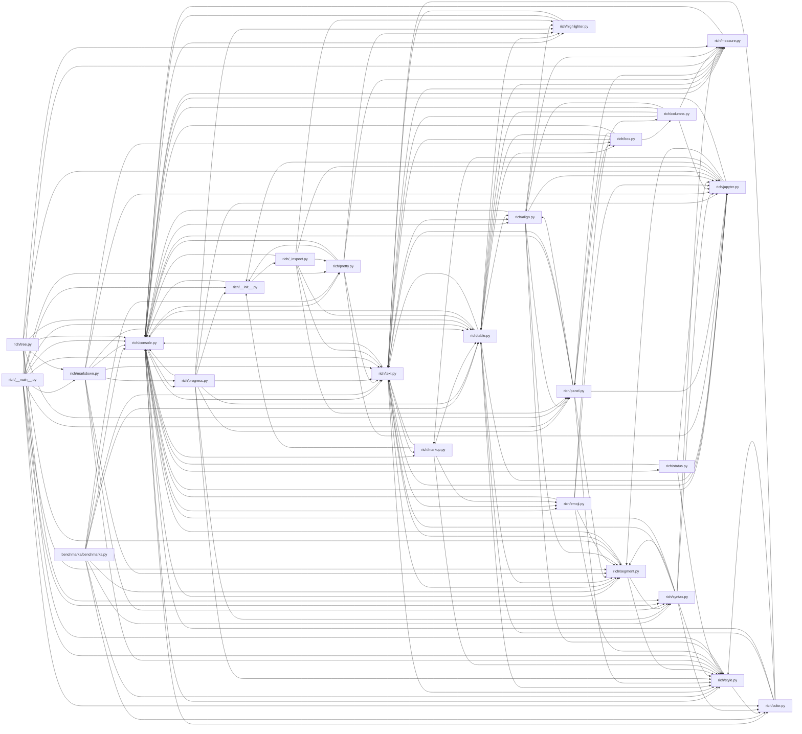

## ARCHITECTURE

A python-based project composed of the following subsystems:

- **benchmarks/**: Primary subsystem containing 181 files
- **rich/**: Primary subsystem containing 99 files
- **docs/**: Primary subsystem containing 69 files
- **tests/**: Primary subsystem containing 67 files
- **examples/**: Primary subsystem containing 37 files
- **Root**: Contains scripts and execution points

## ENTRY_POINTS

### `rich/__main__.py`

```python
import colorsys
import io
from time import process_time

from rich import box
from rich.color import Color
from rich.console import Console, ConsoleOptions, Group, RenderableType, RenderResult
from rich.markdown import Markdown
from rich.measure import Measurement
from rich.pretty import Pretty
from rich.segment import Segment
from rich.style import Style
from rich.syntax import Syntax
from rich.table import Table
from rich.text import Text


class ColorBox:
    def __rich_console__(
        self, console: Console, options: ConsoleOptions
    ) -> RenderResult:
        for y in range(0, 5):
            for x in range(options.max_width):
                h = x / options.max_width
                l = 0.1 + ((y / 5) * 0.7)
                r1, g1, b1 = colorsys.hls_to_rgb(h, l, 1.0)
                r2, g2, b2 = colorsys.hls_to_rgb(h, l + 0.7 / 10, 1.0)
                bgcolor = Color.from_rgb(r1 * 255, g1 * 255, b1 * 255)
                color = Color.from_rgb(r2 * 255, g2 * 255, b2 * 255)
                yield Segment("▄", Style(color=color, bgcolor=bgcolor))
            yield Segment.line()

    def __rich_measure__(
        self, console: "Console", options: ConsoleOptions
    ) -> Measurement:
        return Measurement(1, options.max_width)


def make_test_card() -> Table:
    """Get a renderable that demonstrates a number of features."""
    table = Table.grid(padding=1, pad_edge=True)
    table.title = "Rich features"
    table.add_column("Feature", no_wrap=True, justify="center", style="bold red")
    table.add_column("Demonstration")

    color_table = Table(
        box=None,
        expand=False,
        show_header=False,
        show_edge=False,
        pad_edge=False,
    )
    color_table.add_row(
        (
            "✓ [bold green]4-bit color[/]\n"
            "✓ [bold blue]8-bit color[/]\n"
            "✓ [bold magenta]Truecolor (16.7 million)[/]\n"
            "✓ [bold yellow]Dumb terminals[/]\n"
            "✓ [bold cyan]Automatic color conversion"
        ),
        ColorBox(),
    )

    table.add_row("Colors", color_table)

    table.add_row(
        "Styles",
        "All ansi styles: [bold]bold[/], [dim]dim[/], [italic]italic[/italic], [underline]underline[/], [strike]strikethrough[/], [reverse]reverse[/], and even [blink]blink[/].",
    )

    lorem = "Lorem ipsum dolor sit amet, consectetur adipiscing elit. Quisque in metus sed sapien ultricies pretium a at justo. Maecenas luctus velit et auctor maximus."
    lorem_table = Table.grid(padding=1, collapse_padding=True)
    lorem_table.pad_edge = False
    lorem_table.add_row(
        Text(lorem, justify="left", style="green"),
        Text(lorem, justify="center", style="yellow"),
        Text(lorem, justify="right", style="blue"),
        Text(lorem, justify="full", style="red"),
    )
    table.add_row(
        "Text",
        Group(
            Text.from_markup(
                """Word wrap text. Justify [green]left[/], [yellow]center[/], [blue]right[/] or [red]full[/].\n"""
            ),
            lorem_table,
        ),
    )

    def comparison(renderable1: RenderableType, renderable2: RenderableType) -> Table:
        table = Table(show_header=False, pad_edge=False, box=None, expand=True)
        table.add_column("1", ratio=1)
        table.add_column("2", ratio=1)
        table.add_row(renderable1, renderable2)
        return table

    table.add_row(
        "Asian\nlanguage\nsupport",
        ":flag_for_china:  该库支持中文，日文和韩文文本！\n:flag_for_japan:  ライブラリは中国語、日本語、韓国語のテキストをサポートしています\n:flag_for_south_korea:  이 라이브러리는 중국어, 일본어 및 한국어 텍스트를 지원합니다",
    )

    markup_example = (
        "[bold magenta]Rich[/] supports a simple [i]bbcode[/i]-like [b]markup[/b] for [yellow]color[/], [underline]style[/], and emoji! "
        ":+1: :apple: :ant: :bear: :baguette_bread: :bus: "
    )
    table.add_row("Markup", markup_example)

    example_table = Table(
        show_edge=False,
        show_header=True,
        expand=False,
        row_styles=["none", "dim"],
        box=box.SIMPLE,
    )
    example_table.add_column("[green]Date", style="green", no_wrap=True)
    example_table.add_column("[blue]Title", style="blue")
    example_table.add_column(
        "[cyan]Production Budget",
        style="cyan",
        justify="right",
        no_wrap=True,
    )
    example_table.add_column(
        "[magenta]Box Office",
        style="magenta",
        justify="right",
        no_wrap=True,
    )
    example_table.add_row(
        "Dec 20, 2019",
        "Star Wars: The Rise of Skywalker",
        "$275,000,000",
        "$375,126,118",
    )
    example_table.add_row(
        "May 25, 2018",
        "[b]Solo[/]: A Star Wars Story",
        "$275,000,000",
        "$393,151,347",
    )
    example_table.add_row(
        "Dec 15, 2017",
        "Star Wars Ep. VIII: The Last Jedi",
        "$262,000,000",
        "[bold]$1,332,539,889[/bold]",
    )
    example_table.add_row(
        "May 19, 1999",
        "Star Wars Ep. [b]I[/b]: [i]The phantom Menace",
        "$115,000,000",
        "$1,027,044,677",
    )

    table.add_row("Tables", example_table)

    code = '''\
def iter_last(values: Iterable[T]) -> Iterable[Tuple[bool, T]]:
    """Iterate and generate a tuple with a flag for last value."""
    iter_values = iter(values)
    try:
        previous_value = next(iter_values)
    except StopIteration:
        return
    for value in iter_values:
        yield False, previous_value
        previous_value = value
    yield True, previous_value'''

    pretty_data = {
        "foo": [
            3.1427,
            (
                "Paul Atreides",
                "Vladimir Harkonnen",
                "Thufir Hawat",
            ),
        ],
        "atomic": (False, True, None),
    }
    table.add_row(
        "Syntax\nhighlighting\n&\npretty\nprinting",
        comparison(
            Syntax(code, "python3", line_numbers=True, indent_guides=True),
            Pretty(pretty_data, indent_guides=True),
        ),
    )

    markdown_example = """\
# Markdown

Supports much of the *markdown* __syntax__!

- Headers
- Basic formatting: **bold**, *italic*, `code`
- Block quotes
- Lists, and more...
    """
    table.add_row(
        "Markdown", comparison("[cyan]" + markdown_example, Markdown(markdown_example))
    )

    table.add_row(
        "+more!",
        """Progress bars, columns, styled logging handler, tracebacks, etc...""",
    )
    return table


if __name__ == "__main__":  # pragma: no cover
    from rich.panel import Panel

    console = Console(
        file=io.StringIO(),
        force_terminal=True,
    )
    test_card = make_test_card()

    # Print once to warm cache
    start = process_time()
    console.print(test_card)
    pre_cache_taken = round((process_time() - start) * 1000.0, 1)

    console.file = io.StringIO()

    start = process_time()
    console.print(test_card)
    taken = round((process_time() - start) * 1000.0, 1)

    c = Console(record=True)
    c.print(test_card)

    console = Console()
    console.print(f"[dim]rendered in [not dim]{pre_cache_taken}ms[/] (cold cache)")
    console.print(f"[dim]rendered in [not dim]{taken}ms[/] (warm cache)")
    console.print()
    console.print(
        Panel(
            "[b magenta]Hope you enjoy using Rich![/]\n\n"
            "Consider sponsoring to ensure this project is maintained.\n\n"
            "[cyan]https://github.com/sponsors/willmcgugan[/cyan]",
            border_style="green",
            title="Help ensure Rich is maintained",
            padding=(1, 2),
        )
    )

```

## SYMBOL_INDEX

**`rich/console.py`**
- class `NoChange`
- class `ConsoleDimensions`
- class `ConsoleOptions`
  - `copy()`
  - `update()`
  - `update_width()`
  - `update_height()`
  - `reset_height()`
  - `update_dimensions()`
- class `RichCast`
  - `__rich__()`
- class `ConsoleRenderable`
  - `__rich_console__()`
- class `CaptureError`
- class `NewLine`
  - `__init__()`
  - `__rich_console__()`
- class `ScreenUpdate`
  - `__init__()`
  - `__rich_console__()`
- class `Capture`
  - `__init__()`
  - `__enter__()`
  - `__exit__()`
  - `get()`
- class `ThemeContext`
  - `__init__()`
  - `__enter__()`
  - `__exit__()`
- class `PagerContext`
  - `__init__()`
  - `__enter__()`
  - `__exit__()`
- class `ScreenContext`
  - `__init__()`
  - `update()`
  - `__enter__()`
  - `__exit__()`
- class `Group`
  - `__init__()`
  - `__rich_measure__()`
  - `__rich_console__()`
- `group()`
- `_is_jupyter()`
- class `ConsoleThreadLocals`
- class `RenderHook`
- `get_windows_console_features()`
- `detect_legacy_windows()`
- class `Console`
  - `__init__()`
  - `__repr__()`
  - `_detect_color_system()`
  - `_enter_buffer()`
  - `_exit_buffer()`
  - `set_live()`
  - `clear_live()`
  - `push_render_hook()`
  - `pop_render_hook()`
  - `__enter__()`
  - `__exit__()`
  - `begin_capture()`
  - `end_capture()`
  - `push_theme()`
  - `pop_theme()`
  - `use_theme()`
  - `bell()`
  - `capture()`
  - `pager()`
  - `line()`
  - `clear()`
  - `status()`
  - `show_cursor()`
  - `set_alt_screen()`
  - `set_window_title()`
  - `screen()`
  - `measure()`
  - `render()`
  - `render_lines()`
  - `render_str()`
  - `get_style()`
  - `_collect_renderables()`
  - `rule()`
  - `control()`
  - `out()`
  - `print()`
  - `print_json()`
  - `update_screen()`
  - `update_screen_lines()`
  - `print_exception()`
  - `log()`
  - `on_broken_pipe()`
  - `_check_buffer()`
  - `_write_buffer()`
  - `_render_buffer()`
  - `input()`
  - `export_text()`
  - `save_text()`
  - `export_html()`
  - `save_html()`
  - `export_svg()`
  - `save_svg()`

**`rich/__init__.py`**
- `get_console()`
- `reconfigure()`
- `print()`
- `print_json()`
- `inspect()`

**`rich/text.py`**
- class `Span`
  - `__repr__()`
  - `__bool__()`
  - `split()`
  - `move()`
  - `right_crop()`
  - `extend()`
- class `Text`
  - `__init__()`
  - `__len__()`
  - `__bool__()`
  - `__str__()`
  - `__repr__()`
  - `__add__()`
  - `__eq__()`
  - `__contains__()`
  - `__getitem__()`
  - `blank_copy()`
  - `copy()`
  - `stylize()`
  - `stylize_before()`
  - `apply_meta()`
  - `on()`
  - `remove_suffix()`
  - `get_style_at_offset()`
  - `extend_style()`
  - `highlight_regex()`
  - `highlight_words()`
  - `rstrip()`
  - `rstrip_end()`
  - `set_length()`
  - `__rich_console__()`
  - `__rich_measure__()`
  - `render()`
  - `join()`
  - `expand_tabs()`
  - `truncate()`
  - `_trim_spans()`
  - `pad()`
  - `pad_left()`
  - `pad_right()`
  - `align()`
  - `append()`
  - `append_text()`
  - `append_tokens()`
  - `copy_styles()`
  - `split()`
  - `divide()`
  - `right_crop()`
  - `wrap()`
  - `fit()`
  - `detect_indentation()`
  - `with_indent_guides()`

**`rich/table.py`**
- class `Column`
  - `copy()`
- class `Row`
- class `_Cell`
- class `Table`
  - `__init__()`
  - `get_row_style()`
  - `__rich_measure__()`
  - `add_column()`
  - `add_row()`
  - `add_section()`
  - `__rich_console__()`
  - `_calculate_column_widths()`
  - `_get_cells()`
  - `_get_padding_width()`
  - `_measure_column()`
  - `_render()`

**`rich/style.py`**
- class `_Bit`
  - `__init__()`
  - `__get__()`
- class `Style`
  - `__init__()`
  - `__str__()`
  - `__bool__()`
  - `_make_ansi_codes()`
  - `__rich_repr__()`
  - `__eq__()`
  - `__ne__()`
  - `__hash__()`
  - `copy()`
  - `update_link()`
  - `render()`
  - `test()`
  - `__add__()`
- class `StyleStack`
  - `__init__()`
  - `__repr__()`
  - `push()`
  - `pop()`

**`rich/pretty.py`**
- `_is_attr_object()`
- `_get_attr_fields()`
- `_is_dataclass_repr()`
- `_has_default_namedtuple_repr()`
- `_ipy_display_hook()`
- `_safe_isinstance()`
- `install()`
- class `Pretty`
  - `__init__()`
  - `__rich_console__()`
  - `__rich_measure__()`
- `_get_braces_for_defaultdict()`
- `_get_braces_for_deque()`
- `_get_braces_for_array()`
- `is_expandable()`
- class `Node`
  - `iter_tokens()`
  - `check_length()`
  - `__str__()`
  - `render()`
- class `_Line`
  - `check_length()`
  - `expand()`
  - `__str__()`
- `_is_namedtuple()`
- `traverse()`
- `pretty_repr()`
- `pprint()`

**`rich/panel.py`**
- class `Panel`
  - `__init__()`
  - `__rich_console__()`
  - `__rich_measure__()`

**`rich/progress.py`**
- class `_TrackThread`
  - `__init__()`
  - `run()`
  - `__enter__()`
  - `__exit__()`
- `track()`
- class `_Reader`
  - `__init__()`
  - `__enter__()`
  - `__exit__()`
  - `__iter__()`
  - `__next__()`
  - `fileno()`
  - `isatty()`
  - `readable()`
  - `seekable()`
  - `writable()`
  - `read()`
  - `readinto()`
  - `readline()`
  - `readlines()`
  - `close()`
  - `seek()`
  - `tell()`
  - `write()`
  - `writelines()`
- class `_ReadContext`
  - `__init__()`
  - `__enter__()`
  - `__exit__()`
- `wrap_file()`
- `open()`
- `open()`
- `open()`
- class `ProgressColumn`
  - `__init__()`
  - `get_table_column()`
  - `__call__()`
- class `RenderableColumn`
  - `__init__()`
  - `render()`
- class `SpinnerColumn`
  - `__init__()`
  - `set_spinner()`
  - `render()`
- class `TextColumn`
  - `__init__()`
  - `render()`
- class `BarColumn`
  - `__init__()`
  - `render()`
- class `TimeElapsedColumn`
  - `render()`
- class `TaskProgressColumn`
  - `__init__()`
  - `render()`
- class `TimeRemainingColumn`
  - `__init__()`
  - `render()`
- class `FileSizeColumn`
  - `render()`
- class `TotalFileSizeColumn`
  - `render()`
- class `MofNCompleteColumn`
  - `__init__()`
  - `render()`
- class `DownloadColumn`
  - `__init__()`
  - `render()`
- class `TransferSpeedColumn`
  - `render()`
- class `ProgressSample`
- class `Task`
  - `get_time()`
  - `_reset()`
- class `Progress`
  - `__init__()`
  - `start()`
  - `stop()`
  - `__enter__()`
  - `__exit__()`
  - `track()`
  - `wrap_file()`
  - `open()`
  - `start_task()`
  - `stop_task()`
  - `update()`
  - `reset()`
  - `advance()`
  - `refresh()`
  - `get_renderable()`
  - `get_renderables()`
  - `make_tasks_table()`
  - `__rich__()`
  - `add_task()`
  - `remove_task()`

**`rich/syntax.py`**
- class `SyntaxTheme`
- class `PygmentsSyntaxTheme`
  - `__init__()`
  - `get_style_for_token()`
  - `get_background_style()`
- class `ANSISyntaxTheme`
  - `__init__()`
  - `get_style_for_token()`
  - `get_background_style()`
- class `_SyntaxHighlightRange`
- class `PaddingProperty`
  - `__get__()`
  - `__set__()`
- class `Syntax`
  - `__init__()`
  - `_get_base_style()`
  - `_get_token_color()`
  - `highlight()`
  - `stylize_range()`
  - `_get_line_numbers_color()`
  - `_get_number_styles()`
  - `__rich_measure__()`
  - `__rich_console__()`
  - `_get_syntax()`
  - `_apply_stylized_ranges()`
  - `_process_code()`
- `_get_code_index_for_syntax_position()`

**`rich/segment.py`**
- class `ControlType`
- class `Segment`
  - `__rich_repr__()`
  - `__bool__()`
  - `split_cells()`
- class `Segments`
  - `__init__()`
  - `__rich_console__()`
- class `SegmentLines`
  - `__init__()`
  - `__rich_console__()`

**`rich/markup.py`**
- class `Tag`
  - `__str__()`
- `escape()`
- `_parse()`
- `render()`

**`rich/measure.py`**
- class `Measurement`
  - `normalize()`
  - `with_maximum()`
  - `with_minimum()`
  - `clamp()`
- `measure_renderables()`

**`rich/jupyter.py`**
- class `JupyterRenderable`
  - `__init__()`
  - `_repr_mimebundle_()`
- class `JupyterMixin`
  - `_repr_mimebundle_()`
- `_render_segments()`
- `display()`
- `print()`

**`rich/markdown.py`**
- class `MarkdownElement`
  - `on_enter()`
  - `on_text()`
  - `on_leave()`
  - `on_child_close()`
  - `__rich_console__()`
- class `UnknownElement`
- class `TextElement`
  - `on_enter()`
  - `on_text()`
  - `on_leave()`
- class `Paragraph`
  - `__init__()`
  - `__rich_console__()`
- class `HeadingFormat`
- class `Heading`
  - `on_enter()`
  - `__init__()`
  - `__rich_console__()`
- class `CodeBlock`
  - `__init__()`
  - `__rich_console__()`
- class `BlockQuote`
  - `__init__()`
  - `on_child_close()`
  - `__rich_console__()`
- class `HorizontalRule`
  - `__rich_console__()`
- class `TableElement`
  - `__init__()`
  - `on_child_close()`
  - `__rich_console__()`
- class `TableHeaderElement`
  - `__init__()`
  - `on_child_close()`
- class `TableBodyElement`
  - `__init__()`
  - `on_child_close()`
- class `TableRowElement`
  - `__init__()`
  - `on_child_close()`
- class `TableDataElement`
  - `__init__()`
  - `on_text()`
- class `ListElement`
  - `__init__()`
  - `on_child_close()`
  - `__rich_console__()`
- class `ListItem`
  - `__init__()`
  - `on_child_close()`
  - `render_bullet()`
  - `render_number()`
- class `Link`
  - `__init__()`
- class `ImageItem`
  - `__init__()`
  - `on_enter()`
  - `__rich_console__()`
- class `MarkdownContext`
  - `__init__()`
  - `on_text()`
  - `enter_style()`
  - `leave_style()`
- class `Markdown`
  - `__init__()`
  - `_flatten_tokens()`
  - `__rich_console__()`

**`rich/__main__.py`**
- class `ColorBox`
  - `__rich_console__()`
  - `__rich_measure__()`
- `make_test_card()`

**`rich/columns.py`**
- class `Columns`
  - `__init__()`
  - `add_renderable()`
  - `__rich_console__()`

**`rich/color.py`**
- class `ColorSystem`
  - `__repr__()`
  - `__str__()`
- class `ColorType`
  - `__repr__()`
- class `ColorParseError`
- class `Color`
  - `__rich__()`
  - `__rich_repr__()`
  - `get_truecolor()`
- `parse_rgb_hex()`
- `blend_rgb()`

**`rich/box.py`**
- class `Box`
  - `__init__()`
  - `__repr__()`
  - `__str__()`
  - `substitute()`
  - `get_plain_headed_box()`
  - `get_top()`
  - `get_row()`
  - `get_bottom()`

**`rich/emoji.py`**
- class `NoEmoji`
- class `Emoji`
  - `__init__()`
  - `__repr__()`
  - `__str__()`
  - `__rich_console__()`

**`rich/status.py`**
- class `Status`
  - `__init__()`
  - `update()`
  - `start()`
  - `stop()`
  - `__rich__()`
  - `__enter__()`
  - `__exit__()`

**`rich/highlighter.py`**
- `_combine_regex()`
- class `Highlighter`
  - `__call__()`
- class `NullHighlighter`
  - `highlight()`
- class `RegexHighlighter`
  - `highlight()`
- class `ReprHighlighter`
- class `JSONHighlighter`
  - `highlight()`
- class `ISO8601Highlighter`

**`rich/align.py`**
- class `Align`
  - `__init__()`
  - `__repr__()`
  - `__rich_console__()`
  - `__rich_measure__()`
- class `VerticalCenter`
  - `__init__()`
  - `__repr__()`
  - `__rich_console__()`
  - `__rich_measure__()`

**`rich/tree.py`**
- class `Tree`
  - `__init__()`
  - `add()`
  - `__rich_console__()`
  - `__rich_measure__()`

**`rich/_inspect.py`**
- `_first_paragraph()`
- class `Inspect`
  - `__init__()`
  - `_make_title()`
  - `__rich__()`
  - `_get_signature()`
  - `_render()`
  - `_get_formatted_doc()`
- `get_object_types_mro()`
- `get_object_types_mro_as_strings()`
- `is_object_one_of_types()`

**`rich/live.py`**
- class `_RefreshThread`
  - `__init__()`
  - `stop()`
  - `run()`
- class `Live`
  - `__init__()`
  - `get_renderable()`
  - `start()`
  - `stop()`
  - `__enter__()`
  - `__exit__()`
  - `_enable_redirect_io()`
  - `_disable_redirect_io()`
  - `update()`
  - `refresh()`
  - `process_renderables()`

**`rich/repr.py`**
- class `ReprError`

## IMPORTANT_CALL_PATHS

__main__.ColorBox()
  → console.NoChange()
  → errors.ConsoleError()
## CORE_MODULES

### `rich/console.py`

**Purpose:** Implements console.
**Depends on:** `_emoji_replace`, `_export_format`, `_fileno`, `_log_render`, `_null_file`, +31 more

**Types:**
- `Capture` - Context manager to capture the result of printing to the console. methods: `__init__`, `get`
- `CaptureError` (bases: `Exception`) - An error in the Capture context manager.

**Functions:**
- `def _is_jupyter() -> bool`
- `def detect_legacy_windows() -> bool`
- `def get_windows_console_features() -> "WindowsConsoleFeatures"`
- `def group(fit: bool = True) -> Callable[..., Callable[..., Group]]`

## Constants
JUPYTER_DEFAULT_COLUMNS = 115
JUPYTER_DEFAULT_LINES = 100
WINDOWS = sys.platform == "win32"
NO_CHANGE = NoChange()
COLOR_SYSTEMS = <complex expression>

### `rich/__init__.py`

**Purpose:** Rich text and beautiful formatting in the terminal.
**Depends on:** `_extension`, `_inspect`, `console`

**Functions:**
- `def get_console() -> "Console"`
- `def inspect(obj: Any, *, console: Optional["Console"] = None, title: Optional[str] = None, ...) -> None`
- `def print(*objects: Any, sep: str = " ", end: str = "\n", file: Optional[IO[str]] = None, ...) -> None`
- `def print_json(json: Optional[str] = None, *, data: Any = None, indent: Union[None, int, str] = 2, ...) -> None`
- `def reconfigure(*args: Any, **kwargs: Any) -> None`

### `rich/text.py`

**Purpose:** Implements text.
**Depends on:** `_loop`, `_pick`, `_wrap`, `align`, `ansi`, `cells`, `console`, `containers`, +7 more

**Types:**
- `Span` (bases: `NamedTuple`) - A marked up region in some text. methods: `__repr__`, `extend`, `move`, `right_crop`, `split`
- `Text` (bases: `JupyterMixin`) - Text with color / style. methods: `__init__`, `__repr__`, `__str__`, `align`, `append`, `append_text` (+30 more)

## Constants
DEFAULT_JUSTIFY: "JustifyMethod" = "default"
DEFAULT_OVERFLOW: "OverflowMethod" = "fold"

**Notes:** decorator-heavy (10 decorators); large file (1364 lines)

### `rich/table.py`

**Purpose:** Implements table.
**Depends on:** `_loop`, `_pick`, `_ratio`, `_timer`, `align`, `box`, `console`, `errors`, +8 more

**Types:**
- `Column` - Defines a column within a ~Table. methods: `copy`
- `Row` - Information regarding a row.
- `Table` (bases: `JupyterMixin`) - A console renderable to draw a table. methods: `__init__`, `add_column`, `add_row`, `add_section`, `get_row_style`
- `_Cell` (bases: `NamedTuple`) - A single cell in a table.

**Notes:** decorator-heavy (12 decorators); large file (1016 lines)

### `rich/style.py`

**Purpose:** Implements style.
**Depends on:** `color`, `errors`, `repr`, `terminal_theme`

**Types:**
- `Style` - A terminal style. methods: `__init__`, `__str__`, `copy`, `render`, `test`, `update_link`
- `StyleStack` - A stack of styles. methods: `__init__`, `__repr__`, `pop`, `push`
- `_Bit` - A descriptor to get/set a style attribute bit. methods: `__init__`

## Constants
NULL_STYLE = Style()

**Notes:** decorator-heavy (24 decorators); large file (797 lines)

### `rich/pretty.py`

**Purpose:** Implements pretty.
**Depends on:** `_loop`, `_pick`, `abc`, `cells`, +6 more

**Types:**
- `Node` - A node in a repr tree. May be atomic or a container. methods: `__str__`, `check_length` (+2 more)

**Functions:**
- `def _get_attr_fields(obj: Any) -> Sequence["_attr_module.Attribute[Any]"]`
- `def _get_braces_for_array(_object: "array[Any]") -> Tuple[str, str, str]`
- `def _get_braces_for_defaultdict(_object: DefaultDict[Any, Any]) -> Tuple[str, str, str]`
- `def _get_braces_for_deque(_object: Deque[Any]) -> Tuple[str, str, str]`

### `rich/panel.py`

**Purpose:** Implements panel.
**Depends on:** `align`, `box`, `cells`, `console`, `jupyter`, `measure`, `padding`, `segment`, +2 more

**Types:**
- `Panel` (bases: `JupyterMixin`) - A console renderable that draws a border around its contents. methods: `__init__`

**Notes:** large file (318 lines)

### `rich/progress.py`

**Purpose:** Implements progress.
**Depends on:** `console`, `filesize`, `highlighter`, `jupyter`, +9 more

**Types:**
- `BarColumn` (bases: `ProgressColumn`) - Renders a visual progress bar. methods: `__init__`, `render`

**Functions:**
- `def open(file: Union[str, "PathLike[str]", bytes], mode: Literal["rb"], ...) -> ContextManager[BinaryIO]`
- `def open(file: Union[str, "PathLike[str]", bytes], ...) -> Union[ContextManager[BinaryIO], ContextManager[TextIO]]`
- `def open(file: Union[str, "PathLike[str]", bytes], mode: Union[Literal["rt"], ...) -> ContextManager[TextIO]`
- `def track(sequence: Iterable[ProgressType], description: str = "Working...", ...) -> Iterable[ProgressType]`

### `rich/syntax.py`

**Purpose:** Implements syntax.
**Depends on:** `_loop`, `cells`, `color`, `console`, +7 more

**Types:**
- `ANSISyntaxTheme` (bases: `SyntaxTheme`) - Syntax theme to use standard colors. methods: `__init__`, `get_background_style` (+1 more)

**Functions:**
- `def _get_code_index_for_syntax_position(newlines_offsets: Sequence[int], position: SyntaxPosition) -> Optional[int]`

## Constants
WINDOWS = sys.platform == "win32"
DEFAULT_THEME = "monokai"
ANSI_LIGHT: Dict[TokenType, Style] = <complex expression>
ANSI_DARK: Dict[TokenType, Style] = <complex expression>
RICH_SYNTAX_THEMES = {"ansi_light": ANSI_LIGHT, "ansi_dark": ANSI_DARK}
NUMBERS_COLUMN_DEFAULT_PADDING = 2

### `rich/segment.py`

**Purpose:** Implements segment.
**Depends on:** `cells`, `console`, `repr`, `style`, `syntax`, `text`

**Types:**
- `ControlType` (bases: `IntEnum`) - Non-printable control codes which typically translate to ANSI codes.
- `Segment` (bases: `NamedTuple`) - A piece of text with associated style. Segments are produced by the Console render process and methods: `split_cells`
- `SegmentLines` methods: `__init__`
- `Segments` - A simple renderable to render an iterable of segments. This class may be useful if methods: `__init__`

**Notes:** decorator-heavy (23 decorators); large file (781 lines)

### `rich/markup.py`

**Purpose:** Implements markup.

**Functions:**
- `def _parse(markup: str) -> Iterable[Tuple[int, Optional[str], Optional[Tag]]]`
  - Parse markup in to an iterable of tuples of (position, text, tag).

### `rich/measure.py`

**Purpose:** Implements measure.
**Depends on:** `console`, `errors`, `protocol`

**Types:**
- `Measurement` (bases: `NamedTuple`) - Stores the minimum and maximum widths (in characters) required to render an object. methods: `clamp`, `normalize`, `with_maximum`, `with_minimum`

**Functions:**
- `def measure_renderables(console: "Console", options: "ConsoleOptions", ...) -> "Measurement"`
  - Get a measurement that would fit a number of renderables.

### `rich/jupyter.py`

**Purpose:** Implements jupyter.
**Depends on:** `console`, `segment`, `terminal_theme`

**Types:**
- `JupyterMixin` - Add to an Rich renderable to make it render in Jupyter notebook.
- `JupyterRenderable` - A shim to write html to Jupyter notebook. methods: `__init__`

**Functions:**
- `def _render_segments(segments: Iterable[Segment]) -> str`
- `def display(segments: Iterable[Segment], text: str) -> None`
  - Render segments to Jupyter.
- `def print(*args: Any, **kwargs: Any) -> None`
  - Proxy for Console print.

## Constants
JUPYTER_HTML_FORMAT = <complex expression>

### `rich/markdown.py`

**Purpose:** Implements markdown.
**Depends on:** `_loop`, `_stack`, `box`, `console`, `containers`, `jupyter`, +6 more

**Types:**
- `BlockQuote` (bases: `TextElement`) - A block quote. methods: `__init__`, `on_child_close`
- `CodeBlock` (bases: `TextElement`) - A code block with syntax highlighting. methods: `__init__`
- `Heading` (bases: `TextElement`) - A heading. methods: `__init__`, `on_enter`
- `HeadingFormat`

**Notes:** decorator-heavy (10 decorators); large file (803 lines)

### `rich/columns.py`

**Purpose:** Implements columns.
**Depends on:** `align`, `console`, `constrain`, `jupyter`, `measure`, `padding`, `table`, `text`

**Types:**
- `Columns` (bases: `JupyterMixin`) - Display renderables in neat columns. methods: `__init__`, `add_renderable`

### `rich/color.py`

**Purpose:** Implements color.
**Depends on:** `_palettes`, `color_triplet`, `console`, `repr`, `style`, +3 more

**Types:**
- `Color` (bases: `NamedTuple`) - Terminal color definition. methods: `get_truecolor`
- `ColorParseError` (bases: `Exception`) - The color could not be parsed.

**Functions:**
- `def blend_rgb(     color1: ColorTriplet, color2: ColorTriplet, cross_fade: float = 0.5 ) -> ColorTriplet`
- `def parse_rgb_hex(hex_color: str) -> ColorTriplet`

## Constants
WINDOWS = sys.platform == "win32"
ANSI_COLOR_NAMES = <complex expression>
RE_COLOR = <complex expression>

### `rich/box.py`

**Purpose:** Implements box.

### `rich/emoji.py`

**Purpose:** Implements emoji.
**Depends on:** `_emoji_codes`, `_emoji_replace`, `columns`, `console`, `jupyter`, `segment`, `style`

**Types:**
- `Emoji` (bases: `JupyterMixin`) methods: `__init__`, `__repr__`, `__str__`
- `NoEmoji` (bases: `Exception`) - No emoji by that name.

### `rich/status.py`

**Purpose:** Implements status.
**Depends on:** `console`, `jupyter`, `live`, `spinner`, `style`

**Types:**
- `Status` (bases: `JupyterMixin`) - Displays a status indicator with a 'spinner' animation. methods: `__init__`, `start`, `stop`, `update`

### `rich/highlighter.py`

**Purpose:** Implements highlighter.
**Depends on:** `console`, `text`

**Types:**
- `Highlighter` (bases: `ABC`) - Abstract base class for highlighters. methods: `__call__`
- `ISO8601Highlighter` (bases: `RegexHighlighter`) - Highlights the ISO8601 date time strings.
- `JSONHighlighter` (bases: `RegexHighlighter`) - Highlights JSON methods: `highlight`
- `NullHighlighter` (bases: `Highlighter`) - A highlighter object that doesn't highlight. methods: `highlight`

**Functions:**
- `def _combine_regex(*regexes: str) -> str`
  - Combine a number of regexes in to a single regex.

### `rich/align.py`

**Purpose:** Implements align.
**Depends on:** `console`, `constrain`, `highlighter`, `jupyter`, `measure`, `panel`, `segment`, `style`

**Types:**
- `Align` (bases: `JupyterMixin`) - Align a renderable by adding spaces if necessary. methods: `__init__`, `__repr__`
- `VerticalCenter` (bases: `JupyterMixin`) - Vertically aligns a renderable. methods: `__init__`, `__repr__`

**Notes:** large file (321 lines)

### `rich/tree.py`

**Purpose:** Implements tree.
**Depends on:** `_loop`, `console`, `jupyter`, `markdown`, `measure`, `panel`, `segment`, `style`, +3 more

**Types:**
- `Tree` (bases: `JupyterMixin`) - A renderable for a tree structure. methods: `__init__`, `add`

### `rich/_inspect.py`

**Purpose:** Implements inspect.
**Depends on:** `console`, `control`, `highlighter`, `jupyter`, `panel`, `pretty`, +2 more

**Types:**
- `Inspect` (bases: `JupyterMixin`) - A renderable to inspect any Python Object. methods: `__init__`

**Functions:**
- `def _first_paragraph(doc: str) -> str`
- `def get_object_types_mro(obj: Union[object, Type[Any]]) -> Tuple[type, ...]`
- `def get_object_types_mro_as_strings(obj: object) -> Collection[str]`
- `def is_object_one_of_types(     obj: object, fully_qualified_types_names: Collection[str] ) -> bool`

### `rich/live.py`

**Purpose:** Implements live.
**Depends on:** `align`, `console`, `control`, `file_proxy`, `jupyter`, `live`, `live_render`, `panel`, +5 more

**Types:**
- `Live` (bases: `JupyterMixin, RenderHook`) - Renders an auto-updating live display of any given renderable. methods: `__init__`, `get_renderable`, `process_renderables`, `refresh`, `start`, `stop` (+1 more)
- `_RefreshThread` (bases: `Thread`) - A thread that calls refresh() at regular intervals. methods: `__init__`, `run`, `stop`

**Notes:** large file (405 lines)

### `rich/repr.py`

**Purpose:** Implements repr.
**Depends on:** `console`

**Types:**
- `ReprError` (bases: `Exception`) - An error occurred when attempting to build a repr.

**Functions:**
- `def auto(cls: Optional[Type[T]] = None, *, ...) -> Union[Type[T], Callable[[Type[T]], Type[T]]]`
- `def auto(*, angular: bool = False) -> Callable[[Type[T]], Type[T]]`
- `def auto(cls: Optional[Type[T]]) -> Type[T]`
- `def rich_repr(cls: Optional[Type[T]] = None, *, ...) -> Union[Type[T], Callable[[Type[T]], Type[T]]]`

## Constants
T = TypeVar("T")

### `rich/traceback.py`

**Purpose:** Implements traceback.
**Depends on:** `_loop`, `columns`, `console`, `constrain`, `highlighter`, `panel`, +6 more

**Types:**
- `Frame`
- `PathHighlighter` (bases: `RegexHighlighter`)
- `Stack`

**Functions:**
- `def _iter_syntax_lines(     start: SyntaxPosition, end: SyntaxPosition ) -> Iterable[Tuple[int, int, int]]`
- `def install(...),     max_frames: int = 100, ) -> Callable[[Type[BaseException], BaseException, Optional[TracebackType]], Any]`

## Constants
WINDOWS = sys.platform == "win32"
LOCALS_MAX_LENGTH = 10
LOCALS_MAX_STRING = 80

**Notes:** decorator-heavy (10 decorators); large file (925 lines)

### `rich/theme.py`

**Purpose:** Implements theme.
**Depends on:** `default_styles`, `style`

**Types:**
- `Theme` - A container for style information, used by :class:`~rich.console.Console`. methods: `__init__`
- `ThemeStack` - A stack of themes. methods: `__init__`, `pop_theme`, `push_theme`
- `ThemeStackError` (bases: `Exception`) - Base exception for errors related to the theme stack.

### `rich/_loop.py`

**Purpose:** Implements loop.

**Functions:**
- `def loop_first(values: Iterable[T]) -> Iterable[Tuple[bool, T]]`
  - Iterate and generate a tuple with a flag for first value.
- `def loop_first_last(values: Iterable[T]) -> Iterable[Tuple[bool, bool, T]]`
  - Iterate and generate a tuple with a flag for first and last value.
- `def loop_last(values: Iterable[T]) -> Iterable[Tuple[bool, T]]`
  - Iterate and generate a tuple with a flag for last value.

## Constants
T = TypeVar("T")

### `rich/diagnose.py`

**Purpose:** Implements diagnose.
**Depends on:** `console`, `panel`, `pretty`

**Functions:**
- `def report() -> None`
  - Print a report to the terminal with debugging information

### `rich/padding.py`

**Purpose:** Implements padding.
**Depends on:** `console`, `jupyter`, `measure`, `segment`, `style`

**Types:**
- `Padding` (bases: `JupyterMixin`) - Draw space around content. methods: `__init__`, `__repr__`

### `rich/pager.py`

**Purpose:** Implements pager.
**Depends on:** `__main__`, `console`

**Types:**
- `Pager` (bases: `ABC`) - Base class for a pager.
- `SystemPager` (bases: `Pager`) - Uses the pager installed on the system. methods: `show`

### `rich/palette.py`

**Purpose:** Implements palette.
**Depends on:** `color`, `color_triplet`, `console`, `segment`, `style`, `table`, `text`

**Types:**
- `Palette` - A palette of available colors. methods: `__init__`

### `rich/containers.py`

**Purpose:** Implements containers.
**Depends on:** `cells`, `console`, `measure`, `text`

**Types:**
- `Lines` - A list subclass which can render to the console. methods: `__init__`, `__repr__`, `append`, `extend`, `justify`, `pop`
- `Renderables` - A list subclass which renders its contents to the console. methods: `__init__`, `append`

## Constants
T = TypeVar("T")

### `rich/errors.py`

**Purpose:** Implements errors.

**Types:**
- `ConsoleError` (bases: `Exception`) - An error in console operation.
- `LiveError` (bases: `ConsoleError`) - Error related to Live display.
- `MarkupError` (bases: `ConsoleError`) - Markup was badly formatted.
- `MissingStyle` (bases: `StyleError`) - No such style.
- `NoAltScreen` (bases: `ConsoleError`) - Alt screen mode was required.
- `NotRenderableError` (bases: `ConsoleError`) - Object is not renderable.

### `rich/rule.py`

**Purpose:** Implements rule.
**Depends on:** `align`, `cells`, `console`, `jupyter`, `measure`, `style`, `text`

**Types:**
- `Rule` (bases: `JupyterMixin`) - A console renderable to draw a horizontal rule (line). methods: `__init__`, `__repr__`

### `rich/spinner.py`

**Purpose:** Implements spinner.
**Depends on:** `_spinners`, `console`, `live`, `measure`, `style`, `table`, `text`

**Types:**
- `Spinner` - A spinner animation. methods: `__init__`, `render`, `update`

### `rich/_wrap.py`

**Purpose:** Implements wrap.
**Depends on:** `_loop`, `cells`, `console`

**Functions:**
- `def divide_line(text: str, width: int, fold: bool = True) -> list[int]`
  - Given a string of text, and a width (measured in cells), return a list
- `def words(text: str) -> Iterable[tuple[int, int, str]]`
  - Yields each word from the text as a tuple

### `rich/control.py`

**Purpose:** Implements control.
**Depends on:** `console`, `segment`

**Types:**
- `Control` - A renderable that inserts a control code (non printable but may move cursor). methods: `__init__`, `__str__`

**Functions:**
- `def escape_control_codes(     text: str,     _translate_table: Dict[int, str] = CONTROL_ESCAPE, ) -> str`
  - Replace control codes with their "escaped" equivalent in the given text.
- `def strip_control_codes(     text: str, _translate_table: Dict[int, None] = _CONTROL_STRIP_TRANSLATE ) -> str`
  - Remove control codes from text.

## Constants
STRIP_CONTROL_CODES: Final = <complex expression>
CONTROL_ESCAPE: Final = <complex expression>
CONTROL_CODES_FORMAT: Dict[int, Callable[..., str]] = <complex expression>

**Notes:** decorator-heavy (9 decorators)

### `rich/logging.py`

**Purpose:** Implements logging.
**Depends on:** `_log_render`, `_null_file`, `console`, `highlighter`, `text`, `traceback`

**Types:**
- `RichHandler` (bases: `Handler`) - A logging handler that renders output with Rich. The time / level / message and file are displayed in columns. methods: `__init__`, `emit`, `get_level_text`, `render`, `render_message`

**Notes:** large file (306 lines)

### `rich/styled.py`

**Purpose:** Implements styled.
**Depends on:** `console`, `measure`, `panel`, `segment`, `style`

**Types:**
- `Styled` - Apply a style to a renderable. methods: `__init__`

### `rich/terminal_theme.py`

**Purpose:** Implements terminal theme.
**Depends on:** `color_triplet`, `palette`

**Types:**
- `TerminalTheme` - A color theme used when exporting console content. methods: `__init__`

## Constants
DEFAULT_TERMINAL_THEME = <complex expression>
MONOKAI = <complex expression>
DIMMED_MONOKAI = <complex expression>
NIGHT_OWLISH = <complex expression>
SVG_EXPORT_THEME = <complex expression>

### `rich/json.py`

**Purpose:** Implements json.
**Depends on:** `console`, `highlighter`, `text`

**Types:**
- `JSON` - A renderable which pretty prints JSON. methods: `__init__`

### `rich/layout.py`

**Purpose:** Implements layout.
**Depends on:** `_ratio`, `align`, `console`, `highlighter`, `panel`, `pretty`, +7 more

**Types:**
- `ColumnSplitter` (bases: `Splitter`) - Split a layout region in to columns. methods: `divide`, `get_tree_icon`
- `Layout` - A renderable to divide a fixed height in to rows or columns. methods: `__init__`, `add_split`, `get`, `refresh_screen` (+6 more)
- `LayoutError` (bases: `Exception`) - Layout related error.
- `LayoutRender` (bases: `NamedTuple`) - An individual layout render.

**Notes:** decorator-heavy (7 decorators); large file (443 lines)

### `rich/bar.py`

**Purpose:** Implements bar.
**Depends on:** `color`, `console`, `jupyter`, `measure`, `segment`, `style`

**Types:**
- `Bar` (bases: `JupyterMixin`) - Renders a solid block bar. methods: `__init__`, `__repr__`

## Constants
BEGIN_BLOCK_ELEMENTS = ["█", "█", "█", "▐", "▐", "▐", "▕", "▕"]
END_BLOCK_ELEMENTS = [" ", "▏", "▎", "▍", "▌", "▋", "▊", "▉"]
FULL_BLOCK = "█"

### `rich/color_triplet.py`

**Purpose:** Implements color triplet.

**Types:**
- `ColorTriplet` (bases: `NamedTuple`) - The red, green, and blue components of a color.

### `rich/progress_bar.py`

**Purpose:** Implements progress bar.
**Depends on:** `color`, `color_triplet`, `console`, `jupyter`, `measure`, `segment`, `style`

**Types:**
- `ProgressBar` (bases: `JupyterMixin`) - Renders a (progress) bar. Used by rich.progress. methods: `__init__`, `__repr__`, `update`

## Constants
PULSE_SIZE = 20

### `rich/protocol.py`

**Purpose:** Implements protocol.
**Depends on:** `console`

**Functions:**
- `def is_renderable(check_object: Any) -> bool`
  - Check if an object may be rendered by Rich.
- `def rich_cast(renderable: object) -> "RenderableType"`
  - Cast an object to a renderable by calling __rich__ if present.

### `rich/region.py`

**Purpose:** Implements region.

**Types:**
- `Region` (bases: `NamedTuple`) - Defines a rectangular region of the screen.

### `rich/_win32_console.py`

**Purpose:** Light wrapper around the Win32 Console API - this module should only be imported on Windows
**Depends on:** `color`, `console`, `style`

**Types:**
- `CONSOLE_CURSOR_INFO` (bases: `ctypes.Structure`)

**Functions:**
- `def FillConsoleOutputAttribute(std_handle: wintypes.HANDLE, attributes: int, length: int, ...) -> int`
- `def FillConsoleOutputCharacter(std_handle: wintypes.HANDLE, char: str, length: int, ...) -> int`
- `def GetConsoleCursorInfo(     std_handle: wintypes.HANDLE, cursor_info: CONSOLE_CURSOR_INFO ) -> bool`
- `def GetConsoleMode(std_handle: wintypes.HANDLE) -> int`

## Constants
STDOUT = -11
ENABLE_VIRTUAL_TERMINAL_PROCESSING = 4
COORD = wintypes._COORD

### `rich/_ratio.py`

**Purpose:** Implements ratio.

**Types:**
- `Edge` (bases: `Protocol`) - Any object that defines an edge (such as Layout).

**Functions:**
- `def ratio_distribute(     total: int, ratios: List[int], minimums: Optional[List[int]] = None ) -> List[int]`
  - Distribute an integer total in to parts based on ratios.
- `def ratio_reduce(     total: int, ratios: List[int], maximums: List[int], values: List[int] ) -> List[int]`
  - Divide an integer total in to parts based on ratios.
- `def ratio_resolve(total: int, edges: Sequence[Edge]) -> List[int]`
  - Divide total space to satisfy size, ratio, and minimum_size, constraints.

### `rich/prompt.py`

**Purpose:** Implements prompt.
**Depends on:** `console`, `text`

**Types:**
- `Confirm` (bases: `PromptBase[bool]`) - A yes / no confirmation prompt. methods: `process_response`, `render_default`
- `FloatPrompt` (bases: `PromptBase[float]`) - A prompt that returns a float.
- `IntPrompt` (bases: `PromptBase[int]`) - A prompt that returns an integer.
- `InvalidResponse` (bases: `PromptError`) - Exception to indicate a response was invalid. Raise this within process_response() to indicate an error methods: `__init__`

**Notes:** decorator-heavy (8 decorators); large file (401 lines)

### `rich/scope.py`

**Purpose:** Implements scope.
**Depends on:** `console`, `highlighter`, `panel`, `pretty`, `table`, `text`

**Functions:**
- `def render_scope(scope: "Mapping[str, Any]", *, title: Optional[TextType] = None, ...) -> "ConsoleRenderable"`
  - Render python variables in a given scope.

### `rich/screen.py`

**Purpose:** Implements screen.
**Depends on:** `_loop`, `console`, `segment`, `style`

**Types:**
- `Screen` - A renderable that fills the terminal screen and crops excess. methods: `__init__`

### `rich/ansi.py`

**Purpose:** Implements ansi.
**Depends on:** `color`, `console`, `style`, `text`

**Types:**
- `AnsiDecoder` - Translate ANSI code in to styled Text. methods: `__init__`, `decode`, `decode_line`
- `_AnsiToken` (bases: `NamedTuple`) - Result of ansi tokenized string.

**Functions:**
- `def _ansi_tokenize(ansi_text: str) -> Iterable[_AnsiToken]`
  - Tokenize a string in to plain text and ANSI codes.

## Constants
SGR_STYLE_MAP = <complex expression>

### `rich/constrain.py`

**Purpose:** Implements constrain.
**Depends on:** `console`, `jupyter`, `measure`

**Types:**
- `Constrain` (bases: `JupyterMixin`) - Constrain the width of a renderable to a given number of characters. methods: `__init__`

### `tools/make_emoji.py`

**Purpose:** Implements make emoji.

## Constants
emoji = {k.lower().strip(":"): v for k, v in EMOJI_ALIAS_UNICODE.items()}

### `tools/profile_divide.py`

**Purpose:** Implements profile divide.

## Constants
text = <complex expression>
segments = [Segment(text[n : n + 7]) for n in range(0, len(text), 7)]
start = perf_counter()

### `tools/profile_pretty.py`

**Purpose:** Implements profile pretty.

## Constants
console = Console(file=io.StringIO(), color_system="truecolor", width=100)
start = time()
pretty = Pretty(cats)
result = console.end_capture()
taken = (time() - start) * 1000

### `tools/stress_test_pretty.py`

**Purpose:** Implements stress test pretty.

## Constants
DATA = <complex expression>
console = Console()

### `rich/file_proxy.py`

**Purpose:** Implements file proxy.
**Depends on:** `ansi`, `console`, `text`

**Types:**
- `FileProxy` (bases: `io.TextIOBase`) - Wraps a file (e.g. sys.stdout) and redirects writes to a console. methods: `__init__`, `fileno`, `flush`, `isatty`, `write`

### `rich/live_render.py`

**Purpose:** Implements live render.
**Depends on:** `_loop`, `console`, `control`, `segment`, `style`, `text`

**Types:**
- `LiveRender` - Creates a renderable that may be updated. methods: `__init__`, `position_cursor`, `restore_cursor`, `set_renderable`

### `rich/_null_file.py`

**Purpose:** Implements null file.

**Types:**
- `NullFile` (bases: `IO[str]`) methods: `close`, `fileno`, `flush`, `isatty`, `read`, `readable` (+9 more)

## Constants
NULL_FILE = NullFile()

### `rich/_pick.py`

**Purpose:** Implements pick.

**Functions:**
- `def pick_bool(*values: Optional[bool]) -> bool`
  - Pick the first non-none bool or return the last value.

## SUPPORTING_MODULES

### `rich/abc.py`

```python
class RichRenderable(ABC)
    """An abstract base class for Rich renderables.

    Note that there is no need to extend this class, the intended use is to check if an
    object supports the Rich renderable protocol. For example::

        if isinstance(my_object, RichRenderable):
            console.print(my_object)"""

```

### `rich/default_styles.py`

*197 lines, 7 imports*

### `rich/_emoji_replace.py`

```python
def _emoji_replace(
    text: str,
    default_variant: Optional[str] = None,
    _emoji_sub: _EmojiSubMethod = re.compile(r"(:(\S*?)(?:(?:\-)(emoji|text))?:)").sub,
) -> str
    """Replace emoji code in text."""

```

### `rich/_stack.py`

```python
class Stack(List[T])
    """A small shim over builtin list."""

```

### `rich/_windows_renderer.py`

```python
def legacy_windows_render(buffer: Iterable[Segment], term: LegacyWindowsTerm) -> None
    """Makes appropriate Windows Console API calls based on the segments in the buffer.

    Args:
        buffer (Iterable[Segment]): Iterable of Segments to convert to Win32 API calls.
        term (LegacyWindowsTerm): Used to call the Windows Console API."""

```

### `rich/_fileno.py`

```python
def get_fileno(file_like: IO[str]) -> int | None
    """Get fileno() from a file, accounting for poorly implemented file-like objects.

    Args:
        file_like (IO): A file-like object.

    Returns:
        int | None: The result of fileno if available, or None if operation failed."""

```

### `rich/_log_render.py`

```python
class LogRender

```

### `rich/_palettes.py`

*310 lines, 1 imports*

### `rich/_timer.py`

> 
Timer context manager, only used in debug.


```python
def timer(subject: str = "time") -> Generator[None, None, None]
    """print the elapsed time. (only used in debugging)"""

```

### `rich/_windows.py`

```python
class WindowsConsoleFeatures
    """Windows features available."""

```

### `rich/filesize.py`

> Functions for reporting filesizes. Borrowed from https://github.com/PyFilesystem/pyfilesystem2

The functions declared in this module should cover the different
use cases needed to generate a string representation of a file size
using several different units. Since there are many standards regarding
file size units, three different functions have been implemented.

See Also:
    * `Wikipedia: Binary prefix <https://en.wikipedia.org/wiki/Binary_prefix>`_


```python
def _to_str(
    size: int,
    suffixes: Iterable[str],
    base: int,
    *,
    precision: Optional[int] = 1,
    separator: Optional[str] = " ",
) -> str

def pick_unit_and_suffix(size: int, suffixes: List[str], base: int) -> Tuple[int, str]
    """Pick a suffix and base for the given size."""

def decimal(
    size: int,
    *,
    precision: Optional[int] = 1,
    separator: Optional[str] = " ",
) -> str
    """Convert a filesize in to a string (powers of 1000, SI prefixes).

    In this convention, ``1000 B = 1 kB``.

    This is typically the format used to advertise the storage
    capacity of USB flash drives and the like (*256 MB* meaning
    actually a storage capacity of more than *256 000 000 B*),
    or used by **Mac OS X** since v10.6 to report file sizes.

    Arguments:
        int (size): A file size.
        int (precision): The number of decimal places to include (default = 1).
        str (separator): The string to separate the value from the units (default = " ").

    Returns:
        `str`: A string containing a abbreviated file size and units.

    Example:
        >>> filesize.decimal(30000)
        '30.0 kB'
        >>> filesize.decimal(30000, precision=2, separator="")
        '30.00kB'"""

```

### `rich/_export_format.py`

*77 lines, 0 imports*

### `rich/_extension.py`

```python
def load_ipython_extension(ip: Any) -> None

```

### `tools/make_width_tables.py`

*54 lines, 7 imports*

### `tools/movies.md`

*45 lines, 0 imports*

### `questions/ansi_escapes.question.md`

*12 lines, 0 imports*

### `questions/emoji_broken.question.md`

*12 lines, 0 imports*

### `questions/highlighting_unexpected.question.md`

*12 lines, 0 imports*

### `questions/log_renderables.question.md`

*15 lines, 0 imports*

### `questions/logging_color.question.md`

*12 lines, 0 imports*

### `questions/square_brackets.question.md`

*11 lines, 0 imports*

### `questions/tracebacks_installed.question.md`

*10 lines, 0 imports*

### `rich/themes.py`

*6 lines, 2 imports*

### `rich/_emoji_codes.py`

*3611 lines, 0 imports*

### `rich/_unicode_data/unicode10-0-0.py`

*612 lines, 1 imports*

### `rich/_unicode_data/unicode11-0-0.py`

*626 lines, 1 imports*

### `rich/_unicode_data/unicode12-0-0.py`

*638 lines, 1 imports*

### `rich/_unicode_data/unicode12-1-0.py`

*637 lines, 1 imports*

### `rich/_unicode_data/unicode13-0-0.py`

*649 lines, 1 imports*

### `rich/_unicode_data/unicode14-0-0.py`

*662 lines, 1 imports*

### `rich/_unicode_data/unicode15-0-0.py`

*672 lines, 1 imports*

### `rich/_unicode_data/unicode15-1-0.py`

*671 lines, 1 imports*

### `rich/_unicode_data/unicode16-0-0.py`

*684 lines, 1 imports*

### `rich/_unicode_data/unicode17-0-0.py`

*692 lines, 1 imports*

### `rich/_unicode_data/unicode4-1-0.py`

*426 lines, 1 imports*

### `rich/_unicode_data/unicode5-0-0.py`

*431 lines, 1 imports*

### `rich/_unicode_data/unicode5-1-0.py`

*434 lines, 1 imports*

### `rich/_unicode_data/unicode5-2-0.py`

*462 lines, 1 imports*

### `rich/_unicode_data/unicode6-0-0.py`

*470 lines, 1 imports*

### `rich/_unicode_data/unicode6-1-0.py`

*481 lines, 1 imports*

### `rich/_unicode_data/unicode6-2-0.py`

*481 lines, 1 imports*

### `rich/_unicode_data/unicode6-3-0.py`

*482 lines, 1 imports*

### `rich/_unicode_data/unicode7-0-0.py`

*508 lines, 1 imports*

### `rich/_unicode_data/unicode9-0-0.py`

*599 lines, 1 imports*

### `questions/highlight_incorrect.question.md`

*17 lines, 0 imports*

### `questions/jupyter.question.md`

*20 lines, 0 imports*

### `questions/rich_spinner.question.md`

*8 lines, 0 imports*

### `rich/_unicode_data/_versions.py`

*24 lines, 0 imports*

### `rich/cells.py`

```python
class CellTable(NamedTuple)
    """Contains unicode data required to measure the cell widths of glyphs."""

def get_character_cell_size(character: str, unicode_version: str = "auto") -> int
    """Get the cell size of a character.

    Args:
        character (str): A single character.
        unicode_version: Unicode version, `"auto"` to auto detect, `"latest"` for the latest unicode version.

    Returns:
        int: Number of cells (0, 1 or 2) occupied by that character."""

def cached_cell_len(text: str, unicode_version: str = "auto") -> int
    """Get the number of cells required to display text.

    This method always caches, which may use up a lot of memory. It is recommended to use
    `cell_len` over this method.

    Args:
        text (str): Text to display.
        unicode_version: Unicode version, `"auto"` to auto detect, `"latest"` for the latest unicode version.

    Returns:
        int: Get the number of cells required to display text."""

def cell_len(text: str, unicode_version: str = "auto") -> int
    """Get the cell length of a string (length as it appears in the terminal).

    Args:
        text: String to measure.
        unicode_version: Unicode version, `"auto"` to auto detect, `"latest"` for the latest unicode version.

    Returns:
        Length of string in terminal cells."""

def _cell_len(text: str, unicode_version: str) -> int
    """Get the cell length of a string (length as it appears in the terminal).

    Args:
        text: String to measure.
        unicode_version: Unicode version, `"auto"` to auto detect, `"latest"` for the latest unicode version.

    Returns:
        Length of string in terminal cells."""

def split_graphemes(
    text: str, unicode_version: str = "auto"
) -> "tuple[list[CellSpan], int]"
    """Divide text into spans that define a single grapheme, and additionally return the cell length of the whole string.

    The returned spans will cover every index in the string, with no gaps. It is possible for some graphemes to have a cell length of zero.
    This can occur for nonsense strings like two zero width joiners, or for control codes that don't contribute to the grapheme size.

    Args:
        text: String to split.
        unicode_version: Unicode version, `"auto"` to auto detect, `"latest"` for the latest unicode version.

    Returns:
        A tuple of a list of *spans* and the cell length of the entire string. A span is a list of tuples
            of three values consisting of (<START>, <END>, <CELL LENGTH>), where START and END are string indices,
            and CELL LENGTH is the cell length of the single grapheme."""

def _split_text(
    text: str, cell_position: int, unicode_version: str = "auto"
) -> tuple[str, str]
    """Split text by cell position.

    If the cell position falls within a double width character, it is converted to two spaces.

    Args:
        text: Text to split.
        cell_position Offset in cells.
        unicode_version: Unicode version, `"auto"` to auto detect, `"latest"` for the latest unicode version.

    Returns:
        Tuple to two split strings."""

def split_text(
    text: str, cell_position: int, unicode_version: str = "auto"
) -> tuple[str, str]
    """Split text by cell position.

    If the cell position falls within a double width character, it is converted to two spaces.

    Args:
        text: Text to split.
        cell_position Offset in cells.
        unicode_version: Unicode version, `"auto"` to auto detect, `"latest"` for the latest unicode version.

    Returns:
        Tuple to two split strings."""

def set_cell_size(text: str, total: int, unicode_version: str = "auto") -> str
    """Adjust a string by cropping or padding with spaces such that it fits within the given number of cells.

    Args:
        text: String to adjust.
        total: Desired size in cells.
        unicode_version: Unicode version.

    Returns:
        A string with cell size equal to total."""

def chop_cells(text: str, width: int, unicode_version: str = "auto") -> list[str]
    """Split text into lines such that each line fits within the available (cell) width.

    Args:
        text: The text to fold such that it fits in the given width.
        width: The width available (number of cells).

    Returns:
        A list of strings such that each string in the list has cell width
        less than or equal to the available width."""

```

### `tools/README.md`

*6 lines, 0 imports*

### `rich/py.typed`

*0 lines, 0 imports*

### `make.bat`

*36 lines, 0 imports*

### `questions/README.md`

*7 lines, 0 imports*

### `imgs/logo.svg`

*1 lines, 0 imports*

## DEPENDENCY_GRAPH



### Cyclic Dependencies

> [!WARNING]
> The following circular import chains were detected:

1. `rich/_unicode_data/__init__.py` -> `rich/cells.py`

## RANKED_FILES

| File | Score | Tier | Tokens |
|------|-------|------|--------|
| `rich/console.py` | 0.501 | structured summary | 196 |
| `benchmarks/benchmarks.py` | 0.446 | one-liner | 23 |
| `rich/__init__.py` | 0.431 | structured summary | 170 |
| `rich/text.py` | 0.308 | structured summary | 183 |
| `rich/table.py` | 0.278 | structured summary | 158 |
| `rich/style.py` | 0.271 | structured summary | 142 |
| `rich/pretty.py` | 0.245 | structured summary | 176 |
| `rich/panel.py` | 0.243 | structured summary | 92 |
| `rich/progress.py` | 0.226 | structured summary | 196 |
| `rich/syntax.py` | 0.224 | structured summary | 189 |
| `rich/segment.py` | 0.218 | structured summary | 157 |
| `rich/markup.py` | 0.216 | structured summary | 60 |
| `rich/measure.py` | 0.210 | structured summary | 115 |
| `rich/jupyter.py` | 0.207 | structured summary | 164 |
| `rich/markdown.py` | 0.201 | structured summary | 147 |
| `rich/__main__.py` | 0.199 | full source | 2029 |
| `rich/columns.py` | 0.192 | structured summary | 80 |
| `rich/color.py` | 0.189 | structured summary | 171 |
| `rich/box.py` | 0.186 | structured summary | 13 |
| `rich/emoji.py` | 0.173 | structured summary | 93 |
| `rich/status.py` | 0.171 | structured summary | 77 |
| `rich/highlighter.py` | 0.169 | structured summary | 165 |
| `tests/test_console.py` | 0.168 | one-liner | 25 |
| `rich/align.py` | 0.165 | structured summary | 127 |
| `rich/tree.py` | 0.164 | structured summary | 81 |
| `rich/_inspect.py` | 0.161 | structured summary | 162 |
| `rich/live.py` | 0.160 | structured summary | 155 |
| `rich/repr.py` | 0.159 | structured summary | 165 |
| `rich/traceback.py` | 0.158 | structured summary | 182 |
| `rich/theme.py` | 0.155 | structured summary | 104 |
| `examples/recursive_error.py` | 0.152 | one-liner | 10 |
| `tests/render.py` | 0.150 | one-liner | 19 |
| `rich/_loop.py` | 0.150 | structured summary | 134 |
| `rich/diagnose.py` | 0.148 | structured summary | 53 |
| `rich/padding.py` | 0.148 | structured summary | 68 |
| `rich/pager.py` | 0.148 | structured summary | 72 |
| `rich/palette.py` | 0.148 | structured summary | 63 |
| `tests/test_card.py` | 0.147 | one-liner | 20 |
| `rich/containers.py` | 0.146 | structured summary | 110 |
| `rich/errors.py` | 0.146 | structured summary | 129 |

## PERIPHERY

- `benchmarks/benchmarks.py` — 9 classs, 10 imports, 219 lines
- `tests/test_console.py` — 1 class, 97 functions, 24 imports, 1136 lines
- `examples/recursive_error.py` — 
- `tests/render.py` — 2 functions, 3 imports, 25 lines
- `tests/test_card.py` — 3 functions, 5 imports, 42 lines
- `tests/test_protocol.py` — 2 classs, 6 functions, 5 imports, 85 lines
- `tests/test_pretty.py` — 3 classs, 52 functions, 14 imports, 760 lines
- `tools/cats.json` — 3288 lines
- `tox.ini` — 52 lines
- `tests/_card_render.py` — 2 lines
- `tests/test_segment.py` — 31 functions, 7 imports, 396 lines
- `tests/test_spinner.py` — 5 functions, 6 imports, 73 lines
- `tests/test_status.py` — 2 functions, 4 imports, 35 lines
- `tests/test_style.py` — 27 functions, 4 imports, 268 lines
- `tests/test_styled.py` — 1 function, 4 imports, 16 lines
- `tests/test_syntax.py` — 25 functions, 15 imports, 454 lines
- `tests/test_table.py` — 14 functions, 9 imports, 413 lines
- `tests/test_text.py` — 91 functions, 8 imports, 1130 lines
- `tests/test_theme.py` — 5 functions, 6 imports, 54 lines
- `tests/test_traceback.py` — 23 functions, 8 imports, 400 lines
- `tests/test_tree.py` — 9 functions, 5 imports, 146 lines
- `tests/test_win32_console.py` — 8 imports, 413 lines
- `tests/test_windows_renderer.py` — 13 functions, 7 imports, 142 lines
- `tests/test_jupyter.py` — 3 functions, 1 imports, 33 lines
- `tests/test_layout.py` — 6 functions, 5 imports, 101 lines
- `tests/test_live.py` — 12 functions, 6 imports, 188 lines
- `tests/test_live_render.py` — 5 functions, 5 imports, 46 lines
- `tests/test_log.py` — 5 functions, 3 imports, 66 lines
- `tests/test_logging.py` — 4 functions, 7 imports, 163 lines
- `tests/test_markdown.py` — 10 functions, 4 imports, 223 lines
- `tests/test_markdown_no_hyperlinks.py` — 3 functions, 4 imports, 105 lines
- `tests/test_markup.py` — 21 functions, 5 imports, 220 lines
- `tests/test_measure.py` — 4 functions, 5 imports, 37 lines
- `tests/test_padding.py` — 5 functions, 5 imports, 61 lines
- `tests/test_palette.py` — 1 function, 2 imports, 9 lines
- `tests/test_panel.py` — 8 functions, 7 imports, 184 lines
- `tests/test_progress.py` — 1 class, 37 functions, 13 imports, 691 lines
- `tests/test_prompt.py` — 8 functions, 3 imports, 127 lines
- `tests/test_repr.py` — 8 classs, 8 functions, 5 imports, 153 lines
- `tests/test_rich_print.py` — 7 functions, 4 imports, 75 lines
- `tests/test_rule.py` — 11 functions, 5 imports, 131 lines
- `tests/test_rule_in_table.py` — 3 functions, 7 imports, 77 lines
- `tests/test_screen.py` — 1 function, 2 imports, 13 lines
- `tests/test_align.py` — 16 functions, 5 imports, 152 lines
- `tests/test_ansi.py` — 5 functions, 5 imports, 105 lines
- `tests/test_bar.py` — 7 functions, 5 imports, 102 lines
- `tests/test_block_bar.py` — 4 functions, 3 imports, 56 lines
- `tests/test_box.py` — 8 functions, 3 imports, 106 lines
- `tests/test_cells.py` — 15 functions, 4 imports, 255 lines
- `tests/test_color.py` — 17 functions, 4 imports, 188 lines
- `tests/test_columns.py` — 2 functions, 3 imports, 78 lines
- `tests/test_columns_align.py` — 2 functions, 5 imports, 44 lines
- `tests/test_constrain.py` — 1 function, 3 imports, 14 lines
- `tests/test_containers.py` — 4 functions, 4 imports, 58 lines
- `tests/test_control.py` — 7 functions, 2 imports, 63 lines
- `tests/test_emoji.py` — 6 functions, 3 imports, 38 lines
- `tests/test_file_proxy.py` — 4 functions, 5 imports, 55 lines
- `tests/test_filesize.py` — 2 functions, 1 imports, 21 lines
- `tests/test_highlighter.py` — Tests for the highlighter classes.
- `tests/test_stack.py` — 1 function, 1 imports, 11 lines
- `tests/test_tools.py` — 4 functions, 2 imports, 39 lines
- `tests/test_json.py` — 1 function, 2 imports, 9 lines
- `tests/test_null_file.py` — 1 function, 1 imports, 24 lines
- `tests/test_pick.py` — 1 function, 1 imports, 15 lines
- `tests/test_ratio.py` — 1 class, 2 functions, 3 imports, 59 lines
- `tests/test_color_triplet.py` — 3 functions, 1 imports, 17 lines
- `tests/test_getfileno.py` — 3 functions, 1 imports, 26 lines
- `pyproject.toml` — 69 lines
- `tests/test_unicode_data.py` — 4 functions, 2 imports, 65 lines
- `tests/conftest.py` — 1 function, 1 imports, 9 lines
- `tests/pytest.ini` — 3 lines
- `setup.py` — 1 imports, 9 lines
- `tests/__init__.py` — 0 lines
- `docs/source/console.rst` — 438 lines
- `examples/downloader.py` — 
- `examples/repr.py` — 1 class, 2 imports, 24 lines
- `examples/suppress.py` — 1 function, 2 imports, 24 lines
- `examples/table_movie.py` — Same as the table_movie.py but uses Live to update
- `examples/fullscreen.py` — 
- `examples/group2.py` — 1 function, 3 imports, 13 lines
- `examples/highlighter.py` — 
- `examples/rainbow.py` — 
- `examples/save_table_svg.py` — 
- `examples/screen.py` — 
- `examples/spinners.py` — 6 imports, 24 lines
- `examples/status.py` — 2 imports, 14 lines
- `examples/table.py` — 
- `examples/top_lite_simulator.py` — Lite simulation of the top linux command.
- `examples/tree.py` — 
- `examples/attrs.py` — 3 classs, 6 imports, 54 lines
- `examples/bars.py` — 
- `examples/columns.py` — 
- `examples/cp_progress.py` — 
- `examples/dynamic_progress.py` — 
- `examples/exception.py` — 
- `examples/export.py` — 
- `examples/file_progress.py` — 3 imports, 17 lines
- `examples/group.py` — 3 imports, 10 lines
- `examples/jobs.py` — 3 imports, 32 lines
- `examples/justify.py` — 
- `examples/justify2.py` — 
- `examples/layout.py` — 
- `examples/link.py` — 1 imports, 5 lines
- `examples/listdir.py` — 
- `examples/live_progress.py` — 
- `examples/log.py` — 
- `examples/overflow.py` — 2 imports, 12 lines
- `examples/padding.py` — 2 imports, 6 lines
- `examples/print_calendar.py` — 
- `docs/source/syntax.rst` — 58 lines
- `docs/source/tables.rst` — 172 lines
- `docs/source/text.rst` — 61 lines
- `docs/source/traceback.rst` — 99 lines
- `docs/source/tree.rst` — 46 lines
- `docs/source/reference/panel.rst` — 7 lines
- `docs/source/reference/syntax.rst` — 6 lines
- `docs/source/reference/text.rst` — 7 lines
- `docs/source/reference/traceback.rst` — 7 lines
- `docs/source/style.rst` — 161 lines
- `docs/source/prompt.rst` — 41 lines
- `docs/source/protocol.rst` — 74 lines
- `docs/source/appendix/colors.rst` — 221 lines
- `docs/source/columns.rst` — 24 lines
- `docs/source/group.rst` — 31 lines
- `docs/source/highlighting.rst` — 69 lines
- `docs/source/index.rst` — 47 lines
- `docs/source/introduction.rst` — 113 lines
- `docs/source/layout.rst` — 143 lines
- `docs/source/live.rst` — 163 lines
- `docs/source/logging.rst` — 71 lines
- `docs/source/markdown.rst` — 29 lines
- `docs/source/markup.rst` — 112 lines
- `docs/source/padding.rst` — 28 lines
- `docs/source/panel.rst` — 25 lines
- `docs/source/pretty.rst` — 243 lines
- `docs/source/progress.rst` — 299 lines
- `docs/source/appendix/box.rst` — 21 lines
- `docs/images/svg_export.svg` — 546 lines
- `docs/source/reference/bar.rst` — 8 lines
- `docs/source/reference/emoji.rst` — 7 lines
- `docs/source/reference/logging.rst` — 9 lines
- `docs/source/reference/theme.rst` — 7 lines
- `docs/source/reference.rst` — 42 lines
- `docs/images/box.svg` — 287 lines
- `benchmarks/results/darrenburns-2022-mbp/f2845e12-virtualenv-py3.10-setuptools59.2.0.json` — 1 lines
- `benchmarks/results/darrenburns-2022-mbp/f2af8c9d-virtualenv-py3.10.json` — 2 lines
- `benchmarks/results/darrenburns-2022-mbp/f5ed5bde-virtualenv-py3.10-setuptools59.2.0.json` — 1 lines
- `benchmarks/results/darrenburns-2022-mbp/f82a4ccf-virtualenv-py3.10-setuptools59.2.0.json` — 1 lines
- `benchmarks/results/darrenburns-2022-mbp/f84d5dee-virtualenv-py3.10.json` — 2 lines
- `benchmarks/results/darrenburns-2022-mbp/d06540a2-virtualenv-py3.10-setuptools59.2.0.json` — 1 lines
- `benchmarks/results/darrenburns-2022-mbp/d1ea01d0-virtualenv-py3.10.json` — 2 lines
- `benchmarks/results/darrenburns-2022-mbp/d6e6a762-virtualenv-py3.10.json` — 2 lines
- `benchmarks/results/darrenburns-2022-mbp/d9d59c6e-virtualenv-py3.10-setuptools59.2.0.json` — 1 lines
- `benchmarks/results/darrenburns-2022-mbp/d9d59c6e-virtualenv-py3.10.json` — 2 lines
- `benchmarks/results/darrenburns-2022-mbp/dc3f0623-virtualenv-py3.10-setuptools59.2.0.json` — 1 lines
- `benchmarks/results/darrenburns-2022-mbp/e0a1fd30-virtualenv-py3.10.json` — 2 lines
- `benchmarks/results/darrenburns-2022-mbp/e21ac11a-virtualenv-py3.10-setuptools59.2.0.json` — 1 lines
- `benchmarks/results/darrenburns-2022-mbp/e338ab14-virtualenv-py3.10.json` — 2 lines
- `benchmarks/results/darrenburns-2022-mbp/e34eadb3-virtualenv-py3.10.json` — 2 lines
- `benchmarks/results/darrenburns-2022-mbp/e5246436-virtualenv-py3.10.json` — 2 lines
- `benchmarks/results/darrenburns-2022-mbp/e7849495-virtualenv-py3.10.json` — 2 lines
- `benchmarks/results/darrenburns-2022-mbp/e78acae6-virtualenv-py3.10-setuptools59.2.0.json` — 1 lines
- `benchmarks/results/darrenburns-2022-mbp/e7de32a0-virtualenv-py3.10-setuptools59.2.0.json` — 1 lines
- `benchmarks/results/darrenburns-2022-mbp/e9e72000-virtualenv-py3.10.json` — 2 lines
- `benchmarks/results/darrenburns-2022-mbp/ea049ffc-virtualenv-py3.10.json` — 2 lines
- `benchmarks/results/darrenburns-2022-mbp/ea2ed337-virtualenv-py3.10.json` — 2 lines
- `benchmarks/results/darrenburns-2022-mbp/eab3fe8e-virtualenv-py3.10-setuptools59.2.0.json` — 1 lines
- `benchmarks/results/darrenburns-2022-mbp/ecf3d7f1-virtualenv-py3.10.json` — 2 lines
- `benchmarks/results/darrenburns-2022-mbp/edcb6f9e-virtualenv-py3.10-setuptools59.2.0.json` — 1 lines
- `benchmarks/results/darrenburns-2022-mbp/ef80460f-virtualenv-py3.10.json` — 2 lines
- `benchmarks/results/benchmarks.json` — 515 lines
- `benchmarks/results/darrenburns-2022-mbp/ac1a33da-virtualenv-py3.10.json` — 2 lines
- `benchmarks/results/darrenburns-2022-mbp/aca0b60b-virtualenv-py3.10.json` — 2 lines
- `benchmarks/results/darrenburns-2022-mbp/ad6e3dea-virtualenv-py3.10.json` — 2 lines
- `benchmarks/results/darrenburns-2022-mbp/ae5865eb-virtualenv-py3.10-setuptools59.2.0.json` — 1 lines
- `benchmarks/results/darrenburns-2022-mbp/b15bc18c-virtualenv-py3.10-setuptools59.2.0.json` — 1 lines
- `benchmarks/results/darrenburns-2022-mbp/b391635e-virtualenv-py3.10.json` — 2 lines
- `benchmarks/results/darrenburns-2022-mbp/b9e0014a-virtualenv-py3.10-setuptools59.2.0.json` — 1 lines
- `benchmarks/results/darrenburns-2022-mbp/b9e0014a-virtualenv-py3.10.json` — 2 lines
- `benchmarks/results/darrenburns-2022-mbp/ba5d0c2c-virtualenv-py3.10.json` — 2 lines
- `benchmarks/results/darrenburns-2022-mbp/bd34e0a1-virtualenv-py3.10-setuptools59.2.0.json` — 1 lines
- `benchmarks/results/darrenburns-2022-mbp/bd34e0a1-virtualenv-py3.10.json` — 2 lines
- `benchmarks/results/darrenburns-2022-mbp/bf728dbc-virtualenv-py3.10-setuptools59.2.0.json` — 1 lines
- `benchmarks/results/darrenburns-2022-mbp/c24ab497-virtualenv-py3.10.json` — 2 lines
- `benchmarks/results/darrenburns-2022-mbp/c3d0e358-virtualenv-py3.10-setuptools59.2.0.json` — 1 lines
- `benchmarks/results/darrenburns-2022-mbp/c3d0e358-virtualenv-py3.10.json` — 2 lines
- `benchmarks/results/darrenburns-2022-mbp/c3ee3b05-virtualenv-py3.10.json` — 2 lines
- `benchmarks/results/darrenburns-2022-mbp/c57e1f50-virtualenv-py3.10.json` — 2 lines
- `benchmarks/results/darrenburns-2022-mbp/c9afafdd-virtualenv-py3.10.json` — 2 lines
- `benchmarks/results/darrenburns-2022-mbp/cefafdc1-virtualenv-py3.10.json` — 2 lines
- `benchmarks/results/darrenburns-2022-mbp/cf606f0a-virtualenv-py3.10.json` — 2 lines
- `asv.conf.json` — 35 lines
- `benchmarks/results/darrenburns-2022-mbp/949e1f72-virtualenv-py3.10.json` — 2 lines
- `benchmarks/results/darrenburns-2022-mbp/95d8bf98-virtualenv-py3.10.json` — 2 lines
- `benchmarks/results/darrenburns-2022-mbp/96ea5fed-virtualenv-py3.10.json` — 2 lines
- `benchmarks/results/darrenburns-2022-mbp/972dedff-virtualenv-py3.10-setuptools59.2.0.json` — 1 lines
- `benchmarks/results/darrenburns-2022-mbp/972dedff-virtualenv-py3.10.json` — 2 lines
- `benchmarks/results/darrenburns-2022-mbp/99831099-virtualenv-py3.10.json` — 2 lines
- `benchmarks/results/darrenburns-2022-mbp/9a4fbf83-virtualenv-py3.10.json` — 2 lines
- `benchmarks/results/darrenburns-2022-mbp/9abc0292-virtualenv-py3.10.json` — 2 lines
- `benchmarks/results/darrenburns-2022-mbp/9bfb6190-virtualenv-py3.10-setuptools59.2.0.json` — 1 lines
- `benchmarks/results/darrenburns-2022-mbp/9f2a426e-virtualenv-py3.10.json` — 2 lines
- `benchmarks/results/darrenburns-2022-mbp/a27a3ee2-virtualenv-py3.10.json` — 2 lines
- `benchmarks/results/darrenburns-2022-mbp/a2f6688e-virtualenv-py3.10-setuptools59.2.0.json` — 1 lines
- `benchmarks/results/darrenburns-2022-mbp/a6d1d784-virtualenv-py3.10.json` — 2 lines
- `benchmarks/results/darrenburns-2022-mbp/a6ea9890-virtualenv-py3.10-setuptools59.2.0.json` — 1 lines
- `benchmarks/results/darrenburns-2022-mbp/a81230bc-virtualenv-py3.10-setuptools59.2.0.json` — 1 lines
- `benchmarks/results/darrenburns-2022-mbp/a81230bc-virtualenv-py3.10.json` — 2 lines
- `benchmarks/results/darrenburns-2022-mbp/a8d2bb20-virtualenv-py3.10-setuptools59.2.0.json` — 1 lines
- `benchmarks/results/darrenburns-2022-mbp/aa4546ac-virtualenv-py3.10-setuptools59.2.0.json` — 1 lines
- `benchmarks/results/darrenburns-2022-mbp/aa7926c1-virtualenv-py3.10-setuptools59.2.0.json` — 1 lines
- `benchmarks/results/darrenburns-2022-mbp/aaea99f7-virtualenv-py3.10.json` — 2 lines
- `benchmarks/results/darrenburns-2022-mbp/7441bf27-virtualenv-py3.10.json` — 2 lines
- `benchmarks/results/darrenburns-2022-mbp/76620730-virtualenv-py3.10-setuptools59.2.0.json` — 1 lines
- `benchmarks/results/darrenburns-2022-mbp/79ea1c1d-virtualenv-py3.10-setuptools59.2.0.json` — 1 lines
- `benchmarks/results/darrenburns-2022-mbp/7bad81d5-virtualenv-py3.10-setuptools59.2.0.json` — 1 lines
- `benchmarks/results/darrenburns-2022-mbp/7d00fa83-virtualenv-py3.10.json` — 2 lines
- `benchmarks/results/darrenburns-2022-mbp/7d02d29b-virtualenv-py3.10.json` — 2 lines
- `benchmarks/results/darrenburns-2022-mbp/7e4a2db4-virtualenv-py3.10.json` — 2 lines
- `benchmarks/results/darrenburns-2022-mbp/7edd619f-virtualenv-py3.10-setuptools59.2.0.json` — 1 lines
- `benchmarks/results/darrenburns-2022-mbp/7ef7ffee-virtualenv-py3.10.json` — 2 lines
- `benchmarks/results/darrenburns-2022-mbp/83756d62-virtualenv-py3.10-setuptools59.2.0.json` — 1 lines
- `benchmarks/results/darrenburns-2022-mbp/837b6d7e-virtualenv-py3.10.json` — 2 lines
- `benchmarks/results/darrenburns-2022-mbp/877c53d9-virtualenv-py3.10-setuptools59.2.0.json` — 1 lines
- `benchmarks/results/darrenburns-2022-mbp/88b07b3e-virtualenv-py3.10.json` — 2 lines
- `benchmarks/results/darrenburns-2022-mbp/8a7f5d82-virtualenv-py3.10-setuptools59.2.0.json` — 1 lines
- `benchmarks/results/darrenburns-2022-mbp/8a7f5d82-virtualenv-py3.10.json` — 2 lines
- `benchmarks/results/darrenburns-2022-mbp/8b185610-virtualenv-py3.10.json` — 2 lines
- `benchmarks/results/darrenburns-2022-mbp/8b47f338-virtualenv-py3.10.json` — 2 lines
- `benchmarks/results/darrenburns-2022-mbp/8c3e6be4-virtualenv-py3.10-setuptools59.2.0.json` — 1 lines
- `benchmarks/results/darrenburns-2022-mbp/8e649fea-virtualenv-py3.10-setuptools59.2.0.json` — 1 lines
- `benchmarks/results/darrenburns-2022-mbp/911d305f-virtualenv-py3.10.json` — 2 lines
- `benchmarks/results/darrenburns-2022-mbp/932e26b6-virtualenv-py3.10.json` — 2 lines
- `benchmarks/results/darrenburns-2022-mbp/579a29c8-virtualenv-py3.10.json` — 2 lines
- `benchmarks/results/darrenburns-2022-mbp/588f0331-virtualenv-py3.10-setuptools59.2.0.json` — 1 lines
- `benchmarks/results/darrenburns-2022-mbp/58bfa48f-virtualenv-py3.10-setuptools59.2.0.json` — 1 lines
- `benchmarks/results/darrenburns-2022-mbp/5f021978-virtualenv-py3.10-setuptools59.2.0.json` — 1 lines
- `benchmarks/results/darrenburns-2022-mbp/5f021978-virtualenv-py3.10.json` — 2 lines
- `benchmarks/results/darrenburns-2022-mbp/5f03e3ba-virtualenv-py3.10.json` — 2 lines
- `benchmarks/results/darrenburns-2022-mbp/5f55063b-virtualenv-py3.10.json` — 2 lines
- `benchmarks/results/darrenburns-2022-mbp/5f82274a-virtualenv-py3.10-setuptools59.2.0.json` — 1 lines
- `benchmarks/results/darrenburns-2022-mbp/5fafb92f-virtualenv-py3.10-setuptools59.2.0.json` — 1 lines
- `benchmarks/results/darrenburns-2022-mbp/60dadaf2-virtualenv-py3.10-setuptools59.2.0.json` — 1 lines
- `benchmarks/results/darrenburns-2022-mbp/64471afc-virtualenv-py3.10-setuptools59.2.0.json` — 1 lines
- `benchmarks/results/darrenburns-2022-mbp/646d933d-virtualenv-py3.10-setuptools59.2.0.json` — 1 lines
- `benchmarks/results/darrenburns-2022-mbp/64755d41-virtualenv-py3.10.json` — 2 lines
- `benchmarks/results/darrenburns-2022-mbp/656b7a18-virtualenv-py3.10-setuptools59.2.0.json` — 1 lines
- `benchmarks/results/darrenburns-2022-mbp/666d0cf2-virtualenv-py3.10.json` — 2 lines
- `benchmarks/results/darrenburns-2022-mbp/690507d4-virtualenv-py3.10.json` — 2 lines
- `benchmarks/results/darrenburns-2022-mbp/6d7ba589-virtualenv-py3.10.json` — 2 lines
- `benchmarks/results/darrenburns-2022-mbp/71135d19-virtualenv-py3.10-setuptools59.2.0.json` — 1 lines
- `benchmarks/results/darrenburns-2022-mbp/44f54dd8-virtualenv-py3.10.json` — 2 lines
- `benchmarks/results/darrenburns-2022-mbp/464e4e33-virtualenv-py3.10-setuptools59.2.0.json` — 1 lines
- `benchmarks/results/darrenburns-2022-mbp/489fafc6-virtualenv-py3.10-setuptools59.2.0.json` — 1 lines
- `benchmarks/results/darrenburns-2022-mbp/48da2791-virtualenv-py3.10.json` — 2 lines
- `benchmarks/results/darrenburns-2022-mbp/4b123ddf-virtualenv-py3.10.json` — 2 lines
- `benchmarks/results/darrenburns-2022-mbp/4b3b6531-virtualenv-py3.10-setuptools59.2.0.json` — 1 lines
- `benchmarks/results/darrenburns-2022-mbp/4bf3f19c-virtualenv-py3.10.json` — 2 lines
- `benchmarks/results/darrenburns-2022-mbp/4d6a6d88-virtualenv-py3.10.json` — 2 lines
- `benchmarks/results/darrenburns-2022-mbp/4dc1d4cb-virtualenv-py3.10-setuptools59.2.0.json` — 1 lines
- `benchmarks/results/darrenburns-2022-mbp/4f8908a6-virtualenv-py3.10-setuptools59.2.0.json` — 1 lines
- `benchmarks/results/darrenburns-2022-mbp/52d159aa-virtualenv-py3.10-setuptools59.2.0.json` — 1 lines
- `benchmarks/results/darrenburns-2022-mbp/52d159aa-virtualenv-py3.10.json` — 2 lines
- `benchmarks/results/darrenburns-2022-mbp/53cda574-virtualenv-py3.10-setuptools59.2.0.json` — 1 lines
- `benchmarks/results/darrenburns-2022-mbp/53d9eeaf-virtualenv-py3.10.json` — 2 lines
- `benchmarks/results/darrenburns-2022-mbp/550d3911-virtualenv-py3.10.json` — 2 lines
- `benchmarks/results/darrenburns-2022-mbp/55e11902-virtualenv-py3.10.json` — 2 lines
- `benchmarks/results/darrenburns-2022-mbp/573125e9-virtualenv-py3.10.json` — 2 lines
- `benchmarks/results/darrenburns-2022-mbp/2ea7e586-virtualenv-py3.10-setuptools59.2.0.json` — 1 lines
- `benchmarks/results/darrenburns-2022-mbp/2ea7e586-virtualenv-py3.10.json` — 2 lines
- `benchmarks/results/darrenburns-2022-mbp/30498f59-virtualenv-py3.10-setuptools59.2.0.json` — 1 lines
- `benchmarks/results/darrenburns-2022-mbp/3473658d-virtualenv-py3.10.json` — 2 lines
- `benchmarks/results/darrenburns-2022-mbp/36efcb5a-virtualenv-py3.10.json` — 2 lines
- `benchmarks/results/darrenburns-2022-mbp/3827b4ae-virtualenv-py3.10.json` — 2 lines
- `benchmarks/results/darrenburns-2022-mbp/3be88c08-virtualenv-py3.10-setuptools59.2.0.json` — 1 lines
- `benchmarks/results/darrenburns-2022-mbp/3db6396a-virtualenv-py3.10.json` — 2 lines
- `benchmarks/results/darrenburns-2022-mbp/3f7d3e4e-virtualenv-py3.10-setuptools59.2.0.json` — 1 lines
- `benchmarks/results/darrenburns-2022-mbp/3f7d3e4e-virtualenv-py3.10.json` — 2 lines
- `benchmarks/results/darrenburns-2022-mbp/4020d5a9-virtualenv-py3.10.json` — 2 lines
- `benchmarks/results/darrenburns-2022-mbp/41279bca-virtualenv-py3.10-setuptools59.2.0.json` — 1 lines
- `benchmarks/results/darrenburns-2022-mbp/416033ff-virtualenv-py3.10-setuptools59.2.0.json` — 1 lines
- `benchmarks/results/darrenburns-2022-mbp/43a26c0a-virtualenv-py3.10.json` — 2 lines
- `benchmarks/results/darrenburns-2022-mbp/43d4c4e5-virtualenv-py3.10-setuptools59.2.0.json` — 1 lines
- `benchmarks/results/darrenburns-2022-mbp/43d4c4e5-virtualenv-py3.10.json` — 2 lines
- `benchmarks/results/darrenburns-2022-mbp/1cdcd1ae-virtualenv-py3.10.json` — 2 lines
- `benchmarks/results/darrenburns-2022-mbp/1daa1771-virtualenv-py3.10-setuptools59.2.0.json` — 1 lines
- `benchmarks/results/darrenburns-2022-mbp/1f3f7f1e-virtualenv-py3.10.json` — 2 lines
- `benchmarks/results/darrenburns-2022-mbp/1ffbd443-virtualenv-py3.10.json` — 2 lines
- `benchmarks/results/darrenburns-2022-mbp/20024635-virtualenv-py3.10.json` — 2 lines
- `benchmarks/results/darrenburns-2022-mbp/21432b4c-virtualenv-py3.10-setuptools59.2.0.json` — 1 lines
- `benchmarks/results/darrenburns-2022-mbp/2356d7c0-virtualenv-py3.10.json` — 2 lines
- `benchmarks/results/darrenburns-2022-mbp/23aa7177-virtualenv-py3.10.json` — 2 lines
- `benchmarks/results/darrenburns-2022-mbp/24743154-virtualenv-py3.10.json` — 2 lines
- `benchmarks/results/darrenburns-2022-mbp/25a1bf06-virtualenv-py3.10.json` — 2 lines
- `benchmarks/results/darrenburns-2022-mbp/26fe4667-virtualenv-py3.10-setuptools59.2.0.json` — 1 lines
- `benchmarks/results/darrenburns-2022-mbp/27ab1732-virtualenv-py3.10-setuptools59.2.0.json` — 1 lines
- `benchmarks/results/darrenburns-2022-mbp/2aea8526-virtualenv-py3.10-setuptools59.2.0.json` — 1 lines
- `benchmarks/results/darrenburns-2022-mbp/2ba277ac-virtualenv-py3.10.json` — 2 lines
- `benchmarks/results/darrenburns-2022-mbp/2c93dce9-virtualenv-py3.10-setuptools59.2.0.json` — 1 lines
- `benchmarks/results/darrenburns-2022-mbp/2d3152a2-virtualenv-py3.10-setuptools59.2.0.json` — 1 lines
- `benchmarks/results/darrenburns-2022-mbp/2d3ec69f-virtualenv-py3.10.json` — 2 lines
- `benchmarks/__init__.py` — 0 lines
- `benchmarks/results/darrenburns-2022-mbp/03392a1b-virtualenv-py3.10-setuptools59.2.0.json` — 1 lines
- `benchmarks/results/darrenburns-2022-mbp/038e22eb-virtualenv-py3.10.json` — 2 lines
- `benchmarks/results/darrenburns-2022-mbp/03a52134-virtualenv-py3.10.json` — 2 lines
- `benchmarks/results/darrenburns-2022-mbp/06922006-virtualenv-py3.10.json` — 2 lines
- `benchmarks/results/darrenburns-2022-mbp/06aa1271-virtualenv-py3.10-setuptools59.2.0.json` — 1 lines
- `benchmarks/results/darrenburns-2022-mbp/07d51ffc-virtualenv-py3.10.json` — 2 lines
- `benchmarks/results/darrenburns-2022-mbp/0a3fcb9c-virtualenv-py3.10-setuptools59.2.0.json` — 1 lines
- `benchmarks/results/darrenburns-2022-mbp/0ac4e308-virtualenv-py3.10-setuptools59.2.0.json` — 1 lines
- `benchmarks/results/darrenburns-2022-mbp/0d2aeb75-virtualenv-py3.10-setuptools59.2.0.json` — 1 lines
- `benchmarks/results/darrenburns-2022-mbp/0d69004c-virtualenv-py3.10-setuptools59.2.0.json` — 1 lines
- `benchmarks/results/darrenburns-2022-mbp/0db0cbd0-virtualenv-py3.10.json` — 2 lines
- `benchmarks/results/darrenburns-2022-mbp/0e8df8cd-virtualenv-py3.10-setuptools59.2.0.json` — 1 lines
- `benchmarks/results/darrenburns-2022-mbp/0fd6bc56-virtualenv-py3.10-setuptools59.2.0.json` — 1 lines
- `benchmarks/results/darrenburns-2022-mbp/11c00224-virtualenv-py3.10.json` — 2 lines
- `benchmarks/results/darrenburns-2022-mbp/11c305e1-virtualenv-py3.10.json` — 2 lines
- `benchmarks/results/darrenburns-2022-mbp/1442dd77-virtualenv-py3.10.json` — 2 lines
- `benchmarks/results/darrenburns-2022-mbp/15623c5a-virtualenv-py3.10.json` — 2 lines
- `benchmarks/results/darrenburns-2022-mbp/177958c5-virtualenv-py3.10-setuptools59.2.0.json` — 1 lines
- `benchmarks/results/darrenburns-2022-mbp/189a2a3f-virtualenv-py3.10-setuptools59.2.0.json` — 1 lines
- `benchmarks/results/darrenburns-2022-mbp/19e26c94-virtualenv-py3.10-setuptools59.2.0.json` — 1 lines
- `benchmarks/results/darrenburns-2022-mbp/008854c4-virtualenv-py3.10.json` — 2 lines
- `README.tr.md` — 452 lines
- `README.zh-tw.md` — 462 lines
- `README.hi.md` — 449 lines
- `README.id.md` — 466 lines
- `README.it.md` — 463 lines
- `README.kr.md` — 465 lines
- `README.md` — 446 lines
- `README.pl.md` — 419 lines
- `README.pt-br.md` — 462 lines
- `README.ru.md` — 474 lines
- `README.sv.md` — 459 lines
- `.readthedocs.yml` — 24 lines
- `CHANGELOG.md` — 2410 lines
- `CONTRIBUTING.md` — 150 lines
- `CONTRIBUTORS.md` — 104 lines
- `FAQ.md` — 114 lines
- `README.cn.md` — 440 lines
- `README.de-ch.md` — 462 lines
- `README.de.md` — 460 lines
- `README.es.md` — 458 lines
- `README.fa.md` — 496 lines
- `README.fr.md` — 452 lines
- `SECURITY.md` — 4 lines
- `faq.yml` — 8 lines
- `examples/README.md` — 6 lines
- `docs/source/reference/align.rst` — 8 lines
- `docs/source/reference/color.rst` — 8 lines
- `docs/source/reference/columns.rst` — 8 lines
- `docs/source/reference/console.rst` — 6 lines
- `docs/source/reference/control.rst` — 6 lines
- `docs/source/reference/highlighter.rst` — 8 lines
- `docs/source/reference/init.rst` — 8 lines
- `docs/source/reference/json.rst` — 8 lines
- `docs/source/reference/layout.rst` — 8 lines
- `docs/source/reference/live.rst` — 5 lines
- `docs/source/reference/markdown.rst` — 8 lines
- `docs/source/reference/markup.rst` — 6 lines
- `docs/source/reference/measure.rst` — 6 lines
- `docs/source/reference/padding.rst` — 6 lines
- `docs/source/reference/pretty.rst` — 7 lines
- `docs/source/reference/progress.rst` — 6 lines
- `docs/source/reference/progress_bar.rst` — 8 lines
- `docs/source/reference/prompt.rst` — 6 lines
- `docs/source/reference/protocol.rst` — 6 lines
- `docs/source/reference/rule.rst` — 6 lines
- `docs/source/reference/segment.rst` — 6 lines
- `docs/source/reference/spinner.rst` — 6 lines
- `docs/source/reference/status.rst` — 6 lines
- `docs/source/reference/style.rst` — 8 lines
- `docs/source/reference/styled.rst` — 8 lines
- `docs/source/reference/table.rst` — 6 lines
- `docs/source/reference/tree.rst` — 6 lines
- `rich/_unicode_data/__init__.py` — 2 functions, 9 imports, 94 lines
- `.gitignore` — 122 lines
- `CODE_OF_CONDUCT.md` — 77 lines
- `Makefile` — 16 lines
- `docs/source/reference/abc.rst` — 8 lines
- `docs/source/conf.py` — 2 imports, 78 lines
- `.coveragerc` — 13 lines
- `docs/make.bat` — 36 lines
- `docs/requirements.txt` — 5 lines
- `docs/source/appendix.rst` — 9 lines
- `benchmarks/results/darrenburns-2022-mbp/machine.json` — 9 lines
- `docs/Makefile` — 21 lines
- `asvhashfile` — 24 lines
- `benchmarks/README.md` — 30 lines
- `.pre-commit-config.yaml` — 44 lines
- `AI_POLICY.md` — 8 lines
- `.faq/suggest.md` — 23 lines
- `.faq/FAQ.md` — 21 lines

