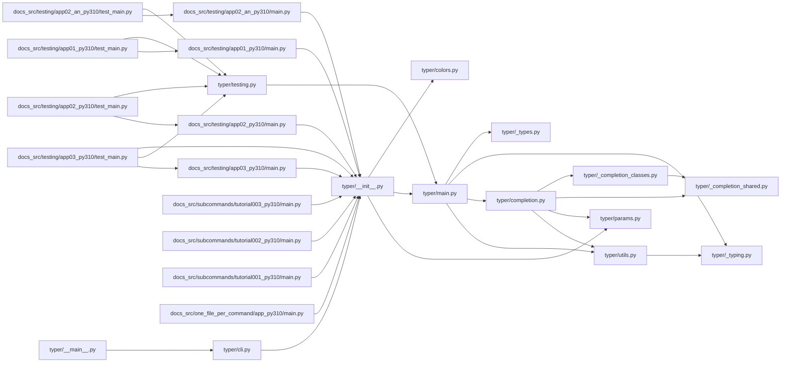

## ARCHITECTURE

A software project composed of the following subsystems:

- **docs_src/**: Primary subsystem containing 304 files
- **tests/**: Primary subsystem containing 254 files
- **docs/**: Primary subsystem containing 87 files
- **typer/**: Primary subsystem containing 17 files
- **scripts/**: Primary subsystem containing 12 files
- **Root**: Contains scripts and execution points

## ENTRY_POINTS

### `typer/main.py`

```python
import inspect
import os
import platform
import shutil
import subprocess
import sys
import traceback
from collections.abc import Callable, Sequence
from datetime import datetime
from enum import Enum
from functools import update_wrapper
from pathlib import Path
from traceback import FrameSummary, StackSummary
from types import TracebackType
from typing import Annotated, Any
from uuid import UUID

import click
from annotated_doc import Doc
from typer._types import TyperChoice

from ._typing import get_args, get_origin, is_literal_type, is_union, literal_values
from .completion import get_completion_inspect_parameters
from .core import (
    DEFAULT_MARKUP_MODE,
    HAS_RICH,
    MarkupMode,
    TyperArgument,
    TyperCommand,
    TyperGroup,
    TyperOption,
)
from .models import (
    AnyType,
    ArgumentInfo,
    CommandFunctionType,
    CommandInfo,
    Default,
    DefaultPlaceholder,
    DeveloperExceptionConfig,
    FileBinaryRead,
    FileBinaryWrite,
    FileText,
    FileTextWrite,
    NoneType,
    OptionInfo,
    ParameterInfo,
    ParamMeta,
    Required,
    TyperInfo,
    TyperPath,
)
from .utils import get_params_from_function

_original_except_hook = sys.excepthook
_typer_developer_exception_attr_name = "__typer_developer_exception__"


def except_hook(
    exc_type: type[BaseException], exc_value: BaseException, tb: TracebackType | None
) -> None:
    exception_config: DeveloperExceptionConfig | None = getattr(
        exc_value, _typer_developer_exception_attr_name, None
    )
    standard_traceback = os.getenv(
        "TYPER_STANDARD_TRACEBACK", os.getenv("_TYPER_STANDARD_TRACEBACK")
    )
    if (
        standard_traceback
        or not exception_config
        or not exception_config.pretty_exceptions_enable
    ):
        _original_except_hook(exc_type, exc_value, tb)
        return
    typer_path = os.path.dirname(__file__)
    click_path = os.path.dirname(click.__file__)
    internal_dir_names = [typer_path, click_path]
    exc = exc_value
    if HAS_RICH:
        from . import rich_utils

        rich_tb = rich_utils.get_traceback(exc, exception_config, internal_dir_names)
        console_stderr = rich_utils._get_rich_console(stderr=True)
        console_stderr.print(rich_tb)
        return
    tb_exc = traceback.TracebackException.from_exception(exc)
    stack: list[FrameSummary] = []
    for frame in tb_exc.stack:
        if any(frame.filename.startswith(path) for path in internal_dir_names):
            if not exception_config.pretty_exceptions_short:
                # Hide the line for internal libraries, Typer and Click
                stack.append(
                    traceback.FrameSummary(
                        filename=frame.filename,
                        lineno=frame.lineno,
                        name=frame.name,
                        line="",
                    )
                )
        else:
            stack.append(frame)
    # Type ignore ref: https://github.com/python/typeshed/pull/8244
    final_stack_summary = StackSummary.from_list(stack)
    tb_exc.stack = final_stack_summary
    for line in tb_exc.format():
        print(line, file=sys.stderr)
    return


def get_install_completion_arguments() -> tuple[click.Parameter, click.Parameter]:
    install_param, show_param = get_completion_inspect_parameters()
    click_install_param, _ = get_click_param(install_param)
    click_show_param, _ = get_click_param(show_param)
    return click_install_param, click_show_param


class Typer:
    """
    `Typer` main class, the main entrypoint to use Typer.

    Read more in the
    [Typer docs for First Steps](https://typer.tiangolo.com/tutorial/typer-app/).

    ## Example

    ```python
    import typer

    app = typer.Typer()
    ```
    """

    def __init__(
        self,
        *,
        name: Annotated[
            str | None,
            Doc(
                """
                The name of this application.
                Mostly used to set the name for [subcommands](https://typer.tiangolo.com/tutorial/subcommands/), in which case it can be overridden by `add_typer(name=...)`.

                **Example**

                ```python
                import typer

                app = typer.Typer(name="users")
                ```
                """
            ),
        ] = Default(None),
        cls: Annotated[
            type[TyperGroup] | None,
            Doc(
                """
                The class of this app. Mainly used when [using the Click library underneath](https://typer.tiangolo.com/tutorial/using-click/). Can usually be left at the default value `None`.
                Otherwise, should be a subtype of `TyperGroup`.

                **Example**

                ```python
                import typer

                app = typer.Typer(cls=TyperGroup)
                ```
                """
            ),
        ] = Default(None),
        invoke_without_command: Annotated[
            bool,
            Doc(
                """
                By setting this to `True`, you can make sure a callback is executed even when no subcommand is provided.

                **Example**

                ```python
                import typer

                app = typer.Typer(invoke_without_command=True)
                ```
                """
            ),
        ] = Default(False),
        no_args_is_help: Annotated[
            bool,
            Doc(
                """
                If this is set to `True`, running a command without any arguments will automatically show the help page.

                **Example**

                ```python
                import typer

                app = typer.Typer(no_args_is_help=True)
                ```
                """
            ),
        ] = Default(False),
        subcommand_metavar: Annotated[
            str | None,
            Doc(
                """
                **Note**: you probably shouldn't use this parameter, it is inherited
                from Click and supported for compatibility.

                ---

                How to represent the subcommand argument in help.
                """
            ),
        ] = Default(None),
        chain: Annotated[
            bool,
            Doc(
                """
                **Note**: you probably shouldn't use this parameter, it is inherited
                from Click and supported for compatibility.

                ---

                Allow passing more than one subcommand argument.
                """
            ),
        ] = Default(False),
        result_callback: Annotated[
            Callable[..., Any] | None,
            Doc(
                """
                **Note**: you probably shouldn't use this parameter, it is inherited
                from Click and supported for compatibility.

                ---

                A function to call after the group's and subcommand's callbacks.
                """
            ),
        ] = Default(None),
        # Command
        context_settings: Annotated[
            dict[Any, Any] | None,
            Doc(
                """
                Pass configurations for the [context](https://typer.tiangolo.com/tutorial/commands/context/).
                Available configurations can be found in the docs for Click's `Context` [here](https://click.palletsprojects.com/en/stable/api/#context).

                **Example**

                ```python
                import typer

                app = typer.Typer(context_settings={"help_option_names": ["-h", "--help"]})
                ```
                """
            ),
        ] = Default(None),
        callback: Annotated[
            Callable[..., Any] | None,
            Doc(
                """
                Add a callback to the main Typer app. Can be overridden with `@app.callback()`.
                See [the tutorial about callbacks](https://typer.tiangolo.com/tutorial/commands/callback/) for more details.

                **Example**

                ```python
                import typer

                def callback():
                    print("Running a command")

                app = typer.Typer(callback=callback)
                ```
                """
            ),
        ] = Default(None),
        help: Annotated[
            str | None,
            Doc(
                """
                Help text for the main Typer app.
                See [the tutorial about name and help](https://typer.tiangolo.com/tutorial/subcommands/name-and-help) for different ways of setting a command's help,
                and which one takes priority.

                **Example**

                ```python
                import typer

                app = typer.Typer(help="Some help.")
                ```
                """
            ),
        ] = Default(None),
        epilog: Annotated[
            str | None,
            Doc(
                """

... (truncated: entry point exceeds 300 lines)
```

### `typer/cli.py`

```python
import importlib.util
import re
import sys
from pathlib import Path
from typing import Any

import click
import typer
import typer.core
from click import Command, Group, Option

from . import __version__
from .core import HAS_RICH, MARKUP_MODE_KEY

default_app_names = ("app", "cli", "main")
default_func_names = ("main", "cli", "app")

app = typer.Typer()
utils_app = typer.Typer(help="Extra utility commands for Typer apps.")
app.add_typer(utils_app, name="utils")


class State:
    def __init__(self) -> None:
        self.app: str | None = None
        self.func: str | None = None
        self.file: Path | None = None
        self.module: str | None = None


state = State()


def maybe_update_state(ctx: click.Context) -> None:
    path_or_module = ctx.params.get("path_or_module")
    if path_or_module:
        file_path = Path(path_or_module)
        if file_path.exists() and file_path.is_file():
            state.file = file_path
        else:
            if not re.fullmatch(r"[a-zA-Z_]\w*(\.[a-zA-Z_]\w*)*", path_or_module):
                typer.echo(
                    f"Not a valid file or Python module: {path_or_module}", err=True
                )
                sys.exit(1)
            state.module = path_or_module
    app_name = ctx.params.get("app")
    if app_name:
        state.app = app_name
    func_name = ctx.params.get("func")
    if func_name:
        state.func = func_name


class TyperCLIGroup(typer.core.TyperGroup):
    def list_commands(self, ctx: click.Context) -> list[str]:
        self.maybe_add_run(ctx)
        return super().list_commands(ctx)

    def get_command(self, ctx: click.Context, name: str) -> Command | None:  # ty: ignore[invalid-method-override]
        self.maybe_add_run(ctx)
        return super().get_command(ctx, name)

    def invoke(self, ctx: click.Context) -> Any:
        self.maybe_add_run(ctx)
        return super().invoke(ctx)

    def maybe_add_run(self, ctx: click.Context) -> None:
        maybe_update_state(ctx)
        maybe_add_run_to_cli(self)


def get_typer_from_module(module: Any) -> typer.Typer | None:
    # Try to get defined app
    if state.app:
        obj = getattr(module, state.app, None)
        if not isinstance(obj, typer.Typer):
            typer.echo(f"Not a Typer object: --app {state.app}", err=True)
            sys.exit(1)
        return obj
    # Try to get defined function
    if state.func:
        func_obj = getattr(module, state.func, None)
        if not callable(func_obj):
            typer.echo(f"Not a function: --func {state.func}", err=True)
            raise typer.Exit(1)
        sub_app = typer.Typer()
        sub_app.command()(func_obj)
        return sub_app
    # Iterate and get a default object to use as CLI
    local_names = dir(module)
    local_names_set = set(local_names)
    # Try to get a default Typer app
    for name in default_app_names:
        if name in local_names_set:
            obj = getattr(module, name, None)
            if isinstance(obj, typer.Typer):
                return obj
    # Try to get any Typer app
    for name in local_names_set - set(default_app_names):
        obj = getattr(module, name)
        if isinstance(obj, typer.Typer):
            return obj
    # Try to get a default function
    for func_name in default_func_names:
        func_obj = getattr(module, func_name, None)
        if callable(func_obj):
            sub_app = typer.Typer()
            sub_app.command()(func_obj)
            return sub_app
    # Try to get any func app
    for func_name in local_names_set - set(default_func_names):
        func_obj = getattr(module, func_name)
        if callable(func_obj):
            sub_app = typer.Typer()
            sub_app.command()(func_obj)
            return sub_app
    return None


def get_typer_from_state() -> typer.Typer | None:
    spec = None
    if state.file:
        module_name = state.file.name
        spec = importlib.util.spec_from_file_location(module_name, str(state.file))
    elif state.module:
        spec = importlib.util.find_spec(state.module)
    if spec is None:
        if state.file:
            typer.echo(f"Could not import as Python file: {state.file}", err=True)
        else:
            typer.echo(f"Could not import as Python module: {state.module}", err=True)
        sys.exit(1)
    assert spec is not None
    module = importlib.util.module_from_spec(spec)
    spec.loader.exec_module(module)  # type: ignore
    obj = get_typer_from_module(module)
    return obj


def maybe_add_run_to_cli(cli: click.Group) -> None:
    if "run" not in cli.commands:
        if state.file or state.module:
            obj = get_typer_from_state()
            if obj:
                obj._add_completion = False
                click_obj = typer.main.get_command(obj)
                click_obj.name = "run"
                if not click_obj.help:
                    click_obj.help = "Run the provided Typer app."
                cli.add_command(click_obj)


def print_version(ctx: click.Context, param: Option, value: bool) -> None:
    if not value or ctx.resilient_parsing:
        return
    typer.echo(f"Typer version: {__version__}")
    raise typer.Exit()


@app.callback(cls=TyperCLIGroup, no_args_is_help=True)
def callback(
    ctx: typer.Context,
    *,
    path_or_module: str = typer.Argument(None),
    app: str = typer.Option(None, help="The typer app object/variable to use."),
    func: str = typer.Option(None, help="The function to convert to Typer."),
    version: bool = typer.Option(
        False,
        "--version",
        help="Print version and exit.",
        callback=print_version,
    ),
) -> None:
    """
    Run Typer scripts with completion, without having to create a package.

    You probably want to install completion for the typer command:

    $ typer --install-completion

    https://typer.tiangolo.com/
    """
    maybe_update_state(ctx)


def get_docs_for_click(
    *,
    obj: Command,
    ctx: typer.Context,
    indent: int = 0,
    name: str = "",
    call_prefix: str = "",
    title: str | None = None,
) -> str:
    docs = "#" * (1 + indent)
    command_name = name or obj.name
    if call_prefix:
        command_name = f"{call_prefix} {command_name}"
    if not title:
        title = f"`{command_name}`" if command_name else "CLI"
    docs += f" {title}\n\n"
    rich_markup_mode = None
    if hasattr(ctx, "obj") and isinstance(ctx.obj, dict):
        rich_markup_mode = ctx.obj.get(MARKUP_MODE_KEY, None)
    to_parse: bool = bool(HAS_RICH and (rich_markup_mode == "rich"))
    if obj.help:
        docs += f"{_parse_html(to_parse, obj.help)}\n\n"
    usage_pieces = obj.collect_usage_pieces(ctx)
    if usage_pieces:
        docs += "**Usage**:\n\n"
        docs += "```console\n"
        docs += "$ "
        if command_name:
            docs += f"{command_name} "
        docs += f"{' '.join(usage_pieces)}\n"
        docs += "```\n\n"
    args = []
    opts = []
    for param in obj.get_params(ctx):
        rv = param.get_help_record(ctx)
        if rv is not None:
            if param.param_type_name == "argument":
                args.append(rv)
            elif param.param_type_name == "option":
                opts.append(rv)
    if args:
        docs += "**Arguments**:\n\n"
        for arg_name, arg_help in args:
            docs += f"* `{arg_name}`"
            if arg_help:
                docs += f": {_parse_html(to_parse, arg_help)}"
            docs += "\n"
        docs += "\n"
    if opts:
        docs += "**Options**:\n\n"
        for opt_name, opt_help in opts:
            docs += f"* `{opt_name}`"
            if opt_help:
                docs += f": {_parse_html(to_parse, opt_help)}"
            docs += "\n"
        docs += "\n"
    if obj.epilog:
        docs += f"{obj.epilog}\n\n"
    if isinstance(obj, Group):
        group = obj
        commands = group.list_commands(ctx)
        if commands:
            docs += "**Commands**:\n\n"
            for command in commands:
                command_obj = group.get_command(ctx, command)
                assert command_obj
                docs += f"* `{command_obj.name}`"
                command_help = command_obj.get_short_help_str()
                if command_help:
                    docs += f": {_parse_html(to_parse, command_help)}"
                docs += "\n"
            docs += "\n"
        for command in commands:
            command_obj = group.get_command(ctx, command)
            assert command_obj
            use_prefix = ""
            if command_name:
                use_prefix += f"{command_name}"
            docs += get_docs_for_click(
                obj=command_obj, ctx=ctx, indent=indent + 1, call_prefix=use_prefix
            )
    return docs


def _parse_html(to_parse: bool, input_text: str) -> str:
    if not to_parse:
        return input_text
    from . import rich_utils

    return rich_utils.rich_to_html(input_text)


@utils_app.command()
def docs(
    ctx: typer.Context,
    name: str = typer.Option("", help="The name of the CLI program to use in docs."),
    output: Path | None = typer.Option(
        None,
        help="An output file to write docs to, like README.md.",
        file_okay=True,
        dir_okay=False,
    ),
    title: str | None = typer.Option(
        None,
        help="The title for the documentation page. If not provided, the name of "
        "the program is used.",
    ),
) -> None:
    """
    Generate Markdown docs for a Typer app.
    """
    typer_obj = get_typer_from_state()
    if not typer_obj:
        typer.echo("No Typer app found", err=True)

... (truncated: entry point exceeds 300 lines)
```

### `typer/__main__.py`

```python
from .cli import main

main()

```

### `docs_src/testing/app03_py310/main.py`

```python
import typer


def main(name: str = "World"):
    print(f"Hello {name}")


if __name__ == "__main__":
    typer.run(main)

```

### `docs_src/testing/app02_py310/main.py`

```python
import typer

app = typer.Typer()


@app.command()
def main(name: str, email: str = typer.Option(..., prompt=True)):
    print(f"Hello {name}, your email is: {email}")


if __name__ == "__main__":
    app()

```

### `docs_src/testing/app02_an_py310/main.py`

```python
from typing import Annotated

import typer

app = typer.Typer()


@app.command()
def main(name: str, email: Annotated[str, typer.Option(prompt=True)]):
    print(f"Hello {name}, your email is: {email}")


if __name__ == "__main__":
    app()

```

### `docs_src/testing/app01_py310/main.py`

```python
import typer

app = typer.Typer()


@app.command()
def main(name: str, city: str | None = None):
    print(f"Hello {name}")
    if city:
        print(f"Let's have a coffee in {city}")


if __name__ == "__main__":
    app()

```

### `docs_src/subcommands/tutorial003_py310/main.py`

```python
import typer

import items
import lands
import users

app = typer.Typer()
app.add_typer(users.app, name="users")
app.add_typer(items.app, name="items")
app.add_typer(lands.app, name="lands")

if __name__ == "__main__":
    app()

```

### `docs_src/subcommands/tutorial002_py310/main.py`

```python
import typer

app = typer.Typer()
items_app = typer.Typer()
app.add_typer(items_app, name="items")
users_app = typer.Typer()
app.add_typer(users_app, name="users")


@items_app.command("create")
def items_create(item: str):
    print(f"Creating item: {item}")


@items_app.command("delete")
def items_delete(item: str):
    print(f"Deleting item: {item}")


@items_app.command("sell")
def items_sell(item: str):
    print(f"Selling item: {item}")


@users_app.command("create")
def users_create(user_name: str):
    print(f"Creating user: {user_name}")


@users_app.command("delete")
def users_delete(user_name: str):
    print(f"Deleting user: {user_name}")


if __name__ == "__main__":
    app()

```

### `docs_src/subcommands/tutorial001_py310/main.py`

```python
import typer

import items
import users

app = typer.Typer()
app.add_typer(users.app, name="users")
app.add_typer(items.app, name="items")

if __name__ == "__main__":
    app()

```

### `docs_src/one_file_per_command/app_py310/main.py`

```python
import typer

from .users import app as users_app
from .version import app as version_app

app = typer.Typer()

app.add_typer(version_app)
app.add_typer(users_app, name="users")


if __name__ == "__main__":
    app()

```

## SYMBOL_INDEX

**`typer/testing.py`**
- class `CliRunner`
  - `invoke()`

**`typer/main.py`**
- `except_hook()`
- `get_install_completion_arguments()`
- class `Typer`
  - `__init__()`
  - `callback()`
  - `command()`
  - `add_typer()`
  - `__call__()`
  - `_info_val_str()`
- `get_group()`
- `get_command()`
- `solve_typer_info_help()`
- `solve_typer_info_defaults()`
- `get_group_from_info()`
- `get_command_name()`
- `get_params_convertors_ctx_param_name_from_function()`
- `get_command_from_info()`
- `determine_type_convertor()`
- `param_path_convertor()`
- `generate_enum_convertor()`
- `generate_list_convertor()`
- `generate_tuple_convertor()`
- `get_callback()`
- `get_click_type()`
- `lenient_issubclass()`
- `get_click_param()`
- `get_param_callback()`
- `get_param_completion()`
- `run()`
- `_is_macos()`
- `_is_linux_or_bsd()`
- `launch()`

**`typer/cli.py`**
- class `State`
  - `__init__()`
- `maybe_update_state()`
- class `TyperCLIGroup`
  - `list_commands()`
  - `get_command()`
  - `invoke()`
  - `maybe_add_run()`
- `get_typer_from_module()`
- `get_typer_from_state()`
- `maybe_add_run_to_cli()`
- `print_version()`
- `callback()`
- `get_docs_for_click()`
- `_parse_html()`
- `docs()`
- `main()`

**`docs_src/testing/app03_py310/main.py`**
- `main()`

**`docs_src/testing/app02_py310/main.py`**
- `main()`

**`docs_src/testing/app02_an_py310/main.py`**
- `main()`

**`docs_src/testing/app01_py310/main.py`**
- `main()`

**`typer/completion.py`**
- `get_completion_inspect_parameters()`
- `install_callback()`
- `show_callback()`
- `_install_completion_placeholder_function()`
- `_install_completion_no_auto_placeholder_function()`
- `shell_complete()`

**`docs_src/subcommands/tutorial002_py310/main.py`**
- `items_create()`
- `items_delete()`
- `items_sell()`
- `users_create()`
- `users_delete()`

**`typer/utils.py`**
- `_param_type_to_user_string()`
- class `AnnotatedParamWithDefaultValueError`
  - `__init__()`
  - `__str__()`
- class `MixedAnnotatedAndDefaultStyleError`
  - `__init__()`
  - `__str__()`
- class `MultipleTyperAnnotationsError`
  - `__init__()`
  - `__str__()`
- class `DefaultFactoryAndDefaultValueError`
  - `__init__()`
  - `__str__()`
- `_split_annotation_from_typer_annotations()`
- `get_params_from_function()`
- `parse_boolean_env_var()`

**`typer/_typing.py`**
- `is_union()`
- `is_none_type()`
- `is_callable_type()`
- `is_literal_type()`
- `literal_values()`
- `all_literal_values()`

**`typer/_types.py`**
- class `TyperChoice`
  - `normalize_choice()`

**`typer/_completion_shared.py`**
- class `Shells`
- `get_completion_script()`
- `install_bash()`
- `install_zsh()`
- `install_fish()`
- `install_powershell()`
- `install()`
- `_get_shell_name()`

**`typer/_completion_classes.py`**
- `_sanitize_help_text()`
- class `BashComplete`
  - `source_vars()`
  - `get_completion_args()`
  - `format_completion()`
  - `complete()`
- class `ZshComplete`
  - `source_vars()`
  - `get_completion_args()`
  - `format_completion()`
  - `complete()`
- class `FishComplete`
  - `source_vars()`
  - `get_completion_args()`
  - `format_completion()`
  - `complete()`
- class `PowerShellComplete`
  - `source_vars()`
  - `get_completion_args()`
  - `format_completion()`
- `completion_init()`

**`typer/params.py`**
- `Option()`
- `Option()`
- `Option()`
- `Argument()`
- `Argument()`
- `Argument()`

**`docs_src/testing/app03_py310/test_main.py`**
- `test_app()`

**`docs_src/testing/app01_py310/test_main.py`**
- `test_app()`

**`docs_src/testing/app02_py310/test_main.py`**
- `test_app()`

**`docs_src/testing/app02_an_py310/test_main.py`**
- `test_app()`

**`docs_src/typer_app/tutorial001_py310.py`**
- `main()`

**`docs_src/terminating/tutorial001_py310.py`**
- `maybe_create_user()`
- `send_new_user_notification()`
- `main()`

**`docs_src/terminating/tutorial002_py310.py`**
- `main()`

**`docs_src/terminating/tutorial003_py310.py`**
- `main()`

**`docs_src/subcommands/tutorial003_py310/items.py`**
- `create()`
- `delete()`
- `sell()`

**`docs_src/subcommands/tutorial003_py310/reigns.py`**
- `conquer()`
- `destroy()`

**`docs_src/subcommands/tutorial003_py310/towns.py`**
- `found()`
- `burn()`

**`docs_src/subcommands/tutorial003_py310/users.py`**
- `create()`
- `delete()`

**`docs_src/subcommands/tutorial001_py310/items.py`**
- `create()`
- `delete()`
- `sell()`

**`docs_src/subcommands/tutorial001_py310/users.py`**
- `create()`
- `delete()`

**`docs_src/one_file_per_command/app_py310/version.py`**
- `version()`

**`docs_src/subcommands/name_help/tutorial001_py310.py`**
- `create()`

**`docs_src/subcommands/name_help/tutorial002_py310.py`**
- `users()`
- `create()`

**`docs_src/subcommands/name_help/tutorial003_py310.py`**
- `users()`
- `create()`

**`docs_src/subcommands/name_help/tutorial004_py310.py`**
- `old_callback()`
- `users()`
- `create()`

**`docs_src/subcommands/name_help/tutorial005_py310.py`**
- `old_callback()`
- `new_users()`
- `users()`
- `create()`

**`docs_src/subcommands/name_help/tutorial006_py310.py`**
- `old_callback()`
- `new_users()`
- `users()`
- `create()`

**`docs_src/subcommands/name_help/tutorial007_py310.py`**
- `old_callback()`
- `new_users()`
- `users()`
- `create()`

**`docs_src/subcommands/name_help/tutorial008_py310.py`**
- `old_callback()`
- `new_users()`
- `users()`
- `create()`

**`docs_src/subcommands/callback_override/tutorial001_py310.py`**
- `users_callback()`
- `create()`

**`docs_src/subcommands/callback_override/tutorial002_py310.py`**
- `users_callback()`
- `create()`

**`docs_src/subcommands/callback_override/tutorial003_py310.py`**
- `default_callback()`
- `user_callback()`
- `create()`

**`docs_src/subcommands/callback_override/tutorial004_py310.py`**
- `default_callback()`
- `callback_for_add_typer()`
- `user_callback()`
- `create()`

**`docs_src/progressbar/tutorial001_py310.py`**
- `main()`

## IMPORTANT_CALL_PATHS

main()
  → __init__()
  → colors()
## CORE_MODULES

### `typer/__init__.py`

**Purpose:** Typer, build great CLIs. Easy to code. Based on Python type hints.
**Depends on:** `colors`, `main`, `models`, `params`

### `typer/testing.py`

**Purpose:** Implements testing.
**Depends on:** `main`

**Types:**
- `CliRunner` (bases: `ClickCliRunner`) methods: `invoke`

### `typer/completion.py`

**Purpose:** Implements completion.

**Functions:**
- `def _install_completion_no_auto_placeholder_function(...),     show_completion: Shells = Option(         None,         callback=show_callback,         expose_value=False,         help="Show completion for the specified shell, to copy it or customize the installation.",     ), ) -> Any`

### `typer/utils.py`

**Purpose:** Implements utils.
**Depends on:** `_typing`, `models`

**Types:**
- `AnnotatedParamWithDefaultValueError` (bases: `Exception`) methods: `__init__`, `__str__`
- `DefaultFactoryAndDefaultValueError` (bases: `Exception`) methods: `__init__`, `__str__`

**Functions:**
- `def _param_type_to_user_string(param_type: type[ParameterInfo]) -> str`
- `def _split_annotation_from_typer_annotations(     base_annotation: type[Any], ) -> tuple[type[Any], list[ParameterInfo]]`
- `def get_params_from_function(func: Callable[..., Any]) -> dict[str, ParamMeta]`
- `def parse_boolean_env_var(env_var_value: str | None, default: bool) -> bool`

### `typer/_typing.py`

**Purpose:** Implements typing.

**Functions:**
- `def all_literal_values(type_: type[Any]) -> tuple[Any, ...]`
  - This method is used to retrieve all Literal values as
- `def is_callable_type(type_: type[Any]) -> bool`
- `def is_literal_type(type_: type[Any]) -> bool`
- `def is_none_type(type_: Any) -> bool`
- `def is_union(tp: type[Any] | None) -> bool`
- `def literal_values(type_: type[Any]) -> tuple[Any, ...]`

### `typer/_types.py`

**Purpose:** Implements types.

**Types:**
- `TyperChoice` (bases: `click.Choice[ParamTypeValue]`) methods: `normalize_choice`

### `typer/_completion_shared.py`

**Purpose:** Implements completion shared.

**Types:**
- `Shells` (bases: `str, Enum`)

**Functions:**
- `def _get_shell_name() -> str | None`
- `def get_completion_script(*, prog_name: str, complete_var: str, shell: str) -> str`
- `def install(shell: str | None = None, prog_name: str | None = None, ...) -> tuple[str, Path]`
- `def install_bash(*, prog_name: str, complete_var: str, shell: str) -> Path`
- `def install_fish(*, prog_name: str, complete_var: str, shell: str) -> Path`
- `def install_powershell(*, prog_name: str, complete_var: str, shell: str) -> Path`

### `typer/_completion_classes.py`

**Purpose:** Implements completion classes.
**Depends on:** `_completion_shared`, `rich_utils`

**Types:**
- `BashComplete` (bases: `click.shell_completion.BashComplete`) methods: `complete`, `format_completion`, `get_completion_args`, `source_vars`
- `FishComplete` (bases: `click.shell_completion.FishComplete`) methods: `complete`, `format_completion`, `get_completion_args`, `source_vars`
- `PowerShellComplete` (bases: `click.shell_completion.ShellComplete`) methods: `format_completion`, `get_completion_args`, `source_vars`

**Functions:**
- `def _sanitize_help_text(text: str) -> str`
- `def completion_init() -> None`

### `typer/params.py`

**Purpose:** Implements params.
**Depends on:** `models`

**Functions:**
- `def Argument(...):              **Example**              ```python             @app.command()             def main(name: str = typer.Argument("World")):                 print(f"Hello {name}!")             ```              Note that this usage is deprecated, and we recommend to use `Annotated` instead:             ```python             @app.command()             def main(name: Annotated[str, typer.Argument()] = "World"):                 print(f"Hello {name}!")             ```             """         ),     ] = ...,     *,     callback: Annotated[         Callable[..., Any] | None,         Doc(             """             Add a callback to this CLI Argument, to execute additional logic with the value received from the terminal.             See [the tutorial about callbacks](https://typer.tiangolo.com/tutorial/options/callback-and-context/) for more details.              **Example**              ```python             def name_callback(value: str):                 if value != "Deadpool":                     raise typer.BadParameter("Only Deadpool is allowed")                 return value              @app.command()             def main(name: Annotated[str, typer.Argument(callback=name_callback)]):                 print(f"Hello {name}")             ```             """         ),     ] = None,     metavar: Annotated[         str | None,         Doc(             """             Customize the name displayed in the help text to represent this CLI Argument.             By default, it will be the same name you declared, in uppercase.             See [the tutorial about CLI Arguments with Help](https://typer.tiangolo.com/tutorial/arguments/help/#custom-help-name-metavar) for more details.              **Example**              ```python             @app.command()             def main(name: Annotated[str, typer.Argument(metavar="✨username✨")]):                 print(f"Hello {name}")             ```             """         ),     ] = None,     expose_value: Annotated[         bool,         Doc(             """             **Note**: you probably shouldn't use this parameter, it is inherited from Click and supported for compatibility.              ---              If this is `True` then the value is passed onwards to the command callback and stored on the context, otherwise it’s skipped.             """         ),     ] = True,     is_eager: Annotated[         bool,         Doc(             """             Set an argument to "eager" to ensure it gets processed before other CLI parameters. This could be relevant when there are other parameters with callbacks that could exit the program early.             For more information and an extended example, see the documentation [here](https://typer.tiangolo.com/tutorial/options/version/#fix-with-is_eager).             """         ),     ] = False,     envvar: Annotated[         str | list[str] | None,         Doc(             """             Configure an argument to read a value from an environment variable if it is not provided in the command line as a CLI argument.             For more information, see the [documentation on Environment Variables](https://typer.tiangolo.com/tutorial/arguments/envvar/).              **Example**              ```python             @app.command()             def main(name: Annotated[str, typer.Argument(envvar="ME")]):                 print(f"Hello Mr. {name}")             ```             """         ),     ] = None,     # TODO: Remove shell_complete in a future version (after 0.16.0)     shell_complete: Annotated[         Callable[             [click.Context, click.Parameter, str],             list["click.shell_completion.CompletionItem"] | list[str],         ]         | None,         Doc(             """             **Note**: you probably shouldn't use this parameter, it is inherited from Click and supported for compatibility.             It is however not fully functional, and will likely be removed in future versions.             """         ),     ] = None,     autocompletion: Annotated[         Callable[..., Any] | None,         Doc(             """             Provide a custom function that helps to autocomplete the values of this CLI Argument.             See [the tutorial on parameter autocompletion](https://typer.tiangolo.com/tutorial/options-autocompletion) for more details.              **Example**              ```python             def complete():                 return ["Me", "Myself", "I"]              @app.command()             def main(name: Annotated[str, typer.Argument(autocompletion=complete)]):                 print(f"Hello {name}")             ```             """         ),     ] = None,     default_factory: Annotated[         Callable[[], Any] | None,         Doc(             """             Provide a custom function that dynamically generates a [default](https://typer.tiangolo.com/tutorial/arguments/default) for this CLI Argument.              **Example**              ```python             def get_name():                 return random.choice(["Me", "Myself", "I"])              @app.command()             def main(name: Annotated[str, typer.Argument(default_factory=get_name)]):                 print(f"Hello {name}")             ```             """         ),     ] = None,     # Custom type     parser: Annotated[         Callable[[str], Any] | None,         Doc(             """             Use your own custom types in Typer applications by defining a `parser` function that parses input into your own types:              **Example**              ```python             class CustomClass:                 def __init__(self, value: str):                     self.value = value                  def __str__(self):                     return f"<CustomClass: value={self.value}>"              def my_parser(value: str):                 return CustomClass(value * 2)              @app.command()             def main(arg: Annotated[CustomClass, typer.Argument(parser=my_parser):                 print(f"arg is {arg}")             ```             """         ),     ] = None,     click_type: Annotated[         click.ParamType | None,         Doc(             """             Define this parameter to use a [custom Click type](https://click.palletsprojects.com/en/stable/parameters/#implementing-custom-types) in your Typer applications.              **Example**              ```python             class MyClass:                 def __init__(self, value: str):                     self.value = value                  def __str__(self):                     return f"<MyClass: value={self.value}>"              class MyParser(click.ParamType):                 name = "MyClass"                  def convert(self, value, param, ctx):                     return MyClass(value * 3)              @app.command()             def main(arg: Annotated[MyClass, typer.Argument(click_type=MyParser())]):                 print(f"arg is {arg}")             ```             """         ),     ] = None,     # TyperArgument     show_default: Annotated[         bool | str,         Doc(             """             When set to `False`, don't show the default value of this CLI Argument in the [help text](https://typer.tiangolo.com/tutorial/arguments/help/).              **Example**              ```python             @app.command()             def main(name: Annotated[str, typer.Argument(show_default=False)] = "Rick"):                 print(f"Hello {name}")             ```             """         ),     ] = True,     show_choices: Annotated[         bool,         Doc(             """             **Note**: you probably shouldn't use this parameter, it is inherited from Click and supported for compatibility.              ---              When set to `False`, this suppresses choices from being displayed inline when `prompt` is used.             """         ),     ] = True,     show_envvar: Annotated[         bool,         Doc(             """             When an ["envvar"](https://typer.tiangolo.com/tutorial/arguments/envvar) is defined, prevent it from showing up in the help text:              **Example**              ```python             @app.command()             def main(name: Annotated[str, typer.Argument(envvar="ME", show_envvar=False)]):                 print(f"Hello Mr. {name}")             ```             """         ),     ] = True,     help: Annotated[         str | None,         Doc(             """             Help text for this CLI Argument.             See [the tutorial about CLI Arguments with help](https://typer.tiangolo.com/tutorial/arguments/help/) for more dedails.              **Example**              ```python             @app.command()             def greet(name: Annotated[str, typer.Argument(help="Person to greet")]):                 print(f"Hello {name}")             ```             """         ),     ] = None,     hidden: Annotated[         bool,         Doc(             """             Hide this CLI Argument from [help outputs](https://typer.tiangolo.com/tutorial/arguments/help). `False` by default.              **Example**              ```python             @app.command()             def main(name: Annotated[str, typer.Argument(hidden=True)] = "World"):                 print(f"Hello {name}")             ```             """         ),     ] = False,     # Choice     case_sensitive: Annotated[         bool,         Doc(             """             For a CLI Argument representing an [Enum (choice)](https://typer.tiangolo.com/tutorial/parameter-types/enum),             you can allow case-insensitive matching with this parameter:              **Example**              ```python             from enum import Enum              class NeuralNetwork(str, Enum):                 simple = "simple"                 conv = "conv"                 lstm = "lstm"              @app.command()             def main(                 network: Annotated[NeuralNetwork, typer.Argument(case_sensitive=False)]):                 print(f"Training neural network of type: {network.value}")             ```              With this setting, "LSTM" or "lstm" will both be valid values that will be resolved to `NeuralNetwork.lstm`.             """         ),     ] = True,     # Numbers     min: Annotated[         int | float | None,         Doc(             """             For a CLI Argument representing a [number](https://typer.tiangolo.com/tutorial/parameter-types/number/) (`int` or `float`),             you can define numeric validations with `min` and `max` values:              **Example**              ```python             @app.command()             def main(                 user: Annotated[str, typer.Argument()],                 user_id: Annotated[int, typer.Argument(min=1, max=1000)],             ):                 print(f"ID for {user} is {user_id}")             ```              If the user attempts to input an invalid number, an error will be shown, explaining why the value is invalid.             """         ),     ] = None,     max: Annotated[         int | float | None,         Doc(             """             For a CLI Argument representing a [number](https://typer.tiangolo.com/tutorial/parameter-types/number/) (`int` or `float`),             you can define numeric validations with `min` and `max` values:              **Example**              ```python             @app.command()             def main(                 user: Annotated[str, typer.Argument()],                 user_id: Annotated[int, typer.Argument(min=1, max=1000)],             ):                 print(f"ID for {user} is {user_id}")             ```              If the user attempts to input an invalid number, an error will be shown, explaining why the value is invalid.             """         ),     ] = None,     clamp: Annotated[         bool,         Doc(             """             For a CLI Argument representing a [number](https://typer.tiangolo.com/tutorial/parameter-types/number/) and that is bounded by using `min` and/or `max`,             you can opt to use the closest minimum or maximum value instead of raising an error. This is done by setting `clamp` to `True`.              **Example**              ```python             @app.command()             def main(                 user: Annotated[str, typer.Argument()],                 user_id: Annotated[int, typer.Argument(min=1, max=1000, clamp=True)],             ):                 print(f"ID for {user} is {user_id}")             ```              If the user attempts to input 3420 for `user_id`, this will internally be converted to `1000`.             """         ),     ] = False,     # DateTime     formats: Annotated[         list[str] | None,         Doc(             """             For a CLI Argument representing a [DateTime object](https://typer.tiangolo.com/tutorial/parameter-types/datetime),             you can customize the formats that can be parsed automatically:              **Example**              ```python             from datetime import datetime              @app.command()             def main(                 birthday: Annotated[                     datetime,                     typer.Argument(                         formats=["%Y-%m-%d", "%Y-%m-%d %H:%M:%S", "%m/%d/%Y"]                     ),                 ],             ):                 print(f"Birthday defined at: {birthday}")             ```             """         ),     ] = None,     # File     mode: Annotated[         str | None,         Doc(             """             For a CLI Argument representing a [File object](https://typer.tiangolo.com/tutorial/parameter-types/file/),             you can customize the mode to open the file with. If unset, Typer will set a [sensible value by default](https://typer.tiangolo.com/tutorial/parameter-types/file/#advanced-mode).              **Example**              ```python             @app.command()             def main(config: Annotated[typer.FileText, typer.Argument(mode="a")]):                 config.write("This is a single line\\n")                 print("Config line written")             ```             """         ),     ] = None,     encoding: Annotated[         str | None,         Doc(             """             Customize the encoding of this CLI Argument represented by a [File object](https://typer.tiangolo.com/tutorial/parameter-types/file/).              **Example**              ```python             @app.command()             def main(config: Annotated[typer.FileText, typer.Argument(encoding="utf-8")]):                 config.write("All the text gets written\\n")             ```             """         ),     ] = None,     errors: Annotated[         str | None,         Doc(             """             **Note**: you probably shouldn't use this parameter, it is inherited from Click and supported for compatibility.              ---              The error handling mode.             """         ),     ] = "strict",     lazy: Annotated[         bool | None,         Doc(             """             For a CLI Argument representing a [File object](https://typer.tiangolo.com/tutorial/parameter-types/file/),             by default the file will not be created until you actually start writing to it.             You can change this behaviour by setting this parameter.             By default, it's set to `True` for writing and to `False` for reading.              **Example**              ```python             @app.command()             def main(config: Annotated[typer.FileText, typer.Argument(mode="a", lazy=False)]):                 config.write("This is a single line\\n")                 print("Config line written")             ```             """         ),     ] = None,     atomic: Annotated[         bool,         Doc(             """             For a CLI Argument representing a [File object](https://typer.tiangolo.com/tutorial/parameter-types/file/),             you can ensure that all write instructions first go into a temporal file, and are only moved to the final destination after completing             by setting `atomic` to `True`. This can be useful for files with potential concurrent access.              **Example**              ```python             @app.command()             def main(config: Annotated[typer.FileText, typer.Argument(mode="a", atomic=True)]):                 config.write("All the text")             ```             """         ),     ] = False,     # Path     exists: Annotated[         bool,         Doc(             """             When set to `True` for a [`Path` argument](https://typer.tiangolo.com/tutorial/parameter-types/path/),             additional validation is performed to check that the file or directory exists. If not, the value will be invalid.              **Example**              ```python             from pathlib import Path              @app.command()             def main(config: Annotated[Path, typer.Argument(exists=True)]):                 text = config.read_text()                 print(f"Config file contents: {text}")             ```             """         ),     ] = False,     file_okay: Annotated[         bool,         Doc(             """             Determine whether or not a [`Path` argument](https://typer.tiangolo.com/tutorial/parameter-types/path/)             is allowed to refer to a file. When this is set to `False`, the application will raise a validation error when a path to a file is given.              **Example**              ```python             from pathlib import Path              @app.command()             def main(config: Annotated[Path, typer.Argument(exists=True, file_okay=False)]):                 print(f"Directory listing: {[x.name for x in config.iterdir()]}")             ```             """         ),     ] = True,     dir_okay: Annotated[         bool,         Doc(             """             Determine whether or not a [`Path` argument](https://typer.tiangolo.com/tutorial/parameter-types/path/)             is allowed to refer to a directory. When this is set to `False`, the application will raise a validation error when a path to a directory is given.              **Example**              ```python             from pathlib import Path              @app.command()             def main(config: Annotated[Path, typer.Argument(exists=True, dir_okay=False)]):                 text = config.read_text()                 print(f"Config file contents: {text}")             ```             """         ),     ] = True,     writable: Annotated[         bool,         Doc(             """             Whether or not to perform a writable check for this [`Path` argument](https://typer.tiangolo.com/tutorial/parameter-types/path/).              **Example**              ```python             from pathlib import Path              @app.command()             def main(config: Annotated[Path, typer.Argument(writable=True)]):                 config.write_text("All the text")             ```             """         ),     ] = False,     readable: Annotated[         bool,         Doc(             """             Whether or not to perform a readable check for this [`Path` argument](https://typer.tiangolo.com/tutorial/parameter-types/path/).              **Example**              ```python             from pathlib import Path              @app.command()             def main(config: Annotated[Path, typer.Argument(readable=True)]):                 config.read_text("All the text")             ```             """         ),     ] = True,     resolve_path: Annotated[         bool,         Doc(             """             Whether or not to fully resolve the path of this [`Path` argument](https://typer.tiangolo.com/tutorial/parameter-types/path/),             meaning that the path becomes absolute and symlinks are resolved.              **Example**              ```python             from pathlib import Path              @app.command()             def main(config: Annotated[Path, typer.Argument(resolve_path=True)]):                 config.read_text("All the text")             ```             """         ),     ] = False,     allow_dash: Annotated[         bool,         Doc(             """             When set to `True`, a single dash for this [`Path` argument](https://typer.tiangolo.com/tutorial/parameter-types/path/)             would be a valid value, indicating standard streams. This is a more advanced use-case.             """         ),     ] = False,     path_type: Annotated[         None | type[str] | type[bytes],         Doc(             """             A string type that will be used to represent this [`Path` argument](https://typer.tiangolo.com/tutorial/parameter-types/path/).             The default is `None` which means the return value will be either bytes or unicode, depending on what makes most sense given the input data.             This is a more advanced use-case.             """         ),     ] = None,     # Rich settings     rich_help_panel: Annotated[         str | None,         Doc(             """             Set the panel name where you want this CLI Argument to be shown in the [help text](https://typer.tiangolo.com/tutorial/arguments/help).              **Example**              ```python             @app.command()             def main(                 name: Annotated[str, typer.Argument(help="Who to greet")],                 age: Annotated[str, typer.Option(help="Their age", rich_help_panel="Data")],             ):                 print(f"Hello {name} of age {age}")             ```             """         ),     ] = None, ) -> Any`
- `def Argument(...)     shell_complete: Callable[         [click.Context, click.Parameter, str],         list["click.shell_completion.CompletionItem"] | list[str],     ]     | None = None,     autocompletion: Callable[..., Any] | None = None,     default_factory: Callable[[], Any] | None = None,     # Custom type     click_type: click.ParamType | None = None,     # TyperArgument     show_default: bool | str = True,     show_choices: bool = True,     show_envvar: bool = True,     help: str | None = None,     hidden: bool = False,     # Choice     case_sensitive: bool = True,     # Numbers     min: int | float | None = None,     max: int | float | None = None,     clamp: bool = False,     # DateTime     formats: list[str] | None = None,     # File     mode: str | None = None,     encoding: str | None = None,     errors: str | None = "strict",     lazy: bool | None = None,     atomic: bool = False,     # Path     exists: bool = False,     file_okay: bool = True,     dir_okay: bool = True,     writable: bool = False,     readable: bool = True,     resolve_path: bool = False,     allow_dash: bool = False,     path_type: None | type[str] | type[bytes] = None,     # Rich settings     rich_help_panel: str | None = None, ) -> Any`
- `def Argument(...)     shell_complete: Callable[         [click.Context, click.Parameter, str],         list["click.shell_completion.CompletionItem"] | list[str],     ]     | None = None,     autocompletion: Callable[..., Any] | None = None,     default_factory: Callable[[], Any] | None = None,     # Custom type     parser: Callable[[str], Any] | None = None,     # TyperArgument     show_default: bool | str = True,     show_choices: bool = True,     show_envvar: bool = True,     help: str | None = None,     hidden: bool = False,     # Choice     case_sensitive: bool = True,     # Numbers     min: int | float | None = None,     max: int | float | None = None,     clamp: bool = False,     # DateTime     formats: list[str] | None = None,     # File     mode: str | None = None,     encoding: str | None = None,     errors: str | None = "strict",     lazy: bool | None = None,     atomic: bool = False,     # Path     exists: bool = False,     file_okay: bool = True,     dir_okay: bool = True,     writable: bool = False,     readable: bool = True,     resolve_path: bool = False,     allow_dash: bool = False,     path_type: None | type[str] | type[bytes] = None,     # Rich settings     rich_help_panel: str | None = None, ) -> Any`
- `def Option(...) are optional and have a default value, passed on like this:              **Example**              ```python             @app.command()             def main(network: str = typer.Option("CNN")):                 print(f"Training neural network of type: {network}")             ```              Note that this usage is deprecated, and we recommend to use `Annotated` instead:             ```             @app.command()             def main(network: Annotated[str, typer.Option()] = "CNN"):                 print(f"Hello {name}!")             ```              You can also use `...` ([Ellipsis](https://docs.python.org/3/library/constants.html#Ellipsis)) as the "default" value to clarify that this is a required CLI option.             """         ),     ] = ...,     *param_decls: Annotated[         str,         Doc(             """             Positional argument that defines how users can call this option on the command line. This may be one or multiple aliases, all strings.             If not defined, Typer will automatically use the function parameter as default name.             See [the tutorial about CLI Option Names](https://typer.tiangolo.com/tutorial/options/name/) for more details.              **Example**              ```python             @app.command()             def main(user_name: Annotated[str, typer.Option("--user", "-u", "-x")]):                 print(f"Hello {user_name}")             ```             """         ),     ],     callback: Annotated[         Callable[..., Any] | None,         Doc(             """             Add a callback to this CLI Option, to execute additional logic after its value was received from the terminal.             See [the tutorial about callbacks](https://typer.tiangolo.com/tutorial/options/callback-and-context/) for more details.              **Example**              ```python             def name_callback(value: str):                 if value != "Deadpool":                     raise typer.BadParameter("Only Deadpool is allowed")                 return value              @app.command()             def main(name: Annotated[str, typer.Option(callback=name_callback)]):                 print(f"Hello {name}")             ```             """         ),     ] = None,     metavar: Annotated[         str | None,         Doc(             """             Customize the name displayed in the [help text](https://typer.tiangolo.com/tutorial/options/help/) to represent this CLI option.             Note that this doesn't influence the way the option must be called.              **Example**              ```python             @app.command()             def main(user: Annotated[str, typer.Option(metavar="User name")]):                 print(f"Hello {user}")             ```             """         ),     ] = None,     expose_value: Annotated[         bool,         Doc(             """             **Note**: you probably shouldn't use this parameter, it is inherited from Click and supported for compatibility.              ---              If this is `True` then the value is passed onwards to the command callback and stored on the context, otherwise it’s skipped.             """         ),     ] = True,     is_eager: Annotated[         bool,         Doc(             """             Mark a CLI Option to be "eager", ensuring it gets processed before other CLI parameters. This could be relevant when there are other parameters with callbacks that could exit the program early.             For more information and an extended example, see the documentation [here](https://typer.tiangolo.com/tutorial/options/version/#fix-with-is_eager).             """         ),     ] = False,     envvar: Annotated[         str | list[str] | None,         Doc(             """             Configure a CLI Option to read its value from an environment variable if it is not provided in the command line.             For more information, see the [documentation on Environment Variables](https://typer.tiangolo.com/tutorial/arguments/envvar/).              **Example**              ```python             @app.command()             def main(user: Annotated[str, typer.Option(envvar="ME")]):                 print(f"Hello {user}")             ```             """         ),     ] = None,     # TODO: Remove shell_complete in a future version (after 0.16.0)     shell_complete: Annotated[         Callable[             [click.Context, click.Parameter, str],             list["click.shell_completion.CompletionItem"] | list[str],         ]         | None,         Doc(             """             **Note**: you probably shouldn't use this parameter, it is inherited from Click and supported for compatibility.             It is however not fully functional, and will likely be removed in future versions.             """         ),     ] = None,     autocompletion: Annotated[         Callable[..., Any] | None,         Doc(             """             Provide a custom function that helps to autocomplete the values of this CLI Option.             See [the tutorial on parameter autocompletion](https://typer.tiangolo.com/tutorial/options-autocompletion) for more details.              **Example**              ```python             def complete():                 return ["Me", "Myself", "I"]              @app.command()             def main(name: Annotated[str, typer.Option(autocompletion=complete)]):                 print(f"Hello {name}")             ```             """         ),     ] = None,     default_factory: Annotated[         Callable[[], Any] | None,         Doc(             """             Provide a custom function that dynamically generates a [default](https://typer.tiangolo.com/tutorial/arguments/default) for this CLI Option.              **Example**              ```python             def get_name():                 return random.choice(["Me", "Myself", "I"])              @app.command()             def main(name: Annotated[str, typer.Option(default_factory=get_name)]):                 print(f"Hello {name}")             ```             """         ),     ] = None,     # Custom type     parser: Annotated[         Callable[[str], Any] | None,         Doc(             """             Use your own custom types in Typer applications by defining a `parser` function that parses input into your own types:              **Example**              ```python             class CustomClass:                 def __init__(self, value: str):                     self.value = value                  def __str__(self):                     return f"<CustomClass: value={self.value}>"              def my_parser(value: str):                 return CustomClass(value * 2)              @app.command()             def main(opt: Annotated[CustomClass, typer.Option(parser=my_parser)] = "Foo"):                 print(f"--opt is {opt}")             ```             """         ),     ] = None,     click_type: Annotated[         click.ParamType | None,         Doc(             """             Define this parameter to use a [custom Click type](https://click.palletsprojects.com/en/stable/parameters/#implementing-custom-types) in your Typer applications.              **Example**              ```python             class MyClass:                 def __init__(self, value: str):                     self.value = value                  def __str__(self):                     return f"<MyClass: value={self.value}>"              class MyParser(click.ParamType):                 name = "MyClass"                  def convert(self, value, param, ctx):                     return MyClass(value * 3)              @app.command()             def main(opt: Annotated[MyClass, typer.Option(click_type=MyParser())] = "Foo"):                 print(f"--opt is {opt}")             ```             """         ),     ] = None,     # Option     show_default: Annotated[         bool | str,         Doc(             """             When set to `False`, don't show the default value of this CLI Option in the [help text](https://typer.tiangolo.com/tutorial/options/help/).              **Example**              ```python             @app.command()             def main(name: Annotated[str, typer.Option(show_default=False)] = "Rick"):                 print(f"Hello {name}")             ```             """         ),     ] = True,     prompt: Annotated[         bool | str,         Doc(             """             When set to `True`, a prompt will appear to ask for the value of this CLI Option if it was not provided:              **Example**              ```python             @app.command()             def main(name: str, lastname: Annotated[str, typer.Option(prompt=True)]):                 print(f"Hello {name} {lastname}")             ```             """         ),     ] = False,     confirmation_prompt: Annotated[         bool,         Doc(             """             When set to `True`, a user will need to type a prompted value twice (may be useful for passwords etc.).              **Example**              ```python             @app.command()             def main(project: Annotated[str, typer.Option(prompt=True, confirmation_prompt=True)]):                 print(f"Deleting project {project}")             ```             """         ),     ] = False,     prompt_required: Annotated[         bool,         Doc(             """             **Note**: you probably shouldn't use this parameter, it is inherited from Click and supported for compatibility.              ---              If this is `False` then a prompt is only shown if the option's flag is given without a value.             """         ),     ] = True,     hide_input: Annotated[         bool,         Doc(             """             When you've configured a prompt, for instance for [querying a password](https://typer.tiangolo.com/tutorial/options/password/),             don't show anything on the screen while the user is typing the value.              **Example**              ```python             @app.command()             def login(                 name: str,                 password: Annotated[str, typer.Option(prompt=True, hide_input=True)],             ):                 print(f"Hello {name}. Doing something very secure with password.")             ```             """         ),     ] = False,     # TODO: remove is_flag and flag_value in a future release     is_flag: Annotated[         bool | None,         Doc(             """             **Note**: you probably shouldn't use this parameter, it is inherited from Click and supported for compatibility.             It is however not fully functional, and will likely be removed in future versions.             """         ),     ] = None,     flag_value: Annotated[         Any | None,         Doc(             """             **Note**: you probably shouldn't use this parameter, it is inherited from Click and supported for compatibility.             It is however not fully functional, and will likely be removed in future versions.             """         ),     ] = None,     count: Annotated[         bool,         Doc(             """             Make a CLI Option work as a [counter](https://typer.tiangolo.com/tutorial/parameter-types/number/#counter-cli-options).             The CLI option will have the `int` value representing the number of times the option was used on the command line.              **Example**              ```python             @app.command()             def main(verbose: Annotated[int, typer.Option("--verbose", "-v", count=True)] = 0):                 print(f"Verbose level is {verbose}")             ```             """         ),     ] = False,     allow_from_autoenv: Annotated[         bool,         Doc(             """             **Note**: you probably shouldn't use this parameter, it is inherited from Click and supported for compatibility.              ---              If this is enabled then the value of this parameter will be pulled from an environment variable in case a prefix is defined on the context.             """         ),     ] = True,     help: Annotated[         str | None,         Doc(             """             Help text for this CLI Option.             See [the tutorial about CLI Options with help](https://typer.tiangolo.com/tutorial/options/help/) for more dedails.              **Example**              ```python             @app.command()             def greet(name: Annotated[str, typer.Option(help="Person to greet")] = "Deadpool"):                 print(f"Hello {name}")             ```             """         ),     ] = None,     hidden: Annotated[         bool,         Doc(             """             Hide this CLI Option from [help outputs](https://typer.tiangolo.com/tutorial/options/help). `False` by default.              **Example**              ```python             @app.command()             def greet(name: Annotated[str, typer.Option(hidden=True)] = "Deadpool"):                 print(f"Hello {name}")             ```             """         ),     ] = False,     show_choices: Annotated[         bool,         Doc(             """             **Note**: you probably shouldn't use this parameter, it is inherited from Click and supported for compatibility.              ---              When set to `False`, this suppresses choices from being displayed inline when `prompt` is used.             """         ),     ] = True,     show_envvar: Annotated[         bool,         Doc(             """             When an ["envvar"](https://typer.tiangolo.com/tutorial/arguments/envvar) is defined, prevent it from showing up in the help text:              **Example**              ```python             @app.command()             def main(user: Annotated[str, typer.Option(envvar="ME", show_envvar=False)]):                 print(f"Hello {user}")             ```             """         ),     ] = True,     # Choice     case_sensitive: Annotated[         bool,         Doc(             """             For a CLI Option representing an [Enum (choice)](https://typer.tiangolo.com/tutorial/parameter-types/enum),             you can allow case-insensitive matching with this parameter:              **Example**              ```python             from enum import Enum              class NeuralNetwork(str, Enum):                 simple = "simple"                 conv = "conv"                 lstm = "lstm"              @app.command()             def main(                 network: Annotated[NeuralNetwork, typer.Option(case_sensitive=False)]):                 print(f"Training neural network of type: {network.value}")             ```              With this setting, "LSTM" or "lstm" will both be valid values that will be resolved to `NeuralNetwork.lstm`.             """         ),     ] = True,     # Numbers     min: Annotated[         int | float | None,         Doc(             """             For a CLI Option representing a [number](https://typer.tiangolo.com/tutorial/parameter-types/number/) (`int` or `float`),             you can define numeric validations with `min` and `max` values:              **Example**              ```python             @app.command()             def main(                 user: Annotated[str, typer.Argument()],                 user_id: Annotated[int, typer.Option(min=1, max=1000)],             ):                 print(f"ID for {user} is {user_id}")             ```              If the user attempts to input an invalid number, an error will be shown, explaining why the value is invalid.             """         ),     ] = None,     max: Annotated[         int | float | None,         Doc(             """             For a CLI Option representing a [number](https://typer.tiangolo.com/tutorial/parameter-types/number/) (`int` or `float`),             you can define numeric validations with `min` and `max` values:              **Example**              ```python             @app.command()             def main(                 user: Annotated[str, typer.Argument()],                 user_id: Annotated[int, typer.Option(min=1, max=1000)],             ):                 print(f"ID for {user} is {user_id}")             ```              If the user attempts to input an invalid number, an error will be shown, explaining why the value is invalid.             """         ),     ] = None,     clamp: Annotated[         bool,         Doc(             """             For a CLI Option representing a [number](https://typer.tiangolo.com/tutorial/parameter-types/number/) and that is bounded by using `min` and/or `max`,             you can opt to use the closest minimum or maximum value instead of raising an error when the value is out of bounds. This is done by setting `clamp` to `True`.              **Example**              ```python             @app.command()             def main(                 user: Annotated[str, typer.Argument()],                 user_id: Annotated[int, typer.Option(min=1, max=1000, clamp=True)],             ):                 print(f"ID for {user} is {user_id}")             ```              If the user attempts to input 3420 for `user_id`, this will internally be converted to `1000`.             """         ),     ] = False,     # DateTime     formats: Annotated[         list[str] | None,         Doc(             """             For a CLI Option representing a [DateTime object](https://typer.tiangolo.com/tutorial/parameter-types/datetime),             you can customize the formats that can be parsed automatically:              **Example**              ```python             from datetime import datetime              @app.command()             def main(                 birthday: Annotated[                     datetime,                     typer.Option(                         formats=["%Y-%m-%d", "%Y-%m-%d %H:%M:%S", "%m/%d/%Y"]                     ),                 ],             ):                 print(f"Birthday defined at: {birthday}")             ```             """         ),     ] = None,     # File     mode: Annotated[         str | None,         Doc(             """             For a CLI Option representing a [File object](https://typer.tiangolo.com/tutorial/parameter-types/file/),             you can customize the mode to open the file with. If unset, Typer will set a [sensible value by default](https://typer.tiangolo.com/tutorial/parameter-types/file/#advanced-mode).              **Example**              ```python             @app.command()             def main(config: Annotated[typer.FileText, typer.Option(mode="a")]):                 config.write("This is a single line\\n")                 print("Config line written")             ```             """         ),     ] = None,     encoding: Annotated[         str | None,         Doc(             """             Customize the encoding of this CLI Option represented by a [File object](https://typer.tiangolo.com/tutorial/parameter-types/file/).              **Example**              ```python             @app.command()             def main(config: Annotated[typer.FileText, typer.Option(encoding="utf-8")]):                 config.write("All the text gets written\\n")             ```             """         ),     ] = None,     errors: Annotated[         str | None,         Doc(             """             **Note**: you probably shouldn't use this parameter, it is inherited from Click and supported for compatibility.              ---              The error handling mode.             """         ),     ] = "strict",     lazy: Annotated[         bool | None,         Doc(             """             For a CLI Option representing a [File object](https://typer.tiangolo.com/tutorial/parameter-types/file/),             by default the file will not be created until you actually start writing to it.             You can change this behaviour by setting this parameter.             By default, it's set to `True` for writing and to `False` for reading.              **Example**              ```python             @app.command()             def main(config: Annotated[typer.FileText, typer.Option(mode="a", lazy=False)]):                 config.write("This is a single line\\n")                 print("Config line written")             ```             """         ),     ] = None,     atomic: Annotated[         bool,         Doc(             """             For a CLI Option representing a [File object](https://typer.tiangolo.com/tutorial/parameter-types/file/),             you can ensure that all write instructions first go into a temporal file, and are only moved to the final destination after completing             by setting `atomic` to `True`. This can be useful for files with potential concurrent access.              **Example**              ```python             @app.command()             def main(config: Annotated[typer.FileText, typer.Option(mode="a", atomic=True)]):                 config.write("All the text")             ```             """         ),     ] = False,     # Path     exists: Annotated[         bool,         Doc(             """             When set to `True` for a [`Path` CLI Option](https://typer.tiangolo.com/tutorial/parameter-types/path/),             additional validation is performed to check that the file or directory exists. If not, the value will be invalid.              **Example**              ```python             from pathlib import Path              @app.command()             def main(config: Annotated[Path, typer.Option(exists=True)]):                 text = config.read_text()                 print(f"Config file contents: {text}")             ```             """         ),     ] = False,     file_okay: Annotated[         bool,         Doc(             """             Determine whether or not a [`Path` CLI Option](https://typer.tiangolo.com/tutorial/parameter-types/path/)             is allowed to refer to a file. When this is set to `False`, the application will raise a validation error when a path to a file is given.              **Example**              ```python             from pathlib import Path              @app.command()             def main(config: Annotated[Path, typer.Option(exists=True, file_okay=False)]):                 print(f"Directory listing: {[x.name for x in config.iterdir()]}")             ```             """         ),     ] = True,     dir_okay: Annotated[         bool,         Doc(             """             Determine whether or not a [`Path` CLI Option](https://typer.tiangolo.com/tutorial/parameter-types/path/)             is allowed to refer to a directory. When this is set to `False`, the application will raise a validation error when a path to a directory is given.              **Example**              ```python             from pathlib import Path              @app.command()             def main(config: Annotated[Path, typer.Argument(exists=True, dir_okay=False)]):                 text = config.read_text()                 print(f"Config file contents: {text}")             ```             """         ),     ] = True,     writable: Annotated[         bool,         Doc(             """             Whether or not to perform a writable check for this [`Path` CLI Option](https://typer.tiangolo.com/tutorial/parameter-types/path/).              **Example**              ```python             from pathlib import Path              @app.command()             def main(config: Annotated[Path, typer.Option(writable=True)]):                 config.write_text("All the text")             ```             """         ),     ] = False,     readable: Annotated[         bool,         Doc(             """             Whether or not to perform a readable check for this [`Path` CLI Option](https://typer.tiangolo.com/tutorial/parameter-types/path/).              **Example**              ```python             from pathlib import Path              @app.command()             def main(config: Annotated[Path, typer.Option(readable=True)]):                 config.read_text("All the text")             ```             """         ),     ] = True,     resolve_path: Annotated[         bool,         Doc(             """             Whether or not to fully resolve the path of this [`Path` CLI Option](https://typer.tiangolo.com/tutorial/parameter-types/path/),             meaning that the path becomes absolute and symlinks are resolved.              **Example**              ```python             from pathlib import Path              @app.command()             def main(config: Annotated[Path, typer.Option(resolve_path=True)]):                 config.read_text("All the text")             ```             """         ),     ] = False,     allow_dash: Annotated[         bool,         Doc(             """             When set to `True`, a single dash for this [`Path` CLI Option](https://typer.tiangolo.com/tutorial/parameter-types/path/)             would be a valid value, indicating standard streams. This is a more advanced use-case.             """         ),     ] = False,     path_type: Annotated[         None | type[str] | type[bytes],         Doc(             """              A string type that will be used to represent this [`Path` argument](https://typer.tiangolo.com/tutorial/parameter-types/path/).              The default is `None` which means the return value will be either bytes or unicode, depending on what makes most sense given the input data.              This is a more advanced use-case.             """         ),     ] = None,     # Rich settings     rich_help_panel: Annotated[         str | None,         Doc(             """             Set the panel name where you want this CLI Option to be shown in the [help text](https://typer.tiangolo.com/tutorial/arguments/help).              **Example**              ```python             @app.command()             def main(                 name: Annotated[str, typer.Argument(help="Who to greet")],                 age: Annotated[str, typer.Option(help="Their age", rich_help_panel="Data")],             ):                 print(f"Hello {name} of age {age}")             ```             """         ),     ] = None, ) -> Any`

### `typer/colors.py`

**Purpose:** Implements colors.

## SUPPORTING_MODULES

### `docs_src/testing/app03_py310/test_main.py`

```python
def test_app()

```

### `docs_src/testing/app01_py310/test_main.py`

```python
def test_app()

```

### `docs_src/testing/app02_py310/test_main.py`

```python
def test_app()

```

### `docs_src/testing/app02_an_py310/test_main.py`

```python
def test_app()

```

### `typer/py.typed`

*0 lines, 0 imports*

### `typer-cli/README.md`

*58 lines, 0 imports*

### `typer-slim/README.md`

*60 lines, 0 imports*

### `docs_src/typer_app/tutorial001_py310.py`

```python
def main(name: str)

```

### `docs_src/terminating/tutorial001_py310.py`

```python
def maybe_create_user(username: str)

def send_new_user_notification(username: str)

def main(username: str)

```

### `docs_src/terminating/tutorial002_py310.py`

```python
def main(username: str)

```

### `docs_src/terminating/tutorial003_py310.py`

```python
def main(username: str)

```

### `docs_src/subcommands/name_help/__init__.py`

*0 lines, 0 imports*

### `docs_src/subcommands/tutorial003_py310/items.py`

```python
def create(item: str)

def delete(item: str)

def sell(item: str)

```

### `docs_src/subcommands/tutorial003_py310/lands.py`

*12 lines, 3 imports*

### `docs_src/subcommands/tutorial003_py310/reigns.py`

```python
def conquer(name: str)

def destroy(name: str)

```

### `docs_src/subcommands/tutorial003_py310/towns.py`

```python
def found(name: str)

def burn(name: str)

```

### `docs_src/subcommands/tutorial003_py310/users.py`

```python
def create(user_name: str)

def delete(user_name: str)

```

### `docs_src/typer_app/__init__.py`

*0 lines, 0 imports*

### `docs_src/subcommands/tutorial001_py310/items.py`

```python
def create(item: str)

def delete(item: str)

def sell(item: str)

```

### `docs_src/subcommands/tutorial001_py310/users.py`

```python
def create(user_name: str)

def delete(user_name: str)

```

### `docs_src/one_file_per_command/app_py310/version.py`

```python
def version()

```

### `docs_src/one_file_per_command/app_py310/users/__init__.py`

*10 lines, 3 imports*

### `docs_src/subcommands/name_help/tutorial001_py310.py`

```python
def create(name: str)

```

### `docs_src/subcommands/name_help/tutorial002_py310.py`

```python
def users()
    """Manage users in the app."""

def create(name: str)

```

### `docs_src/subcommands/name_help/tutorial003_py310.py`

```python
def users()
    """Manage users in the app."""

def create(name: str)

```

### `docs_src/subcommands/name_help/tutorial004_py310.py`

```python
def old_callback()
    """Old callback help."""

def users()
    """Manage users in the app."""

def create(name: str)

```

### `docs_src/subcommands/name_help/tutorial005_py310.py`

```python
def old_callback()
    """Old callback help."""

def new_users()
    """I have the highland! Create some users."""

def users()
    """Manage users in the app."""

def create(name: str)

```

### `docs_src/subcommands/name_help/tutorial006_py310.py`

```python
def old_callback()
    """Old callback help."""

def new_users()
    """I have the highland! Create some users."""

def users()
    """Manage users in the app."""

def create(name: str)

```

### `docs_src/subcommands/name_help/tutorial007_py310.py`

```python
def old_callback()
    """Old callback help."""

def new_users()
    """I have the highland! Create some users."""

def users()
    """Manage users in the app."""

def create(name: str)

```

### `docs_src/subcommands/name_help/tutorial008_py310.py`

```python
def old_callback()
    """Old callback help."""

def new_users()
    """I have the highland! Create some users."""

def users()
    """Manage users in the app."""

def create(name: str)

```

### `docs_src/subcommands/callback_override/tutorial001_py310.py`

```python
def users_callback()

def create(name: str)

```

### `docs_src/subcommands/callback_override/tutorial002_py310.py`

```python
def users_callback()

def create(name: str)

```

### `docs_src/subcommands/callback_override/tutorial003_py310.py`

```python
def default_callback()

def user_callback()

def create(name: str)

```

### `docs_src/subcommands/callback_override/tutorial004_py310.py`

```python
def default_callback()

def callback_for_add_typer()

def user_callback()

def create(name: str)

```

### `docs_src/progressbar/tutorial001_py310.py`

```python
def main()

```

### `docs_src/progressbar/tutorial002_py310.py`

```python
def main()

```

### `docs_src/progressbar/tutorial003_py310.py`

```python
def main()

```

### `docs_src/progressbar/tutorial004_py310.py`

```python
def iterate_user_ids()

def main()

```

### `docs_src/progressbar/tutorial005_py310.py`

```python
def main()

```

### `docs_src/progressbar/tutorial006_py310.py`

```python
def main()

```

### `docs_src/prompt/tutorial001_py310.py`

```python
def main()

```

### `docs_src/prompt/tutorial002_py310.py`

```python
def main()

```

### `docs_src/prompt/tutorial003_py310.py`

```python
def main()

```

### `docs_src/prompt/tutorial004_py310.py`

```python
def main()

```

### `docs_src/printing/tutorial001_py310.py`

```python
def main()

```

### `docs_src/printing/tutorial002_py310.py`

```python
def main()

```

### `docs_src/printing/tutorial003_py310.py`

```python
def main()

```

### `docs_src/printing/tutorial004_py310.py`

```python
def main()

```

### `docs_src/printing/tutorial005_py310.py`

```python
def main(good: bool = True)

```

### `docs_src/printing/tutorial006_py310.py`

```python
def main(name: str)

```

### `docs_src/terminating/__init__.py`

*0 lines, 0 imports*

### `docs_src/testing/app03_py310/__init__.py`

*0 lines, 0 imports*

### `docs_src/parameter_types/uuid/tutorial001_py310.py`

```python
def main(user_id: UUID)

```

### `docs_src/subcommands/callback_override/__init__.py`

*0 lines, 0 imports*

### `docs_src/parameter_types/path/tutorial001_an_py310.py`

```python
def main(config: Annotated[Path | None, typer.Option()] = None)

```

### `docs_src/parameter_types/path/tutorial001_py310.py`

```python
def main(config: Path | None = typer.Option(None))

```

### `docs_src/parameter_types/path/tutorial002_an_py310.py`

```python
def main(
    config: Annotated[
        Path,
        typer.Option(
            exists=True,
            file_okay=True,
            dir_okay=False,
            writable=False,
            readable=True,
            resolve_path=True,
        ),
    ],
)

```

### `docs_src/parameter_types/path/tutorial002_py310.py`

```python
def main(
    config: Path = typer.Option(
        ...,
        exists=True,
        file_okay=True,
        dir_okay=False,
        writable=False,
        readable=True,
        resolve_path=True,
    ),
)

```

### `docs_src/testing/app01_py310/__init__.py`

*0 lines, 0 imports*

### `docs_src/parameter_types/number/tutorial001_an_py310.py`

```python
def main(
    id: Annotated[int, typer.Argument(min=0, max=1000)],
    age: Annotated[int, typer.Option(min=18)] = 20,
    score: Annotated[float, typer.Option(max=100)] = 0,
)

```

### `docs_src/parameter_types/number/tutorial001_py310.py`

```python
def main(
    id: int = typer.Argument(..., min=0, max=1000),
    age: int = typer.Option(20, min=18),
    score: float = typer.Option(0, max=100),
)

```

### `docs_src/parameter_types/number/tutorial002_an_py310.py`

```python
def main(
    id: Annotated[int, typer.Argument(min=0, max=1000)],
    rank: Annotated[int, typer.Option(max=10, clamp=True)] = 0,
    score: Annotated[float, typer.Option(min=0, max=100, clamp=True)] = 0,
)

```

### `docs_src/parameter_types/number/tutorial002_py310.py`

```python
def main(
    id: int = typer.Argument(..., min=0, max=1000),
    rank: int = typer.Option(0, max=10, clamp=True),
    score: float = typer.Option(0, min=0, max=100, clamp=True),
)

```

### `docs_src/parameter_types/number/tutorial003_an_py310.py`

```python
def main(verbose: Annotated[int, typer.Option("--verbose", "-v", count=True)] = 0)

```

### `docs_src/parameter_types/number/tutorial003_py310.py`

```python
def main(verbose: int = typer.Option(0, "--verbose", "-v", count=True))

```

### `docs_src/prompt/__init__.py`

*0 lines, 0 imports*

### `docs_src/parameter_types/index/tutorial001_py310.py`

```python
def main(name: str, age: int = 20, height_meters: float = 1.89, female: bool = True)

```

### `docs_src/subcommands/tutorial003_py310/__init__.py`

*0 lines, 0 imports*

### `docs_src/subcommands/tutorial002_py310/__init__.py`

*0 lines, 0 imports*

### `docs_src/parameter_types/file/tutorial001_an_py310.py`

```python
def main(config: Annotated[typer.FileText, typer.Option()])

```

### `docs_src/parameter_types/file/tutorial001_py310.py`

```python
def main(config: typer.FileText = typer.Option(...))

```

### `docs_src/parameter_types/file/tutorial002_an_py310.py`

```python
def main(config: Annotated[typer.FileTextWrite, typer.Option()])

```

### `docs_src/parameter_types/file/tutorial002_py310.py`

```python
def main(config: typer.FileTextWrite = typer.Option(...))

```

### `docs_src/parameter_types/file/tutorial003_an_py310.py`

```python
def main(file: Annotated[typer.FileBinaryRead, typer.Option()])

```

### `docs_src/parameter_types/file/tutorial003_py310.py`

```python
def main(file: typer.FileBinaryRead = typer.Option(...))

```

### `docs_src/parameter_types/file/tutorial004_an_py310.py`

```python
def main(file: Annotated[typer.FileBinaryWrite, typer.Option()])

```

### `docs_src/parameter_types/file/tutorial004_py310.py`

```python
def main(file: typer.FileBinaryWrite = typer.Option(...))

```

### `docs_src/parameter_types/file/tutorial005_an_py310.py`

```python
def main(config: Annotated[typer.FileText, typer.Option(mode="a")])

```

### `docs_src/parameter_types/file/tutorial005_py310.py`

```python
def main(config: typer.FileText = typer.Option(..., mode="a"))

```

## DEPENDENCY_GRAPH



### Cyclic Dependencies

> [!WARNING]
> The following circular import chains were detected:

1. `typer/rich_utils.py` -> `typer/models.py` -> `typer/core.py`

## RANKED_FILES

| File | Score | Tier | Tokens |
|------|-------|------|--------|
| `typer/__init__.py` | 0.549 | structured summary | 47 |
| `typer/testing.py` | 0.391 | structured summary | 43 |
| `typer/main.py` | 0.206 | full source | 1790 |
| `typer/cli.py` | 0.201 | full source | 2334 |
| `typer/__main__.py` | 0.200 | full source | 22 |
| `docs_src/testing/app03_py310/main.py` | 0.162 | full source | 53 |
| `docs_src/testing/app02_py310/main.py` | 0.162 | full source | 76 |
| `docs_src/testing/app02_an_py310/main.py` | 0.161 | full source | 84 |
| `docs_src/testing/app01_py310/main.py` | 0.161 | full source | 82 |
| `typer/completion.py` | 0.160 | structured summary | 77 |
| `docs_src/subcommands/tutorial003_py310/main.py` | 0.158 | full source | 83 |
| `docs_src/subcommands/tutorial002_py310/main.py` | 0.158 | full source | 207 |
| `docs_src/subcommands/tutorial001_py310/main.py` | 0.157 | full source | 68 |
| `tests/utils.py` | 0.156 | one-liner | 19 |
| `typer/utils.py` | 0.156 | structured summary | 178 |
| `typer/_typing.py` | 0.154 | structured summary | 123 |
| `typer/_types.py` | 0.151 | structured summary | 43 |
| `typer/_completion_shared.py` | 0.139 | structured summary | 181 |
| `docs_src/one_file_per_command/app_py310/main.py` | 0.138 | full source | 78 |
| `typer/_completion_classes.py` | 0.136 | structured summary | 161 |
| `typer/params.py` | 0.136 | structured summary | 10387 |
| `typer/colors.py` | 0.135 | structured summary | 13 |
| `tests/test_tutorial/test_typer_app/test_tutorial001.py` | 0.132 | one-liner | 29 |
| `tests/test_type_conversion.py` | 0.132 | one-liner | 25 |
| `tests/test_types.py` | 0.132 | one-liner | 24 |
| `tests/test_tutorial/test_testing/test_app01.py` | 0.132 | one-liner | 26 |
| `tests/test_tutorial/test_testing/test_app03.py` | 0.132 | one-liner | 26 |
| `tests/test_tutorial/test_terminating/test_tutorial001.py` | 0.131 | one-liner | 29 |
| `tests/test_tutorial/test_terminating/test_tutorial002.py` | 0.131 | one-liner | 29 |
| `tests/test_tutorial/test_terminating/test_tutorial003.py` | 0.131 | one-liner | 29 |
| `tests/test_tutorial/test_subcommands/test_name_help/test_tutorial001.py` | 0.130 | one-liner | 31 |
| `tests/test_tutorial/test_subcommands/test_name_help/test_tutorial002.py` | 0.130 | one-liner | 31 |
| `tests/test_tutorial/test_subcommands/test_name_help/test_tutorial003.py` | 0.130 | one-liner | 31 |
| `tests/test_tutorial/test_subcommands/test_name_help/test_tutorial004.py` | 0.130 | one-liner | 31 |
| `tests/test_tutorial/test_subcommands/test_name_help/test_tutorial005.py` | 0.130 | one-liner | 31 |
| `tests/test_tutorial/test_subcommands/test_name_help/test_tutorial006.py` | 0.130 | one-liner | 31 |
| `tests/test_tutorial/test_subcommands/test_name_help/test_tutorial007.py` | 0.130 | one-liner | 31 |
| `tests/test_tutorial/test_subcommands/test_name_help/test_tutorial008.py` | 0.130 | one-liner | 31 |
| `tests/test_tutorial/test_subcommands/test_tutorial001.py` | 0.130 | one-liner | 28 |
| `tests/test_tutorial/test_subcommands/test_tutorial002.py` | 0.130 | one-liner | 28 |

## PERIPHERY

- `tests/utils.py` — 2 functions, 6 imports, 43 lines
- `tests/test_tutorial/test_typer_app/test_tutorial001.py` — 3 functions, 4 imports, 32 lines
- `tests/test_type_conversion.py` — 1 class, 8 functions, 7 imports, 171 lines
- `tests/test_types.py` — 1 class, 2 functions, 3 imports, 35 lines
- `tests/test_tutorial/test_testing/test_app01.py` — 2 functions, 4 imports, 19 lines
- `tests/test_tutorial/test_testing/test_app03.py` — 2 functions, 4 imports, 19 lines
- `tests/test_tutorial/test_terminating/test_tutorial001.py` — 4 functions, 4 imports, 41 lines
- `tests/test_tutorial/test_terminating/test_tutorial002.py` — 3 functions, 4 imports, 31 lines
- `tests/test_tutorial/test_terminating/test_tutorial003.py` — 5 functions, 7 imports, 50 lines
- `tests/test_tutorial/test_subcommands/test_name_help/test_tutorial001.py` — 4 functions, 4 imports, 40 lines
- `tests/test_tutorial/test_subcommands/test_name_help/test_tutorial002.py` — 4 functions, 4 imports, 40 lines
- `tests/test_tutorial/test_subcommands/test_name_help/test_tutorial003.py` — 4 functions, 4 imports, 40 lines
- `tests/test_tutorial/test_subcommands/test_name_help/test_tutorial004.py` — 4 functions, 4 imports, 40 lines
- `tests/test_tutorial/test_subcommands/test_name_help/test_tutorial005.py` — 4 functions, 4 imports, 40 lines
- `tests/test_tutorial/test_subcommands/test_name_help/test_tutorial006.py` — 4 functions, 4 imports, 40 lines
- `tests/test_tutorial/test_subcommands/test_name_help/test_tutorial007.py` — 4 functions, 4 imports, 40 lines
- `tests/test_tutorial/test_subcommands/test_name_help/test_tutorial008.py` — 4 functions, 4 imports, 40 lines
- `tests/test_tutorial/test_subcommands/test_tutorial001.py` — 11 functions, 8 imports, 100 lines
- `tests/test_tutorial/test_subcommands/test_tutorial002.py` — 9 functions, 4 imports, 78 lines
- `tests/test_tutorial/test_subcommands/test_tutorial003.py` — 18 functions, 9 imports, 179 lines
- `tests/test_tutorial/test_subcommands/test_callback_override/test_tutorial001.py` — 2 functions, 4 imports, 27 lines
- `tests/test_tutorial/test_subcommands/test_callback_override/test_tutorial002.py` — 2 functions, 4 imports, 27 lines
- `tests/test_tutorial/test_subcommands/test_callback_override/test_tutorial003.py` — 3 functions, 4 imports, 32 lines
- `tests/test_tutorial/test_subcommands/test_callback_override/test_tutorial004.py` — 3 functions, 4 imports, 34 lines
- `tests/test_tutorial/test_prompt/test_tutorial001.py` — 2 functions, 4 imports, 26 lines
- `tests/test_tutorial/test_prompt/test_tutorial002.py` — 3 functions, 4 imports, 34 lines
- `tests/test_tutorial/test_prompt/test_tutorial003.py` — 3 functions, 4 imports, 33 lines
- `tests/test_tutorial/test_prompt/test_tutorial004.py` — 2 functions, 4 imports, 26 lines
- `tests/test_tutorial/test_progressbar/test_tutorial001.py` — 3 functions, 7 imports, 49 lines
- `tests/test_tutorial/test_progressbar/test_tutorial002.py` — 2 functions, 6 imports, 34 lines
- `tests/test_tutorial/test_progressbar/test_tutorial003.py` — 2 functions, 6 imports, 34 lines
- `tests/test_tutorial/test_progressbar/test_tutorial004.py` — 3 functions, 6 imports, 62 lines
- `tests/test_tutorial/test_progressbar/test_tutorial005.py` — 2 functions, 6 imports, 34 lines
- `tests/test_tutorial/test_progressbar/test_tutorial006.py` — 2 functions, 6 imports, 34 lines
- `tests/test_tutorial/test_printing/test_tutorial001.py` — 2 functions, 7 imports, 45 lines
- `tests/test_tutorial/test_printing/test_tutorial002.py` — 3 functions, 7 imports, 42 lines
- `tests/test_tutorial/test_printing/test_tutorial003.py` — 2 functions, 5 imports, 33 lines
- `tests/test_tutorial/test_printing/test_tutorial004.py` — 2 functions, 4 imports, 27 lines
- `tests/test_tutorial/test_printing/test_tutorial005.py` — 3 functions, 5 imports, 43 lines
- `tests/test_tutorial/test_printing/test_tutorial006.py` — 2 functions, 5 imports, 32 lines
- `tests/test_tutorial/test_parameter_types/test_uuid/test_tutorial001.py` — 3 functions, 4 imports, 35 lines
- `tests/test_tutorial/test_parameter_types/test_path/test_tutorial001.py` — 6 functions, 7 imports, 65 lines
- `tests/test_tutorial/test_parameter_types/test_path/test_tutorial002.py` — 5 functions, 7 imports, 60 lines
- `tests/test_tutorial/test_parameter_types/test_number/test_tutorial001.py` — 9 functions, 8 imports, 92 lines
- `tests/test_tutorial/test_parameter_types/test_number/test_tutorial002.py` — 4 functions, 6 imports, 48 lines
- `tests/test_tutorial/test_parameter_types/test_number/test_tutorial003.py` — 8 functions, 6 imports, 68 lines
- `tests/test_tutorial/test_parameter_types/test_index/test_tutorial001.py` — 4 functions, 4 imports, 46 lines
- `tests/test_tutorial/test_parameter_types/test_file/test_tutorial001.py` — 3 functions, 7 imports, 43 lines
- `tests/test_tutorial/test_parameter_types/test_file/test_tutorial002.py` — 3 functions, 7 imports, 45 lines
- `tests/test_tutorial/test_parameter_types/test_file/test_tutorial003.py` — 3 functions, 7 imports, 42 lines
- `tests/test_tutorial/test_parameter_types/test_file/test_tutorial004.py` — 3 functions, 7 imports, 46 lines
- `tests/test_tutorial/test_parameter_types/test_file/test_tutorial005.py` — 3 functions, 7 imports, 48 lines
- `tests/test_tutorial/test_parameter_types/test_enum/test_tutorial001.py` — 6 functions, 4 imports, 59 lines
- `tests/test_tutorial/test_parameter_types/test_enum/test_tutorial002.py` — 4 functions, 6 imports, 44 lines
- `tests/test_tutorial/test_parameter_types/test_enum/test_tutorial003.py` — 6 functions, 6 imports, 58 lines
- `tests/test_tutorial/test_parameter_types/test_enum/test_tutorial004.py` — 5 functions, 6 imports, 57 lines
- `tests/test_tutorial/test_parameter_types/test_datetime/test_tutorial001.py` — 4 functions, 4 imports, 45 lines
- `tests/test_tutorial/test_parameter_types/test_datetime/test_tutorial002.py` — 4 functions, 6 imports, 44 lines
- `tests/test_tutorial/test_parameter_types/test_custom_types/test_tutorial001.py` — 5 functions, 6 imports, 49 lines
- `tests/test_tutorial/test_parameter_types/test_bool/test_tutorial001.py` — 6 functions, 6 imports, 57 lines
- `tests/test_tutorial/test_parameter_types/test_bool/test_tutorial002.py` — 8 functions, 7 imports, 74 lines
- `tests/test_tutorial/test_parameter_types/test_bool/test_tutorial003.py` — 5 functions, 6 imports, 53 lines
- `tests/test_tutorial/test_parameter_types/test_bool/test_tutorial004.py` — 6 functions, 6 imports, 57 lines
- `tests/test_tutorial/test_options_autocompletion/test_tutorial001.py` — 3 functions, 6 imports, 38 lines
- `tests/test_tutorial/test_options_autocompletion/test_tutorial002.py` — 4 functions, 8 imports, 57 lines
- `tests/test_tutorial/test_options_autocompletion/test_tutorial003.py` — 5 functions, 8 imports, 75 lines
- `tests/test_tutorial/test_options_autocompletion/test_tutorial004_tutorial005.py` — 4 functions, 8 imports, 59 lines
- `tests/test_tutorial/test_options_autocompletion/test_tutorial006.py` — 4 functions, 6 imports, 45 lines
- `tests/test_tutorial/test_options_autocompletion/test_tutorial007.py` — 4 functions, 8 imports, 58 lines
- `tests/test_tutorial/test_options_autocompletion/test_tutorial008.py` — 4 functions, 8 imports, 59 lines
- `tests/test_tutorial/test_options_autocompletion/test_tutorial009.py` — 4 functions, 8 imports, 59 lines
- `tests/test_tutorial/test_options/test_version/test_tutorial001.py` — 6 functions, 8 imports, 69 lines
- `tests/test_tutorial/test_options/test_version/test_tutorial002.py` — 6 functions, 8 imports, 69 lines
- `tests/test_tutorial/test_options/test_version/test_tutorial003.py` — 6 functions, 8 imports, 69 lines
- `tests/test_tutorial/test_options/test_required/test_tutorial001_tutorial002.py` — 6 functions, 8 imports, 64 lines
- `tests/test_tutorial/test_options/test_prompt/test_tutorial001.py` — 5 functions, 6 imports, 53 lines
- `tests/test_tutorial/test_options/test_prompt/test_tutorial002.py` — 5 functions, 6 imports, 53 lines
- `tests/test_tutorial/test_options/test_prompt/test_tutorial003.py` — 6 functions, 6 imports, 62 lines
- `tests/test_tutorial/test_options/test_password/test_tutorial001.py` — 5 functions, 7 imports, 57 lines
- `tests/test_tutorial/test_options/test_password/test_tutorial002.py` — 5 functions, 7 imports, 61 lines
- `tests/test_others.py` — 18 functions, 17 imports, 340 lines
- `tests/test_tutorial/test_options/test_name/test_tutorial001.py` — 5 functions, 6 imports, 52 lines
- `tests/test_tutorial/test_options/test_name/test_tutorial002.py` — 5 functions, 6 imports, 53 lines
- `tests/test_tutorial/test_options/test_name/test_tutorial003.py` — 4 functions, 6 imports, 47 lines
- `tests/test_tutorial/test_options/test_name/test_tutorial004.py` — 5 functions, 6 imports, 53 lines
- `tests/test_tutorial/test_options/test_name/test_tutorial005.py` — 7 functions, 6 imports, 65 lines
- `tests/test_tutorial/test_options/test_help/test_tutorial001.py` — 6 functions, 6 imports, 59 lines
- `tests/test_tutorial/test_options/test_help/test_tutorial002.py` — 5 functions, 6 imports, 55 lines
- `tests/test_tutorial/test_options/test_help/test_tutorial003.py` — 4 functions, 6 imports, 46 lines
- `tests/test_tutorial/test_options/test_help/test_tutorial004.py` — 4 functions, 6 imports, 48 lines
- `tests/test_tutorial/test_options/test_callback/test_tutorial001.py` — 4 functions, 6 imports, 45 lines
- `tests/test_tutorial/test_options/test_callback/test_tutorial002.py` — 4 functions, 6 imports, 47 lines
- `tests/test_tutorial/test_options/test_callback/test_tutorial003.py` — 5 functions, 8 imports, 64 lines
- `tests/test_tutorial/test_options/test_callback/test_tutorial004.py` — 5 functions, 8 imports, 64 lines
- `tests/test_tutorial/test_one_file_per_command/test_tutorial.py` — 5 functions, 2 imports, 45 lines
- `tests/test_tutorial/test_multiple_values/test_options_with_multiple_values/test_tutorial001.py` — 6 functions, 6 imports, 61 lines
- `tests/test_tutorial/test_multiple_values/test_multiple_options/test_tutorial001.py` — 5 functions, 6 imports, 56 lines
- `tests/test_tutorial/test_multiple_values/test_multiple_options/test_tutorial002.py` — 5 functions, 6 imports, 52 lines
- `tests/test_tutorial/test_multiple_values/test_arguments_with_multiple_values/test_tutorial001.py` — 2 functions, 4 imports, 28 lines
- `tests/test_tutorial/test_multiple_values/test_arguments_with_multiple_values/test_tutorial002.py` — 6 functions, 6 imports, 64 lines
- `tests/test_tutorial/test_launch/test_tutorial002.py` — 3 functions, 8 imports, 48 lines
- `tests/test_tutorial/test_first_steps/test_tutorial001.py` — 2 functions, 5 imports, 26 lines
- `tests/test_tutorial/test_first_steps/test_tutorial002.py` — 3 functions, 5 imports, 34 lines
- `tests/test_tutorial/test_first_steps/test_tutorial003.py` — 3 functions, 5 imports, 34 lines
- `tests/test_tutorial/test_first_steps/test_tutorial004.py` — 6 functions, 5 imports, 58 lines
- `tests/test_tutorial/test_first_steps/test_tutorial005.py` — 6 functions, 5 imports, 58 lines
- `tests/test_tutorial/test_first_steps/test_tutorial006.py` — 6 functions, 5 imports, 53 lines
- `tests/test_tutorial/test_launch/test_tutorial001.py` — 2 functions, 5 imports, 28 lines
- `tests/test_tutorial/test_exceptions/test_tutorial001.py` — 3 functions, 7 imports, 60 lines
- `tests/test_tutorial/test_exceptions/test_tutorial002.py` — 3 functions, 7 imports, 60 lines
- `tests/test_tutorial/test_exceptions/test_tutorial003.py` — 2 functions, 6 imports, 40 lines
- `tests/test_tutorial/test_exceptions/test_tutorial004.py` — 2 functions, 6 imports, 39 lines
- `tests/test_tutorial/test_commands/test_options/test_tutorial001.py` — 10 functions, 6 imports, 89 lines
- `tests/test_tutorial/test_commands/test_one_or_multiple/test_tutorial001.py` — 3 functions, 4 imports, 33 lines
- `tests/test_tutorial/test_commands/test_one_or_multiple/test_tutorial002.py` — 3 functions, 4 imports, 35 lines
- `tests/test_tutorial/test_commands/test_name/test_tutorial001.py` — 4 functions, 4 imports, 40 lines
- `tests/test_tutorial/test_commands/test_index/test_tutorial002.py` — 4 functions, 4 imports, 41 lines
- `tests/test_tutorial/test_commands/test_index/test_tutorial003.py` — 5 functions, 4 imports, 47 lines
- `tests/test_tutorial/test_commands/test_index/test_tutorial004.py` — 4 functions, 4 imports, 46 lines
- `tests/test_tutorial/test_commands/test_index/test_tutorial005.py` — 2 functions, 2 imports, 25 lines
- `tests/test_tutorial/test_commands/test_help/test_tutorial001.py` — 13 functions, 6 imports, 122 lines
- `tests/test_tutorial/test_commands/test_help/test_tutorial002.py` — 6 functions, 4 imports, 57 lines
- `tests/test_tutorial/test_commands/test_help/test_tutorial003.py` — 4 functions, 4 imports, 45 lines
- `tests/test_tutorial/test_commands/test_help/test_tutorial004.py` — 7 functions, 7 imports, 74 lines
- `tests/test_tutorial/test_commands/test_help/test_tutorial005.py` — 7 functions, 7 imports, 75 lines
- `tests/test_tutorial/test_commands/test_help/test_tutorial006.py` — 3 functions, 5 imports, 54 lines
- `tests/test_tutorial/test_commands/test_help/test_tutorial007.py` — 5 functions, 7 imports, 70 lines
- `tests/test_tutorial/test_commands/test_help/test_tutorial008.py` — 3 functions, 4 imports, 33 lines
- `tests/test_tutorial/test_commands/test_context/test_tutorial001.py` — 3 functions, 4 imports, 34 lines
- `tests/test_tutorial/test_commands/test_context/test_tutorial002.py` — 4 functions, 4 imports, 40 lines
- `tests/test_tutorial/test_commands/test_context/test_tutorial003.py` — 4 functions, 4 imports, 40 lines
- `tests/test_tutorial/test_commands/test_context/test_tutorial004.py` — 2 functions, 4 imports, 29 lines
- `tests/test_tutorial/test_commands/test_callback/test_tutorial001.py` — 8 functions, 6 imports, 75 lines
- `tests/test_tutorial/test_commands/test_callback/test_tutorial002.py` — 2 functions, 4 imports, 27 lines
- `tests/test_tutorial/test_commands/test_callback/test_tutorial003.py` — 3 functions, 4 imports, 32 lines
- `tests/test_tutorial/test_commands/test_callback/test_tutorial004.py` — 3 functions, 4 imports, 34 lines
- `tests/test_tutorial/test_commands/test_arguments/test_tutorial001.py` — 5 functions, 4 imports, 44 lines
- `tests/test_tutorial/test_arguments/test_optional/test_tutorial000.py` — 5 functions, 7 imports, 52 lines
- `tests/test_tutorial/test_arguments/test_optional/test_tutorial001.py` — 6 functions, 7 imports, 59 lines
- `tests/test_tutorial/test_arguments/test_optional/test_tutorial002.py` — 5 functions, 6 imports, 50 lines
- `tests/test_tutorial/test_arguments/test_optional/test_tutorial003.py` — 5 functions, 7 imports, 48 lines
- `tests/test_tutorial/test_arguments/test_help/test_tutorial001.py` — 5 functions, 7 imports, 60 lines
- `tests/test_tutorial/test_arguments/test_help/test_tutorial002.py` — 4 functions, 6 imports, 49 lines
- `tests/test_tutorial/test_arguments/test_help/test_tutorial003.py` — 4 functions, 6 imports, 49 lines
- `tests/test_tutorial/test_arguments/test_help/test_tutorial004.py` — 4 functions, 6 imports, 49 lines
- `tests/test_tutorial/test_arguments/test_help/test_tutorial005.py` — 4 functions, 6 imports, 47 lines
- `tests/test_tutorial/test_arguments/test_help/test_tutorial006.py` — 4 functions, 6 imports, 46 lines
- `tests/test_tutorial/test_arguments/test_help/test_tutorial007.py` — 4 functions, 6 imports, 46 lines
- `tests/test_tutorial/test_arguments/test_help/test_tutorial008.py` — 5 functions, 7 imports, 58 lines
- `tests/test_tutorial/test_arguments/test_envvar/test_tutorial001.py` — 7 functions, 8 imports, 71 lines
- `tests/test_tutorial/test_arguments/test_envvar/test_tutorial002.py` — 6 functions, 6 imports, 59 lines
- `tests/test_tutorial/test_arguments/test_envvar/test_tutorial003.py` — 6 functions, 6 imports, 59 lines
- `tests/test_tutorial/test_arguments/test_default/test_tutorial001.py` — 5 functions, 6 imports, 52 lines
- `tests/test_tutorial/test_arguments/test_default/test_tutorial002.py` — 5 functions, 6 imports, 54 lines
- `tests/test_tutorial/test_app_dir/test_tutorial001.py` — 4 functions, 7 imports, 46 lines
- `tests/test_completion/colon_example.py` — 2 functions, 1 imports, 26 lines
- `tests/test_completion/example_rich_tags.py` — 3 functions, 1 imports, 32 lines
- `tests/test_completion/path_example.py` — 1 function, 2 imports, 15 lines
- `tests/test_completion/test_completion_install.py` — 5 functions, 9 imports, 174 lines
- `tests/test_completion/test_completion_show.py` — 7 functions, 8 imports, 149 lines
- `tests/test_corner_cases.py` — 3 functions, 4 imports, 36 lines
- `tests/test_deprecation.py` — 1 function, 3 imports, 26 lines
- `tests/test_exit_errors.py` — 4 functions, 4 imports, 59 lines
- `tests/test_future_annotations.py` — 1 function, 3 imports, 28 lines
- `tests/test_launch.py` — 4 functions, 4 imports, 57 lines
- `tests/test_param_meta_empty.py` — 1 function, 3 imports, 37 lines
- `tests/test_rich_markup_mode.py` — 9 functions, 7 imports, 333 lines
- `tests/test_rich_utils.py` — 8 functions, 8 imports, 225 lines
- `tests/test_suggest_commands.py` — 5 functions, 2 imports, 99 lines
- `tests/test_tutorial/test_testing/test_app02.py` — 5 functions, 5 imports, 43 lines
- `tests/test_tutorial/test_typer_app/__init__.py` — 0 lines
- `tests/test_tutorial/test_testing/__init__.py` — 0 lines
- `tests/test_ambiguous_params.py` — 10 functions, 5 imports, 233 lines
- `tests/test_annotated.py` — 5 functions, 5 imports, 98 lines
- `tests/test_callback_warning.py` — 2 functions, 3 imports, 45 lines
- `tests/test_tutorial/test_terminating/__init__.py` — 0 lines
- `scripts/docs.py` — 12 functions, 9 imports, 363 lines
- `tests/test_tutorial/test_subcommands/test_name_help/__init__.py` — 0 lines
- `tests/test_tutorial/test_subcommands/test_callback_override/__init__.py` — 0 lines
- `tests/test_tutorial/test_subcommands/__init__.py` — 0 lines
- `tests/test_tutorial/test_prompt/__init__.py` — 0 lines
- `tests/test_completion/test_completion.py` — 10 functions, 6 imports, 167 lines
- `tests/test_completion/test_completion_complete_rich.py` — 6 functions, 4 imports, 114 lines
- `tests/test_completion/test_completion_option_colon.py` — 13 functions, 4 imports, 220 lines
- `tests/test_completion/test_completion_path.py` — 2 functions, 4 imports, 31 lines
- `tests/test_completion/test_sanitization.py` — 1 function, 4 imports, 39 lines
- `tests/test_tutorial/test_progressbar/__init__.py` — 0 lines
- `tests/test_tutorial/test_printing/__init__.py` — 0 lines
- `tests/test_tutorial/test_parameter_types/test_uuid/__init__.py` — 0 lines
- `tests/test_tutorial/test_parameter_types/test_path/__init__.py` — 0 lines
- `tests/test_tutorial/test_parameter_types/test_number/__init__.py` — 0 lines
- `tests/test_tutorial/test_parameter_types/test_index/__init__.py` — 0 lines
- `tests/test_tutorial/test_parameter_types/test_file/__init__.py` — 0 lines
- `tests/test_tutorial/test_parameter_types/test_enum/__init__.py` — 0 lines
- `tests/test_tutorial/test_parameter_types/test_datetime/__init__.py` — 0 lines
- `tests/test_completion/test_completion_complete_no_help.py` — 4 functions, 4 imports, 64 lines
- `tests/test_tutorial/test_parameter_types/test_custom_types/__init__.py` — 0 lines
- `tests/test_tutorial/test_parameter_types/test_bool/__init__.py` — 0 lines
- `tests/test_tutorial/test_parameter_types/__init__.py` — 0 lines
- `tests/test_tutorial/test_options_autocompletion/__init__.py` — 0 lines
- `tests/test_tutorial/test_options/test_version/__init__.py` — 0 lines
- `tests/test_tutorial/test_options/test_required/__init__.py` — 0 lines
- `tests/test_tutorial/test_options/test_prompt/__init__.py` — 0 lines
- `tests/test_tutorial/test_options/test_password/__init__.py` — 0 lines
- `tests/test_tutorial/test_options/test_name/__init__.py` — 0 lines
- `tests/test_tutorial/test_options/test_help/__init__.py` — 0 lines
- `tests/test_tutorial/test_options/test_callback/__init__.py` — 0 lines
- `tests/test_tutorial/test_options/__init__.py` — 0 lines
- `tests/test_tutorial/test_one_file_per_command/__init__.py` — 0 lines
- `docs_src/subcommands/__init__.py` — 0 lines
- `docs_src/subcommands/tutorial001_py310/__init__.py` — 0 lines
- `docs_src/parameter_types/enum/tutorial001_py310.py` — 1 class, 1 function, 2 imports, 22 lines
- `docs_src/parameter_types/enum/tutorial002_an_py310.py` — 1 class, 1 function, 3 imports, 27 lines
- `docs_src/parameter_types/enum/tutorial002_py310.py` — 1 class, 1 function, 2 imports, 24 lines
- `docs_src/parameter_types/enum/tutorial003_an_py310.py` — 1 class, 1 function, 3 imports, 23 lines
- `docs_src/parameter_types/enum/tutorial003_py310.py` — 1 class, 1 function, 2 imports, 22 lines
- `docs_src/parameter_types/enum/tutorial004_an_py310.py` — 1 function, 2 imports, 17 lines
- `docs_src/parameter_types/enum/tutorial004_py310.py` — 1 function, 2 imports, 15 lines
- `tests/test_tutorial/test_multiple_values/test_options_with_multiple_values/__init__.py` — 0 lines
- `docs_src/parameter_types/datetime/tutorial001_py310.py` — 1 function, 2 imports, 16 lines
- `docs_src/parameter_types/datetime/tutorial002_an_py310.py` — 1 function, 3 imports, 23 lines
- `docs_src/parameter_types/datetime/tutorial002_py310.py` — 1 function, 2 imports, 19 lines
- `tests/test_tutorial/test_multiple_values/test_multiple_options/__init__.py` — 0 lines
- `tests/test_tutorial/test_multiple_values/test_arguments_with_multiple_values/__init__.py` — 0 lines
- `tests/test_tutorial/test_multiple_values/__init__.py` — 0 lines
- `docs_src/parameter_types/custom_types/tutorial001_an_py310.py` — 1 class, 2 functions, 2 imports, 32 lines
- `docs_src/parameter_types/custom_types/tutorial001_py310.py` — 1 class, 2 functions, 1 imports, 30 lines
- `docs_src/parameter_types/bool/tutorial001_an_py310.py` — 1 function, 2 imports, 18 lines
- `docs_src/parameter_types/bool/tutorial001_py310.py` — 1 function, 1 imports, 16 lines
- `docs_src/parameter_types/bool/tutorial002_an_py310.py` — 1 function, 2 imports, 20 lines
- `docs_src/parameter_types/bool/tutorial002_py310.py` — 1 function, 1 imports, 18 lines
- `docs_src/parameter_types/bool/tutorial003_an_py310.py` — 1 function, 2 imports, 18 lines
- `docs_src/parameter_types/bool/tutorial003_py310.py` — 1 function, 1 imports, 16 lines
- `docs_src/parameter_types/bool/tutorial004_an_py310.py` — 1 function, 2 imports, 18 lines
- `docs_src/parameter_types/bool/tutorial004_py310.py` — 1 function, 1 imports, 16 lines
- `tests/test_tutorial/test_first_steps/__init__.py` — 0 lines
- `tests/test_tutorial/test_exceptions/__init__.py` — 0 lines
- `tests/test_tutorial/test_commands/test_options/__init__.py` — 0 lines
- `tests/test_tutorial/test_commands/test_one_or_multiple/__init__.py` — 0 lines
- `docs_src/parameter_types/uuid/__init__.py` — 0 lines
- `docs_src/options_autocompletion/tutorial001_an_py310.py` — 1 function, 2 imports, 15 lines
- `docs_src/options_autocompletion/tutorial001_py310.py` — 1 function, 1 imports, 13 lines
- `docs_src/options_autocompletion/tutorial002_an_py310.py` — 2 functions, 2 imports, 24 lines
- `docs_src/options_autocompletion/tutorial002_py310.py` — 2 functions, 1 imports, 22 lines
- `docs_src/options_autocompletion/tutorial003_an_py310.py` — 2 functions, 2 imports, 30 lines
- `docs_src/options_autocompletion/tutorial003_py310.py` — 2 functions, 1 imports, 28 lines
- `docs_src/options_autocompletion/tutorial004_an_py310.py` — 2 functions, 2 imports, 35 lines
- `docs_src/options_autocompletion/tutorial004_py310.py` — 2 functions, 1 imports, 33 lines
- `docs_src/options_autocompletion/tutorial005_an_py310.py` — 2 functions, 2 imports, 32 lines
- `docs_src/options_autocompletion/tutorial005_py310.py` — 2 functions, 1 imports, 30 lines
- `docs_src/options_autocompletion/tutorial006_an_py310.py` — 1 function, 2 imports, 18 lines
- `docs_src/options_autocompletion/tutorial006_py310.py` — 1 function, 1 imports, 14 lines
- `docs_src/options_autocompletion/tutorial007_an_py310.py` — 2 functions, 2 imports, 35 lines
- `docs_src/options_autocompletion/tutorial007_py310.py` — 2 functions, 1 imports, 32 lines
- `docs_src/options_autocompletion/tutorial008_an_py310.py` — 2 functions, 3 imports, 38 lines
- `docs_src/options_autocompletion/tutorial008_py310.py` — 2 functions, 2 imports, 35 lines
- `docs_src/options_autocompletion/tutorial009_an_py310.py` — 2 functions, 3 imports, 39 lines
- `docs_src/options_autocompletion/tutorial009_py310.py` — 2 functions, 2 imports, 36 lines
- `tests/test_tutorial/test_commands/test_name/__init__.py` — 0 lines
- `docs_src/options/version/tutorial001_an_py310.py` — 2 functions, 2 imports, 28 lines
- `docs_src/options/version/tutorial001_py310.py` — 2 functions, 1 imports, 24 lines
- `docs_src/options/version/tutorial002_an_py310.py` — 3 functions, 2 imports, 34 lines
- `docs_src/options/version/tutorial002_py310.py` — 3 functions, 1 imports, 30 lines
- `docs_src/options/version/tutorial003_an_py310.py` — 3 functions, 2 imports, 35 lines
- `docs_src/options/version/tutorial003_py310.py` — 3 functions, 1 imports, 32 lines
- `tests/test_tutorial/test_commands/test_index/__init__.py` — 0 lines
- `docs_src/options/required/tutorial001_an_py310.py` — 1 function, 2 imports, 15 lines
- `docs_src/options/required/tutorial001_py310.py` — 1 function, 1 imports, 13 lines
- `docs_src/options/required/tutorial002_py310.py` — 1 function, 1 imports, 13 lines
- `docs_src/parameter_types/index/__init__.py` — 0 lines
- `tests/test_tutorial/test_commands/test_help/__init__.py` — 0 lines
- `docs_src/options/prompt/tutorial001_an_py310.py` — 1 function, 2 imports, 15 lines
- `docs_src/options/prompt/tutorial001_py310.py` — 1 function, 1 imports, 13 lines
- `docs_src/options/prompt/tutorial002_an_py310.py` — 1 function, 2 imports, 18 lines
- `docs_src/options/prompt/tutorial002_py310.py` — 1 function, 1 imports, 15 lines
- `docs_src/options/prompt/tutorial003_an_py310.py` — 1 function, 2 imports, 17 lines
- `docs_src/options/prompt/tutorial003_py310.py` — 1 function, 1 imports, 13 lines
- `docs_src/options/password/tutorial001_an_py310.py` — 1 function, 2 imports, 18 lines
- `docs_src/options/password/tutorial001_py310.py` — 1 function, 1 imports, 15 lines
- `docs_src/options/password/tutorial002_an_py310.py` — 1 function, 2 imports, 21 lines
- `docs_src/options/password/tutorial002_py310.py` — 1 function, 1 imports, 19 lines
- `tests/test_tutorial/test_commands/test_context/__init__.py` — 0 lines
- `tests/test_tutorial/test_commands/test_callback/__init__.py` — 0 lines
- `tests/test_tutorial/test_commands/test_arguments/__init__.py` — 0 lines
- `docs_src/parameter_types/enum/__init__.py` — 0 lines
- `docs_src/options/name/tutorial001_an_py310.py` — 1 function, 2 imports, 15 lines
- `docs_src/options/name/tutorial001_py310.py` — 1 function, 1 imports, 13 lines
- `docs_src/options/name/tutorial002_an_py310.py` — 1 function, 2 imports, 15 lines
- `docs_src/options/name/tutorial002_py310.py` — 1 function, 1 imports, 13 lines
- `docs_src/options/name/tutorial003_an_py310.py` — 1 function, 2 imports, 15 lines
- `docs_src/options/name/tutorial003_py310.py` — 1 function, 1 imports, 13 lines
- `docs_src/options/name/tutorial004_an_py310.py` — 1 function, 2 imports, 15 lines
- `docs_src/options/name/tutorial004_py310.py` — 1 function, 1 imports, 13 lines
- `docs_src/options/name/tutorial005_an_py310.py` — 1 function, 2 imports, 21 lines
- `docs_src/options/name/tutorial005_py310.py` — 1 function, 1 imports, 19 lines
- `tests/test_tutorial/test_commands/__init__.py` — 0 lines
- `docs_src/parameter_types/datetime/__init__.py` — 0 lines
- `tests/test_tutorial/test_arguments/test_optional/__init__.py` — 0 lines
- `docs_src/options/help/tutorial001_an_py310.py` — 1 function, 2 imports, 27 lines
- `docs_src/options/help/tutorial001_py310.py` — 1 function, 1 imports, 25 lines
- `docs_src/options/help/tutorial002_an_py310.py` — 1 function, 2 imports, 38 lines
- `docs_src/options/help/tutorial002_py310.py` — 1 function, 1 imports, 30 lines
- `docs_src/options/help/tutorial003_an_py310.py` — 1 function, 2 imports, 15 lines
- `docs_src/options/help/tutorial003_py310.py` — 1 function, 1 imports, 13 lines
- `docs_src/options/help/tutorial004_an_py310.py` — 1 function, 2 imports, 19 lines
- `docs_src/options/help/tutorial004_py310.py` — 1 function, 1 imports, 17 lines
- `docs_src/one_file_per_command/app_py310/users/add.py` — 1 function, 1 imports, 9 lines
- `docs_src/one_file_per_command/app_py310/users/delete.py` — 1 function, 1 imports, 9 lines
- `tests/test_tutorial/test_arguments/test_help/__init__.py` — 0 lines
- `tests/test_tutorial/test_arguments/test_envvar/__init__.py` — 0 lines
- `docs_src/options/callback/tutorial001_an_py310.py` — 2 functions, 2 imports, 21 lines
- `docs_src/options/callback/tutorial001_py310.py` — 2 functions, 1 imports, 19 lines
- `docs_src/options/callback/tutorial002_an_py310.py` — 2 functions, 2 imports, 22 lines
- `docs_src/options/callback/tutorial002_py310.py` — 2 functions, 1 imports, 20 lines
- `docs_src/options/callback/tutorial003_an_py310.py` — 2 functions, 2 imports, 24 lines
- `docs_src/options/callback/tutorial003_py310.py` — 2 functions, 1 imports, 22 lines
- `docs_src/options/callback/tutorial004_an_py310.py` — 2 functions, 2 imports, 24 lines
- `docs_src/options/callback/tutorial004_py310.py` — 2 functions, 1 imports, 22 lines
- `tests/test_tutorial/test_arguments/test_default/__init__.py` — 0 lines
- `tests/test_tutorial/test_arguments/__init__.py` — 0 lines
- `tests/test_tutorial/test_app_dir/__init__.py` — 0 lines
- `docs_src/multiple_values/options_with_multiple_values/tutorial001_an_py310.py` — 1 function, 2 imports, 21 lines
- `docs_src/multiple_values/options_with_multiple_values/tutorial001_py310.py` — 1 function, 1 imports, 19 lines
- `docs_src/multiple_values/multiple_options/tutorial001_an_py310.py` — 1 function, 2 imports, 19 lines
- `docs_src/multiple_values/multiple_options/tutorial001_py310.py` — 1 function, 1 imports, 17 lines
- `docs_src/multiple_values/multiple_options/tutorial002_an_py310.py` — 1 function, 2 imports, 15 lines
- `docs_src/multiple_values/multiple_options/tutorial002_py310.py` — 1 function, 1 imports, 13 lines
- `docs_src/multiple_values/arguments_with_multiple_values/tutorial001_py310.py` — 1 function, 2 imports, 18 lines
- `docs_src/multiple_values/arguments_with_multiple_values/tutorial002_an_py310.py` — 1 function, 2 imports, 20 lines
- `docs_src/multiple_values/arguments_with_multiple_values/tutorial002_py310.py` — 1 function, 1 imports, 18 lines
- `docs_src/launch/tutorial001_py310.py` — 1 function, 1 imports, 14 lines
- `docs_src/launch/tutorial002_py310.py` — 1 function, 2 imports, 25 lines
- `tests/test_completion/test_completion_complete.py` — 11 functions, 7 imports, 188 lines
- `tests/test_prog_name.py` — 1 function, 3 imports, 14 lines
- `tests/test_rich_import.py` — 1 function, 3 imports, 22 lines
- `tests/test_tracebacks.py` — 3 functions, 4 imports, 65 lines
- `tests/test_tutorial/__init__.py` — 0 lines
- `typer/core.py` — 4 classs, 8 functions, 26 imports, 821 lines
- `docs_src/first_steps/tutorial001_py310.py` — 1 function, 1 imports, 10 lines
- `docs_src/first_steps/tutorial002_py310.py` — 1 function, 1 imports, 10 lines
- `docs_src/first_steps/tutorial003_py310.py` — 1 function, 1 imports, 10 lines
- `docs_src/first_steps/tutorial004_py310.py` — 1 function, 1 imports, 13 lines
- `docs_src/first_steps/tutorial005_py310.py` — 1 function, 1 imports, 13 lines
- `docs_src/first_steps/tutorial006_py310.py` — 1 function, 1 imports, 18 lines
- `docs_src/first_steps/__init__.py` — 0 lines
- `docs_src/exceptions/tutorial001_py310.py` — 1 function, 1 imports, 13 lines
- `docs_src/exceptions/tutorial002_py310.py` — 1 function, 1 imports, 13 lines
- `docs_src/exceptions/tutorial003_py310.py` — 1 function, 1 imports, 13 lines
- `docs_src/exceptions/tutorial004_py310.py` — 1 function, 1 imports, 13 lines
- `docs_src/commands/options/tutorial001_an_py310.py` — 4 functions, 2 imports, 45 lines
- `docs_src/commands/options/tutorial001_py310.py` — 4 functions, 1 imports, 41 lines
- `docs_src/commands/one_or_multiple/tutorial001_py310.py` — 2 functions, 1 imports, 18 lines
- `docs_src/commands/one_or_multiple/tutorial002_py310.py` — 2 functions, 1 imports, 22 lines
- `tests/test_cli/test_app_other_name.py` — 2 functions, 2 imports, 42 lines
- `tests/test_cli/test_completion_run.py` — 1 function, 3 imports, 20 lines
- `tests/test_cli/test_doc.py` — 8 functions, 4 imports, 199 lines
- `tests/test_cli/test_empty_script.py` — 1 function, 2 imports, 21 lines
- `tests/test_cli/test_extending_app.py` — 6 functions, 2 imports, 121 lines
- `tests/test_cli/test_extending_empty_app.py` — 3 functions, 2 imports, 60 lines
- `tests/test_cli/test_func_other_name.py` — 1 function, 2 imports, 23 lines
- `tests/test_cli/test_help.py` — 2 functions, 2 imports, 39 lines
- `tests/test_cli/test_multi_app.py` — 6 functions, 2 imports, 124 lines
- `tests/test_cli/test_multi_app_cli.py` — 5 functions, 2 imports, 103 lines
- `tests/test_cli/test_multi_app_sub.py` — 2 functions, 2 imports, 47 lines
- `tests/test_cli/test_multi_func.py` — 5 functions, 2 imports, 107 lines
- `tests/test_cli/test_not_python.py` — 1 function, 2 imports, 21 lines
- `tests/test_cli/test_sub.py` — 7 functions, 2 imports, 140 lines
- `tests/test_cli/test_sub_completion.py` — 1 function, 3 imports, 20 lines
- `tests/test_cli/test_sub_help.py` — 1 function, 2 imports, 25 lines
- `tests/test_cli/test_version.py` — 1 function, 2 imports, 12 lines
- `tests/test_completion/__init__.py` — 0 lines
- `docs_src/commands/name/tutorial001_py310.py` — 2 functions, 1 imports, 18 lines
- `docs_src/commands/index/tutorial002_py310.py` — 2 functions, 1 imports, 18 lines
- `docs_src/commands/index/tutorial003_py310.py` — 2 functions, 1 imports, 18 lines
- `docs_src/commands/index/tutorial004_py310.py` — 2 functions, 1 imports, 18 lines
- `docs_src/commands/index/tutorial005_py310.py` — 2 functions, 1 imports, 18 lines
- `docs_src/exceptions/__init__.py` — 0 lines
- `docs_src/commands/help/tutorial001_an_py310.py` — 4 functions, 2 imports, 69 lines
- `docs_src/commands/help/tutorial001_py310.py` — 4 functions, 1 imports, 63 lines
- `docs_src/commands/help/tutorial002_py310.py` — 2 functions, 1 imports, 24 lines
- `docs_src/commands/help/tutorial003_py310.py` — 2 functions, 1 imports, 26 lines
- `docs_src/commands/help/tutorial004_an_py310.py` — 2 functions, 2 imports, 39 lines
- `docs_src/commands/help/tutorial004_py310.py` — 2 functions, 1 imports, 35 lines
- `docs_src/commands/help/tutorial005_an_py310.py` — 2 functions, 2 imports, 39 lines
- `docs_src/commands/help/tutorial005_py310.py` — 2 functions, 1 imports, 35 lines
- `docs_src/commands/help/tutorial006_py310.py` — 6 functions, 1 imports, 56 lines
- `docs_src/commands/help/tutorial007_an_py310.py` — 2 functions, 2 imports, 46 lines
- `docs_src/commands/help/tutorial007_py310.py` — 2 functions, 1 imports, 38 lines
- `docs_src/commands/help/tutorial008_py310.py` — 1 function, 1 imports, 16 lines
- `docs_src/one_file_per_command/app_py310/__init__.py` — 0 lines
- `docs_src/commands/context/tutorial001_py310.py` — 3 functions, 1 imports, 26 lines
- `docs_src/commands/context/tutorial002_py310.py` — 3 functions, 1 imports, 26 lines
- `docs_src/commands/context/tutorial003_py310.py` — 3 functions, 1 imports, 27 lines
- `docs_src/commands/context/tutorial004_py310.py` — 1 function, 1 imports, 16 lines
- `tests/test_cli/__init__.py` — 0 lines
- `docs_src/commands/callback/tutorial001_py310.py` — 3 functions, 1 imports, 37 lines
- `docs_src/commands/callback/tutorial002_py310.py` — 2 functions, 1 imports, 18 lines
- `docs_src/commands/callback/tutorial003_py310.py` — 3 functions, 1 imports, 23 lines
- `docs_src/commands/callback/tutorial004_py310.py` — 2 functions, 1 imports, 24 lines
- `docs_src/commands/index/__init__.py` — 0 lines
- `docs_src/commands/arguments/tutorial001_py310.py` — 2 functions, 1 imports, 18 lines
- `docs_src/launch/__init__.py` — 0 lines
- `docs_src/multiple_values/arguments_with_multiple_values/__init__.py` — 0 lines
- `scripts/docker/compose.yaml` — 9 lines
- `scripts/format.sh` — 7 lines
- `scripts/get-pwsh-activate.sh` — 2 lines
- `scripts/lint.sh` — 10 lines
- `scripts/mkdocs_hooks.py` — 2 functions, 5 imports, 39 lines
- `scripts/test-cov-html.sh` — 7 lines
- `scripts/test-files.sh` — 9 lines
- `scripts/test.sh` — 14 lines
- `tests/__init__.py` — 0 lines
- `docs_src/arguments/optional/tutorial000_an_py310.py` — 1 function, 2 imports, 12 lines
- `docs_src/arguments/optional/tutorial000_py310.py` — 1 function, 1 imports, 10 lines
- `docs_src/arguments/optional/tutorial001_an_py310.py` — 1 function, 2 imports, 15 lines
- `docs_src/arguments/optional/tutorial001_py310.py` — 1 function, 1 imports, 13 lines
- `docs_src/arguments/optional/tutorial002_an_py310.py` — 1 function, 2 imports, 15 lines
- `docs_src/arguments/optional/tutorial002_py310.py` — 1 function, 1 imports, 13 lines
- `docs_src/arguments/optional/tutorial003_py310.py` — 1 function, 1 imports, 13 lines
- `scripts/deploy_docs_status.py` — 2 classs, 1 function, 6 imports, 128 lines
- `scripts/docker/Dockerfile` — 29 lines
- `docs_src/commands/help/__init__.py` — 0 lines
- `typer/models.py` — 15 classs, 1 function, 9 imports, 652 lines
- `docs_src/commands/one_or_multiple/__init__.py` — 0 lines
- `mkdocs.env.yml` — 6 lines
- `mkdocs.yml` — 256 lines
- `pyproject.toml` — 215 lines
- `scripts/add_latest_release_date.py` — Check release-notes.md and add today's date to the latest release header if miss
- `docs_src/commands/context/__init__.py` — 0 lines
- `docs_src/commands/callback/__init__.py` — 0 lines
- `docs_src/arguments/help/tutorial001_an_py310.py` — 1 function, 2 imports, 15 lines
- `docs_src/arguments/help/tutorial001_py310.py` — 1 function, 1 imports, 13 lines
- `docs_src/arguments/help/tutorial002_an_py310.py` — 1 function, 2 imports, 18 lines
- `docs_src/arguments/help/tutorial002_py310.py` — 1 function, 1 imports, 16 lines
- `docs_src/arguments/help/tutorial003_an_py310.py` — 1 function, 2 imports, 18 lines
- `docs_src/arguments/help/tutorial003_py310.py` — 1 function, 1 imports, 16 lines
- `docs_src/arguments/help/tutorial004_an_py310.py` — 1 function, 2 imports, 22 lines
- `docs_src/arguments/help/tutorial004_py310.py` — 1 function, 1 imports, 16 lines
- `docs_src/arguments/help/tutorial005_an_py310.py` — 1 function, 2 imports, 22 lines
- `docs_src/arguments/help/tutorial005_py310.py` — 1 function, 1 imports, 17 lines
- `docs_src/arguments/help/tutorial006_an_py310.py` — 1 function, 2 imports, 15 lines
- `docs_src/arguments/help/tutorial006_py310.py` — 1 function, 1 imports, 13 lines
- `docs_src/arguments/help/tutorial007_an_py310.py` — 1 function, 2 imports, 27 lines
- `docs_src/arguments/help/tutorial007_py310.py` — 1 function, 1 imports, 24 lines
- `docs_src/arguments/help/tutorial008_an_py310.py` — 1 function, 2 imports, 18 lines
- `docs_src/arguments/help/tutorial008_py310.py` — 1 function, 1 imports, 16 lines
- `docs_src/testing/app02_py310/__init__.py` — 0 lines
- `docs_src/arguments/envvar/tutorial001_an_py310.py` — 1 function, 2 imports, 15 lines
- `docs_src/arguments/envvar/tutorial001_py310.py` — 1 function, 1 imports, 13 lines
- `docs_src/arguments/envvar/tutorial002_an_py310.py` — 1 function, 2 imports, 17 lines
- `docs_src/arguments/envvar/tutorial002_py310.py` — 1 function, 1 imports, 13 lines
- `docs_src/arguments/envvar/tutorial003_an_py310.py` — 1 function, 2 imports, 19 lines
- `docs_src/arguments/envvar/tutorial003_py310.py` — 1 function, 1 imports, 13 lines
- `docs_src/testing/app02_an_py310/__init__.py` — 0 lines
- `docs_src/commands/name/__init__.py` — 0 lines
- `docs_src/arguments/default/tutorial001_an_py310.py` — 1 function, 2 imports, 15 lines
- `docs_src/arguments/default/tutorial001_py310.py` — 1 function, 1 imports, 13 lines
- `docs_src/arguments/default/tutorial002_an_py310.py` — 2 functions, 3 imports, 20 lines
- `docs_src/arguments/default/tutorial002_py310.py` — 2 functions, 2 imports, 19 lines
- `docs_src/testing/__init__.py` — 0 lines
- `docs_src/app_dir/tutorial001_py310.py` — 1 function, 2 imports, 20 lines
- `typer/rich_utils.py` — 3 classs, 15 functions, 24 imports, 754 lines
- `docs_src/commands/arguments/__init__.py` — 0 lines
- `docs_src/arguments/optional/__init__.py` — 0 lines
- `docs_src/progressbar/__init__.py` — 0 lines
- `docs_src/printing/__init__.py` — 0 lines
- `docs_src/parameter_types/path/__init__.py` — 0 lines
- `docs_src/app_dir/__init__.py` — 0 lines
- `docs_src/parameter_types/number/__init__.py` — 0 lines
- `docs_src/parameter_types/file/__init__.py` — 0 lines
- `docs_src/parameter_types/custom_types/__init__.py` — 0 lines
- `docs_src/parameter_types/bool/__init__.py` — 0 lines
- `docs_src/parameter_types/__init__.py` — 0 lines
- `docs_src/options_autocompletion/__init__.py` — 0 lines
- `docs_src/options/version/__init__.py` — 0 lines
- `docs_src/options/required/__init__.py` — 0 lines
- `docs_src/options/prompt/__init__.py` — 0 lines
- `docs_src/options/password/__init__.py` — 0 lines
- `docs_src/options/name/__init__.py` — 0 lines
- `docs_src/options/help/__init__.py` — 0 lines
- `docs_src/options/callback/__init__.py` — 0 lines
- `docs_src/options/__init__.py` — 0 lines
- `docs_src/one_file_per_command/__init__.py` — 0 lines
- `docs_src/multiple_values/options_with_multiple_values/__init__.py` — 0 lines
- `docs_src/multiple_values/multiple_options/__init__.py` — 0 lines
- `docs_src/multiple_values/__init__.py` — 0 lines
- `docs_src/commands/options/__init__.py` — 0 lines
- `docs_src/commands/__init__.py` — 0 lines
- `docs_src/arguments/help/__init__.py` — 0 lines
- `docs_src/arguments/envvar/__init__.py` — 0 lines
- `docs_src/arguments/default/__init__.py` — 0 lines
- `docs_src/arguments/__init__.py` — 0 lines
- `docs/tutorial/subcommands/callback-override.md` — 99 lines
- `docs/tutorial/subcommands/index.md` — 42 lines
- `docs/tutorial/subcommands/name-and-help.md` — 460 lines
- `docs/tutorial/subcommands/nested-subcommands.md` — 284 lines
- `docs/tutorial/subcommands/single-file.md` — 143 lines
- `docs/tutorial/terminating.md` — 121 lines
- `docs/tutorial/testing.md` — 215 lines
- `docs/tutorial/typer-app.md` — 119 lines
- `docs/tutorial/typer-command.md` — 374 lines
- `docs/virtual-environments.md` — 845 lines
- `docs/tutorial/parameter-types/custom-types.md` — 14 lines
- `docs/tutorial/parameter-types/datetime.md` — 86 lines
- `docs/tutorial/parameter-types/enum.md` — 148 lines
- `docs/tutorial/parameter-types/file.md` — 235 lines
- `docs/tutorial/parameter-types/index.md` — 63 lines
- `docs/tutorial/parameter-types/number.md` — 146 lines
- `docs/tutorial/parameter-types/path.md` — 107 lines
- `docs/tutorial/parameter-types/uuid.md` — 50 lines
- `docs/tutorial/printing.md` — 273 lines
- `docs/tutorial/progressbar.md` — 233 lines
- `docs/tutorial/prompt.md` — 95 lines
- `docs/tutorial/subcommands/add-typer.md` — 169 lines
- `docs/tutorial/options/help.md` — 158 lines
- `docs/tutorial/options/index.md` — 6 lines
- `docs/tutorial/options/name.md` — 318 lines
- `docs/tutorial/options/password.md` — 52 lines
- `docs/tutorial/options/prompt.md` — 85 lines
- `docs/tutorial/options/required.md` — 72 lines
- `docs/tutorial/options/version.md` — 113 lines
- `docs/tutorial/package.md` — 673 lines
- `docs/tutorial/parameter-types/bool.md` — 180 lines
- `docs/tutorial/multiple-values/index.md` — 6 lines
- `docs/tutorial/multiple-values/multiple-options.md` — 66 lines
- `docs/tutorial/multiple-values/options-with-multiple-values.md` — 86 lines
- `docs/tutorial/one-file-per-command.md` — 145 lines
- `docs/tutorial/options-autocompletion.md` — 385 lines
- `docs/tutorial/options/callback-and-context.md` — 206 lines
- `docs/tutorial/commands/callback.md` — 162 lines
- `docs/tutorial/commands/context.md` — 126 lines
- `docs/tutorial/commands/help.md` — 505 lines
- `docs/tutorial/commands/index.md` — 172 lines
- `docs/tutorial/commands/name.md` — 57 lines
- `docs/tutorial/commands/one-or-multiple.md` — 149 lines
- `docs/tutorial/commands/options.md` — 100 lines
- `docs/tutorial/exceptions.md` — 270 lines
- `docs/tutorial/first-steps.md` — 510 lines
- `docs/tutorial/index.md` — 65 lines
- `docs/tutorial/install.md` — 18 lines
- `docs/tutorial/launch.md` — 50 lines
- `docs/tutorial/multiple-values/arguments-with-multiple-values.md` — 79 lines
- `docs/tutorial/arguments/envvar.md` — 119 lines
- `docs/tutorial/arguments/help.md` — 268 lines
- `docs/tutorial/arguments/index.md` — 6 lines
- `docs/tutorial/arguments/optional.md` — 239 lines
- `docs/tutorial/arguments/other-uses.md` — 6 lines
- `docs/tutorial/commands/arguments.md` — 46 lines
- `docs/tutorial/arguments/default.md` — 103 lines
- `docs/reference/file_objects.md` — 19 lines
- `docs/reference/index.md` — 8 lines
- `docs/reference/parameters.md` — 32 lines
- `docs/reference/run_launch.md` — 12 lines
- `docs/reference/typer.md` — 17 lines
- `docs/release-notes.md` — 1372 lines
- `docs/resources/index.md` — 4 lines
- `docs/tutorial/app-dir.md` — 44 lines
- `docs/js/termynal.js` — 1 class, 264 lines
- `docs/management-tasks.md` — 118 lines
- `docs/management.md` — 46 lines
- `docs/overrides/main.html` — 2 lines
- `docs/reference/context.md` — 40 lines
- `docs/img/logo-margin/logo-margin-white-vector.svg` — 74 lines
- `docs/img/logo-margin/logo-margin-white.svg` — 79 lines
- `docs/img/logo-margin/logo-margin.svg` — 79 lines
- `docs/index.md` — 378 lines
- `docs/js/custom.js` — 3 functions, 147 lines
- `docs/img/github-social-preview.svg` — 173 lines
- `docs/img/icon-square.svg` — 69 lines
- `docs/img/icon.svg` — 69 lines
- `docs/img/logo-margin/logo-margin-vector.svg` — 74 lines
- `docs/css/termynal.css` — 112 lines
- `docs/environment-variables.md` — 299 lines
- `docs/features.md` — 79 lines
- `docs/help-typer.md` — 250 lines
- `docs/about/index.md` — 4 lines
- `docs/alternatives.md` — 104 lines
- `docs/contributing.md` — 338 lines
- `docs/css/custom.css` — 145 lines
- `.gitignore` — 15 lines
- `.pre-commit-config.yaml` — 58 lines
- `.python-version` — 2 lines
- `CITATION.cff` — 23 lines
- `CONTRIBUTING.md` — 2 lines
- `README.md` — 372 lines
- `SECURITY.md` — 30 lines
- `data/members.yml` — 5 lines

