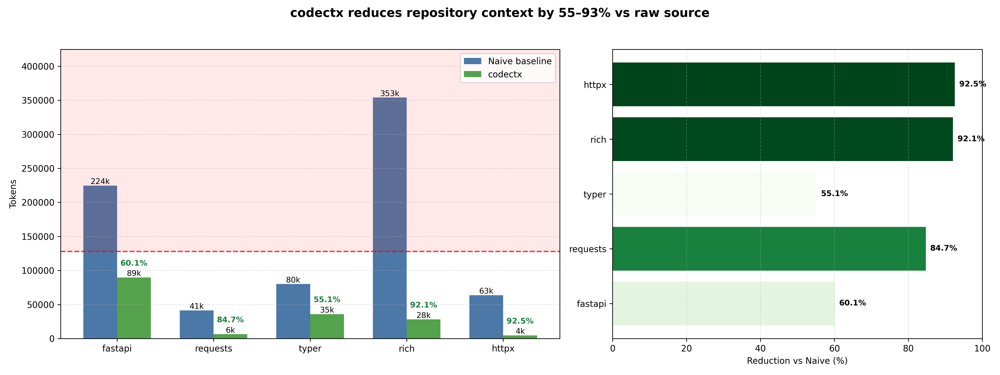

# codectx Benchmark Report

Methodology: Naive tokens count all source files excluding tests, docs, and examples using the same file set codectx analyzes.

Caveat: Reduction varies by repository size and structure.

CONTEXT.md artifacts are preserved in `benchmark_results/contexts/` for manual inspection.

Average token reduction vs naive: **76.90%**

| Repo | LOC | Naive Tokens | codectx Tokens | vs Naive | Coverage |
|------|-----|--------------|---------------|----------|----------|
| fastapi | 32408 | 224672 | 89750 | 60.05% | 0.0% (0/529) |
| requests | 5634 | 41353 | 6327 | 84.70% | 0.0% (0/19) |
| typer | 12798 | 80204 | 35992 | 55.12% | 0.0% (0/324) |
| rich | 39002 | 353919 | 28075 | 92.07% | 0.0% (0/109) |
| httpx | 8827 | 63731 | 4760 | 92.53% | 0.0% (0/23) |

## Chart

